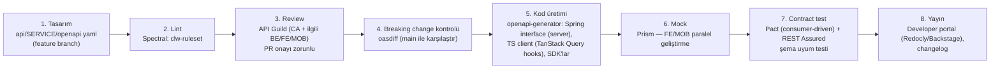

# AEP-CLW — API ve Event Tasarım Rehberi (API Guidelines)

| Alan | Değer |
|---|---|
| Sahip | Chief Architect (`CA`) |
| Uygulayan | Tüm backend ekipleri; lint: Spectral (OpenAPI), AsyncAPI CLI; CI'da zorunlu |
| Durum | Taslak — **MUST / SHOULD / MAY** RFC 2119 anlamındadır |

---

## 1. Genel İlkeler

| # | Kural |
|---|---|
| G1 | **API-first (MUST)**: Uç önce OpenAPI 3.1 sözleşmesi olarak yazılır, review edilir, sonra kod üretilir. |
| G2 | **Kaynak odaklı (resource-oriented)** URL'ler; fiil yalnız "aksiyon alt kaynağı" için: `POST /payments/{id}/capture`. |
| G3 | JSON (UTF-8), `camelCase` alan adları, `kebab-case` URL segmentleri, çoğul koleksiyon adları (`/top-ups`, `/payment-tokens`). |
| G4 | Dış kimlikler **prefix'li opaque string**: `pay_01J9Z6...` (UUIDv7 base32). İç sayısal id'ler asla dışarı sızmaz. |
| G5 | Geriye uyumsuz değişiklik **yalnız yeni major sürümle** (`/v2`). |
| G6 | Her uç **tenant kapsamlıdır**; tenant URL'de değil, token/claim'den gelir (platform uçları hariç: `/platform/v1/tenants/{tenantId}`). |
| G7 | Güvenlik: tüm uçlar OAuth2 (scope bazlı); public uç yoktur (health/JWKS/webhook hariç). |

---

## 2. REST Standartları

### 2.1 HTTP metotları ve durum kodları

| Metot | Kullanım | Idempotent | Başarı |
|---|---|---|---|
| GET | Okuma | Evet | 200 |
| POST | Oluşturma / aksiyon | **Idempotency-Key ile** | 201 (Location header) / 200 (aksiyon) / 202 (async) |
| PUT | Tam değiştirme (konfig gibi) | Evet | 200 |
| PATCH | Kısmi güncelleme — `application/merge-patch+json` (RFC 7396) | Idempotency-Key ile | 200 |
| DELETE | Finansal kaynaklarda **yasak**; yalnız bağlantı/abonelik/cihaz gibi kaynaklarda soft-delete | Evet | 204 |

| Kod | Anlam (AEP-CLW) |
|---|---|
| 400 | Sözdizimi / şema doğrulama hatası |
| 401 | Kimlik yok/geçersiz |
| 402 | **Yetersiz bakiye** (`INSUFFICIENT_FUNDS`) — ödeme uçlarında |
| 403 | Yetki yok, tenant uyuşmazlığı |
| 404 | Kaynak yok (veya tenant'a ait değil — varlık ifşa edilmez) |
| 409 | Durum çakışması (ör. zaten capture edilmiş), idempotency işlemi hâlâ sürüyor |
| 412 | `If-Match` ETag uyuşmazlığı (optimistic concurrency) |
| 422 | İş kuralı ihlali (limit, invariant), `IDEMPOTENCY_KEY_REUSED` |
| 423 | Kaynak kilitli (cüzdan FROZEN, tenant SUSPENDED) |
| 428 | Step-up gerekli (`STEP_UP_REQUIRED`) veya `If-Match` zorunlu |
| 429 | Rate limit (`Retry-After`) |
| 500 / 502 / 503 / 504 | Sunucu / upstream / bakım / zaman aşımı — `Retry-After` opsiyonel |

### 2.2 Optimistic concurrency

Konfigürasyon, kampanya, merchant gibi yönetim kaynaklarında `ETag` (aggregate version) döner; güncellemede
`If-Match` **MUST**. Eksikse `428`, eşleşmezse `412`.

### 2.3 Filtreleme, sıralama, alan seçimi

- Filtre: `GET /payments?status=CAPTURED&merchantId=m_77&createdFrom=2026-09-01T00:00:00Z&createdTo=...`
- Sıralama: `sort=-createdAt,amount` (yalnız sözleşmede listelenen alanlar).
- Alan seçimi (SHOULD, BFF'lerde): `fields=id,amount,status`.
- Tarih aralığı filtresi büyük koleksiyonlarda **zorunlu** (maks 93 gün); daha uzun sorgular reporting API'sine.

---

## 3. Versiyonlama

| Konu | Kural |
|---|---|
| URL major versiyon | `/v1/...` (MUST). Minor/patch değişiklikler geriye uyumlu ve URL'de görünmez. |
| Geriye uyumlu (izinli) | Yeni opsiyonel istek alanı, yeni yanıt alanı, yeni uç, yeni enum değeri (**istemciler bilinmeyen enum'u tolere etmeli — MUST**, sözleşmede `x-extensible-enum`) |
| Uyumsuz (yeni major) | Alan silme/yeniden adlandırma, tip değişikliği, zorunlu yeni istek alanı, semantik değişiklik, hata kodu anlam değişikliği |
| Deprecation | `Deprecation: @1798761600` ve `Sunset: Wed, 30 Jun 2027 00:00:00 GMT` header'ları (RFC 9745 / RFC 8594), `Link: <...>; rel="deprecation"`; minimum **6 ay** (Public POS API için **12 ay**) paralel destek |
| Mobil | Eski uygulama sürümleri: `/mobile/v1/app-config` `minSupportedVersion` ile zorunlu güncelleme; BFF en az N-2 uygulama sürümünü destekler |
| Tarih bazlı sürüm | Public POS API için opsiyonel `Clw-Api-Version: 2026-09-01` header'ı (Stripe modeli) — v2'de değerlendirilecek |

---

## 4. Pagination (Cursor)

Offset pagination **yasaktır** (büyük tablolarda maliyet + tutarsızlık). Opaque cursor kullanılır.

```http
GET /v1/payments?limit=50&cursor=eyJjIjoiMjAyNi0wOS0yNVQxMDoxNTowMy4xMjBaIiwiaSI6InBheV8wMUo5WjYifQ
```

```json
{
  "data": [ { "id": "pay_01J9Z6...", "amount": { "amount": "100.00", "currency": "TRY" }, "status": "CAPTURED" } ],
  "page": {
    "limit": 50,
    "nextCursor": "eyJjIjoiMjAyNi0wOS0yNVQxMDoxMDowMC4wMDBaIiwiaSI6InBheV8wMUo5WjAifQ",
    "prevCursor": null,
    "hasMore": true
  }
}
```

| Kural | Detay |
|---|---|
| Cursor içeriği | `base64url(json{sortKeyValues, id, direction, filterHash})` + HMAC (manipülasyon koruması); istemci için opaque |
| Sıralama anahtarı | Tekil ve kararlı: `(createdAt DESC, id DESC)` → keyset sorgu `WHERE (created_at, id) < ($1, $2)` |
| `limit` | Varsayılan 20, maksimum 100 (reporting export hariç) |
| Toplam sayı | Varsayılan dönmez (`count(*)` pahalı); gerekiyorsa `includeTotal=true` → yaklaşık değer (`totalEstimate`) |
| Filtre değişikliği | Cursor'daki `filterHash` ≠ istek → `400 CURSOR_FILTER_MISMATCH` |

---

## 5. Idempotency-Key

| Kural | Detay |
|---|---|
| Zorunluluk | Tüm `POST` ve `PATCH` uçlarında **MUST** (GET/PUT/DELETE doğası gereği idempotent). Eksikse `400 IDEMPOTENCY_KEY_REQUIRED`. |
| Format | İstemci üretimi; UUIDv4/v7 veya deterministik string, maks 128 karakter, `[A-Za-z0-9_:\-.]` |
| Kapsam | `(tenantId, clientId/actor, method, path-template, key)` |
| Saklama | Min **24 saat** (mobil/POS), ledger içi deterministik key'ler kalıcı |
| Aynı key + aynı gövde | İlk yanıt **aynen** tekrar döner (status + body), header `Idempotent-Replayed: true` |
| Aynı key + farklı gövde | `422 IDEMPOTENCY_KEY_REUSED` |
| İlk istek hâlâ işleniyor | `409 IDEMPOTENCY_IN_PROGRESS` + `Retry-After: 1` |
| 5xx sonrası | Key "tamamlanmamış" kabul edilir; aynı key ile retry güvenlidir (işlem ya hiç yapılmamış ya da idempotent tamamlanmış) |
| 4xx doğrulama hataları | Saklanmaz (istemci düzeltip aynı key ile tekrar deneyebilir) — iş kuralı ret'leri (402/422) **saklanır** |
| Servisler arası | Orkestratörler downstream'e **deterministik** key geçirir: `{sagaId}:{step}` |

IETF taslağı "The Idempotency-Key HTTP Header Field" ile uyumludur.

---

## 6. Hata Modeli — RFC 7807 / RFC 9457 Problem Details

```http
HTTP/1.1 402 Payment Required
Content-Type: application/problem+json

{
  "type": "https://docs.clw.app/problems/insufficient-funds",
  "title": "Yetersiz bakiye",
  "status": 402,
  "detail": "Cüzdan bakiyesi bu ödeme için yeterli değil.",
  "instance": "/pos/v1/payments",
  "code": "INSUFFICIENT_FUNDS",
  "correlationId": "c0a8012e-7f3b-4c1e-9d2a-5b6c7d8e9f10",
  "traceId": "4bf92f3577b34da6a3ce929d0e0e4736",
  "timestamp": "2026-09-25T10:15:03.412Z",
  "retryable": false,
  "errors": [
    { "field": "amount", "code": "EXCEEDS_AVAILABLE", "message": "Kullanılabilir: 87,60 TRY" }
  ]
}
```

| Kural | Detay |
|---|---|
| `type` | Kalıcı, dokümante URI; hata kataloğu (`platform-commons-error` içinde enum + docs sayfası) |
| `code` | Makine okunur, **SCREAMING_SNAKE_CASE**, sürüm boyunca sabit — istemciler bunu kullanır (`title`/`detail` değil) |
| `title`/`detail` | `Accept-Language`'e göre yerelleştirilmiş, son kullanıcıya gösterilebilir; **iç detay, stack trace, SQL, sağlayıcı ham hatası YOK** |
| `errors[]` | Alan bazlı doğrulama hataları (JSON Pointer veya alan adı) |
| `retryable` | İstemcinin aynı Idempotency-Key ile tekrar deneyip denememesi gerektiği |
| Güvenlik | Risk/fraud retlerinde sebep ifşa edilmez: `code: PAYMENT_DECLINED`, iç `reasonCode` yalnız log/audit |
| Kanal | BFF'ler downstream problem'lerini kanal uygun koda **map'leyebilir** ama `correlationId`'yi korur |

**Hata kodu kataloğu (örnek)**

| Kod | HTTP | Açıklama |
|---|---|---|
| `VALIDATION_FAILED` | 400 | Şema/alan doğrulama |
| `IDEMPOTENCY_KEY_REQUIRED` / `IDEMPOTENCY_KEY_REUSED` / `IDEMPOTENCY_IN_PROGRESS` | 400 / 422 / 409 | Idempotency |
| `TENANT_MISSING` / `TENANT_MISMATCH` / `TENANT_SUSPENDED` | 400 / 403 / 423 | Tenant |
| `INSUFFICIENT_FUNDS` | 402 | Bakiye |
| `LIMIT_EXCEEDED` | 422 | KYC/tenant limitleri (`errors[].code`: `DAILY_TOP_UP`, `MAX_BALANCE`...) |
| `WALLET_FROZEN` | 423 | Cüzdan dondurulmuş |
| `PAYMENT_DECLINED` | 422 | Genel ret (risk dahil) |
| `STEP_UP_REQUIRED` | 428 | Ek doğrulama |
| `QR_EXPIRED` / `QR_ALREADY_USED` / `QR_INVALID` | 422 | QR token |
| `INVALID_STATE_TRANSITION` | 409 | Ör. capture edilmiş ödemeye void |
| `REFUND_EXCEEDS_CAPTURED` | 422 | İade tutarı |
| `LEDGER_CONTENTION` | 409 (retryable) | Kilit zaman aşımı |
| `UPSTREAM_UNAVAILABLE` | 503 (retryable) | Harici sistem |

---

## 7. Correlation-Id ve İzlenebilirlik

| Header | Kural |
|---|---|
| `X-Correlation-Id` | İstemci gönderebilir (UUID); yoksa gateway üretir. Tüm yanıtlarda döner. Log MDC, Kafka header `correlation_id`, audit kaydında bulunur. |
| `traceparent` / `tracestate` | W3C Trace Context; OTel otomatik yayılım (HTTP + Kafka) |
| `X-Request-Deadline` | İç servisler arası: kalan zaman bütçesi (ms epoch); alt çağrılar bu değere göre timeout ayarlar |
| `Server-Timing` | (SHOULD, iç ortamlar) `db;dur=12, ledger;dur=31` — performans teşhisi; production dış yanıtlarda kapalı |

Saga'larda `correlationId` tüm adımlar ve kompanzasyonlar boyunca **aynı** kalır; `causationId` (event'i tetikleyen event id) event zarfında taşınır.

---

## 8. Tarih, Saat, Para ve Diğer Formatlar

| Tip | Format | Örnek | Not |
|---|---|---|---|
| Zaman damgası | RFC 3339, **UTC**, milisaniye | `"2026-09-25T10:15:03.412Z"` | Offset'li giriş kabul edilir, UTC'ye normalize edilir |
| Tarih | ISO 8601 `date` | `"2026-09-25"` | İş günü/raporlar tenant timezone'unda yorumlanır |
| Süre | ISO 8601 duration | `"PT12H"` | Hold TTL gibi |
| Timezone | IANA | `"Europe/Istanbul"` | — |
| **Para** | Nesne: `amount` **string decimal** + `currency` ISO 4217 | `{"amount": "125.50", "currency": "TRY"}` | JSON number **yasak** (float hassasiyeti); minor unit'ten fazla hane → 400; negatif tutar yalnız açıkça belgelenmiş alanlarda (ör. `adjustment`) |
| Oran | Baz puan (bps) tamsayı | `"percentageBps": 150` (= %1,5) | — |
| Ülke | ISO 3166-1 alpha-2 | `"TR"` | — |
| Dil | BCP 47 | `"tr-TR"` | `Accept-Language` |
| Telefon | E.164 | `"+905321234567"` | Yanıtlarda maskeli: `"+90532*****67"` |
| IBAN | Boşluksuz, büyük harf | `"TR330006100519786457841326"` | Yanıtlarda maskeli |
| Enum | `SCREAMING_SNAKE_CASE` string | `"PARTIALLY_REFUNDED"` | Genişletilebilir |
| Boolean | `true/false` | — | `is`/`has` öneki yok (`frozen`, değil `isFrozen`) |
| Null | Opsiyonel alanlar yanıtta **atlanır** (null gönderilmez); PATCH'te `null` = alanı temizle | — | — |

---

## 9. OpenAPI-First Süreci



| Kural | Detay |
|---|---|
| Konum | Monorepo `api/` dizini: `api/<service>/openapi.yaml`, ortak bileşenler `api/common/components.yaml` (`Money`, `Problem`, `PageInfo`, header'lar) — `$ref` ile |
| Spectral kuralları (özet) | `operationId` zorunlu ve camelCase; tüm POST'larda `Idempotency-Key` parametresi; tüm 4xx/5xx `application/problem+json`; para alanları `$ref: Money`; `additionalProperties: false` istek şemalarında; örnek (example) zorunlu; security scheme her uçta; `x-tenant-scoped: true` |
| Breaking change | `oasdiff breaking` CI'da; `/v1` altında breaking → PR bloklanır |
| Sunucu kodu | Üretilen `*Api` interface'leri `adapter.in.web` controller'larınca implement edilir; elle DTO yazılmaz |
| Dokümantasyon | Her uç: açıklama, hata kodları, idempotency davranışı, gerekli scope, rate limit sınıfı |

---

## 10. Event'ler — AsyncAPI + CloudEvents

### 10.1 Zarf (Envelope) — CloudEvents 1.0 (Kafka binary content mode)

Kafka **binary mode**: CloudEvents attribute'ları Kafka header'larında (`ce_*`), payload Avro.

| Header | Örnek | Zorunlu |
|---|---|---|
| `ce_specversion` | `1.0` | Evet |
| `ce_id` | `01J9Z7K3...` (UUIDv7 — outbox satır id'si) | Evet |
| `ce_source` | `/clw/payment-service` | Evet |
| `ce_type` | `com.aep.clw.payment.captured.v1` | Evet |
| `ce_time` | `2026-09-25T10:15:03.412Z` | Evet |
| `ce_subject` | `pay_01J9Z6...` (aggregate id) | Evet |
| `ce_tenantid` | `8f1c2c9e-...` (extension) | Evet |
| `ce_correlationid` | `c0a8012e-...` (extension) | Evet |
| `ce_causationid` | Tetikleyen event id (extension) | Saga'larda evet |
| `ce_dataschema` | `schema-registry://clw.payment.payment.captured.v1/versions/3` | Evet |
| `ce_aggregateversion` | `7` (extension — tüketici sıralama/dedupe) | Evet |
| `traceparent` | W3C | Evet |
| `content-type` | `application/avro` | Evet |

Kafka key = aggregate id (`ce_subject`). Webhook ve harici dağıtımda **structured mode** (JSON) kullanılır (bkz. integration §11.3).

### 10.2 Payload örneği (Avro)

```json
{
  "type": "record",
  "name": "PaymentCaptured",
  "namespace": "com.aep.clw.payment.v1",
  "doc": "Bir ödeme başarıyla capture edildiğinde yayınlanır.",
  "fields": [
    { "name": "paymentId",   "type": "string" },
    { "name": "tenantId",    "type": "string" },
    { "name": "merchantId",  "type": "string" },
    { "name": "storeId",     "type": "string" },
    { "name": "terminalId",  "type": "string" },
    { "name": "customerId",  "type": "string" },
    { "name": "amountMinor", "type": "long" },
    { "name": "currency",    "type": "string" },
    { "name": "legs", "type": { "type": "array", "items": {
        "type": "record", "name": "PaymentLeg", "fields": [
          { "name": "walletType",  "type": "string" },
          { "name": "amountMinor", "type": "long" } ] } } },
    { "name": "journalId",   "type": "string" },
    { "name": "channel",     "type": { "type": "enum", "name": "Channel", "symbols": ["POS", "MOBILE", "API", "UNKNOWN"], "default": "UNKNOWN" } },
    { "name": "capturedAt",  "type": { "type": "long", "logicalType": "timestamp-millis" } },
    { "name": "orderRef",    "type": ["null", "string"], "default": null }
  ]
}
```

### 10.3 Event tasarım kuralları

| # | Kural |
|---|---|
| E1 | **Geçmiş zaman, iş anlamlı ad**: `PaymentCaptured`, `HoldReleased` — CRUD (`PaymentUpdated`) yasak. |
| E2 | Topic = `clw.<context>.<aggregate>.<event>.v<major>`; bir topic = bir event tipi (şema evrimi basit, ACL net). İstisna: `clw.audit.event.recorded.v1`. |
| E3 | **Event-carried state transfer (sınırlı)**: tüketicilerin geri çağrı yapmaması için gerekli alanlar payload'da; ancak **PII yok**. |
| E4 | Tutarlar `amountMinor` (long) + `currency`; zaman `timestamp-millis` UTC. |
| E5 | Tüketiciler idempotent (inbox) ve sıra bağımsız olmaya çalışır; aggregate içi sıra partition key ile garanti, `aggregateVersion` ile doğrulanır (eski versiyon → yok say). |
| E6 | Komutlar (saga adımları, async ise) ayrı topic ailesi: `clw.<context>.cmd.<command>.v1`, yanıtlar `clw.<context>.reply.<command>.v1`. |
| E7 | Retention: domain event topic'leri 30 gün (ClickHouse/replay için S3 arşiv), `*.cmd.*` 7 gün, compacted "state" topic'leri (örn. `clw.tenant.config.state.v1`) sınırsız. |
| E8 | AsyncAPI 3.0 sözleşmesi `api/<service>/asyncapi.yaml` — OpenAPI ile aynı review süreci. |

### 10.4 Event versiyonlama

| Değişiklik | Uyumluluk | Nasıl |
|---|---|---|
| Opsiyonel alan ekleme (default'lu) | BACKWARD + FORWARD | Aynı topic, yeni şema versiyonu |
| Enum'a sembol ekleme | Tüketici tolere eder (enum `default` tanımlı — Avro 1.9+) | Aynı topic |
| Alan silme (default'u olan) | BACKWARD | Aynı topic, önce deprecate (doc), 2 release sonra |
| Tip değişikliği, zorunlu alan ekleme, anlam değişikliği | **Uyumsuz** | Yeni topic `...v2`; üretici **geçiş süresince her iki topic'e** yazar (outbox'tan iki kayıt), tüketiciler taşınınca v1 kapatılır (min 3 ay) |

- Schema Registry uyumluluk modu: **`BACKWARD_TRANSITIVE`** (tüm geçmiş versiyonlarla). CI'da `schema-registry:test-compatibility` adımı.
- Tüketici kodu Avro `SpecificRecord` + **reader schema** ile çalışır; bilinmeyen alanları yok sayar.

---

## 11. Güvenlik ve Rate Limit (API seviyesinde)

| Konu | Kural |
|---|---|
| Scope adlandırma | `<resource>:<action>` — `payments:write`, `payments:read`, `refunds:write`, `wallets:read`, `admin.tenants:write` |
| Hassas işlemler | `acr=step-up` claim'i (P2P, payout, yüksek tutar, cihaz ekleme) — yoksa 428 |
| Rate limit header'ları | `RateLimit-Limit`, `RateLimit-Remaining`, `RateLimit-Reset` (IETF draft), 429'da `Retry-After` |
| Girdi limitleri | Gövde ≤ 256 KB (upload uçları hariç), string alanlarda `maxLength` zorunlu, dizi alanlarda `maxItems` |
| CORS | Yalnız tenant portal domain'leri (dinamik, tenant-service'ten) |
| Hassas veri | Yanıtlarda maskeleme varsayılan; açık görüntüleme ayrı uç (`/reveal`) + audit |

---

## 12. Kontrol Listesi (PR şablonuna eklenecek)

- [ ] OpenAPI/AsyncAPI sözleşmesi güncellendi ve Spectral'dan geçti
- [ ] Breaking change yok (veya yeni major + deprecation planı)
- [ ] Tüm POST/PATCH uçlarında Idempotency-Key davranışı tanımlı ve test edildi
- [ ] Hata yanıtları `application/problem+json` ve katalogdaki kodlarla
- [ ] Para alanları `Money` (string decimal); zaman UTC RFC 3339
- [ ] Pagination cursor tabanlı; `limit` üst sınırı var
- [ ] Event'ler CloudEvents header'ları + Avro şeması Registry uyumluluk testinden geçti
- [ ] PII yok (event, log); yanıtlarda maskeleme
- [ ] Pact consumer/provider testleri güncel
