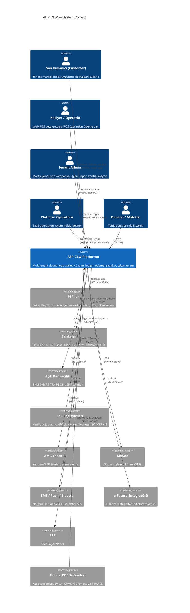
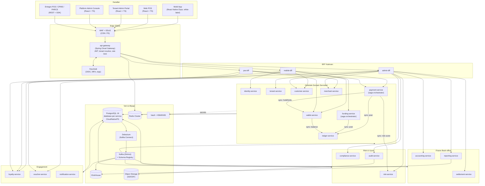
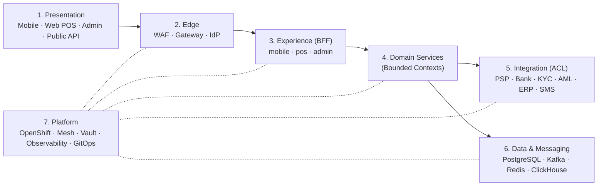
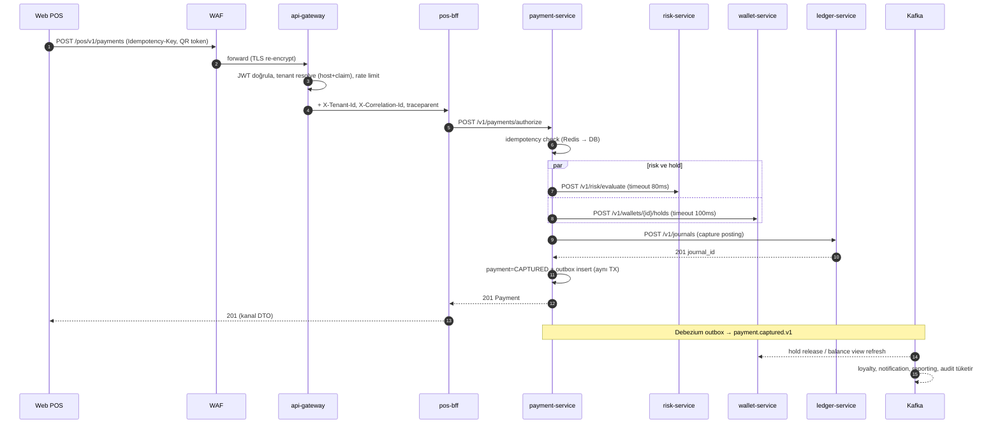
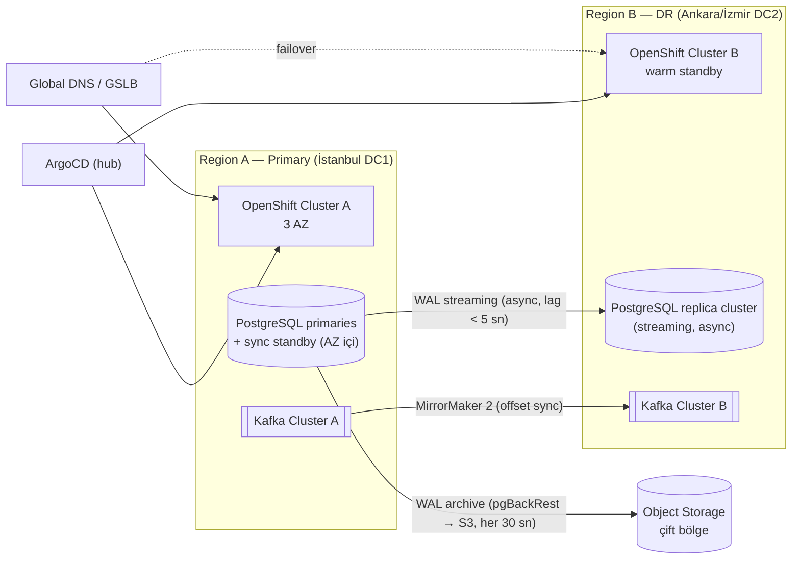

# AEP-CLW — Mimari Genel Bakış (Architecture Overview)

| Alan | Değer |
|---|---|
| Doküman sahibi | Chief Architect (`CA`) |
| Katkı | Solution Architect – Payments (`SA`), DBA/Data (`DATA`), SRE (`OPS`), CISO (`SEC`) |
| Durum | Taslak — Sprint 0 onayına sunulacak |
| Kaynak | [`../00-project-charter.md`](../00-project-charter.md), ADR'ler: [`adr/`](adr/README.md) |

> Bu doküman AEP-CLW platformunun hedef mimarisini (target architecture) tanımlar. Tüm alt dokümanlar
> (multitenancy, ledger, flows, data, integration, api-guidelines) buradaki ilkelere bağlıdır.
> Çelişki durumunda **ADR > bu doküman > alt dokümanlar** önceliği geçerlidir.

---

## 1. Mimari İlkeler (Architecture Principles)

| # | İlke | Açıklama | Uygulama mekanizması |
|---|---|---|---|
| P1 | **Ledger is the source of truth** | Parasal bakiyenin tek doğruluk kaynağı `ledger-service`'tir. `wallet-service` bakiye *görünümü* ve hold yönetimi sağlar, ancak para hareketi yalnızca ledger posting'i ile gerçekleşir. | ADR-006, ArchUnit kuralları, posting API'si dışında bakiye yazımı yasak |
| P2 | **Append-only finansal veri** | Finansal kayıtlarda `UPDATE`/`DELETE` yoktur; düzeltme = ters kayıt (reversal). | DB seviyesinde trigger + `REVOKE UPDATE, DELETE` |
| P3 | **Her yazma idempotent** | Tüm mutasyon uçları `Idempotency-Key` zorunlu; tüm consumer'lar `event_id` ile dedupe eder. | `platform-commons-idempotency`, inbox tablosu |
| P4 | **Tenant her yerde** | Her istek, her satır, her event, her cache anahtarı, her log satırı `tenant_id` taşır. | TenantContext, RLS, Kafka header, MDC |
| P5 | **Database-per-service** | Servisler birbirlerinin veritabanına erişmez; paylaşım yalnızca API veya event ile. | Ayrı DB kullanıcıları, NetworkPolicy |
| P6 | **Async by default, sync when necessary** | Kullanıcı yanıtı için zorunlu olmayan her şey event ile. Senkron çağrı yalnızca "karar anında gereken" veri için. | Bölüm 5 kuralları |
| P7 | **Kart verisi tutulmaz** | PAN/CVV sistemimize hiç girmez; PSP hosted fields / tokenization. | ADR-012 |
| P8 | **Zero-trust** | Servisler arası mTLS (Service Mesh), her servis JWT doğrular, en az yetki. | OpenShift Service Mesh, OPA/Keycloak scope |
| P9 | **Observable by design** | Her istek trace'lenir; iş metrikleri (TPS, onay oranı, ledger drift) birinci sınıf metriktir. | OpenTelemetry auto + manual span |
| P10 | **Hexagonal** | Domain katmanı framework'ten bağımsızdır; adaptörler değiştirilebilir. | ArchUnit layer testleri |

---

## 2. C4 — Level 1: System Context



### 2.1 Aktörler ve kanallar

| Aktör | Kanal | Kimlik | BFF |
|---|---|---|---|
| Customer | White-label mobil (React Native Expo), opsiyonel PWA | Keycloak (telefon OTP + cihaz bağlama, PKCE) | `mobile-bff` |
| Kasiyer | Web POS (React) | Keycloak (kullanıcı + terminal bağlama) | `pos-bff` |
| Entegre POS / CPMS / PARCS | Public POS API + SDK | OAuth2 client credentials (merchant API key → token), HMAC | `pos-bff` |
| Tenant Admin | Tenant Admin Portalı (React) | Keycloak organization üyesi, MFA zorunlu | `admin-bff` |
| Platform Operatörü | Platform Admin Konsolu (React) | Platform realm, MFA + IP allowlist | `admin-bff` (platform scope) |
| Denetçi | Admin Konsolu – Teftiş modülü | Read-only rol, zaman sınırlı erişim | `admin-bff` |

---

## 3. C4 — Level 2: Container Diyagramı



### 3.1 Container envanteri (özet)

| Container | Teknoloji | Stateful? | Not |
|---|---|---|---|
| `api-gateway` | Spring Cloud Gateway (WebFlux) | Hayır | Tek giriş; tenant resolve, JWT, rate limit (Redis token bucket) |
| BFF'ler (3) | Spring Boot 3 (WebFlux veya MVC + virtual threads) | Hayır | Kanal şekillendirme, aggregation, response caching |
| Domain servisleri (15) | Spring Boot 3, Java 21 virtual threads | Hayır (DB dışında) | Hexagonal |
| PostgreSQL | 16.x, CloudNativePG operator | Evet | Servis başına cluster (tiering'e göre paylaşımlı instance, ayrı DB) |
| Kafka | Strimzi / AMQ Streams 3.x, KRaft | Evet | 3 AZ, RF=3, `min.insync.replicas=2` |
| Debezium | Kafka Connect (Strimzi `KafkaConnector` CR) | Hayır | Outbox Event Router SMT |
| Redis | Redis 7 Cluster (Sentinel'siz, cluster mode) | Yarı | Cache, rate limit, idempotency hızlı yol, OTP, QR token nonce |
| ClickHouse | ClickHouse Operator (Altinity) | Evet | Raporlama/OLAP |
| Keycloak | Keycloak 24+ (Quarkus), HA, PostgreSQL arka uç | Evet | Organizations = tenant |
| Vault | HashiCorp Vault Enterprise + HSM auto-unseal | Evet | Dinamik DB kimlikleri, Transit (crypto-shredding), PKI |

---

## 4. Mantıksal Katmanlar



| Katman | Sorumluluk | Yasaklar |
|---|---|---|
| Presentation | UI, tenant teması, i18n, offline kuyruk (mobil) | İş kuralı içeremez; bakiyeyi kendisi hesaplayamaz |
| Edge | TLS termination, WAF, JWT doğrulama, tenant çözümleme, rate limit, request size limit | İş mantığı yok |
| Experience (BFF) | Kanal özel DTO, çoklu servis aggregation, kanal bazlı cache, pagination şekillendirme | Veri sahipliği yok; DB'si yok (yalnız Redis cache); saga başlatamaz, domain servisine delege eder |
| Domain | Aggregate, invariant, saga orkestrasyonu, event üretimi | Başka servisin DB'sine erişim yok |
| Integration | Harici sistemlere ACL (anti-corruption layer) adaptörleri | Harici modeller domain'e sızamaz |
| Data & Messaging | Kalıcılık, event backbone | — |
| Platform | Runtime, güvenlik, gözlemlenebilirlik | — |

> **Karar:** Entegrasyon adaptörleri ayrı servisler değildir; sahibi olan bounded context'in içinde
> `adapter.out.<provider>` paketinde yaşar (örn. PSP adaptörleri `funding-service` + `payment-service`
> refund için `funding-service` üzerinden). Detay: [`integration-architecture.md`](integration-architecture.md).

---

## 5. Kanal → BFF → Servis Akışı

### 5.1 Tipik istek yaşam döngüsü (QR ödeme onayı örneği)



### 5.2 Header propagasyonu

| Header | Üreten | Taşıyan | Amaç |
|---|---|---|---|
| `traceparent` / `tracestate` | Gateway (yoksa) | Tüm HTTP + Kafka header | W3C Trace Context |
| `X-Correlation-Id` | Client veya Gateway | Tüm hop'lar, log MDC, Kafka header `correlation_id` | İş akışı korelasyonu |
| `X-Tenant-Id` | Gateway (JWT claim ile doğrulanmış) | İç servisler | Tenant context; dış istemcinin gönderdiği değere **güvenilmez**, gateway üzerine yazar |
| `Idempotency-Key` | Client | Mutasyon uçları | Bkz. `api-guidelines.md` |
| `X-Channel` | Gateway (route'a göre) | BFF → servis | `MOBILE`, `POS`, `ADMIN`, `API` — risk ve limit kuralları için |
| `X-Device-Id` | Mobil app | mobile-bff → servis | Cihaz bağlama, risk |

---

## 6. Senkron / Asenkron İletişim Kuralları

### 6.1 Karar matrisi

| Durum | İletişim | Gerekçe |
|---|---|---|
| Kullanıcının beklediği yanıt için **karar** verisi gerekiyor (risk skoru, bakiye yeterliliği, hold) | **Senkron REST** (mesh içi HTTP/2, mTLS) | Karar anında tutarlılık |
| Para hareketi (posting) | **Senkron REST** → `ledger-service` | Ledger commit'i olmadan ödeme onaylanamaz |
| Durum değişikliğinin diğer context'lere duyurulması | **Asenkron event** (Outbox → Kafka) | Gevşek bağlılık, dayanıklılık |
| Uzun süren çok adımlı iş (top-up, pre-auth, settlement) | **Saga (orchestration)**: adım komutları sync REST veya Kafka command topic; durum orchestrator DB'sinde | ADR-005 |
| Bildirim, sadakat, raporlama, audit | **Asenkron** | Kritik yolda değil |
| Harici webhook (PSP) | **Inbound HTTP → inbox tablosu → iç event** | Harici sistem retry'larına karşı idempotent |
| Raporlama sorgusu | **CQRS read model** (ClickHouse / servis-içi projection) | OLTP'yi korur |

### 6.2 Senkron çağrı kuralları

1. **Derinlik sınırı:** Kullanıcı isteği için senkron zincir en fazla **3 hop** (BFF → orchestrator → [risk | wallet | ledger]). Döngüsel senkron bağımlılık ArchUnit + servis grafı lint'i ile yasak.
2. **Timeout bütçesi:** Her hop kendi timeout'unu üst bütçeden türetir (deadline propagation, `X-Request-Deadline`). Ödeme onayı toplam bütçe **250 ms** (p99 hedefi 300 ms'nin altında kalmak için).
3. **Resilience4j:** Her dış çağrıda `TimeLimiter` + `CircuitBreaker` + `Bulkhead`; `Retry` **yalnızca idempotent** çağrılarda ve en fazla 1 kez (jitter'lı).
4. **Fallback politikası:** Risk servisi erişilemezse → tenant konfigürasyonundaki `risk.failMode` (`OPEN` küçük tutarlarda, `CLOSED` varsayılan). Ledger erişilemezse → **her zaman fail-closed** (ödeme reddedilir).
5. **Protokol:** REST/JSON (OpenAPI). gRPC değerlendirildi; ekosistem ve contract testi (Pact) basitliği nedeniyle v1'de REST. Sıcak yol (payment → ledger) ileride gRPC'ye taşınabilir (ADR gerekir).

### 6.3 Asenkron kurallar

1. Event'ler **yalnızca Transactional Outbox** ile yayınlanır; servis kodu doğrudan `KafkaTemplate.send` yapamaz (ArchUnit kuralı). ADR-004.
2. Event zarfı **CloudEvents 1.0**, payload **Avro** (Schema Registry, `BACKWARD_TRANSITIVE` uyumluluk).
3. Partition key: aggregate id (örn. `wallet_id`) → aggregate bazında sıralama garantisi. Tenant bazlı sıralama gerekmez.
4. Consumer'lar **at-least-once** alır; **inbox tablosu** (`processed_event(event_id PK)`) ile effectively-once.
5. Retry: `topic.retry.1m`, `topic.retry.10m`, sonra `topic.dlq`. DLQ'lar operasyon konsolunda görünür ve yeniden oynatılabilir (replay).
6. Topic isimlendirme: `clw.<context>.<aggregate>.<event>.v<major>` (örn. `clw.payment.payment.captured.v1`). Command topic'leri: `clw.<context>.cmd.<command>.v1`.

---

## 7. Ölçeklenebilirlik ve Performans

### 7.1 Hedefler (NFR)

| Metrik | Hedef | Ölçüm |
|---|---|---|
| Ödeme throughput | **5.000 TPS** sürekli, 10.000 TPS 15 dk burst | Gatling/k6, üretim eşdeğeri ortam |
| Ödeme onay gecikmesi | **p99 < 300 ms**, p95 < 150 ms (gateway giriş → yanıt) | OTel histogram |
| Bakiye sorgusu | p99 < 50 ms | Redis/ledger snapshot |
| Kullanılabilirlik | **%99,95** aylık (≈ 21,9 dk/ay kesinti bütçesi) — ödeme, yükleme, bakiye yolları | SLO + error budget |
| RPO | **≤ 1 dk** | Kafka + PostgreSQL senkron/async replikasyon |
| RTO | **≤ 15 dk** | DR tatbikatı (çeyreklik) |
| Ledger tutarlılığı | Σ debit = Σ credit, **0 drift** | Sürekli invariant job + alarm |

### 7.2 Kapasite hesabı (5.000 TPS ödeme)

| Bileşen | Hesap | Boyut (başlangıç) |
|---|---|---|
| payment-service | ~600 TPS/pod (virtual threads, 2 vCPU) → 5.000/600 ≈ 9 + %50 headroom | **HPA min 6 / max 24** |
| ledger-service | Her ödeme ≈ 1 journal + 2–4 posting; ~400 journal/s/pod | **HPA min 8 / max 32** |
| ledger DB | 5.000 journal/s × ~3 posting = 15.000 insert/s + balance update | Pool tier: 4 shard cluster (bkz. §7.4); her primary 16 vCPU / 64 GB, NVMe |
| Kafka | 5.000 ödeme × ~6 event = 30.000 msg/s, ~1 KB → ~30 MB/s | 6 broker, topic başına 24–48 partition |
| Redis | idempotency + rate limit + cache ≈ 40k ops/s | 6 node cluster (3 primary + 3 replica) |

### 7.3 HPA stratejisi

- **CPU tabanlı değil, iş metriği tabanlı** ölçekleme: KEDA ile
  - HTTP servisler: `http_server_requests_active` (Prometheus scaler) + CPU %60 ikincil,
  - Consumer'lar: Kafka consumer lag (KEDA Kafka scaler; `lagThreshold` per partition = 500),
  - pod sayısı üst sınırı = topic partition sayısı (consumer için).
- `PodDisruptionBudget`: kritik servislerde `minAvailable: 66%`.
- `topologySpreadConstraints`: zone başına eşit dağılım (3 AZ).
- JVM: Java 21, `-XX:+UseZGC -XX:+ZGenerational`, container-aware heap (`MaxRAMPercentage=70`), CRaC/AppCDS ile hızlı başlatma (scale-out < 20 sn hedef).
- Pre-warm: kampanya/etkinlik takvimi (örn. stadyum maç günü) için tenant bazlı **scheduled scaling** (KEDA cron scaler).

### 7.4 Veri katmanı ölçekleme

| Teknik | Nerede | Detay |
|---|---|---|
| **Partitioning (zaman)** | `ledger.posting`, `ledger.journal`, `payment.payment`, `audit.audit_event`, outbox | Aylık native range partition, `pg_partman` ile otomatik |
| **Partitioning (hash / shard)** | Pool tier ledger | `tenant_id` hash → N mantıksal shard → fiziksel cluster eşlemesi (shard map `tenant-service`'te) |
| **Read replica** | wallet, customer, merchant, loyalty okuma uçları | CloudNativePG `replica` servisleri; Spring `@Transactional(readOnly=true)` → routing DataSource. **Ledger bakiye kararları asla replica'dan okunmaz.** |
| **Hot account sharding** | Merchant payable, PSP clearing gibi yüksek yazma hesapları | Alt hesaplara bölme (bkz. `ledger-design.md` §8) |
| **Connection pooling** | Tüm DB'ler | HikariCP (servis) + PgBouncer (transaction mode) |
| **CQRS** | Raporlar, admin listeleri | ClickHouse + servis-içi projection tabloları |
| **Caching** | Tenant config, merchant/terminal lookup, FX tablosu, kampanya kuralları | Redis + Caffeine (L1, 30 sn TTL), event ile invalidation |

---

## 8. Multi-Region ve DR Stratejisi

### 8.1 Topoloji



> **Veri yerelliği:** 6493 sayılı Kanun ve KVKK gereği TR tenant'larının birincil verisi Türkiye'deki
> veri merkezlerinde tutulur. AB tenant'ları için ayrı bir **regional stamp** (EU-Frankfurt) kurulur —
> stamp'ler arası veri paylaşımı yoktur (cell-based architecture).

### 8.2 Strateji: Active–Warm Standby (v1), Active–Active (v2 hedefi)

| Konu | v1 Kararı | Gerekçe |
|---|---|---|
| Mod | **Active–Warm Standby** | Ledger için multi-master yazma (conflict) finansal olarak kabul edilemez |
| PostgreSQL | Bölge içi: 1 primary + 1 **synchronous** standby (farklı AZ, `synchronous_commit=remote_apply` ledger için) + 1 async. Bölgeler arası: CloudNativePG **replica cluster** (async streaming) | Bölge içi RPO=0, bölgeler arası RPO ≈ saniyeler |
| Kafka | MirrorMaker 2, `IdentityReplicationPolicy`, consumer offset sync | Event kaybını RPO içinde tutar; outbox DB'de olduğu için kaynak gerçeği DB |
| Redis | Bölge başına bağımsız; DR'da soğuk başlar | Cache/rate limit yeniden oluşturulabilir; OTP/QR nonce kısa ömürlü |
| ClickHouse | DR'da CDC'den yeniden besleme + günlük snapshot | RPO toleranslı (raporlama) |
| Uygulama | DR cluster'da tüm Deployment'lar `replicas` düşük tutulur (ArgoCD ApplicationSet `dr` overlay) | Maliyet |
| Failover | **Yarı otomatik**: otomatik tespit + insan onayı (runbook, 1 tık) | Split-brain riski |

### 8.3 RPO ≤ 1 dk / RTO ≤ 15 dk nasıl sağlanır

| Adım | Süre hedefi | Mekanizma |
|---|---|---|
| Tespit | ≤ 2 dk | Sentetik probe (3 lokasyon), bölge sağlık skoru |
| Karar | ≤ 3 dk | On-call + Incident Commander onayı (runbook) |
| DB promote | ≤ 2 dk | `cnpg promote` (replica cluster → primary), fencing eski primary |
| Kafka switch | ≤ 2 dk | Client bootstrap DNS değişimi; offset'ler senkron |
| Uygulama scale-up | ≤ 4 dk | KEDA/HPA + pre-pulled image, AppCDS |
| DNS/GSLB | ≤ 2 dk | TTL 30 sn |
| **Toplam** | **≤ 15 dk** | Çeyreklik DR tatbikatı ile doğrulanır |

**RPO:** async bölgeler arası replikasyon gecikmesi alarm eşiği 10 sn, kritik 30 sn; WAL arşivi 30 sn'de bir zorla
(`archive_timeout=30s`). Failover sonrası **ledger reconciliation job** PSP/banka kayıtlarıyla son 5 dakikayı karşılaştırır
ve eksik posting'leri `suspense` hesabı üzerinden işaretler.

---

## 9. Hexagonal Paket Yapısı

### 9.1 Standart paket düzeni

```text
com.aep.clw.payment
├── PaymentServiceApplication.java
├── domain                         # Saf Java; Spring/JPA bağımlılığı YOK
│   ├── model                      # Aggregate, Entity, Value Object
│   │   ├── Payment.java           # Aggregate root
│   │   ├── PaymentId.java
│   │   ├── PaymentStatus.java
│   │   └── PreAuthorization.java
│   ├── event                      # Domain event'ler (PaymentCaptured, ...)
│   ├── service                    # Domain service (policy, calculator)
│   ├── exception                  # Domain exception'ları
│   └── port                       # (opsiyonel) domain'e ait repository interface
├── application                    # Use case orkestrasyonu, transaction sınırı
│   ├── port
│   │   ├── in                     # Use case interface'leri (AuthorizePaymentUseCase)
│   │   └── out                    # Driven port'lar (LoadPaymentPort, LedgerPort, RiskPort, EventPublisherPort)
│   ├── service                    # Use case implementasyonları
│   ├── saga                       # Saga tanımları + state machine
│   └── dto                        # Command / Result nesneleri
├── adapter
│   ├── in
│   │   ├── web                    # REST controller, OpenAPI'den üretilen interface impl, mapper
│   │   ├── messaging              # Kafka consumer (inbox pattern)
│   │   └── scheduler              # ShedLock'lu zamanlanmış işler
│   └── out
│       ├── persistence            # JPA/jOOQ entity, repository, mapper
│       ├── messaging              # Outbox writer
│       ├── ledger                 # LedgerPort → ledger-service REST client
│       ├── risk                   # RiskPort → risk-service client
│       ├── wallet                 # WalletPort client
│       └── cache                  # Redis adaptörü
└── config                         # Spring @Configuration, bean wiring
```

### 9.2 ArchUnit ile zorlanan kurallar

| Kural | Açıklama |
|---|---|
| `domain` → hiçbir `org.springframework..`, `jakarta.persistence..`, `adapter..` bağımlılığı yok | Saf domain |
| `application` → `adapter..` bağımlılığı yok | Port üzerinden |
| `adapter.in.*` → `domain.model` doğrudan mutasyon yok; yalnız `application.port.in` | Use case disiplini |
| `KafkaTemplate` yalnız `platform-commons-outbox` relay içinde | Outbox zorunluluğu |
| `@Transactional` yalnız `application.service` katmanında | TX sınırı netliği |
| `BigDecimal` / `double` para alanlarında yasak → `Money` | Para tipi disiplini |

### 9.3 Persistence teknolojisi

- **Ledger, wallet, payment:** jOOQ (SQL kontrolü, `SELECT ... FOR UPDATE`, batch insert, partition-aware sorgular).
- **Diğer servisler:** Spring Data JPA (Hibernate 6) + Flyway.
- Tüm servislerde `spring.jpa.open-in-view=false`, N+1 tespiti için test ortamında Hibernate statistics assert.

---

## 10. Cross-Cutting Kütüphaneler — `platform-commons`

Gradle multi-module altında (`libs/platform-commons-*`), Spring Boot auto-configuration olarak dağıtılır
(ADR-011). Semver ile versiyonlanır; servisler BOM (`platform-bom`) üzerinden tüketir.

| Modül | İçerik | Kritik detay |
|---|---|---|
| `platform-commons-tenant` | `TenantContext` (ScopedValue — Java 21 preview yerine `ThreadLocal` + virtual-thread uyumlu `InheritableThreadLocal` sarmalayıcı), `TenantResolverFilter`, JDBC `set_config('app.tenant_id', ...)` interceptor, Kafka producer/consumer interceptor, `@TenantScoped` cache key generator | Tenant yoksa istek **reddedilir** (`TENANT_MISSING`); platform scope yalnız açık `@PlatformScope` ile |
| `platform-commons-idempotency` | `@Idempotent` anotasyonu, Redis hızlı yol + PostgreSQL `idempotency_record` kalıcı kayıt, request hash karşılaştırma, response replay | Aynı key + farklı body → `422 IDEMPOTENCY_KEY_REUSED` |
| `platform-commons-outbox` | `OutboxWriter` (aynı TX içinde `outbox_event` insert), Avro serializer, CloudEvents header mapper, Debezium Outbox Event Router konfig şablonu; `InboxGuard` consumer tarafı | Outbox tablosu aylık partition, 7 gün sonra drop |
| `platform-commons-audit` | `AuditPublisher` (`@Audited` aspect), actor/tenant/ip/device/before-after diff, PII maskeleme | Audit event'leri outbox üzerinden `clw.audit.event.recorded.v1` |
| `platform-commons-error` | RFC 7807 `ProblemDetail` genişletmesi: `type`, `title`, `status`, `detail`, `instance`, `code`, `correlationId`, `tenantId`, `errors[]`; global `@ControllerAdvice`; hata kodu kataloğu | Stack trace asla dışarı sızmaz |
| `platform-commons-money` | `Money(long minorUnits, CurrencyUnit currency)` immutable VO, `CurrencyUnit` (ISO 4217, minor unit sayısı), aritmetik (`plus`, `minus`, `allocate(ratios)` — kuruş kaybı olmadan bölüştürme), `RoundingPolicy` (HALF_EVEN), Jackson `{ "amount": "125.50", "currency": "TRY" }` serileştirme, jOOQ/JPA converter | `double` yasak; farklı para birimi aritmetiği exception |
| `platform-commons-security` | JWT → `ClwPrincipal` (tenantId, actorType, scopes, merchantId, terminalId), method security, service-to-service token (client credentials) cache | — |
| `platform-commons-observability` | OTel konfig, MDC (`tenant_id`, `correlation_id`, `trace_id`), iş metrikleri helper (`clw_payment_total{tenant,status}` — tenant label kardinalite kontrollü) | PII log redaction (`Logback` masking) |
| `platform-commons-resilience` | Resilience4j standart profilleri (`critical-sync`, `external-psp`, `best-effort`) | Konfig kod değil YAML profil |
| `platform-commons-saga` | Hafif saga orchestrator motoru: saga tanımı DSL, `saga_instance` / `saga_step` tabloları, timeout scheduler, compensation zinciri | ADR-005 |
| `platform-commons-test` | Testcontainers (Postgres, Kafka, Redis) base sınıfları, tenant fixture, ArchUnit kural seti, Pact helper | — |

---

## 11. Güvenlik Mimarisi (özet)

| Katman | Kontrol |
|---|---|
| Kimlik | Keycloak OIDC; müşteri: PKCE + DPoP (token bağlama) + cihaz anahtarı; admin: MFA (WebAuthn/TOTP) zorunlu |
| Yetkilendirme | Scope + rol (RBAC) + tenant/merchant ABAC; admin işlemlerinde **maker-checker** |
| Ağ | Service Mesh mTLS STRICT, NetworkPolicy default-deny, egress gateway (yalnız allowlist harici hostlar) |
| Sırlar | Vault Agent Injector / CSI; DB kimlikleri dinamik (TTL 1 saat) |
| Veri | TDE (disk şifreleme), PII kolon şifreleme (Vault Transit, tenant/subject anahtarı → crypto-shredding) |
| PCI | Kart verisi tutulmaz → SAQ A / A-EP hedefi (ADR-012) |
| Tedarik zinciri | SBOM (CycloneDX), cosign imza, OpenShift image policy (yalnız imzalı imaj) |

Detaylı tehdit modeli: `docs/security/` (CISO sorumluluğunda).

---

## 12. İlgili Dokümanlar

- [multitenancy.md](multitenancy.md) · [service-catalog.md](service-catalog.md) · [domain-model.md](domain-model.md)
- [ledger-design.md](ledger-design.md) · [flows.md](flows.md) · [data-architecture.md](data-architecture.md)
- [integration-architecture.md](integration-architecture.md) · [api-guidelines.md](api-guidelines.md) · [adr/](adr/README.md)
