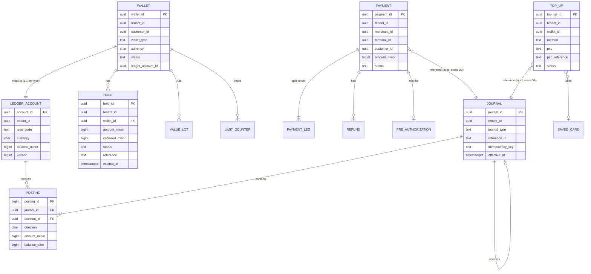
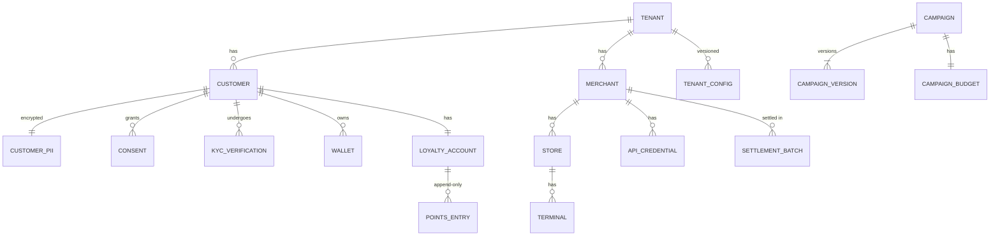
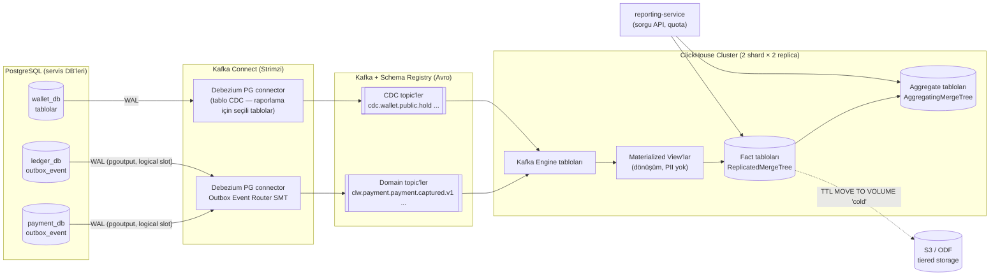
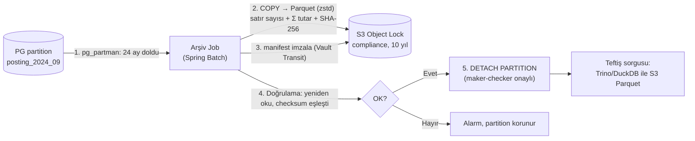
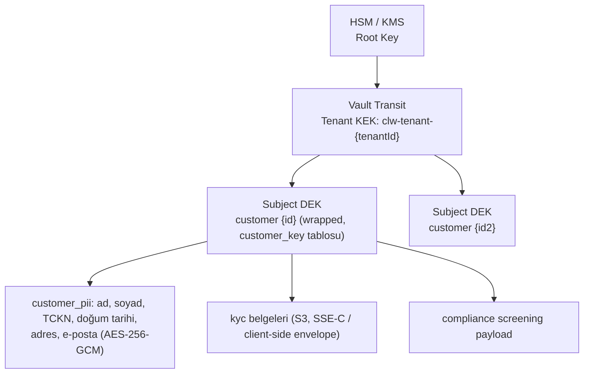
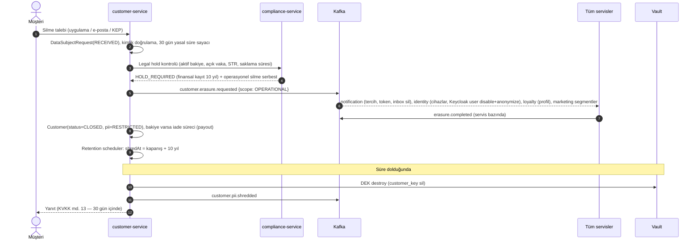

# AEP-CLW — Veri Mimarisi (Data Architecture)

| Alan | Değer |
|---|---|
| Sahip | DBA / Data Engineer (`DATA`) |
| Onay | Chief Architect (`CA`), CISO (`SEC`), Compliance (`CMP`) |
| İlgili ADR | [ADR-003](adr/ADR-003-postgresql-database-per-service-rls.md), [ADR-004](adr/ADR-004-kafka-transactional-outbox.md), [ADR-009](adr/ADR-009-cqrs-clickhouse-reporting.md) |
| Durum | Taslak |

---

## 1. İlkeler

| # | İlke |
|---|---|
| D1 | **Database-per-service**: her servis kendi PostgreSQL veritabanına sahip; başka servisin şemasına erişim yok (ayrı rol, ayrı DB, NetworkPolicy). |
| D2 | **Tenant her satırda**: iş tablolarında `tenant_id uuid NOT NULL` + RLS (FORCE); index'ler `tenant_id` ile başlar. |
| D3 | **Append-only finansal veri**; düzeltme ters kayıtla. |
| D4 | **PII minimizasyonu**: finansal/olay tablolarında PII yok (yalnız pseudonymous id). PII yalnız `customer-service` (+ `identity`, `compliance`) içinde, kolon şifreli. |
| D5 | **Zaman bazlı partition** yüksek hacimli tablolarda zorunlu. |
| D6 | **Outbox tablosu** her yazma yapan serviste; event'ler yalnız CDC ile çıkar. |
| D7 | **Kimlikler UUIDv7** (zaman sıralı), dış dünyaya prefix'li gösterim (`pay_`, `w_`, `m_`). |
| D8 | **Zaman** daima `timestamptz` (UTC); iş günü hesapları tenant timezone ile. |

---

## 2. Servis Başına Veritabanları

| Servis | DB | Ana tablolar | Hacim (yıllık, 5k TPS tepe varsayımı) | Partition | Tier |
|---|---|---|---|---|---|
| identity | `identity_db` | `device`, `user_credential`, `otp_audit`, `login_event` | Orta | `login_event` aylık | POOL |
| tenant | `tenant_db` | `tenant`, `tenant_config` (jsonb, versiyonlu), `subscription`, `placement`, `preset`, `feature_flag` | Küçük | — | Platform |
| customer | `customer_db` | `customer`, `customer_pii` (şifreli), `kyc_verification`, `consent`, `customer_group`, `data_subject_request` | Orta | — | POOL/BRIDGE/SILO |
| wallet | `wallet_db` | `wallet`, `hold`, `limit_counter`, `value_lot`, `auto_top_up_rule` | Yüksek | `hold` aylık | POOL/BRIDGE/SILO |
| ledger | `ledger_db` | `account`, `journal`, `posting`, `journal_idempotency`, `balance_snapshot`, `accounting_period` | **Çok yüksek** (~1,5 milyar posting/yıl) | `journal`, `posting` aylık | Shard'lı |
| payment | `payment_db` | `payment`, `payment_leg`, `pre_authorization`, `refund`, `p2p_transfer`, `payment_token_usage`, `saga_instance`, `saga_step` | Çok yüksek | `payment`, `payment_leg`, `saga_*` aylık | POOL/BRIDGE/SILO |
| funding | `funding_db` | `top_up`, `saved_card`, `virtual_iban`, `bank_transfer_match`, `payout`, `chargeback`, `webhook_inbox`, `psp_route` | Yüksek | `top_up`, `webhook_inbox` aylık | POOL/BRIDGE/SILO |
| merchant | `merchant_db` | `merchant`, `store`, `terminal`, `api_credential`, `webhook_subscription`, `webhook_delivery`, `commission_plan`, `merchant_qr` | Orta | `webhook_delivery` aylık | POOL |
| loyalty | `loyalty_db` | `loyalty_account`, `points_entry`, `campaign`, `campaign_version`, `campaign_budget`, `cashback_grant`, `coupon`, `coupon_redemption`, `reward` | Yüksek | `points_entry`, `cashback_grant` aylık | POOL/BRIDGE |
| voucher | `voucher_db` | `voucher_batch`, `voucher` (code_hash), `voucher_event` | Orta (toplu) | `voucher` aylık (`created_at`) | POOL |
| risk | `risk_db` | `risk_rule`, `risk_rule_version`, `risk_decision`, `list_entry`, `risk_case`, `case_alert`, `device_profile` | Çok yüksek (`risk_decision`) | `risk_decision` günlük | POOL |
| compliance | `compliance_db` | `screening`, `screening_hit`, `monitoring_alert`, `compliance_case`, `str_report`, `customer_risk_rating`, `regulatory_limit` | Orta | `monitoring_alert` aylık | Platform (izole) |
| settlement | `settlement_db` | `settlement_batch`, `settlement_line`, `payout_instruction`, `recon_file`, `recon_run`, `recon_item`, `recon_exception` | Yüksek (`recon_item`) | `recon_item` aylık | POOL |
| accounting | `accounting_db` | `gl_mapping`, `gl_export_batch`, `gl_export_line`, `invoice`, `breakage_schedule`, `period_close` | Orta | `gl_export_line` aylık | POOL |
| reporting | `reporting_db` + ClickHouse | PG: `report_definition`, `report_schedule`, `report_job`, `dashboard`; CH: fact/dim | CH: çok yüksek | CH: `toYYYYMM` | Platform |
| audit | `audit_db` + S3 WORM | `audit_record`, `chain_anchor`, `evidence_package`, `pii_access_log` | Çok yüksek | `audit_record` aylık | Platform (izole) |
| notification | `notification_db` | `template`, `notification`, `preference`, `inbox_message`, `device_token` | Yüksek | `notification` aylık (90 gün sıcak) | POOL |

Ortak tablolar (her yazan serviste, `platform-commons`):

| Tablo | Amaç |
|---|---|
| `outbox_event` | Transactional outbox (Debezium kaynağı), günlük partition, 7 gün sonra `DROP PARTITION` |
| `inbox_event` | Tüketilen event dedupe (`event_id` PK, `consumer_group`), 14 gün |
| `idempotency_record` | API idempotency (key, request_hash, response_status, response_body, expires_at) 24 saat–7 gün |
| `shedlock` | Zamanlanmış iş kilidi |
| `flyway_schema_history` | Migrasyon |

---

## 3. Özet ER Diyagramları

### 3.1 Çekirdek finansal model (wallet / ledger / payment / funding)



> Cross-DB ilişkiler (örn. `PAYMENT → JOURNAL`) **referans id**'dir; FK değildir. Tutarlılık saga + mutabakat job'ları ile sağlanır.

### 3.2 Müşteri / merchant / sadakat



---

## 4. CDC → Kafka → ClickHouse Raporlama Hattı

### 4.1 Topoloji



### 4.2 Kurallar

| Konu | Karar |
|---|---|
| Kaynak tercihi | **Birincil kaynak domain event'leri** (outbox) — anlamlı, versiyonlu sözleşme. Tablo CDC yalnız event'i olmayan durum/snapshot ihtiyaçları için ve **PII kolonları hariç** (`column.exclude.list`). |
| Replication slot güvenliği | `max_slot_wal_keep_size = 50GB`; slot lag alarmı (> 1 GB veya > 5 dk); Debezium heartbeat (`heartbeat.action.query`) ile boş DB'lerde WAL birikmesi önlenir. |
| Failover | PG 16'da logical slot'lar standby'a senkronize edilmez. Failover sonrası Debezium slot'u yeniden oluşturur ve `outbox_event` için **incremental snapshot** (signal tablosu) ile son 7 günlük outbox yeniden okunur; oluşan tekrarlar tüketicilerde inbox ile elenir. PG 17+ yükseltmesinde `failover` slot'ları (slot sync) kullanılacaktır. |
| Tenant | Her fact tablosunda `tenant_id` ilk sıralama anahtarı; `reporting-service` sorguya zorunlu `tenant_id` predicate'i ekler (row policy: ClickHouse `CREATE ROW POLICY ... USING tenant_id = getSetting('SQL_tenant_id')`). |
| Tazelik | Hedef < 60 sn (outbox → CH); ölçüm: `now() - max(event_time)` metrik |
| Doğruluk | ClickHouse raporları **resmi finansal kayıt değildir**; finansal raporlar (mizan, emanet) ledger'dan (read replica) üretilir; CH ile günlük karşılaştırma job'u farkları alarmlar. |
| Yeniden oluşturma | Kafka retention (domain topic 30 gün + compacted snapshot topic'leri) + S3 arşiv (Parquet) → CH tabloları sıfırdan rebuild edilebilir. |

### 4.3 Örnek ClickHouse şeması

```sql
CREATE TABLE fact_payment ON CLUSTER clw
(
  tenant_id     UUID,
  event_date    Date,
  event_time    DateTime64(3, 'UTC'),
  payment_id    UUID,
  merchant_id   UUID,
  store_id      UUID,
  terminal_id   UUID,
  customer_key  UInt64,          -- pseudonymous: cityHash64(tenant_salt, customer_id) — PII değil
  status        LowCardinality(String),
  channel       LowCardinality(String),
  method        LowCardinality(String),
  amount_minor  Int64,
  currency      LowCardinality(FixedString(3)),
  bonus_minor   Int64,
  main_minor    Int64,
  fee_minor     Int64,
  _version      UInt64
)
ENGINE = ReplicatedReplacingMergeTree('/clickhouse/{cluster}/tables/{shard}/fact_payment', '{replica}', _version)
PARTITION BY toYYYYMM(event_date)
ORDER BY (tenant_id, event_date, merchant_id, payment_id)
TTL event_date + INTERVAL 13 MONTH TO VOLUME 'cold',
    event_date + INTERVAL 5 YEAR DELETE;

CREATE MATERIALIZED VIEW mv_merchant_daily ON CLUSTER clw
ENGINE = ReplicatedAggregatingMergeTree(...)
PARTITION BY toYYYYMM(event_date)
ORDER BY (tenant_id, event_date, merchant_id, store_id)
AS SELECT tenant_id, event_date, merchant_id, store_id,
          countState() AS tx_count,
          sumState(amount_minor) AS gross_minor,
          uniqState(customer_key) AS unique_customers
   FROM fact_payment WHERE status = 'CAPTURED'
   GROUP BY tenant_id, event_date, merchant_id, store_id;
```

> ClickHouse'ta raporlama saklama süresi 5 yıl (operasyonel analitik). **Yasal 10 yıl saklama yükümlülüğü ledger/audit arşivi ile karşılanır** (§5).

---

## 5. Veri Saklama ve Arşiv

### 5.1 Saklama matrisi

| Veri sınıfı | Örnek | Sıcak (PG) | Ilık | Arşiv (WORM) | Toplam | Dayanak |
|---|---|---|---|---|---|---|
| Finansal kayıtlar | journal, posting, payment, top_up, refund, settlement | 24 ay | 24–36 ay: PG read-only tablespace / ayrı arşiv DB | Parquet + manifest + imza, S3 Object Lock (compliance mode) | **10 yıl** | TTK md. 82, VUK md. 253, 6493 ve ilgili yönetmelikler, MASAK (8 yıl) — en uzun süre esas |
| Müşteri kimlik & KYC | kimlik belgesi, KYC sonucu | İş ilişkisi süresince | — | İlişki bitiminden itibaren **8–10 yıl** (şifreli, erişim kısıtlı) | ~10 yıl | 5549 / MASAK, 6493 |
| Audit log | audit_record | 12 ay | — | 10 yıl WORM | 10 yıl | İç denetim, 6493 |
| Risk kararları | risk_decision | 6 ay | 2 yıl (CH) | Özet 10 yıl (finansal işlemle ilişkili kısım) | — | — |
| Bildirim içerikleri | notification | 90 gün | — | Teslim metası 2 yıl | 2 yıl | İYS / ticari ileti |
| Operasyonel loglar | Loki | 30 gün | 1 yıl (S3) | — | 1 yıl | 5651 (erişim logları ≥ 2 yıl gereken bileşenlerde ayrı) |
| Outbox / inbox | — | 7 / 14 gün | — | — | — | Teknik |

**Kesin süreler `CMP` tarafından `docs/compliance/data-retention-policy.md` içinde onaylanır; bu tablo mimari karşılığı tanımlar.**

### 5.2 Arşiv hattı



- Arşivden okuma: denetçi sorguları için **Trino** (veya DuckDB) S3 Parquet üzerinde, read-only, audit'li.
- Başlangıç bakiyeleri: arşivlenen dönemin son `balance_snapshot`'ları PG'de kalır (as-of sorgular için).

---

## 6. KVKK — Silme / Anonimleştirme Stratejisi (Crypto-Shredding)

### 6.1 Çatışma: "unutulma hakkı" vs. "10 yıl saklama"

KVKK md. 7 silme hakkı, kanuni saklama yükümlülüğü olan veriler için **saklama süresi sonuna kadar ertelenir** (md. 5/2-ç: hukuki yükümlülük).
Çözüm:

1. **Operasyonel PII** (pazarlama tercihleri, cihazlar, bildirim geçmişi, profil fotoğrafı vb.) → talep üzerine **hemen** silinir/anonimleştirilir.
2. **Kanuni saklama kapsamındaki PII** (kimlik, KYC, işlem tarafları) → **kısıtlanmış erişim** (legal hold) altında saklanır, süre bitiminde **crypto-shredding** ile geri döndürülemez hale getirilir.
3. **Finansal kayıtlar** (journal/posting/payment) zaten PII içermez → pseudonymous `customer_id` kalır; anahtar yok edildiğinde kişi ile bağlantı kopar.

### 6.2 Anahtar hiyerarşisi



| Unsur | Tasarım |
|---|---|
| Şifreleme | Uygulama katmanında envelope encryption: kolon başına AES-256-GCM, subject DEK ile; DEK tenant KEK ile wrap'li (`customer_key(customer_id, wrapped_dek, key_version, status)`) |
| Arama | Telefon/e-posta/TCKN için **blind index**: `HMAC-SHA256(tenant_search_key, normalize(value))` — eşitlik araması; ham değer yok |
| Silme (crypto-shred) | `customer_key.wrapped_dek` silinir + DEK tüm cache'lerden temizlenir → PII tüm kopyalarda (replica, backup, arşiv, CDC) **okunamaz**. Blind index satırları da silinir. |
| Backup'lar | Backup'lar yeniden yazılmaz; shredded DEK backup restore edilse bile `customer_key_tombstone` listesi restore sonrası job ile tekrar uygulanır |
| Tenant offboarding | Tenant KEK **destroy** (Vault Transit `deletion_allowed` + delete) → tenant'ın tüm PII'ı tek adımda shred |
| Log/trace | PII loglanmaz (masking filter); ihlal için Loki'de otomatik tarama (regex: TCKN, telefon, IBAN) |
| ClickHouse | PII yok; `customer_key` = tenant salt'lı hash (salt tenant offboarding'de imha) |
| Kafka | Event'lerde PII yok; zorunlu ise (örn. notification için telefon) alan **şifreli** (subject DEK) ve topic retention kısa (3 gün) |

### 6.3 Veri sahibi talebi akışı



---

## 7. Partitioning

| Tablo | Strateji | Anahtar | Aralık | Otomasyon | Index notu |
|---|---|---|---|---|---|
| `ledger.posting`, `ledger.journal` | RANGE | `created_at` | Aylık | `pg_partman` (premake 3 ay) | Local index; `(tenant_id, account_id, created_at DESC)` |
| `payment.payment`, `payment_leg` | RANGE | `created_at` | Aylık | pg_partman | `payment_id` lookup için `(payment_id)` local index + prefix'ten ay tahmini (UUIDv7 zaman içerir → partition pruning: `created_at` türetilir) |
| `risk.risk_decision` | RANGE | `created_at` | Günlük | pg_partman, 180 gün sonra drop (CH'de kalır) | — |
| `outbox_event` | RANGE | `created_at` | Günlük | 7 gün sonra drop (DELETE yok → bloat yok) | — |
| `audit.audit_record` | RANGE | `recorded_at` | Aylık | Arşiv sonra detach | — |
| POOL tier ledger | HASH (mantıksal) | `tenant_id` | 16 shard | Uygulama routing | Bkz. ledger-design §8.3 |

**UUIDv7 + partition pruning:** Dışarıdan gelen `payment_id` ile sorguda UUIDv7'nin ilk 48 biti milisaniye zamanıdır;
repository katmanı `created_at BETWEEN ts(id) - 1 dk AND ts(id) + 1 dk` predicate'ini otomatik ekler → tek partition taranır.

---

## 8. Operatör, Yüksek Erişilebilirlik ve Backup

### 8.1 Operatör seçimi

| Kriter | CloudNativePG (CNPG) | Crunchy PGO | Karar |
|---|---|---|---|
| Lisans | Apache 2.0, CNCF | Apache 2.0 (imajlar Crunchy lisanslı / Red Hat Marketplace sertifikalı) | — |
| OpenShift uyumu | Sertifikalı operator (OperatorHub) | Sertifikalı | Eşit |
| Backup | Barman (native) veya **pgBackRest plugin (CNPG-I)** | **pgBackRest native** | PGO avantajlı |
| Replica cluster (DR) | Native `replica cluster` + distributed topology | Standby cluster (S3/stream) | Eşit |
| Declarative DB/role | `Database`, `Role` CR | `users` spec | CNPG daha zengin |
| Topluluk / momentum | Çok yüksek | Yüksek | — |
| **Karar** | **Birincil: CloudNativePG** + pgBackRest (CNPG-I plugin) | **Alternatif**: Red Hat destek sözleşmesi Crunchy'yi zorunlu kılarsa | Sprint 1 PoC ile teyit |

### 8.2 Cluster topolojisi (servis başına)

| Parametre | Tier-0 (ledger, payment, wallet, funding) | Tier-1/2 |
|---|---|---|
| Instance | 3 (primary + 2 standby, 3 AZ) | 2–3 |
| Replikasyon | `synchronous_standby_names = ANY 1 (...)`, ledger: `synchronous_commit=remote_apply`; diğerleri: `on` | async |
| Pooler | CNPG `Pooler` (PgBouncer, transaction mode), rw + ro | aynı |
| Storage | Lokal NVMe / ODF Ceph RBD (IOPS sınıfı), WAL ayrı volume | ODF |
| Kaynak | ledger shard: 16 vCPU / 64 GB | 2–4 vCPU / 8–16 GB |
| Parametreler | `shared_buffers=25%`, `wal_compression=zstd`, `checkpoint_timeout=15min`, `max_wal_size=16GB`, `random_page_cost=1.1`, `idle_in_transaction_session_timeout=10s`, `statement_timeout=2s` (app rolü) | — |
| Uzantılar | `pg_partman`, `pg_stat_statements`, `pgaudit` (DDL + rol değişiklikleri), `pg_cron` (yalnız bakım) | aynı |

### 8.3 Backup & PITR (pgBackRest)

| Unsur | Politika |
|---|---|
| Repo | 2 repo: `repo1` bölge içi S3 (ODF/MinIO), `repo2` DR bölgesi S3 (farklı hesap, Object Lock) |
| Full | Haftalık (Pazar 02:00 tenant-nötr), `repo1` + `repo2` |
| Differential | Günlük |
| Incremental | 6 saatte bir (Tier-0) |
| WAL arşivi | Sürekli, `archive_timeout=30s` (RPO desteği), async archive push, paralel |
| Şifreleme | `repo-cipher-type=aes-256-cbc`, anahtar Vault'ta |
| Saklama | Full: 5 hafta; WAL: 35 gün PITR penceresi; aylık full → 13 ay (`repo2`) |
| PITR | Son 35 gün içindeki herhangi bir ana (point-in-time) dönüş, hedef: `--type=time` veya `--type=lsn`; restore **yeni cluster** olarak (CNPG `bootstrap.recovery`), asla yerinde değil |
| Tenant bazlı restore | BRIDGE/SILO: tenant DB'si PITR. POOL: PITR yeni cluster → tenant satırlarını `COPY` ile çıkar → **düzeltme journal'ları** (ledger'a asla doğrudan geri yazma yok) |
| Test | **Aylık otomatik restore testi** (her Tier-0 DB): restore → checksum (`pg_amcheck`) → ledger invariant'ları → rapor; çeyreklik DR tatbikatı |
| Metrik | Son başarılı backup yaşı, WAL arşiv gecikmesi, restore süresi (RTO girdisi) |

---

## 9. Veri Kalitesi ve Gözlem

| Kontrol | Araç | Sıklık |
|---|---|---|
| Ledger invariant'ları | ledger-service job'ları | 5 dk / saatlik / gece |
| Cross-service tutarlılık (payment ↔ ledger ↔ wallet) | `reconciliation-internal` job (settlement-service) | 15 dk |
| CDC lag | Debezium metrikleri, replication slot lag | Sürekli |
| CH ↔ ledger günlük toplam | reporting job | Günlük |
| Şema drift | Flyway validate + `pg_dump --schema-only` diff (CI) | Her deploy |
| RLS kapsamı | CI sorgusu (multitenancy §4.5) | Her migration |
| PII sızıntı taraması | Log + CH + Kafka örneklem regex | Günlük |
| Yavaş sorgu | `pg_stat_statements` top-N, `auto_explain` (> 200 ms) | Sürekli |

---

## 10. Migrasyon Kuralları (Flyway)

1. **Expand → migrate → contract**: kolon silme/yeniden adlandırma en az 2 release'e yayılır; eski ve yeni sürüm aynı şemayla çalışabilmeli (rolling deploy).
2. Büyük tablolarda `CREATE INDEX CONCURRENTLY` (Flyway `executeInTransaction=false` ayrı migration).
3. `NOT NULL` ekleme: önce `CHECK (...) NOT VALID` → `VALIDATE CONSTRAINT` → `SET NOT NULL`.
4. Migration'lar ayrı `Job` (ArgoCD PreSync hook) olarak `*_owner` rolüyle; uygulama podları `*_app` rolüyle — uygulama DDL yapamaz.
5. Tenant tier'ı BRIDGE/SILO olan DB'ler için migration job'u **placement map**'ten tüm hedef DB'leri alıp sırayla uygular; başarısız DB'ler için deploy durur (canary: önce POOL, sonra BRIDGE, en son SILO).
