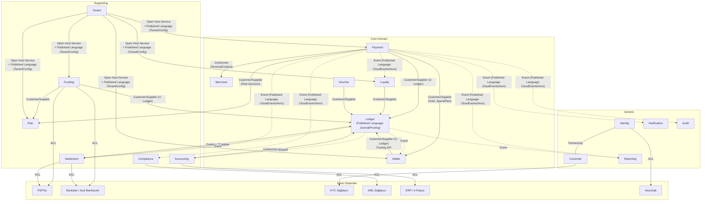
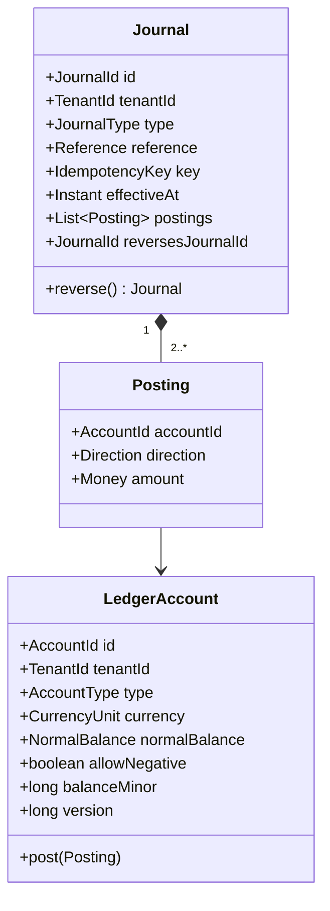
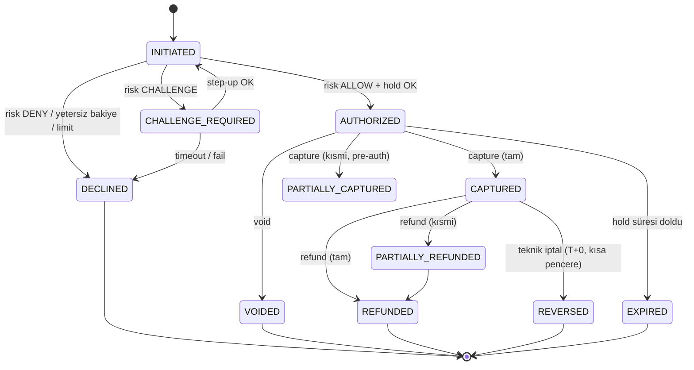

# AEP-CLW — Domain Modeli (DDD)

| Alan | Değer |
|---|---|
| Sahip | Chief Architect (`CA`) + Solution Architect – Payments (`SA`) + Business Analyst (`BA`) |
| İlgili ADR | [ADR-001](adr/ADR-001-microservices-ddd.md), [ADR-006](adr/ADR-006-double-entry-ledger-service.md) |
| Durum | Taslak |

---

## 1. Subdomain Sınıflandırması

| Subdomain | Tip | Bounded Context(ler) | Gerekçe |
|---|---|---|---|
| Cüzdan & Değer Saklama | **Core** | Wallet, Ledger | Rekabet avantajı; finansal doğruluk |
| Ödeme Kabul | **Core** | Payment, Merchant | QR/token/pre-auth sektör farklılaşması |
| Sadakat & Kampanya | **Core** | Loyalty, Voucher | Tenant'ın platformu seçme nedeni |
| Para Yükleme | Supporting | Funding | Kritik ama PSP'lere dayalı |
| Risk & Fraud | Supporting | Risk | Özelleştirilmiş, ancak kısmen satın alınabilir (v2 ML) |
| Uyum | Supporting | Compliance | Regülasyon zorunlu; sağlayıcılarla |
| Takas & Mutabakat | Supporting | Settlement | Finansal operasyon |
| Muhasebe | Supporting | Accounting | ERP'ye köprü |
| Tenant / SaaS | Supporting | Tenant | Multitenant işletim |
| Müşteri & Kimlik | Generic (+özelleştirme) | Identity, Customer | Keycloak + KYC sağlayıcıları |
| Bildirim | Generic | Notification | Sağlayıcı temelli |
| Raporlama | Generic | Reporting | CQRS okuma |
| Denetim | Generic (+regülasyon) | Audit | Hash chain özelleştirmesi |

---

## 2. Context Map

### 2.1 İlişki tipleri — açıklama

| İlişki | Upstream (U) | Downstream (D) | Tip | Not |
|---|---|---|---|---|
| Ledger ← Payment/Funding/Wallet/Loyalty/Voucher/Settlement | Ledger | Diğerleri | **Customer/Supplier** + **Published Language** | Ledger'ın `PostJournal` sözleşmesi tüm context'ler için ortak dildir. Ledger, downstream'lerin kavramlarını (Payment, TopUp) bilmez; yalnız `reference_type` + `reference_id` taşır. |
| Accounting ← Ledger | Ledger | Accounting | **Conformist** | Accounting ledger modelini olduğu gibi kabul eder, eşleme yapar |
| Tenant → herkes | Tenant | Herkes | **Open Host Service** | Versiyonlu TenantConfig şeması (JSON Schema) |
| Payment → Merchant | Merchant | Payment | **Conformist** | `TerminalContext` read modeli |
| Identity ↔ Customer | — | — | **Partnership** | Kayıt akışında birlikte evrilir; ortak release planı |
| Harici sistemler | Harici | İç | **Anti-Corruption Layer** | Harici modeller domain'e sızmaz |
| Reporting/Audit | Herkes | Reporting/Audit | **Event-carried state transfer** | Yalnız tüketici |

---

## 3. Ubiquitous Language — Sözlük (TR / EN)

| TR | EN (kod) | Tanım | Context |
|---|---|---|---|
| Tenant / Marka | Tenant | Platformu kendi markasıyla kullanan kurum | Tenant |
| Program | Program | Tenant altındaki cüzdan ürünü | Tenant |
| Müşteri | Customer | Tenant'ın son kullanıcısı (tenant kapsamında tekil) | Customer |
| KYC seviyesi | KycTier | ANONYMOUS / BASIC / VERIFIED / ENHANCED | Customer |
| Açık rıza / Onay | Consent | KVKK/pazarlama izinleri, versiyonlu metin | Customer |
| Cihaz bağlama | DeviceBinding | Cihaz açık anahtarının müşteriye bağlanması | Identity |
| Cüzdan | Wallet | Müşterinin belirli tipteki değer hesabı (MAIN, BONUS, GIFT...) | Wallet |
| Defter bakiyesi | LedgerBalance | Ledger'daki kesinleşmiş bakiye | Ledger |
| Provizyon / Bloke | Hold | Harcanmak üzere ayrılmış, henüz kesinleşmemiş tutar | Wallet |
| Kullanılabilir bakiye | AvailableBalance | LedgerBalance − aktif Hold'lar | Wallet |
| Değer lotu | ValueLot | Aynı son kullanma tarihine sahip yükleme parçası | Wallet |
| Harcama sırası | SpendPriority / SpendPlan | Hangi cüzdandan ne kadar düşüleceği | Wallet |
| Yükleme | TopUp | Cüzdana harici kaynaktan para girişi | Funding |
| Otomatik yükleme | AutoTopUp | Eşik altına düşünce kayıtlı kartla yükleme | Funding |
| Sanal IBAN | VirtualIban | Müşteriye özel havale eşleştirme IBAN'ı | Funding |
| Geri ödeme / Bakiye iadesi | Payout / Withdrawal | Cüzdan bakiyesinin müşteri banka hesabına iadesi | Funding |
| Ters ibraz | Chargeback | Kart sahibinin bankası üzerinden itiraz | Funding |
| Ödeme | Payment | Müşterinin merchant'a cüzdanla yaptığı ödeme | Payment |
| Yetkilendirme | Authorization | Ödeme için fon ayırma (hold) kararı | Payment |
| Tahsil / Kesinleştirme | Capture | Hold'un gerçek harcamaya dönüşmesi | Payment |
| Ön provizyon | PreAuthorization | Tutarı sonradan belli olacak işlem için hold (EV, otopark) | Payment |
| İptal (capture öncesi) | Void | Yetkilendirmenin geri alınması | Payment |
| Teknik iptal | Reversal | POS timeout vb. nedeniyle sistemsel geri alma | Payment |
| İade | Refund | Capture edilmiş ödemenin (kısmen) geri verilmesi | Payment |
| Kişiden kişiye transfer | P2PTransfer | Müşteriler arası cüzdan transferi | Payment |
| Müşteri QR'ı | CustomerPresentedQr | Müşterinin gösterdiği, kasanın okuduğu dinamik QR | Payment |
| İşyeri QR'ı | MerchantPresentedQr | Merchant'ın gösterdiği, müşterinin okuduğu QR | Payment |
| Ödeme token'ı | PaymentToken | QR/NFC içindeki tek kullanımlık TOTP tabanlı token | Payment |
| İşyeri | Merchant | Ödeme kabul eden tüzel birim | Merchant |
| Mağaza / Şube | Store | Merchant'ın fiziksel/sanal lokasyonu | Merchant |
| Terminal | Terminal | Ödeme alan cihaz/yazılım (Web POS, şarj istasyonu, bariyer) | Merchant |
| Komisyon planı | CommissionPlan (MDR) | Merchant'tan alınan işlem ücreti kuralı | Merchant |
| Yevmiye kaydı | Journal | Dengeli posting'lerden oluşan atomik muhasebe olayı | Ledger |
| Kayıt satırı | Posting / Entry | Tek hesaba borç veya alacak | Ledger |
| Borç / Alacak | Debit / Credit | Çift kayıt yönleri | Ledger |
| Hesap planı | ChartOfAccounts | Tenant'ın ledger hesap şablonu | Ledger |
| Ters kayıt | Reversal Journal | Önceki journal'ı nötrleyen yeni journal | Ledger |
| Askı hesabı | Suspense | Sınıflandırılamayan / eşleşmeyen tutarlar | Ledger |
| Kullanılmayan bakiye geliri | Breakage | Süresi dolan/kullanılmayacak bakiyenin gelir kaydı | Accounting |
| Ertelenmiş gelir | DeferredRevenue | Henüz hizmete dönüşmemiş ön ödeme | Accounting |
| Takas | Settlement | Merchant'a net tutarın ödenmesi | Settlement |
| Mutabakat | Reconciliation | İç kayıtların PSP/banka kayıtlarıyla eşleştirilmesi | Settlement |
| İstisna | ReconciliationException | Eşleşmeyen kayıt | Settlement |
| Puan / Yıldız | Points | Parasal olmayan sadakat birimi | Loyalty |
| Seviye | Tier | Sadakat seviyesi (Green/Gold) | Loyalty |
| Kampanya | Campaign | Kural + bütçe + dönem | Loyalty |
| Para iadesi (kampanya) | Cashback | Harcama karşılığı BONUS cüzdana parasal ödül | Loyalty |
| Kupon | Coupon | Tek/çok kullanımlık indirim hakkı | Loyalty |
| Hediye kartı / e-kod | Voucher / GiftCard | Önceden ödenmiş, koda bağlı değer | Voucher |
| Risk kararı | RiskDecision | ALLOW / CHALLENGE / REVIEW / DENY | Risk |
| Hız kontrolü | Velocity | Zaman penceresinde sayı/tutar limiti | Risk |
| Vaka | Case | İnceleme gerektiren risk/uyum dosyası | Risk / Compliance |
| Tarama | Screening | Yaptırım/PEP listesi kontrolü | Compliance |
| Şüpheli işlem bildirimi | STR (SuspiciousTransactionReport) | MASAK'a bildirim | Compliance |
| Dört göz / Onaylı işlem | MakerChecker | Bir kişi hazırlar, başka kişi onaylar | Cross-cutting |
| Denetim kaydı | AuditRecord | Hash-zincirli değiştirilemez kayıt | Audit |
| Delil paketi | EvidencePackage | Teftiş için imzalı kayıt seti | Audit |

**Yasaklı / belirsiz terimler:** "bakiye" tek başına kullanılmaz (LedgerBalance mı AvailableBalance mı?); "iptal" tek başına
kullanılmaz (Void / Reversal / Refund ayrımı); "transaction" kod içinde DB transaction'ı ile karışmaması için finansal anlamda
kullanılmaz → `Journal`, `Payment`, `TopUp`.

---

## 4. Ana Aggregate'ler ve Invariant'lar

### 4.1 Ledger context

| Aggregate | Invariant'lar |
|---|---|
| **Journal** | (J1) En az 2 posting. (J2) Para birimi başına Σ debit = Σ credit. (J3) Tüm posting'ler aynı tenant. (J4) Tutarlar > 0 (yön `direction` ile). (J5) Oluşturulduktan sonra değişmez. (J6) `(tenant_id, idempotency_key)` tekil. (J7) Reversal journal, orijinalin tam aynası olmalı ve bir journal yalnız bir kez tam ters çevrilebilir. (J8) `effective_at` kapanmış döneme düşemez. |
| **LedgerAccount** | (A1) `allowNegative=false` ise posting sonrası bakiye ≥ 0 (müşteri cüzdan hesapları). (A2) Hesap para birimi ≠ posting para birimi → red. (A3) `CLOSED` hesaba posting yok. (A4) Bakiye = snapshot + sonraki posting'lerin toplamı (sürekli doğrulanır). |

### 4.2 Wallet context

| Aggregate | Invariant'lar |
|---|---|
| **Wallet** | (W1) Müşteri başına tenant config'deki her `walletType` için en fazla 1 aktif cüzdan (para birimi başına). (W2) `FROZEN` cüzdandan çıkış yok (girişe tenant politikası karar verir). (W3) Bakiye tavanı: `ledgerBalance + gelen ≤ maxBalance(kycTier)`. |
| **Hold** | (H1) `amount ≤ availableBalance` (oluşturma anında; ledger hold posting ile garanti). (H2) `capturedAmount ≤ amount × (1 + overCaptureBps)`. (H3) Durum geçişleri: ACTIVE → {CAPTURED, PARTIALLY_CAPTURED, RELEASED, EXPIRED}; terminal durumlardan çıkış yok. (H4) `expiresAt` geçince otomatik EXPIRED + release. (H5) Bir hold tek bir referansa (payment/preauth) bağlıdır. |
| **LimitCounter** | (L1) Dönem (gün/ay) içindeki toplam + yeni tutar ≤ limit. (L2) Sayaç güncellemesi ilgili işlemle aynı saga adımında ve kompanzasyonla geri alınabilir. |
| **ValueLot** | (V1) Harcama FIFO (en erken expiry önce). (V2) Σ lot.remaining = ilgili cüzdanın ledger bakiyesi (günlük mutabakat). |

### 4.3 Payment context

| Aggregate | Invariant'lar |
|---|---|
| **Payment** | (P1) Σ refund ≤ captured. (P2) Capture ≤ authorized (+ over-capture toleransı). (P3) Ödeme token'ı tek kullanımlık (`jti` tekil, TTL içinde). (P4) Terminal + store + merchant aynı tenant ve ACTIVE. (P5) Legs (split tender) toplamı = ödeme tutarı. (P6) Reversal yalnız `REVERSAL_WINDOW` (varsayılan 15 dk) içinde ve settlement'a girmeden önce; sonrası → Refund. |
| **PreAuthorization** | (PA1) Increment toplamı ≤ `maxPreAuthAmount`. (PA2) `completeAt ≤ expiresAt`. (PA3) Final capture ≤ toplam hold; fark otomatik release. |
| **Refund** | (R1) Orijinal ödemenin kaynak cüzdan(lar)ına oransal iade (BONUS'tan harcanan BONUS'a döner — tenant politikası). (R2) Merchant payable yetersizse (takas edilmiş) → merchant receivable (netting) |
| **P2PTransfer** | (T1) Gönderen ≠ alıcı; aynı tenant. (T2) Yalnız `transferable=true` cüzdan tipleri. (T3) Alıcının KYC tavanı aşılamaz. |

### 4.4 Funding context

| Aggregate | Invariant'lar |
|---|---|
| **TopUp** | (F1) Ledger'a posting yalnız PSP **capture/settled** teyidi sonrası (3DS + auth + capture). (F2) PSP'de başarılı ama ledger'da başarısız → otomatik kompanzasyon (PSP refund) veya retry; çift yükleme yok (idempotency: `pspReference` tekil). (F3) Tutar limitleri ve bakiye tavanı saga başında kontrol + ledger posting anında tekrar kontrol. |
| **SavedCard** | (F4) PAN saklanmaz; yalnız `pspToken`, `last4`, `brand`, `expMonth/Year`, `fingerprint` (PSP'nin). |
| **BankTransferMatch** | (F5) Eşleşmeyen havale 24 saat içinde manuel çözüm; aksi halde gönderene iade. |

### 4.5 Merchant, Loyalty, Voucher, Risk, Compliance, Settlement, Tenant

| Aggregate | Invariant'lar |
|---|---|
| **Merchant** | Takas IBAN'ı KYB doğrulanmış tüzel kişiye ait olmalı; `SUSPENDED` merchant'ın terminalleri ödeme alamaz. |
| **Terminal** | Tek store'a bağlı; aktivasyon kodu tek kullanımlık, 24 saat geçerli. |
| **Campaign** | `budgetSpent ≤ budgetCap` (atomik düşüm — DB `UPDATE ... WHERE spent + x <= cap`); aktifken kural değişemez (yeni versiyon). |
| **LoyaltyAccount** | Puan bakiyesi ≥ 0; puan girişleri append-only; iade → oransal puan geri alma (bakiye negatife düşebilir mi: tenant politikası, varsayılan hayır → borç kaydı). |
| **Voucher** | Kod bir kez redeem; `ACTIVATED` olmadan redeem yok; aktivasyon = ödeme alındı teyidi. |
| **RiskRule** | Yayında olan kural değiştirilemez; yeni versiyon önce `SHADOW` modda çalışır. |
| **STR** | Maker ≠ checker; gönderim sonrası değiştirilemez; müşteriye/merchant'a bilgi sızmaz (tipping-off). |
| **SettlementBatch** | `net = gross − fees − refunds − chargebacks ± adjustments`; `PAID` batch yeniden hesaplanamaz — düzeltme sonraki batch'te `adjustment`. |
| **ReconciliationException** | Çözülmeden kapanamaz; her çözüm bir ledger journal'ı (veya "no-op" gerekçesi) referanslar. |
| **TenantConfiguration** | ACTIVE versiyon immutable; limitler platform tavanlarını aşamaz; finansal alanlar geriye dönük etkili olamaz. |

---

## 5. Domain Event Kataloğu (özet)

| Event | Üretici | Tetikleyici | Ana tüketiciler |
|---|---|---|---|
| `CustomerRegistered` | customer | Kayıt tamam | wallet, loyalty, compliance, notification |
| `KycTierChanged` | customer | KYC sonucu | wallet (limit), compliance, notification |
| `TopUpCompleted` | funding | Ledger posting OK | loyalty, notification, compliance, reporting |
| `PaymentCaptured` | payment | Capture OK | loyalty, notification, settlement, compliance, risk, reporting |
| `PaymentRefunded` | payment | Refund OK | loyalty, settlement, notification |
| `PreAuthCompleted` | payment | Final capture | loyalty, notification |
| `HoldExpired` | wallet | TTL | payment |
| `JournalPosted` | ledger | Her journal | wallet (cache), settlement, accounting, reporting |
| `CampaignBudgetExhausted` | loyalty | Bütçe bitti | notification (tenant admin) |
| `RiskCaseOpened` | risk | REVIEW kararı | admin-bff (iş kutusu), notification |
| `ComplianceFreezeRequested` | compliance | Alert/tarama hit | wallet, customer |
| `SettlementBatchPaid` | settlement | Banka teyidi | accounting, merchant webhook, notification |
| `TenantConfigActivated` | tenant | Onay | tüm servisler (cache) |

Event şema ve versiyonlama kuralları: [api-guidelines.md §10](api-guidelines.md).

---

## 6. Modelleme Kararları

1. **Wallet ≠ Ledger Account (1:1 eşleme ama ayrı aggregate).** Wallet iş kavramı (tip, durum, limit, hold, lot); LedgerAccount muhasebe kavramı. Bu ayrım ledger'ı sade ve yeniden kullanılabilir tutar (merchant payable, PSP clearing de LedgerAccount'tur, wallet değildir).
2. **Hold, ledger'da da temsil edilir** (`customer_wallet` → `customer_wallet_held` alt hesabı transferi). Böylece ledger tek başına "harcanabilir" bakiyeyi garanti eder; wallet servisindeki Hold aggregate'i yaşam döngüsü ve TTL yönetir. Bkz. [ledger-design.md §7](ledger-design.md).
3. **Puanlar parasal değildir** ve ana ledger'a girmez (loyalty context'in kendi append-only points ledger'ı vardır). Puanın paraya dönüştüğü an (ödül kullanımı → indirim/cashback) ana ledger'a `promo expense` ile girer.
4. **Müşteri tenant kapsamlıdır.** Aynı telefon numarası farklı tenant'larda farklı `customer_id`; platform genelinde kişi eşlemesi yalnız compliance context'inde (AML için, pseudonymous `person_key`).
5. **Para birimi aggregate seviyesinde sabittir**; FX dönüşümü v1 kapsam dışıdır (tenant tek base currency). Model çoklu para birimine açıktır (Money VO + hesap başına currency).
