# AEP-CLW — Uçtan Uca Akışlar (Sequence Diagrams)

| Alan | Değer |
|---|---|
| Sahip | Solution Architect – Payments (`SA`) |
| İlgili | [ledger-design.md](ledger-design.md) (posting karşılıkları), [service-catalog.md](service-catalog.md), [ADR-005](adr/ADR-005-saga-orchestration.md) |
| Durum | Taslak |

> Gösterim: senkron çağrılar `->>`, yanıtlar `-->>`; asenkron event'ler `K` (Kafka) katılımcısı
> üzerinden gösterilir. "Outbox" = aynı DB transaction'ında `outbox_event` insert, Debezium ile Kafka'ya.
> Tüm mutasyon çağrıları deterministik `Idempotency-Key` taşır.

## İçindekiler

1. [Müşteri kaydı + OTP](#1-müşteri-kaydı--otp--cihaz-bağlama)
2. [Kartla para yükleme (3DS, webhook, saga, compensation)](#2-kartla-para-yükleme-3ds--psp-webhook--saga--compensation)
3. [QR ile mağaza ödemesi (customer-presented dynamic QR)](#3-qr-ile-mağaza-ödemesi-customer-presented-dynamic-qr)
4. [Pre-auth — EV şarj](#4-pre-auth--ev-şarj-hold--increment--final-capture)
5. [İade](#5-iade-refund)
6. [P2P transfer](#6-p2p-transfer)
7. [Gün sonu takas & mutabakat](#7-gün-sonu-takas--mutabakat)
8. [Kampanya / cashback tetikleme](#8-kampanya--cashback-tetikleme)
9. [Fraud bloklama](#9-fraud-bloklama)

---

## 1. Müşteri Kaydı + OTP + Cihaz Bağlama

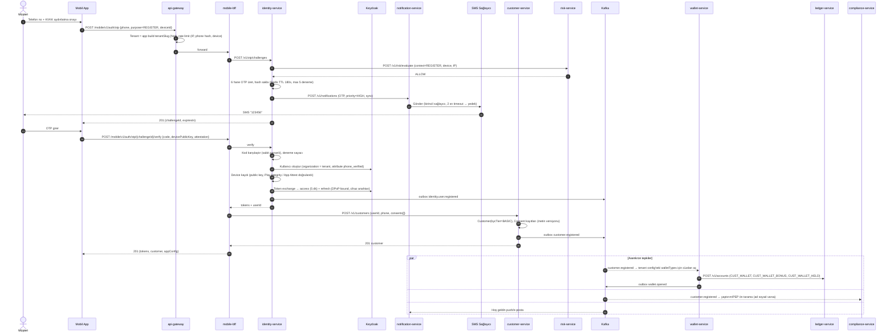

**Hata / güvenlik notları**

| Durum | Davranış |
|---|---|
| OTP 5 hatalı deneme | Challenge kilitlenir; telefon hash için 15 dk cooldown; risk sinyali |
| SIM swap şüphesi (operatör API, ops.) | Risk CHALLENGE → ek doğrulama (e-posta / KYC) |
| Aynı telefon tenant'ta mevcut | Kayıt değil **login** akışına yönlendir (hesap numaralandırma koruması: aynı yanıt süresi ve mesaj) |
| Cihaz attestation başarısız | Kayıt sınırlı mod (yükleme limiti düşük) veya red — tenant politikası |

---

## 2. Kartla Para Yükleme (3DS + PSP Webhook + Saga + Compensation)

### 2.1 Mutlu yol

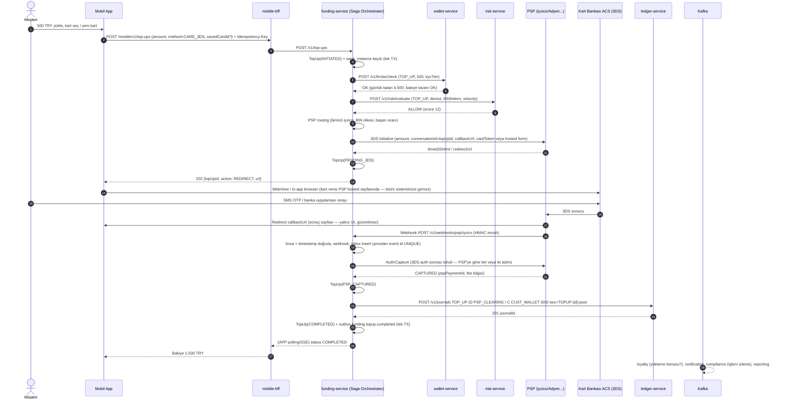

### 2.2 Saga durum makinesi ve kompanzasyon

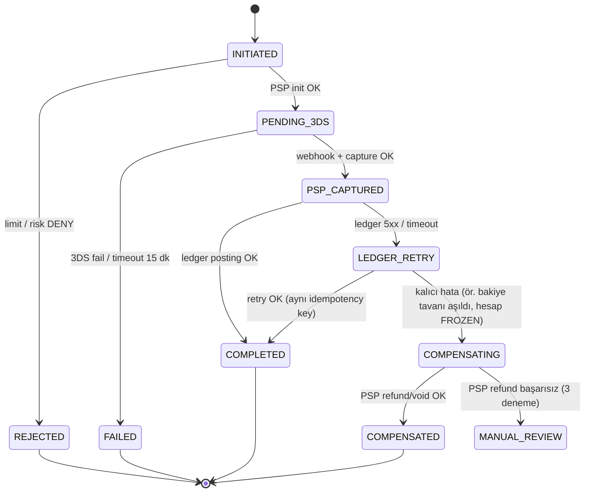

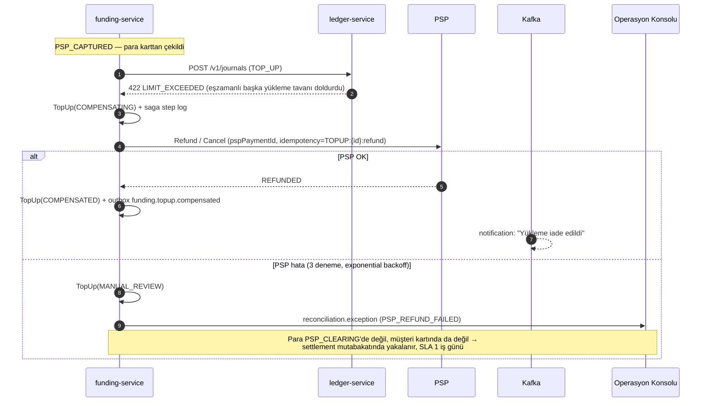

**Kritik kurallar**

| # | Kural |
|---|---|
| F-1 | Ledger posting yalnız **webhook veya PSP sorgu API'si** ile teyit edilmiş capture sonrasında. Redirect callback'ine güvenilmez. |
| F-2 | Webhook gelmezse: saga timeout (3 dk) → PSP `retrieve payment` sorgusu (pull), 15 dk'da FAILED. |
| F-3 | Webhook tekrarları `webhook_inbox (provider, provider_event_id)` UNIQUE ile dedupe. |
| F-4 | Yükleme ücretini müşteri ödüyorsa PSP'ye `amount + fee` gönderilir, posting 3 bacaklıdır (ledger senaryo 2). |
| F-5 | Kayıtlı kart (non-3DS, MIT/CIT kuralı): auto top-up **MIT** (merchant-initiated) olarak işaretlenir; PSP token + ilk işlem 3DS ile alınmış olmalı. |

---

## 3. QR ile Mağaza Ödemesi (Customer-Presented Dynamic QR)

### 3.1 Token tasarımı (TOTP tabanlı)

| Unsur | Tasarım |
|---|---|
| Seed | Cihaz bağlamada, cihaz başına 256-bit `tokenSeed` üretilir; sunucuda Vault Transit ile şifreli, cihazda Secure Enclave / Android Keystore'da |
| Token | `QR = base45(ver ‖ tenantShort ‖ walletRef (opaque, 8B) ‖ deviceKeyId ‖ timeStep ‖ TOTP(HMAC-SHA256, seed, 30s, 8 hane) ‖ sigTrunc)` — ~60 karakter, QR v4 |
| Geçerlilik | Tenant config `qr.ttlSeconds` (varsayılan 60 sn = 2 step), ±1 step saat sapma toleransı |
| Tek kullanım | Redis `SET NX clw:..:qr:nonce:{deviceKeyId}:{step}:{otp}` TTL 90 sn; kullanılmış token → `QR_ALREADY_USED` |
| Offline | Uygulama çevrimdışıyken önceden üretilen **N adet** (config `offlineTokens`) tek kullanımlık, düşük limitli token (sunucuda sayaçlı); POS çevrimdışıysa → kasada ödeme yapılamaz (v1), çevrimiçi POS zorunlu |
| Gizlilik | QR müşteri kimliği/telefonu içermez; `walletRef` opaque ve rotasyonlu |
| Ekran güvenliği | QR ekranında screenshot engelleme (Android FLAG_SECURE), 60 sn geri sayım, step-up (biyometri) tenant ayarı |

### 3.2 Akış

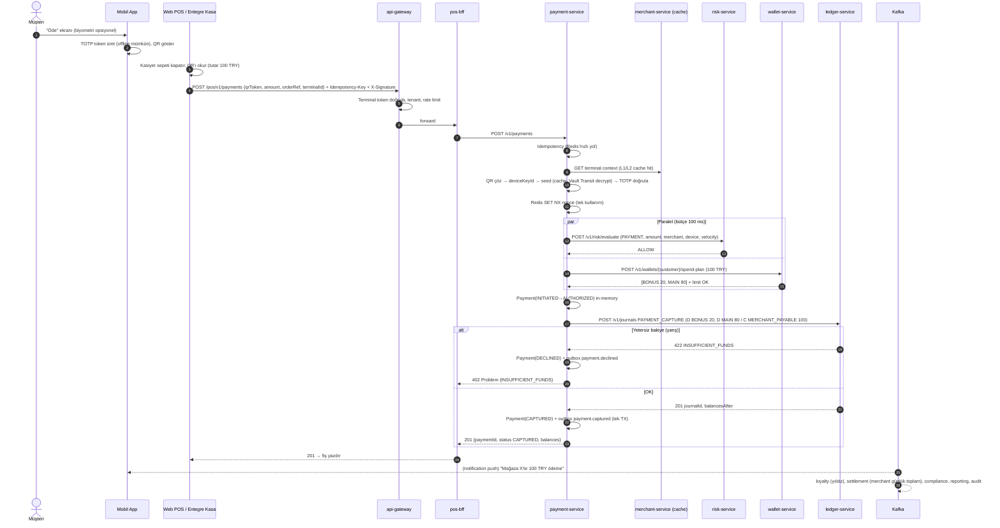

**Zaman bütçesi (p99 300 ms hedefi)**

| Adım | Bütçe |
|---|---|
| Gateway + BFF | 20 ms |
| Terminal context + QR doğrulama + nonce | 15 ms |
| Risk ∥ spend-plan | 80 ms |
| Ledger posting | 40 ms |
| Payment persist + outbox | 15 ms |
| Ağ + serileştirme payı | 30 ms |
| **Toplam** | **~200 ms** (p99 hedefi altında 100 ms tampon) |

**POS timeout / belirsiz sonuç:** POS 5 sn içinde yanıt alamazsa **aynı Idempotency-Key** ile tekrar sorar
(`GET /pos/v1/payments?orderRef=` veya POST retry). Kesin yanıt alınamazsa `POST /payments/{id}/reversal` (15 dk pencere).

### 3.3 Merchant-Presented QR (özet)

Müşteri, kasadaki dinamik QR'ı (tutar + `merchantQrId` + imza) okur → `POST /mobile/v1/merchant-qr/{id}/pay` →
müşteri onayı (biyometri) → aynı ödeme çekirdeği. POS, sonucu webhook veya long-poll ile alır.

---

## 4. Pre-Auth — EV Şarj (Hold → Increment → Final Capture)

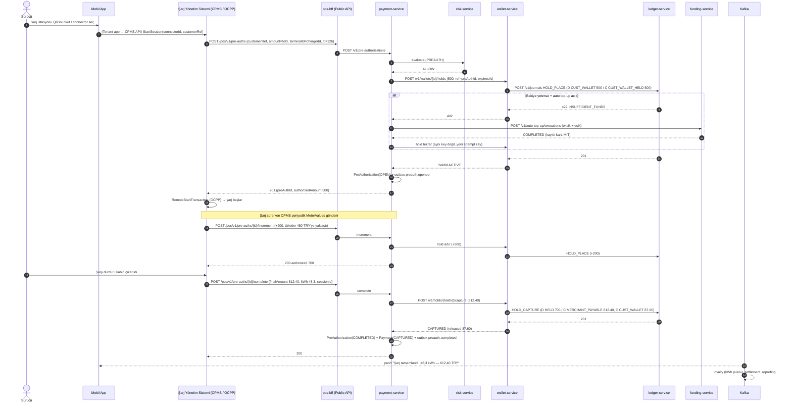

| İstisna | Davranış |
|---|---|
| `complete` hiç gelmez | Hold `expiresAt` (12 saat) → wallet-service `HOLD_RELEASE` + `wallet.hold.expired` → payment `preauth.expired`; CPMS geç `complete` gönderirse → **incremental charge** (yeni ödeme, müşteri bakiyesinden; yetersizse auto top-up / borç kaydı `CUST_RECEIVABLE`) |
| Final > hold | `overCaptureBps` içinde ise fark `CUST_WALLET`'tan ek posting; değilse kalan için ayrı ödeme denemesi |
| CPMS aynı `complete`'i 2 kez gönderir | Idempotency-Key = `PREAUTH:{id}:complete` → aynı yanıt |
| Otopark | Aynı model: giriş (plaka tanıma) → hold 200; çıkış → süre ücreti hesap → capture; bariyer offline ise PARCS kuyruğa alır, çevrimiçi olunca `complete` |

---

## 5. İade (Refund)

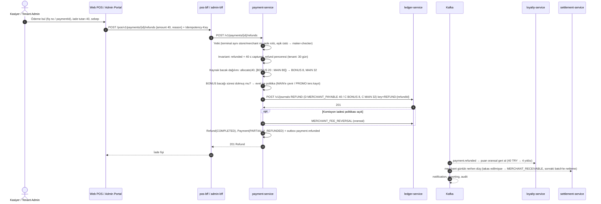

| Kural | Açıklama |
|---|---|
| Refund ≠ Reversal | Reversal: teknik, 15 dk, settlement öncesi, ayna journal. Refund: iş işlemi, kısmi olabilir, pencere tenant ayarı. |
| Maker-checker | Tenant eşiği üstü iade (örn. > 1.000 TRY) → admin onayı bekler (`Refund(PENDING_APPROVAL)`). |
| Karta iade yok | Kapalı devre: iade **cüzdana**. Cüzdan bakiyesinin karta/IBAN'a iadesi ayrı `payout` akışıdır. |

---

## 6. P2P Transfer

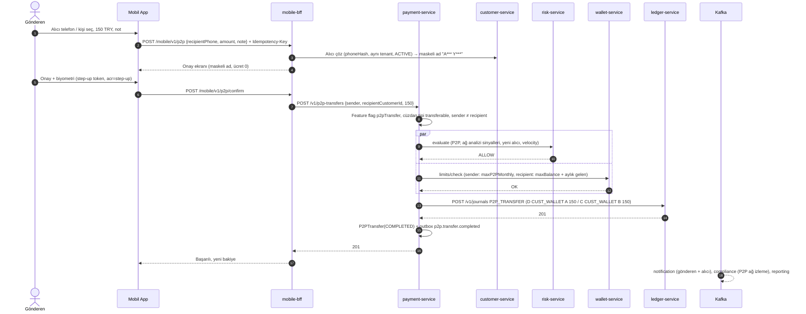

**Risk CHALLENGE durumunda:** `PS` → `428 STEP_UP_REQUIRED` → uygulama PIN/biyometri + opsiyonel OTP → aynı Idempotency-Key ile tekrar.

---

## 7. Gün Sonu Takas & Mutabakat

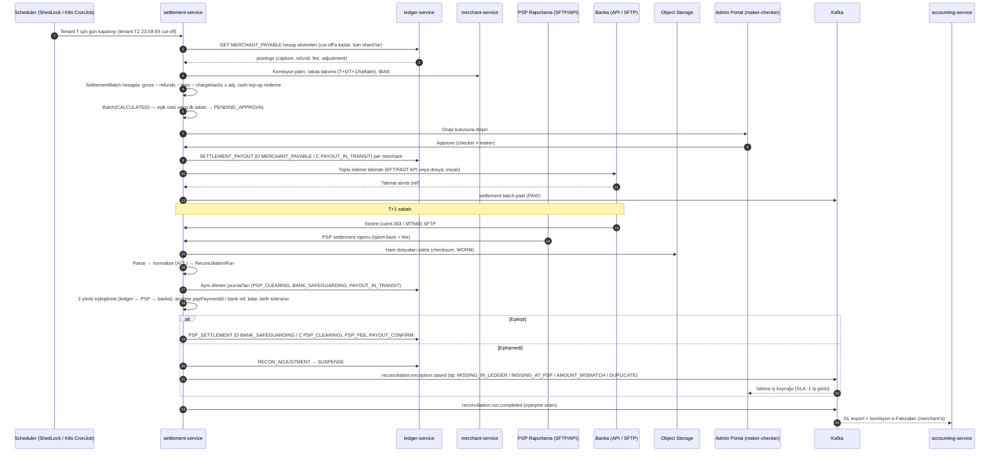

**Mutabakat kontrolleri**

| Kontrol | Kaynaklar | Tolerans |
|---|---|---|
| PSP işlem eşleşmesi | `funding.top_up` ↔ PSP raporu | Tutar tam, tarih ±1 gün |
| PSP net ödeme | PSP raporu net ↔ banka ekstresi | Tam |
| Merchant payout | `PAYOUT_IN_TRANSIT` ↔ banka çıkışları | Tam |
| Safeguarding | Σ müşteri yükümlülükleri ↔ emanet banka bakiyesi + PSP in-transit | Tam; fark → P1 + CMP |
| İç tutarlılık | Trial balance, wallet ↔ ledger | Sıfır |

---

## 8. Kampanya / Cashback Tetikleme

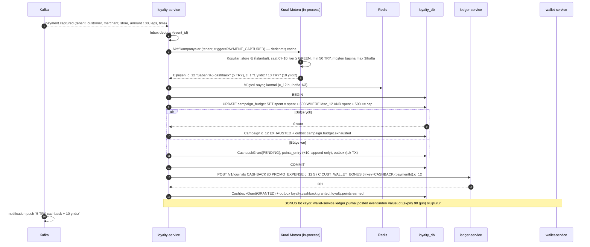

| Kural | Açıklama |
|---|---|
| Geri alma | `payment.refunded` → oransal cashback geri alma (D `CUST_WALLET_BONUS` / C `PROMO_EXPENSE`); BONUS harcanmışsa politika: MAIN'den düş veya zarar yaz (tenant ayarı) |
| Gecikme | Ödeme → cashback yansıma p95 < 5 sn |
| Simülasyon | Kampanya yayına almadan `simulate` ile geçmiş 30 gün ClickHouse verisinde maliyet tahmini |
| Kötüye kullanım | Risk sinyali (aynı cihaz çok hesap) → cashback REVIEW, grant bekletilir |

---

## 9. Fraud Bloklama

### 9.1 Gerçek zamanlı ret + vaka

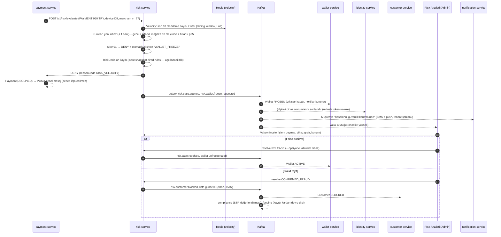

### 9.2 Karar matrisi

| Skor / kural | Karar | Aksiyon |
|---|---|---|
| 0–39 | ALLOW | — |
| 40–69 | CHALLENGE | Step-up (biyometri/PIN/OTP), başarılıysa ALLOW |
| 70–84 | REVIEW | İşlem tenant politikasına göre ALLOW+vaka veya hold+vaka |
| 85–100 veya kesin kural (blocklist) | DENY | Vaka + opsiyonel freeze |
| Risk servisi erişilemez | Tenant `risk.failMode` | `OPEN`: `failOpenMaxAmount` altı ALLOW + sonradan değerlendirme; `CLOSED`: DENY |

Kurallar yeni versiyonda önce **SHADOW** modda çalışır (karar etkilemez, metrik toplar); onaylı promosyon sonrası ACTIVE.
