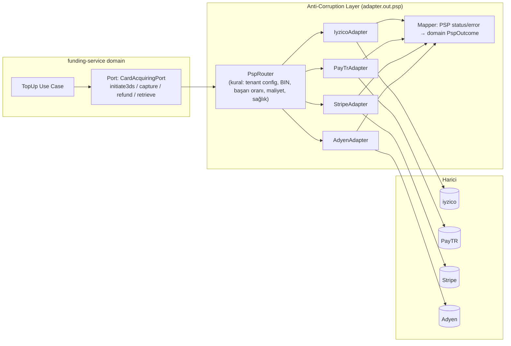
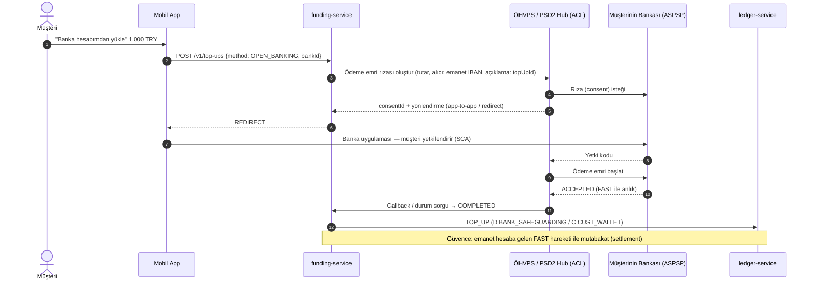
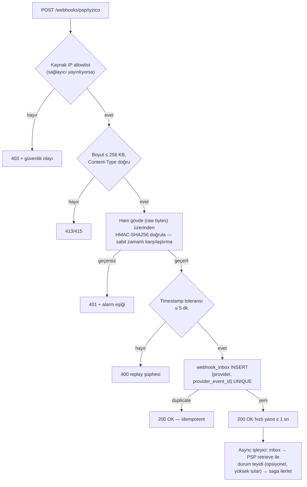

# AEP-CLW — Entegrasyon Mimarisi

| Alan | Değer |
|---|---|
| Sahip | Solution Architect – Payments (`SA`) |
| Onay | Chief Architect (`CA`), CISO (`SEC`), Compliance (`CMP`) |
| İlgili ADR | [ADR-012](adr/ADR-012-no-card-data-storage-psp-tokenization.md), [ADR-005](adr/ADR-005-saga-orchestration.md) |
| Durum | Taslak |

---

## 1. Genel Model — Ports & Adapters + Anti-Corruption Layer



**ACL kuralları**

| # | Kural |
|---|---|
| I1 | Harici DTO'lar (`com.iyzipay.model.*`, Stripe SDK tipleri) **yalnız** adapter paketinde; domain'e sızması ArchUnit ile yasak. |
| I2 | Her adaptör harici durum/hata kodlarını **normalize** eder: `PspOutcome { APPROVED, DECLINED(reason), PENDING, REQUIRES_ACTION, TECHNICAL_ERROR(retryable) }` + `DeclineReason { INSUFFICIENT_FUNDS, DO_NOT_HONOR, FRAUD_SUSPECTED, EXPIRED_CARD, 3DS_FAILED, ... }`. |
| I3 | Ham istek/yanıt (maskelenmiş) `integration_log` tablosuna (30 gün) + S3 (1 yıl) — mutabakat ve itiraz kanıtı. |
| I4 | Her harici çağrı **idempotency** taşır (PSP'nin desteklediği alan: `conversationId`, `Idempotency-Key`, `merchantReference`). |
| I5 | Harici sistemler **egress gateway** üzerinden, host allowlist + mTLS (destekleyenlerde) ile çağrılır. |
| I6 | Sırlar (API key, secret, sertifika) Vault'ta; tenant'a özel PSP hesabı (sub-merchant / marketplace) desteği: `vault:secret/clw/{tenant}/psp/{provider}`. |
| I7 | Contract testleri: sağlayıcı sandbox'larına karşı gece çalışan **provider-verification** suite + WireMock kayıtlı senaryolar (CI). |

---

## 2. Dayanıklılık — Resilience4j Standart Profilleri

| Profil | Kullanım | Timeout | Retry | Circuit Breaker | Bulkhead |
|---|---|---|---|---|---|
| `critical-sync` | İç sıcak yol (ledger, wallet, risk) | 50–150 ms (çağrıya göre) | 0 (ledger), 1 (idempotent GET) | failureRate 50%, slowCall 80% > timeout, window 100 çağrı, open 10 sn | Semaphore 200 |
| `external-psp` | PSP API | connect 1 sn, read 8 sn (3DS init), 15 sn (capture) | **Yalnız** idempotent işlemler, max 2, exponential 200 ms × 2 + jitter, sadece `TECHNICAL_ERROR(retryable)` / 5xx / timeout | failureRate 30%, window 50, open 30 sn, half-open 5 çağrı | PSP başına thread-pool / virtual-thread semaphore 100 |
| `external-bank` | Banka API | 10–30 sn | Max 3 (idempotent referans ile) | failureRate 40%, open 60 sn | 20 |
| `external-kyc-aml` | KYC/AML | 5 sn | 2 | 50%, open 30 sn | 50 |
| `external-comm` | SMS/push/e-posta | 3 sn | 1 (aynı sağlayıcı), sonra **failover** ikincil sağlayıcı | 30%, open 20 sn | 200 |
| `best-effort` | ERP, e-Fatura | 30 sn | Kuyruk bazlı (outbox + retry topic), 72 saat | 50%, open 5 dk | 10 |

**Belirsiz sonuç (timeout sonrası)**: Para hareketi içeren harici çağrıda timeout = "bilinmiyor". Kural:
**asla körlemesine yeniden gönderme** (idempotency desteklemeyen PSP'de çift çekim riski) → önce `retrieve/inquiry` ile durumu sorgula,
sonuca göre ilerle veya kompanze et. Sorgu da başarısızsa saga `UNKNOWN` durumunda bekler, mutabakat çözer.

**PSP failover:** Circuit breaker OPEN → `PspRouter` yeni işlemleri yedek PSP'ye yönlendirir (tenant config'de `fallback` tanımlı ise).
Kayıtlı kart token'ları PSP'ye özgü olduğundan kayıtlı kart işlemleri failover edilemez → müşteriye yeni kart/3DS akışı önerilir
(v2: network token — Visa VTS / Mastercard MDES — ile PSP bağımsız token).

---

## 3. PSP Adaptörleri

| PSP | Pazar | Kullanım | Tokenization | 3DS | Webhook imzası | Settlement raporu | Not |
|---|---|---|---|---|---|---|---|
| **iyzico** | TR | Birincil TR kart tahsilatı, marketplace (sub-merchant) | Card Storage (`cardUserKey` + `cardToken`) | 3DS 2 (`/payment/3dsecure/initialize` → auth) | `X-IYZ-Signature-V3` (HMAC-SHA256) | Settlement/payout raporları API | Checkout Form (hosted) tercih — SAQ A |
| **PayTR** | TR | Alternatif TR PSP, iFrame API | Kart saklama (`utoken`/`ctoken`) | iFrame içinde | `hash` alanı (HMAC-SHA256, merchant_key + salt) — callback POST | Günlük işlem raporu | Callback'e "OK" yanıtı zorunlu |
| **Stripe** | Global/EU | EU tenant'ları, Apple/Google Pay | PaymentMethod / SetupIntent (`off_session`) | Otomatik (PaymentIntent `requires_action`) | `Stripe-Signature` (t=…, v1=HMAC-SHA256), 5 dk tolerans | Balance transactions / payout reconciliation report | Idempotency-Key native |
| **Adyen** | Global/Enterprise | Enterprise tenant'lar, çok ülkeli | Recurring (`storedPaymentMethodId`), network token | Native 3DS2 / Drop-in | HMAC (notification item bazında, `additionalData.hmacSignature`) | Settlement Detail Report (SFTP/API) | Webhook'a `[accepted]` yanıtı; 4.xx batch |

### 3.1 Ortak port

```text
CardAcquiringPort
  initiatePayment(InitiateCommand{tenant, amount, customerRef, savedCardToken?, returnUrl, idempotencyKey, mitFlag})
      → PspInitiation{pspPaymentRef, action: NONE|REDIRECT|HOSTED_FORM|CHALLENGE, actionPayload}
  capture(pspPaymentRef, amount, idempotencyKey)        → PspOutcome
  refund(pspPaymentRef, amount, idempotencyKey)         → PspOutcome
  cancel(pspPaymentRef, idempotencyKey)                 → PspOutcome
  retrieve(pspPaymentRef)                               → PspPaymentStatus
  parseWebhook(headers, rawBody)                        → VerifiedPspEvent   (imza doğrulama dahil)
  createSavedCard(customerRef, returnUrl)               → HostedCardCapture   (PAN bize gelmez)
  fetchSettlementReport(date)                           → Stream<PspSettlementLine>
```

### 3.2 PSP routing

```text
route(topUp) =
  1. tenant.paymentMethods.psp.primary  (sözleşme / sub-merchant hesabı)
  2. saved card → kartın bağlı olduğu PSP (zorunlu)
  3. circuit OPEN → fallback (yalnız yeni kart)
  4. v2: maliyet/başarı oranı bazlı akıllı yönlendirme (BIN × PSP başarı oranı, ClickHouse'tan saatlik)
```

---

## 4. Banka Entegrasyonları

| Yetenek | Protokol | Akış | Not |
|---|---|---|---|
| **Gelen havale / EFT** | Banka API (webhook/polling) veya **MT940 / camt.053 ekstre (SFTP)**; anlık bildirim için banka "hesap hareketi bildirimi" API'si | Açıklama/referanstaki müşteri kodu veya **sanal IBAN** ile eşleştirme → `TOP_UP` | Eşleşmeyen → `SUSPENSE`, 24 saat içinde çözüm/iade |
| **Sanal IBAN** | Banka ürün API'si (alt hesap/sanal IBAN tahsisi) | Müşteri başına kalıcı sanal IBAN → gelen tutar otomatik müşteriye | Kampüs/kurumsal toplu yükleme için ideal; gönderen ad-soyad = müşteri kontrolü (AML) |
| **FAST** | Banka API (FAST ödeme başlatma), 7/24 anlık, TCMB FAST limitleri | Merchant takas ödemesi (küçük tutar), müşteri payout | Limit üstü → EFT |
| **EFT** | Banka API / toplu ödeme dosyası (imzalı, SFTP) | Merchant takas toplu ödeme | EFT çalışma saatleri; talimat ref ile teyit |
| **Emanet (safeguarding) hesap** | Banka API — bakiye sorgu | Günlük safeguarding kontrolü (ledger §5.3) | Ayrı hesap, 6493 fon koruma |
| **Ekstre** | camt.053 (tercih) / MT940 | Günlük mutabakat | Ham dosya S3 WORM |

**Banka ACL:** Her banka farklı format sunduğundan `BankStatementParser` port'u (MT940, camt.053, banka-özel CSV/JSON) ve
`BankPaymentPort` (FAST/EFT/toplu dosya) tanımlanır. Dosya bazlı entegrasyonlarda PGP şifreleme + imza, SFTP anahtarları Vault'ta.

---

## 5. Açık Bankacılık

| Bölge | Standart | Rol | Kullanım |
|---|---|---|---|
| TR | **BKM ÖHVPS** (Ödeme Hizmetleri Veri Paylaşım Servisleri) API standardı, TCMB düzenlemesi | **ÖBHS** (ödeme başlatma hizmeti — PISP) ve **HBHS** (hesap bilgisi — AISP) — lisans: tenant/platform lisansına veya lisanslı iş ortağına bağlı | Kartsız, düşük maliyetli yükleme (hesaptan cüzdana), IBAN doğrulama (hesap sahibi = müşteri) |
| EU | **PSD2** (Berlin Group NextGenPSD2 / STET) — v2'de PSD3/PSR takibi | PISP / AISP (lisanslı aggregator: Tink, TrueLayer, Token.io üzerinden) | EU tenant'larında banka ile yükleme |



> Ödeme emri durumu "ACCEPTED" olsa bile **emanet hesaba fon girişi mutabakatla teyit edilir**. Tenant risk iştahına göre
> anında kredi (instant credit) + mutabakat veya fon görülene kadar bekleme seçilebilir.

---

## 6. KYC Sağlayıcıları

| Yetenek | Seçenekler (TR/EU) | Entegrasyon |
|---|---|---|
| TCKN / kimlik doğrulama | **NVİ KPS** (Kimlik Paylaşım Sistemi — kurum yetkisi gerekir) | SOAP/REST, sync |
| Belge + NFC çip okuma + liveness | Yerli ve global video/NFC KYC sağlayıcıları (ör. çip okuma + yüz eşleme SDK'sı); EU: Onfido, Sumsub, Veriff | Mobil SDK + webhook sonuç |
| Uzaktan kimlik doğrulama (regülasyon uyumlu) | BDDK/TCMB uzaktan kimlik tespiti gereklilikleri kapsamında sertifikalı sağlayıcı | SDK + görüntülü görüşme (ENHANCED tier) |
| Adres doğrulama | e-Devlet belgesi / fatura | Manuel + OCR |

**Port:** `KycVerificationPort { startSession(level) → sdkToken; getResult(sessionId); parseWebhook(...) }`.
Sonuçlar normalize edilir: `KycResult { status, level, checks[{type, outcome, score}], evidenceRefs[] }`. Belgeler S3'te (subject DEK ile şifreli).
**Sağlayıcı seçimi Sprint 1'de RFP ile yapılır** (maliyet, NFC kapsamı, uyum sertifikaları).

---

## 7. AML Tarama Sağlayıcıları

| Yetenek | Kaynak | Entegrasyon |
|---|---|---|
| Yaptırım listeleri | MASAK/BM/OFAC/AB/HMT konsolide listeleri — ticari sağlayıcı (ör. Dow Jones, Refinitiv World-Check, ComplyAdvantage, LexisNexis) | REST (sync onboarding), batch (gece delta tarama) |
| PEP | Aynı sağlayıcılar | aynı |
| Olumsuz medya | Sağlayıcı ek modülü (ENHANCED) | async |
| İşlem izleme | **İç** (compliance-service senaryo motoru + ClickHouse) | — |

- **Fuzzy match eşiği** ve false-positive yönetimi compliance-service'te; sağlayıcı ham skorları saklanır.
- Liste güncellemesinde **delta tarama**: tüm aktif müşteriler (pseudonymous kimlik + şifre çözülmüş isim, izole worker) gece taranır.
- Veri minimizasyonu: sağlayıcıya yalnız ad-soyad, doğum yılı, uyruk gönderilir (TCKN gönderilmez — sağlayıcı sözleşmesi ve KVKK yurt dışı aktarım değerlendirmesi `CMP`).

---

## 8. SMS / Push / E-posta Sağlayıcıları

| Kanal | Birincil | Yedek | Not |
|---|---|---|---|
| SMS (TR) | Netgsm | İletimerkezi / Mutlucell | OTP için ayrı başlık (originator), yüksek öncelik hattı; **İYS** kontrolü pazarlama SMS'lerinde zorunlu |
| SMS (global) | Twilio | Vonage / Infobip | — |
| Push | FCM (Android), APNs (iOS) — tenant başına ayrı Firebase projesi / APNs key (white-label) | — | Token'lar notification_db'de, tenant × app bundle |
| E-posta | Amazon SES (EU/TR bölgesi) | SendGrid | DKIM/SPF/DMARC tenant custom domain desteği |

**Port:** `SmsPort`, `PushPort`, `EmailPort`; `ChannelRouter` sağlık/maliyet/teslim oranına göre seçer.
Teslim raporları (DLR) webhook'ları HMAC/IP allowlist ile korunur. OTP SMS'lerinde içerik: tenant adı + kod + "kimseyle paylaşmayın" + (Android) SMS Retriever hash.

---

## 9. e-Fatura / e-Arşiv Entegratörü

| Konu | Tasarım |
|---|---|
| Model | GİB **özel entegratör** üzerinden (ör. Foriba/Sovos, Uyumsoft, Logo e-Dönüşüm, EDM) — seçim tenant bazında da olabilir (tenant kendi entegratörünü kullanıyorsa) |
| Kapsam | Platform → tenant: SaaS abonelik faturası; Tenant/Platform → merchant: komisyon faturası; müşteri ücretleri (yükleme/P2P ücreti) → e-Arşiv |
| Kapsam dışı | Cüzdan yüklemesi **fatura konusu değildir** (ödeme aracı); mal/hizmet faturası harcamada merchant'ın kendi POS/ERP'si tarafından kesilir |
| Format | UBL-TR 1.2; UUID, ETTN; PDF görüntüsü entegratörden |
| Akış | `accounting-service` → `InvoicePort.issue(ublDoc)` → entegratör → GİB; durum polling/webhook → `accounting.invoice.issued` |
| Hata | Reddedilen fatura → iş kuyruğu; e-Arşiv iptal kuralları (süre sınırları) |

---

## 10. ERP Entegrasyonu (SAP, Logo, Netsis)

| ERP | Yöntem | Format | Yön |
|---|---|---|---|
| **SAP S/4HANA** | OData API (Journal Entry — `API_JOURNALENTRY_SRV` / SOAP `JournalEntryBulkCreateRequest`) veya IDoc (`ACC_DOCUMENT`) | JSON/XML | Platform → ERP (günlük yevmiye özeti) |
| **Logo (Tiger/Go)** | Logo REST API / Logo Objects veya XML import | XML | Platform → ERP |
| **Netsis** | Netsis REST / NetOpenX veya dosya import | XML/CSV | Platform → ERP |
| Genel | SFTP'ye CSV/XLSX (şablon) | CSV | Fallback |

**Tasarım:** `GlExportPort` → ERP adaptörleri. Export **özet seviyesinde** (günlük, hesap × merchant × işlem tipi) — posting
seviyesinde değil (hacim). Her export batch'i: `batchId`, kontrol toplamları (Σ borç = Σ alacak, satır sayısı), ERP'den dönen belge no ile
`gl_export_batch.external_ref` eşleşmesi; idempotent yeniden gönderim (ERP tarafında referans alanıyla duplicate kontrol).
Eşleme tablosu (`gl_mapping`) tenant'ın hesap planına göre admin portalda yönetilir (Tek Düzen Hesap Planı örnek şablonu hazır gelir:
ör. müşteri fonları için 3xx yabancı kaynak, komisyon gelirleri 600/602, promosyon gideri 760 — nihai eşleme tenant mali müşaviri onaylı).

---

## 11. POS Entegrasyonu (REST API + SDK + Webhook)

### 11.1 Entegrasyon seçenekleri

| Seçenek | Hedef | Nasıl |
|---|---|---|
| **Web POS** | Küçük işletme, entegrasyonsuz | Tarayıcıda React uygulaması, kamera ile QR okuma |
| **Public POS REST API** | Kasa yazılımı üreticileri, CPMS, PARCS | `pos-bff` üzerinden `/api/v1/*`, OpenAPI 3.1, sandbox tenant |
| **SDK** | Hızlı entegrasyon | Java, .NET (kasa yazılımlarında yaygın), JavaScript/TypeScript, Kotlin (Android POS/EFT-POS cihazları); OpenAPI Generator + el yazımı yardımcılar (imza, retry, idempotency) |
| **Webhook** | Asenkron sonuç, iade, takas bildirimi | Merchant aboneliği, HMAC imzalı |
| **OCPP köprüsü (EV)** | Şarj istasyonları | CPMS tarafı OCPP; CPMS ↔ AEP-CLW REST (pre-auth API). v2: OCPI (roaming) |

### 11.2 Kimlik ve imza

```text
1) Terminal aktivasyonu: admin portalda aktivasyon kodu → POS: POST /api/v1/terminals/activate {code, deviceInfo}
   → client_id + client_secret (tek sefer gösterim) veya mTLS sertifikası (CSR)
2) Token: POST /oauth/token (client_credentials, scope=payments:write refunds:write) → JWT (15 dk)
3) Her istek:
   Authorization: Bearer <jwt>
   Idempotency-Key: <uuid>                 (mutasyonlarda zorunlu)
   X-Timestamp: 2026-09-25T10:15:03Z       (±5 dk)
   X-Signature: v1=base64(HMAC-SHA256(signingKey, method + "\n" + path + "\n" + X-Timestamp + "\n" + sha256(body)))
```

İstek imzası (token'a ek olarak) — **replay ve MITM** (TLS kırıcı kurumsal proxy) senaryolarına karşı derinlemesine savunma; signing key terminal başına, Vault'ta, rotasyon 90 gün.

### 11.3 Merchant webhook sözleşmesi

```http
POST https://kasa.merchant.com/clw/webhooks
Content-Type: application/cloudevents+json
Webhook-Id: evt_01J9Z7...
Webhook-Timestamp: 1790331303
Webhook-Signature: v1,K5o...=   (HMAC-SHA256(secret, id + "." + timestamp + "." + body))

{ "specversion": "1.0", "id": "evt_01J9Z7...", "type": "com.aep.clw.payment.captured.v1", "source": "/tenants/kx/payments",
  "time": "2026-09-25T10:15:03.412Z", "datacontenttype": "application/json",
  "data": { "paymentId": "pay_01J9Z...", "orderRef": "F-1029", "amount": { "amount": "100.00", "currency": "TRY" }, "status": "CAPTURED" } }
```

- **Standard Webhooks** (standardwebhooks.com) başlık konvansiyonu; imza secret'ı abonelik başına, 2 aktif secret ile rotasyon.
- Teslim: 2xx = başarı; aksi halde exponential backoff (1 dk, 5 dk, 30 dk, 2 sa, 6 sa, 12 sa… 72 saat), sonra `FAILED` + admin bildirimi; manuel yeniden gönderim.
- Sıralama garantisi yoktur; alıcı `id` ile dedupe, `time` + kaynak nesnenin güncel durumunu `GET` ile teyit etmelidir.

---

## 12. Gelen Webhook Güvenliği (PSP, banka, KYC, SMS DLR)



| Kural | Detay |
|---|---|
| Ham gövde | İmza **parse edilmeden önce** ham byte'lar üzerinden doğrulanır (JSON yeniden serileştirme imzayı bozar) |
| Sabit zamanlı karşılaştırma | `MessageDigest.isEqual` |
| Secret rotasyonu | 2 secret eşzamanlı geçerli (geçiş penceresi) |
| Güven ama doğrula | Kritik durum değişiklikleri (capture, refund) webhook'tan sonra **PSP retrieve API** ile teyit (yüksek tutar veya imza desteklemeyen sağlayıcı) |
| Hızlı ACK | İş mantığı webhook isteği içinde çalışmaz; inbox'a yaz → 200 |
| Gözlem | İmza hatası oranı, gecikme, duplicate oranı metrikleri; sağlayıcı bazında dashboard |

---

## 13. Entegrasyon Envanteri (özet)

| Sistem | Sahip servis | Yön | Protokol | Kimlik | SLA bağımlılığı | Fallback |
|---|---|---|---|---|---|---|
| iyzico / PayTR / Stripe / Adyen | funding (+settlement rapor) | Çift | REST + webhook | API key + HMAC | Yükleme | Yedek PSP |
| Bankalar (FAST/EFT/ekstre) | funding, settlement | Çift | REST / SFTP | mTLS / SSH key + PGP | Takas | Dosya bazlı fallback |
| ÖHVPS / PSD2 | funding | Giden + callback | REST (FAPI, mTLS) | QWAC/QSealC (EU), BKM sertifikası (TR) | Yükleme (alternatif) | Kart |
| NVİ KPS | customer | Giden | SOAP/REST | Kurum sertifikası | KYC | Manuel |
| KYC sağlayıcı | customer | Çift | REST + SDK + webhook | API key + HMAC | KYC | İkincil sağlayıcı / manuel |
| AML sağlayıcı | compliance | Giden + batch | REST / SFTP | API key | Onboarding | Manuel inceleme kuyruğu (fail-closed) |
| SMS / Push / E-posta | notification | Giden + DLR | REST | API key | OTP | İkincil sağlayıcı |
| İYS | notification | Giden | REST | API key | Pazarlama | Pazarlama durdurulur |
| e-Fatura entegratörü | accounting | Çift | REST/SOAP | API key / sertifika | Faturalama | Kuyruk (72 sa) |
| SAP / Logo / Netsis | accounting | Giden | OData / REST / dosya | OAuth / kullanıcı | GL | SFTP CSV |
| POS / CPMS / PARCS | pos-bff, merchant | Gelen + webhook | REST | OAuth CC + HMAC (+mTLS) | Ödeme | Web POS |
| TSA (RFC 3161) | audit | Giden | HTTP | — | Audit anchor | İkincil TSA |
