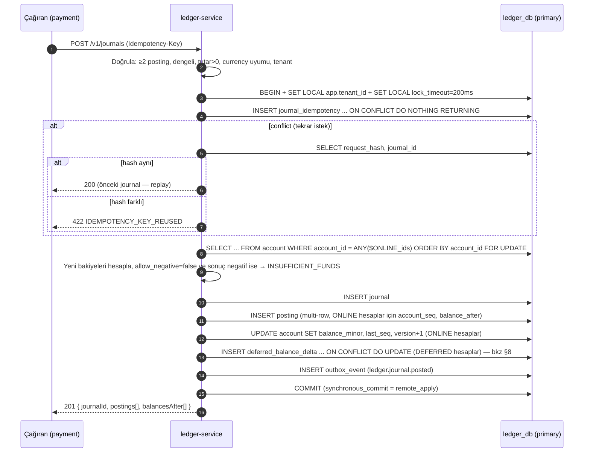
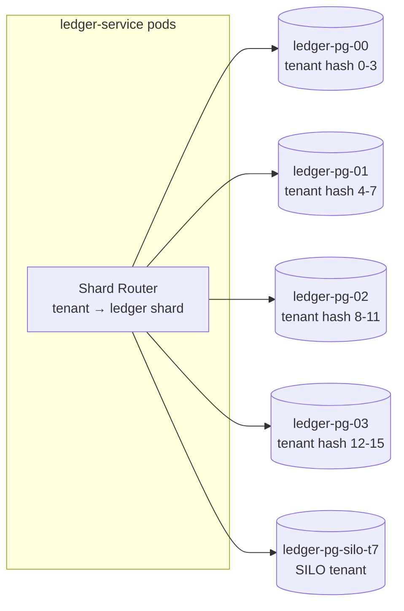

# AEP-CLW — Ledger Tasarımı (Çift Kayıtlı Defter)

| Alan | Değer |
|---|---|
| Sahip | Solution Architect – Payments (`SA`) + DBA (`DATA`) |
| Onay | Chief Architect (`CA`), Compliance (`CMP`), Internal Audit (`AUD`) |
| İlgili ADR | [ADR-006](adr/ADR-006-double-entry-ledger-service.md), [ADR-003](adr/ADR-003-postgresql-database-per-service-rls.md) |
| Durum | Taslak |

> `ledger-service` platformdaki **parasal gerçeğin tek kaynağıdır**. Bu doküman hesap modelini, şemayı,
> yazma yolunu, eşzamanlılık stratejisini ve tüm iş senaryolarının posting karşılıklarını tanımlar.

---

## 1. Temel Kurallar

| # | Kural |
|---|---|
| L1 | Her para hareketi bir **journal**'dır; journal ≥ 2 **posting** içerir ve para birimi başına **Σ debit = Σ credit**. |
| L2 | Journal ve posting'ler **append-only**'dir. `UPDATE`/`DELETE` DB seviyesinde yasaktır. Hata düzeltme = **reversal journal** (+ gerekirse doğru journal). |
| L3 | Tutarlar **minor unit** (`bigint`) olarak saklanır; `numeric`/`float` para alanlarında yasak. |
| L4 | Her journal bir **idempotency key** taşır; aynı key ile ikinci istek aynı sonucu döner, yeni kayıt oluşturmaz. |
| L5 | Negatif bakiyeye izin verilmeyen hesaplar (müşteri cüzdanları) **DB constraint** ile korunur — uygulama hatası bile negatif bakiye üretemez. |
| L6 | Ledger başka servise senkron çağrı yapmaz; iş kavramlarını (Payment, TopUp) bilmez, yalnız `reference_type/reference_id` saklar. |
| L7 | Her journal tek tenant'a aittir; cross-tenant journal yoktur. |
| L8 | `effective_at` (muhasebe tarihi) ≠ `created_at` (sistem zamanı); kapanmış döneme `effective_at` yazılamaz. |

---

## 2. Hesap Modeli

### 2.1 Hesap tipleri (tenant başına hesap planı şablonu)

| Kod | Ad | Sınıf | Normal bakiye | Negatif? | Kardinalite | Açıklama |
|---|---|---|---|---|---|---|
| `CUST_WALLET` | Müşteri cüzdanı (MAIN/GIFT/ALLOWANCE) | Liability | Credit | **Hayır** | Cüzdan başına 1 | Müşteriye borçlu olunan elektronik para/ön ödeme |
| `CUST_WALLET_BONUS` | Müşteri bonus/promosyon cüzdanı | Liability | Credit | Hayır | Cüzdan başına 1 | Nakde çevrilemeyen promosyon değeri |
| `CUST_WALLET_HELD` | Müşteri provizyon (hold) alt hesabı | Liability | Credit | Hayır | Cüzdan başına 1 | Hold edilmiş tutar; harcanamaz |
| `MERCHANT_PAYABLE` | İşyeri borcu | Liability | Credit | Evet (netting) | Merchant başına × **N shard** | Merchant'a takasla ödenecek tutar |
| `MERCHANT_RECEIVABLE` | İşyeri alacağı | Asset | Debit | Evet | Merchant başına | Kasada nakit yükleme, takas sonrası iade vb. |
| `VOUCHER_LIABILITY` | Hediye kartı yükümlülüğü | Liability | Credit | Hayır | Tenant (+batch) başına | Satılmış ama cüzdana yüklenmemiş kodlar |
| `PSP_CLEARING` | PSP takas (alacak) | Asset | Debit | Evet | PSP × para birimi × **N shard** | PSP'den tahsil edilecek tutar |
| `BANK_SAFEGUARDING` | Emanet (koruma) banka hesabı | Asset | Debit | Hayır | Banka hesabı başına | Müşteri fonlarının tutulduğu ayrık hesap (6493 fon koruma) |
| `BANK_OPERATING` | İşletme banka hesabı | Asset | Debit | Hayır | — | Ücret gelirlerinin aktarıldığı hesap |
| `PAYOUT_IN_TRANSIT` | Yoldaki ödeme | Asset | Debit | Evet | Tenant başına | Banka talimatı verilmiş, teyit bekleyen |
| `FEE_INCOME` | Ücret/komisyon geliri | Revenue | Credit | Evet | Ücret tipi başına × N shard | Müşteri ücretleri, merchant MDR |
| `VAT_PAYABLE` | Hesaplanan KDV | Liability | Credit | Evet | Tenant başına | Ücretler üzerindeki KDV |
| `BREAKAGE_INCOME` | Kullanılmayan bakiye geliri | Revenue | Credit | Evet | Tenant başına | Süresi dolan ödenmiş değer |
| `PROMO_EXPENSE` | Promosyon/kampanya gideri | Expense | Debit | Evet | Kampanya başına | Bonus/cashback maliyeti |
| `PROMO_FUNDING_LIABILITY` | Promosyon fonlama yükümlülüğü | Liability | Credit | Hayır | Tenant başına | Tenant'ın promosyon için ön-fonladığı tutar (bkz. §12.2) |
| `PSP_FEE_EXPENSE` | PSP/banka maliyet gideri | Expense | Debit | Evet | PSP başına | PSP komisyonları |
| `CUST_RECEIVABLE` | Müşteri alacağı | Asset | Debit | Evet | Müşteri başına (lazy) | Chargeback/ters işlem sonrası müşteriden alacak (cüzdan negatife düşürülmez) |
| `CHARGEBACK_LOSS` | Ters ibraz zararı | Expense | Debit | Evet | Tenant başına | Tahsil edilemeyen chargeback |
| `SUSPENSE` | Askı hesabı | Asset | Debit | **Evet** | Tenant × sebep | Eşleşmeyen havale, mutabakat farkları; günlük sıfırlanma hedefi |
| `ROUNDING` | Yuvarlama farkı | Expense | Debit | Evet | Tenant başına | Oransal bölüştürmede kalan (allocate ile ≈ 0) |

### 2.2 Normal bakiye ve işaret konvansiyonu

- Posting tutarı daima **pozitif** `amount_minor` + `direction ∈ {D, C}`.
- Hesap bakiyesi **normal bakiye yönünde** tutulur:
  - Debit-normal hesap: `balance += (D ? +amount : −amount)`
  - Credit-normal hesap: `balance += (C ? +amount : −amount)`
- Böylece müşteri cüzdanı bakiyesi (credit-normal liability) müşterinin gördüğü pozitif sayıdır.

### 2.3 Hesap tanımlayıcıları

`account_id` = UUIDv7 (zaman sıralı, B-tree dostu). İnsan okunur **account code**:
`{tenantShort}:{TYPE}:{ownerId}[:{currency}][:s{shard}]` — örn. `kx:CUST_WALLET:w_01J9...:TRY`, `kx:MERCHANT_PAYABLE:m_77:TRY:s05`.

---

## 3. Şema (PostgreSQL 16 DDL)

```sql
CREATE SCHEMA IF NOT EXISTS ledger;

-- 3.1 Para birimleri (ISO 4217)
CREATE TABLE ledger.currency (
  code        char(3)  PRIMARY KEY,
  minor_unit  smallint NOT NULL CHECK (minor_unit BETWEEN 0 AND 4),   -- TRY=2, JPY=0, KWD=3
  active      boolean  NOT NULL DEFAULT true
);

-- 3.2 Hesap planı şablonu (tenant başına instantiate edilir)
CREATE TABLE ledger.account_type (
  code            text     PRIMARY KEY,                                -- CUST_WALLET, MERCHANT_PAYABLE ...
  account_class   text     NOT NULL CHECK (account_class IN ('ASSET','LIABILITY','EQUITY','REVENUE','EXPENSE')),
  normal_balance  char(1)  NOT NULL CHECK (normal_balance IN ('D','C')),
  allow_negative  boolean  NOT NULL,
  default_shards  smallint NOT NULL DEFAULT 1
);

-- 3.3 Hesaplar
CREATE TABLE ledger.account (
  account_id      uuid        PRIMARY KEY,
  tenant_id       uuid        NOT NULL,
  account_code    text        NOT NULL,
  type_code       text        NOT NULL REFERENCES ledger.account_type(code),
  owner_type      text        NOT NULL CHECK (owner_type IN ('WALLET','MERCHANT','TENANT','PSP','BANK','CAMPAIGN','VOUCHER_BATCH','SYSTEM')),
  owner_id        text        NOT NULL,
  currency        char(3)     NOT NULL REFERENCES ledger.currency(code),
  normal_balance  char(1)     NOT NULL CHECK (normal_balance IN ('D','C')),
  allow_negative  boolean     NOT NULL,
  parent_account_id uuid      NULL REFERENCES ledger.account(account_id),  -- shard'lı hesabın mantıksal ebeveyni
  shard_no        smallint    NOT NULL DEFAULT 0,
  status          text        NOT NULL DEFAULT 'OPEN' CHECK (status IN ('OPEN','FROZEN_DEBIT','CLOSED')),
  balance_minor   bigint      NOT NULL DEFAULT 0,     -- running balance (normal yönde)
  last_seq        bigint      NOT NULL DEFAULT 0,     -- hesap içi posting sıra no
  version         bigint      NOT NULL DEFAULT 0,     -- optimistic lock
  balance_mode    text        NOT NULL DEFAULT 'ONLINE' CHECK (balance_mode IN ('ONLINE','DEFERRED')),
  created_at      timestamptz NOT NULL DEFAULT now(),
  CONSTRAINT uq_account_code UNIQUE (tenant_id, account_code),
  CONSTRAINT ck_non_negative CHECK (allow_negative OR balance_minor >= 0)   -- L5: son savunma hattı
);
CREATE INDEX ix_account_owner ON ledger.account (tenant_id, owner_type, owner_id);

-- 3.4 Journal (aylık partition)
CREATE TABLE ledger.journal (
  journal_id          uuid        NOT NULL,             -- UUIDv7
  tenant_id           uuid        NOT NULL,
  journal_type        text        NOT NULL,             -- TOP_UP, PAYMENT_CAPTURE, HOLD_PLACE, REFUND, BREAKAGE ...
  reference_type      text        NOT NULL,             -- PAYMENT, TOP_UP, SETTLEMENT_BATCH ...
  reference_id        text        NOT NULL,
  idempotency_key     text        NOT NULL,
  reverses_journal_id uuid        NULL,
  effective_at        timestamptz NOT NULL,             -- muhasebe tarihi
  created_at          timestamptz NOT NULL DEFAULT now(),
  created_by          text        NOT NULL,             -- servis/aktör (spiffe id veya user id)
  description         text        NULL,
  metadata            jsonb       NOT NULL DEFAULT '{}'::jsonb,   -- PII YOK
  PRIMARY KEY (journal_id, created_at)
) PARTITION BY RANGE (created_at);
CREATE INDEX ix_journal_ref ON ledger.journal (tenant_id, reference_type, reference_id);
CREATE INDEX ix_journal_reverses ON ledger.journal (reverses_journal_id) WHERE reverses_journal_id IS NOT NULL;

-- 3.5 Posting (aylık partition)
CREATE TABLE ledger.posting (
  posting_id        bigint      GENERATED ALWAYS AS IDENTITY,
  journal_id        uuid        NOT NULL,
  tenant_id         uuid        NOT NULL,
  account_id        uuid        NOT NULL,
  direction         char(1)     NOT NULL CHECK (direction IN ('D','C')),
  amount_minor      bigint      NOT NULL CHECK (amount_minor > 0),
  currency          char(3)     NOT NULL,
  account_seq       bigint      NULL,     -- ONLINE hesaplarda hesap içi sıra (gap-free)
  balance_after     bigint      NULL,     -- ONLINE hesaplarda posting sonrası bakiye
  effective_at      timestamptz NOT NULL,
  created_at        timestamptz NOT NULL DEFAULT now(),
  PRIMARY KEY (posting_id, created_at)
) PARTITION BY RANGE (created_at);
CREATE INDEX ix_posting_account ON ledger.posting (tenant_id, account_id, created_at DESC);
CREATE INDEX ix_posting_journal ON ledger.posting (journal_id);
CREATE UNIQUE INDEX uq_posting_account_seq ON ledger.posting (account_id, account_seq, created_at)
  WHERE account_seq IS NOT NULL;

-- 3.6 Idempotency (partition'sız: partitioned tabloda global unique mümkün değil)
CREATE TABLE ledger.journal_idempotency (
  tenant_id        uuid        NOT NULL,
  idempotency_key  text        NOT NULL,
  request_hash     bytea       NOT NULL,    -- SHA-256(canonical request)
  journal_id       uuid        NOT NULL,
  created_at       timestamptz NOT NULL DEFAULT now(),
  PRIMARY KEY (tenant_id, idempotency_key)
);
-- Tek-seferlik reversal garantisi
CREATE TABLE ledger.journal_reversal_guard (
  reversed_journal_id uuid PRIMARY KEY,
  reversal_journal_id uuid NOT NULL,
  tenant_id           uuid NOT NULL
);

-- 3.7 Bakiye snapshot (gün sonu, tenant timezone)
CREATE TABLE ledger.balance_snapshot (
  account_id     uuid        NOT NULL,
  tenant_id      uuid        NOT NULL,
  as_of          timestamptz NOT NULL,        -- snapshot anı (dahil)
  balance_minor  bigint      NOT NULL,
  last_seq       bigint      NULL,
  posting_count  bigint      NOT NULL,
  checksum       bytea       NOT NULL,        -- SHA-256(prev_checksum || postings)
  PRIMARY KEY (account_id, as_of)
);

-- 3.8 Muhasebe dönemleri
CREATE TABLE ledger.accounting_period (
  tenant_id   uuid  NOT NULL,
  period      date  NOT NULL,                  -- ayın ilk günü
  status      text  NOT NULL CHECK (status IN ('OPEN','CLOSING','CLOSED')),
  closed_at   timestamptz NULL,
  PRIMARY KEY (tenant_id, period)
);

-- 3.9 DEFERRED (hot) hesaplar için bakiye birikimi
CREATE TABLE ledger.deferred_balance_delta (
  account_id    uuid        NOT NULL,
  tenant_id     uuid        NOT NULL,
  bucket_ts     timestamptz NOT NULL,          -- 1 sn'lik kova
  delta_minor   bigint      NOT NULL,
  PRIMARY KEY (account_id, bucket_ts)
);
```

### 3.10 Değiştirilemezlik (append-only) zorlaması

```sql
CREATE OR REPLACE FUNCTION ledger.forbid_mutation() RETURNS trigger LANGUAGE plpgsql AS $$
BEGIN
  RAISE EXCEPTION 'ledger tables are append-only (% on %)', TG_OP, TG_TABLE_NAME
    USING ERRCODE = 'insufficient_privilege';
END $$;

CREATE TRIGGER trg_journal_immutable  BEFORE UPDATE OR DELETE ON ledger.journal
  FOR EACH ROW EXECUTE FUNCTION ledger.forbid_mutation();
CREATE TRIGGER trg_posting_immutable  BEFORE UPDATE OR DELETE ON ledger.posting
  FOR EACH ROW EXECUTE FUNCTION ledger.forbid_mutation();
CREATE TRIGGER trg_journal_truncate BEFORE TRUNCATE ON ledger.journal
  FOR EACH STATEMENT EXECUTE FUNCTION ledger.forbid_mutation();
CREATE TRIGGER trg_posting_truncate BEFORE TRUNCATE ON ledger.posting
  FOR EACH STATEMENT EXECUTE FUNCTION ledger.forbid_mutation();

REVOKE UPDATE, DELETE, TRUNCATE ON ledger.journal, ledger.posting FROM ledger_app;
```

> **Arşivleme istisnası:** 10 yıllık saklama sonrası partition'lar `DETACH PARTITION` + arşiv (Parquet, WORM)
> ile kaldırılır; bu işlem yalnız `ledger_owner` rolüyle, maker-checker onaylı runbook ile yapılır ve audit'e yazılır.

### 3.11 Denge invariant'ı — statement-level trigger (transition table)

Uygulama journal'ı dengeli üretir; DB ikinci savunma hattıdır. Row-level trigger yerine **statement-level** trigger
(batch insert başına bir kez) kullanılır → 15k posting/s altında düşük maliyet.

```sql
CREATE OR REPLACE FUNCTION ledger.assert_balanced() RETURNS trigger LANGUAGE plpgsql AS $$
DECLARE bad record;
BEGIN
  SELECT journal_id, currency,
         SUM(CASE WHEN direction='D' THEN amount_minor ELSE 0 END) AS dr,
         SUM(CASE WHEN direction='C' THEN amount_minor ELSE 0 END) AS cr
    INTO bad
    FROM new_postings
   GROUP BY journal_id, currency
  HAVING SUM(CASE WHEN direction='D' THEN amount_minor ELSE -amount_minor END) <> 0
   LIMIT 1;
  IF FOUND THEN
    RAISE EXCEPTION 'unbalanced journal % (%): D=% C=%', bad.journal_id, bad.currency, bad.dr, bad.cr
      USING ERRCODE = 'check_violation';
  END IF;
  RETURN NULL;
END $$;

CREATE TRIGGER trg_posting_balanced
  AFTER INSERT ON ledger.posting
  REFERENCING NEW TABLE AS new_postings
  FOR EACH STATEMENT EXECUTE FUNCTION ledger.assert_balanced();
```

> Kural: bir journal'ın tüm posting'leri **tek bir multi-row INSERT** ile yazılır (jOOQ batch → tek statement).
> Aksi halde statement-level kontrol parçalı journal'ı reddeder — bu bilinçli bir tasarım kısıtıdır.

---

## 4. Yazma Yolu (Post Journal)

### 4.1 API sözleşmesi

```http
POST /v1/journals
Idempotency-Key: pay_01J9Z...:capture
X-Tenant-Id: 8f1c...
Content-Type: application/json

{
  "journalType": "PAYMENT_CAPTURE",
  "reference": { "type": "PAYMENT", "id": "pay_01J9Z..." },
  "effectiveAt": "2026-09-25T10:15:03.120Z",
  "postings": [
    { "accountId": "acc_wallet_main_...", "direction": "D", "amount": { "amount": "80.00", "currency": "TRY" } },
    { "accountId": "acc_wallet_bonus_...", "direction": "D", "amount": { "amount": "20.00", "currency": "TRY" } },
    { "accountRef": { "type": "MERCHANT_PAYABLE", "ownerId": "m_77", "currency": "TRY" }, "direction": "C",
      "amount": { "amount": "100.00", "currency": "TRY" } }
  ],
  "metadata": { "storeId": "st_12", "terminalId": "t_900" }
}
```

`accountRef` (tip + sahip) verildiğinde ledger doğru hesabı (ve shard'ı) kendisi çözer — çağıranlar shard'lamayı bilmez.

### 4.2 Algoritma



- **Tek round-trip optimizasyonu:** Yukarıdaki adımlar jOOQ ile tek transaction'da, pipeline edilmiş (PgJDBC batch) 5–6 statement'tır. Hedef p99 < 40 ms.
- **Kilit sırası:** Hesaplar `account_id` artan sırada kilitlenir → deadlock yok (tüm yazma yolları aynı sırayı kullanır).
- **`lock_timeout=200ms`:** Kilit beklemesi aşılırsa `409 LEDGER_CONTENTION` → çağıran saga idempotent retry yapar (aynı key).

---

## 5. Bakiye Hesaplama

### 5.1 Üç katmanlı model

| Katman | Kaynak | Kullanım | Tutarlılık |
|---|---|---|---|
| **Running balance** | `account.balance_minor` (ONLINE) | Harcama kararları (negatif kontrol), anlık bakiye | Güçlü (TX içinde) |
| **Posting `balance_after`** | Her posting | Hesap ekstresi, "işlem sonrası bakiye" gösterimi, as-of sorgu (hızlı yol) | Güçlü |
| **Snapshot** | `balance_snapshot` (gün sonu) | Tarihsel as-of, mutabakat, doğrulama, arşiv sonrası başlangıç bakiyesi | Günlük |

### 5.2 As-of bakiye

```sql
-- ONLINE hesap: t anındaki bakiye
SELECT balance_after
  FROM ledger.posting
 WHERE tenant_id = $1 AND account_id = $2 AND created_at <= $3
 ORDER BY created_at DESC, account_seq DESC
 LIMIT 1;

-- Genel (DEFERRED hesaplar dahil): snapshot + delta
WITH s AS (
  SELECT balance_minor, as_of FROM ledger.balance_snapshot
   WHERE account_id = $2 AND as_of <= $3 ORDER BY as_of DESC LIMIT 1
)
SELECT COALESCE((SELECT balance_minor FROM s), 0)
     + COALESCE(SUM(CASE WHEN p.direction = a.normal_balance THEN p.amount_minor ELSE -p.amount_minor END), 0)
  FROM ledger.posting p
  JOIN ledger.account a ON a.account_id = p.account_id
 WHERE p.account_id = $2
   AND p.created_at >  COALESCE((SELECT as_of FROM s), '-infinity')
   AND p.created_at <= $3;
```

### 5.3 Sürekli doğrulama (invariant job'ları)

| Job | Sıklık | Kontrol | Alarm |
|---|---|---|---|
| Trial balance | 5 dk | Tenant × para birimi: Σ debit = Σ credit (son 5 dk + kümülatif) | P1 |
| Running vs. recomputed | Saatlik (örneklem) + gece (tam) | `account.balance_minor` = snapshot + Σ posting | P1 |
| Seq gap | Gece | `account_seq` boşluksuz | P2 |
| Wallet ↔ Ledger | 15 dk | wallet-service `available` = ledger (`CUST_WALLET` bakiyesi) | P2 |
| Lot ↔ Ledger | Gece | Σ ValueLot.remaining = cüzdan bakiyesi | P2 |
| Safeguarding | Günlük | Σ müşteri yükümlülükleri (CUST_* + VOUCHER_LIABILITY) ≤ BANK_SAFEGUARDING + PSP_CLEARING (in-transit) | P1 + CMP bildirimi |

---

## 6. Idempotency

| Katman | Mekanizma |
|---|---|
| API | `Idempotency-Key` zorunlu; çağıran servis **deterministik** key üretir: `{referenceType}:{referenceId}:{step}` (örn. `PAYMENT:pay_01J9:capture`). Rastgele key yasak (retry'da farklı key → çift posting riski). |
| DB | `journal_idempotency (tenant_id, idempotency_key)` PK — aynı TX'te insert; commit olmadıysa key de yoktur (atomik). |
| Request hash | Canonical JSON (sıralı alanlar) SHA-256; aynı key + farklı hash → `422`. |
| Saklama | Key'ler **kalıcı** (finansal referans); 13 ay sonra `journal_idempotency_archive` tablosuna taşınır (sorgu gerekirse). |
| Event tüketimi | `ledger.journal.posted` tüketicileri inbox tablosu ile dedupe eder. |

---

## 7. Hold (Provizyon) Muhasebesi

### 7.1 Neden ledger'da?

Hold'u yalnız wallet-service'te tutmak, "ledger bakiyesi 100, hold 80, iki eşzamanlı hold isteği" yarışında
**iki servis arası dağıtık kilit** gerektirir. Bunun yerine hold, müşteri cüzdanından `CUST_WALLET_HELD` alt hesabına
bir **transfer journal'ı**dır; negatif bakiye constraint'i yarışı DB seviyesinde çözer.

### 7.2 Akış

| Adım | Journal | Debit | Credit |
|---|---|---|---|
| Hold oluştur (500) | `HOLD_PLACE` | `CUST_WALLET` 500 | `CUST_WALLET_HELD` 500 |
| Kısmi capture (320) + kalan release | `HOLD_CAPTURE` | `CUST_WALLET_HELD` 500 | `MERCHANT_PAYABLE` 320, `CUST_WALLET` 180 |
| Hold release / expiry | `HOLD_RELEASE` | `CUST_WALLET_HELD` 500 | `CUST_WALLET` 500 |

- `AvailableBalance` = `CUST_WALLET.balance` (hold zaten düşülmüş). `LedgerBalance` (müşteriye gösterilen "toplam") = `CUST_WALLET` + `CUST_WALLET_HELD`.
- wallet-service `Hold` aggregate'i: TTL, referans, kısmi capture takibi; her durum geçişi yukarıdaki journal'lardan birini tetikler (idempotency key: `HOLD:{holdId}:{place|capture|release}`).
- Tek adımlı QR ödemede (auth+capture aynı anda) hold journal'ı **atlanır**; doğrudan `PAYMENT_CAPTURE` yazılır (2 journal yerine 1 → TPS kazancı).

---

## 8. Eşzamanlılık Stratejisi ve Hot-Account Sharding

### 8.1 Hesap sınıfına göre strateji

| Hesap sınıfı | Çekişme | Negatif kontrol gerekir mi? | Strateji |
|---|---|---|---|
| Müşteri cüzdanları (`CUST_*`) | Düşük (tek müşteri) | **Evet** | `ONLINE` + `SELECT ... FOR UPDATE` (pessimistic, sıralı), `lock_timeout 200ms` |
| Merchant payable (büyük zincir, tek merchant = binlerce mağaza) | **Çok yüksek** | Hayır (credit tarafı artıyor) | `DEFERRED` + **N shard** (varsayılan 16, 64'e kadar) |
| PSP clearing | Yüksek | Hayır | `DEFERRED` + N shard |
| Fee income, promo expense, breakage | Yüksek | Hayır | `DEFERRED` + N shard |
| Voucher liability | Orta | Evet | `ONLINE` + optimistic lock (`version`) + retry (en fazla 3) |
| Suspense, bank, payout in transit | Düşük | Kısmen | `ONLINE` pessimistic |
| Kampanya bütçesi (loyalty'de) | Yüksek | Evet (bütçe) | Loyalty servisinde atomik `UPDATE ... WHERE spent + x <= cap`; ledger'da `PROMO_EXPENSE` DEFERRED |

### 8.2 DEFERRED hesaplar

- Posting satırı yazılır (`balance_after = NULL`, `account_seq = NULL`); `account` satırı **kilitlenmez**.
- Bakiye etkisi `deferred_balance_delta` tablosuna 1 sn'lik kovalara `INSERT ... ON CONFLICT DO UPDATE SET delta = delta + EXCLUDED.delta` ile yazılır. Kova satırı kısa ömürlü sıcak nokta olsa da shard × kova sayesinde çekişme dağılır.
- **Balance aggregator** (ShedLock'lu tekil job, 1 sn periyot): kapanmış kovaları `account.balance_minor`'a katlar ve kovayı arşiv partition'ına taşır. Okuma: `balance_minor + Σ açık kovalar`.
- Shard seçimi: `shard = hash(journal_id) mod N` (deterministik → retry aynı shard'a düşer). Mantıksal bakiye = Σ shard bakiyeleri (`parent_account_id` ile gruplama).
- Shard sayısı artırma: yeni shard hesapları açılır, eski shard'lar kullanılmaya devam eder (N yalnız artar), aggregator ebeveyn bazında toplar.

### 8.3 Fiziksel ölçekleme



- Journal tek tenant'a ait (L7) → **tüm journal tek fiziksel shard'da** → dağıtık transaction yok.
- POOL tenant'lar 16 mantıksal shard → 4 fiziksel cluster; büyüdükçe mantıksal shard'lar yeni cluster'lara taşınır (logical replication, bkz. multitenancy §3.3).

---

## 9. Negatif Bakiye Önleme — Savunma Katmanları

| Katman | Mekanizma |
|---|---|
| 1. wallet-service ön kontrol | `spend-plan` ve limit kontrolü (hızlı ret, kullanıcı mesajı) |
| 2. ledger uygulama kontrolü | `FOR UPDATE` sonrası hesaplanan bakiye < 0 → `INSUFFICIENT_FUNDS` |
| 3. DB constraint | `CHECK (allow_negative OR balance_minor >= 0)` — commit edilemez |
| 4. İstisna yolları | Chargeback / PSP ters işlem gibi **müşteri iradesi dışı** borçlar negatif cüzdan yapmaz → fark `MERCHANT_RECEIVABLE`/`CHARGEBACK_LOSS` veya müşteri alacak hesabına (`CUST_RECEIVABLE`, asset) yazılır, cüzdan **FROZEN_DEBIT** olur |

---

## 10. Para Birimi ve Minor Units

| Konu | Kural |
|---|---|
| Saklama | `bigint amount_minor` + `char(3) currency`; ölçek `ledger.currency.minor_unit` |
| API | `{"amount": "125.50", "currency": "TRY"}` — string decimal; minor unit'ten fazla hane → `400 INVALID_AMOUNT_SCALE` |
| Aralık | `bigint` üst sınırı ≈ 9,2×10^18 minor → TRY için 92 katrilyon; yeterli |
| Yuvarlama | Ücret/komisyon hesabında `HALF_EVEN` (banker's rounding), yüzde oranları **bps** tamsayı |
| Bölüştürme | `Money.allocate(ratios)` — largest-remainder yöntemi; toplam korunur, kuruş kaybı yok (örn. 100,00 / 3 → 33,34 + 33,33 + 33,33) |
| Çoklu para birimi | Her hesap tek para birimi; journal içinde para birimi başına denge. FX v1 kapsam dışı; v2'de `FX_POSITION` hesapları + iki bacaklı journal |
| Gösterim birimi | "Jeton/Kredi" gibi sanal birimler yalnız UI dönüşümüdür; ledger base currency'dir |

---

## 11. Düzeltme Kayıtları (Corrections)

| Durum | Yöntem | Not |
|---|---|---|
| Tam iptal (teknik hata, yanlış posting) | `POST /v1/journals/{id}/reverse` → ayna journal (`reverses_journal_id` set, D↔C) | `journal_reversal_guard` ile tek sefer |
| Kısmi düzeltme | Yeni **adjustment** journal (`journal_type = ADJUSTMENT`), gerekçe + maker-checker referansı `metadata.approvalId` | Admin UI → onay → accounting/settlement servisi üzerinden |
| Yanlış hesap | Reversal + doğru journal (iki ayrı journal, aynı `correlation`) | — |
| Kapanmış dönem | Reversal/adjustment **açık döneme** `effective_at` ile yazılır; önceki dönem raporları değişmez | Muhasebe ilkesi |
| İş iadesi (refund) | Reversal **değildir**; kendi journal tipi (`REFUND`) — farklı tutar/zaman/ücret mantığı olabilir | — |

**Asla:** `UPDATE posting SET amount = ...`, `DELETE FROM journal ...` (DB trigger engeller).

---

## 12. Posting Senaryoları

> Tutarlar TRY. `D` = Debit, `C` = Credit. Örnek tenant: kahve zinciri; merchant = "Mağaza m_77".
> KDV oranı örnek olarak %20 alınmıştır.

| # | Senaryo | Journal tipi | Debit | Credit | Not |
|---|---|---|---|---|---|
| 1 | **Kartla yükleme** 500 (ücretsiz) | `TOP_UP` | `PSP_CLEARING` 500 | `CUST_WALLET` 500 | PSP capture teyidi sonrası |
| 1a | PSP maliyeti (%1,8, tenant öder) | `PSP_FEE` | `PSP_FEE_EXPENSE` 9 | `PSP_CLEARING` 9 | PSP settlement raporu ile (T+1) |
| 1b | PSP'den bankaya aktarım | `PSP_SETTLEMENT` | `BANK_SAFEGUARDING` 491 | `PSP_CLEARING` 491 | Mutabakat sonrası; PSP_CLEARING → 0 |
| 2 | **Yükleme + müşteri ücreti** (500 yükleme, 5 ücret + KDV dahil) | `TOP_UP` | `PSP_CLEARING` 505 | `CUST_WALLET` 500, `FEE_INCOME` 4,17, `VAT_PAYABLE` 0,83 | Ücret KDV dahil 5,00 → matrah 4,17 |
| 3 | **Havale / sanal IBAN yükleme** 1.000 | `TOP_UP` | `BANK_SAFEGUARDING` 1.000 | `CUST_WALLET` 1.000 | Ekstre eşleşmesi ile |
| 3a | Eşleşmeyen havale 750 | `UNMATCHED_INBOUND` | `BANK_SAFEGUARDING` 750 | `SUSPENSE` (UNMATCHED_BANK) 750 | Çözümde: D `SUSPENSE` / C `CUST_WALLET` veya iade |
| 4 | **QR ödeme** 100 (BONUS 20 + MAIN 80) | `PAYMENT_CAPTURE` | `CUST_WALLET_BONUS` 20, `CUST_WALLET` 80 | `MERCHANT_PAYABLE` 100 | Spend plan: BONUS önce |
| 4a | Merchant komisyonu (%1,5 + KDV) | `MERCHANT_FEE` | `MERCHANT_PAYABLE` 1,80 | `FEE_INCOME` 1,50, `VAT_PAYABLE` 0,30 | Ödeme anında veya takas hesaplamasında (tenant ayarı) |
| 5 | **Tam iade** (4'ün iadesi) | `REFUND` | `MERCHANT_PAYABLE` 100 | `CUST_WALLET_BONUS` 20, `CUST_WALLET` 80 | Kaynak cüzdanlara oransal. BONUS süresi dolmuşsa → `PROMO_EXPENSE` ters kayıt politikası |
| 5a | Kısmi iade 40 | `REFUND` | `MERCHANT_PAYABLE` 40 | `CUST_WALLET_BONUS` 8, `CUST_WALLET` 32 | `allocate(20:80)` |
| 5b | Komisyon iadesi (politikaya bağlı) | `MERCHANT_FEE_REVERSAL` | `FEE_INCOME` 0,60, `VAT_PAYABLE` 0,12 | `MERCHANT_PAYABLE` 0,72 | Oransal |
| 6 | **Pre-auth hold** (EV şarj) 500 | `HOLD_PLACE` | `CUST_WALLET` 500 | `CUST_WALLET_HELD` 500 | — |
| 6a | Hold artırma +200 | `HOLD_PLACE` | `CUST_WALLET` 200 | `CUST_WALLET_HELD` 200 | Increment |
| 6b | **Final capture** 612,40 (toplam hold 700) | `HOLD_CAPTURE` | `CUST_WALLET_HELD` 700 | `MERCHANT_PAYABLE` 612,40, `CUST_WALLET` 87,60 | Kalan otomatik release |
| 6c | Hold expiry (şarj hiç başlamadı) | `HOLD_RELEASE` | `CUST_WALLET_HELD` 500 | `CUST_WALLET` 500 | TTL |
| 7 | **Bonus yükleme / kampanya** 50 | `PROMO_GRANT` | `PROMO_EXPENSE` (kampanya c_12) 50 | `CUST_WALLET_BONUS` 50 | Bütçe loyalty'de düşülür |
| 7a | Cashback %5 (100 TRY ödemeye) | `CASHBACK` | `PROMO_EXPENSE` 5 | `CUST_WALLET_BONUS` 5 | `payment.captured` tetikler |
| 8 | **Breakage — BONUS expiry** 30 | `PROMO_EXPIRY` | `CUST_WALLET_BONUS` 30 | `PROMO_EXPENSE` 30 | Promosyon nakit değildir → gelir değil **gider iptali** |
| 8a | **Breakage — ödenmiş değer** (GIFT/MAIN, dormancy) 100 | `BREAKAGE` | `CUST_WALLET` 100 | `BREAKAGE_INCOME` 100 | Hukuki inceleme + tenant politikası; müşteri talep ederse geri yükleme = reversal |
| 9 | **Merchant takası** (gün sonu net 98,20) | `SETTLEMENT_PAYOUT` | `MERCHANT_PAYABLE` 98,20 | `PAYOUT_IN_TRANSIT` 98,20 | Banka talimatı |
| 9a | Banka teyidi | `PAYOUT_CONFIRM` | `PAYOUT_IN_TRANSIT` 98,20 | `BANK_SAFEGUARDING` 98,20 | EFT/FAST dönüş |
| 9b | Ücret gelirinin işletme hesabına aktarımı | `FEE_SWEEP` | `BANK_OPERATING` 1,50 | `BANK_SAFEGUARDING` 1,50 | Emanet hesabından yalnız kazanılmış gelir çıkar |
| 10 | **P2P transfer** 150 | `P2P_TRANSFER` | `CUST_WALLET` (A) 150 | `CUST_WALLET` (B) 150 | Opsiyonel ücret: + D `CUST_WALLET`(A) / C `FEE_INCOME`, `VAT_PAYABLE` |
| 11 | **Hediye kartı toplu satış** (B2B, 100 × 100) | `VOUCHER_SALE` | `BANK_SAFEGUARDING` 10.000 | `VOUCHER_LIABILITY` 10.000 | Aktivasyon = ödeme teyidi |
| 11a | Hediye kodu redeem 100 | `VOUCHER_REDEEM` | `VOUCHER_LIABILITY` 100 | `CUST_WALLET` (GIFT) 100 | — |
| 12 | **Kasada nakit yükleme** 200 | `CASH_TOP_UP` | `MERCHANT_RECEIVABLE` 200 | `CUST_WALLET` 200 | Nakit merchant'ta; takasta netlenir (D `MERCHANT_PAYABLE` / C `MERCHANT_RECEIVABLE`) |
| 13 | **Chargeback** 500 (bakiye 120 kalmış) | `CHARGEBACK` | `CUST_WALLET` 120, `CHARGEBACK_LOSS` 380 | `PSP_CLEARING` 500 | Cüzdan FROZEN; tahsilat süreci; alternatif: `CUST_RECEIVABLE` 380 |
| 14 | **Bakiye iadesi (payout)** 300 | `WITHDRAWAL` | `CUST_WALLET` 300 | `PAYOUT_IN_TRANSIT` 300 | Yalnız `refundable=true` cüzdanlar |
| 15 | **Teknik reversal** (4'ün ters kaydı) | `REVERSAL` | `MERCHANT_PAYABLE` 100 | `CUST_WALLET_BONUS` 20, `CUST_WALLET` 80 | `reverses_journal_id` = 4; ayna |
| 16 | **Mutabakat farkı** (PSP 2 TRY eksik ödedi) | `RECON_ADJUSTMENT` | `SUSPENSE` (RECON_PSP) 2 | `PSP_CLEARING` 2 | İstisna çözümünde gider/alacak hesabına |

### 12.1 Senaryo 6 (pre-auth) — T hesap görünümü

```text
        CUST_WALLET (C-normal)             CUST_WALLET_HELD (C-normal)          MERCHANT_PAYABLE (C-normal)
   D                     C              D                     C              D                    C
 ---------------------------          ---------------------------          ---------------------------
 500 (6)       | 1000 (açılış)          700 (6b)    | 500 (6)                                | 612,40 (6b)
 200 (6a)      |   87,60 (6b)                       | 200 (6a)
 ---------------------------          ---------------------------          ---------------------------
 Bakiye: 387,60                        Bakiye: 0                             Bakiye: 612,40
```

---

### 12.2 Promosyon değerinin nakit karşılığı (Promo funding)

Kapalı devrede BONUS bakiyesi merchant'ta harcandığında `MERCHANT_PAYABLE` doğar ve merchant'a **gerçek para** ödenir;
bu nakdin kaynağı müşteri fonları (emanet hesabı) **olamaz**. Bu nedenle:

1. Tenant, kampanya bütçesi kadar tutarı `BANK_SAFEGUARDING`'e ön-fonlar: D `BANK_SAFEGUARDING` / C `PROMO_FUNDING_LIABILITY` (tenant'a karşı yükümlülük, ya da tenant = merchant ise netleme).
2. BONUS harcandığında (senaryo 4), takas hesaplamasında BONUS bacağı kadar tutar `PROMO_FUNDING` kaynağından karşılanır: memo kaydı (`metadata.promoFunded=true`), nakit çıkışı takasta `PROMO_FUNDING_LIABILITY` borçlandırılarak yapılır: D `PROMO_FUNDING_LIABILITY` / C `PAYOUT_IN_TRANSIT`.
3. Tenant = merchant (kendi mağazaları) olduğu en yaygın modelde BONUS bacağı takasta **nakit hareketi doğurmaz**; `settlement-service` BONUS bacağını netler ve yalnız MAIN/GIFT bacağını öder.

Safeguarding invariant'ı (§5.3) BONUS bakiyelerini müşteri fonu saymaz; promo fonlaması ayrı izlenir. Kesin muhasebe
politikası `CMP` + tenant mali müşaviri ile Sprint 2'de onaylanacaktır (açık madde).

## 13. Olaylar (Events) ve Tüketiciler

`ledger.journal.posted.v1` payload (Avro, özet):

```json
{
  "journalId": "01J9Z6...", "tenantId": "8f1c...", "journalType": "PAYMENT_CAPTURE",
  "reference": { "type": "PAYMENT", "id": "pay_01J9Z..." },
  "effectiveAt": "2026-09-25T10:15:03.120Z",
  "postings": [
    { "accountId": "...", "accountType": "CUST_WALLET", "ownerType": "WALLET", "ownerId": "w_...", "direction": "D",
      "amountMinor": 8000, "currency": "TRY", "balanceAfterMinor": 38760 }
  ]
}
```

Partition key: `journalId` değil **ilk müşteri hesabının owner id'si** (wallet bazında sıralama — wallet-service bakiye cache'i için), müşteri hesabı yoksa `journalId`.

---

## 14. Test ve Doğrulama Stratejisi

| Test | Araç | Amaç |
|---|---|---|
| Property-based | jqwik | Rastgele journal dizileri → Σ D = Σ C, bakiye ≥ 0, reversal sonrası net sıfır |
| Eşzamanlılık | Testcontainers + 200 thread aynı cüzdan | Negatif bakiye asla oluşmaz; deadlock yok |
| Idempotency | Aynı key 1.000 paralel istek | Tam olarak 1 journal |
| Mutasyon testi | PIT | Ledger domain ≥ %90 mutation score |
| Chaos | Pod kill / DB failover sırasında yük | Commit edilmiş journal kaybı = 0 (remote_apply), duplicate = 0 |
| Performans | Gatling | 5.000 journal/s, p99 < 40 ms, hot merchant (tek merchant %30 trafik) senaryosu |
| Denetim | AUD kontrol testi | Trigger'lar, REVOKE'lar, reversal-only düzeltme, maker-checker kanıtı |
