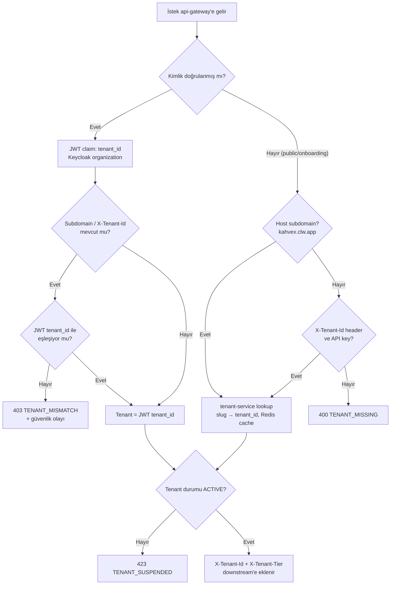
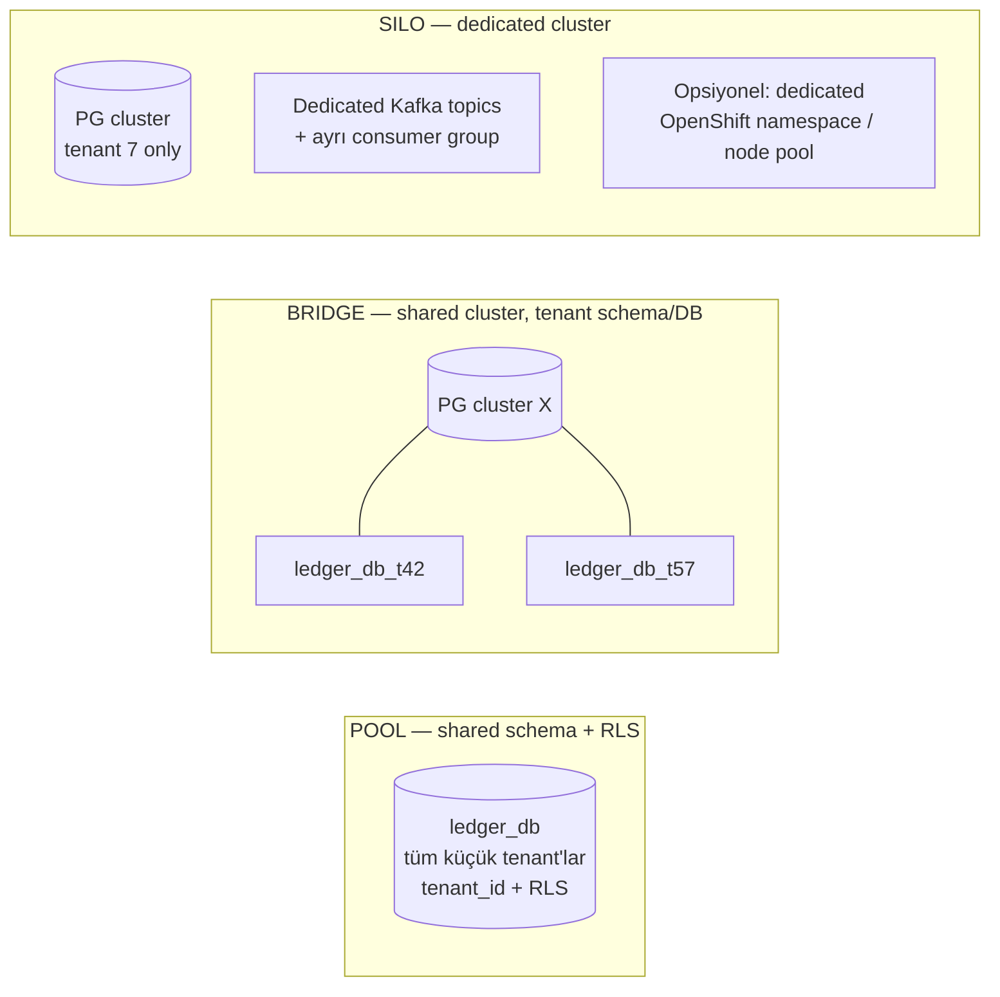
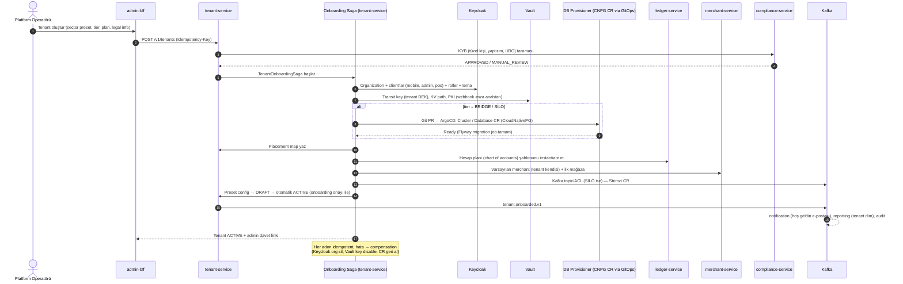

# AEP-CLW — Multitenancy Mimarisi

| Alan | Değer |
|---|---|
| Sahip | Chief Architect (`CA`) + DBA (`DATA`) |
| İlgili ADR | [ADR-003](adr/ADR-003-postgresql-database-per-service-rls.md), [ADR-007](adr/ADR-007-keycloak-identity.md) |
| Durum | Taslak |

---

## 1. Kavramlar

| Terim | Tanım |
|---|---|
| **Tenant** | Platformu kendi markasıyla kullanan kurum (kahve zinciri, EV şarj operatörü, otopark işletmecisi, eğlence parkı, üniversite). Finansal ve hukuki sınırdır. |
| **Program** | Bir tenant'ın altındaki cüzdan programı (örn. "Marka X Kart", "Marka X Kurumsal"). v1'de tenant = 1 program; model ileride çoklu programa açıktır (`program_id`). |
| **Merchant** | Tenant'ın ödeme kabul eden tüzel birimi (tenant'ın kendisi veya franchise/anlaşmalı işyeri). |
| **Tier** | Tenant'ın izolasyon ve kaynak seviyesi: `POOL`, `BRIDGE`, `SILO`. |
| **Stamp / Cell** | Bir bölgedeki komple platform kopyası (TR-1, EU-1). Tenant tek bir stamp'e aittir. |
| **Preset** | Sektör bazlı hazır konfigürasyon şablonu. |

---

## 2. Tenant Çözümleme (Tenant Resolution)

### 2.1 Kaynaklar ve öncelik



| Kaynak | Kullanım | Güven seviyesi |
|---|---|---|
| **JWT claim** `tenant_id` (+ `org` Keycloak organization) | Tüm kimliği doğrulanmış istekler | **Yetkili kaynak** (authoritative) |
| **Subdomain** `{tenant-slug}.clw.app` veya custom domain (`cuzdan.kahvex.com` → CNAME) | Web portallar, login sayfası theming, public onboarding | Yalnız ipucu (hint); JWT ile doğrulanır |
| **Header** `X-Tenant-Id` | Server-to-server POS API, mobil app (build-time sabit tenant) | Yalnız ipucu; API key/client'ın bağlı olduğu tenant ile doğrulanır |
| **Mobil build config** | White-label app `app.config.ts` içinde `tenantSlug` | Login öncesi theming/realm org seçimi |

**Kural:** Downstream servisler `X-Tenant-Id`'yi yalnız gateway'den (mesh kimliği `spiffe://.../api-gateway`) ya da
kendi JWT doğrulamalarından kabul eder. Servisler JWT'yi tekrar doğrular ve `tenant_id` claim'i ile header'ı karşılaştırır (defense in depth).

### 2.2 Platform (cross-tenant) erişim

Platform operatörü token'ı `tenant_id=*` taşımaz; bunun yerine `platform_scope=true` ve istek başına
`X-Act-As-Tenant` header'ı kullanılır. Her cross-tenant erişim `audit-service`'e `PLATFORM_TENANT_ACCESS` olarak yazılır,
destek erişimleri tenant admin'in onayı (break-glass ticket) ile zaman sınırlıdır.

---

## 3. İzolasyon Modelleri ve Tenant Tiering

### 3.1 Modeller



| Boyut | POOL | BRIDGE | SILO |
|---|---|---|---|
| Veritabanı | Servis DB'si paylaşımlı, `tenant_id` + RLS | Servis başına **tenant'a özel database** (aynı PG cluster) | **Tenant'a özel PG cluster** (servis başına DB) |
| RLS | Zorunlu | Zorunlu (defense in depth — tek tenant olsa da) | Zorunlu (aynı kod yolu) |
| Uygulama pod'ları | Paylaşımlı | Paylaşımlı | Paylaşımlı (varsayılan) veya dedicated deployment (opsiyon) |
| Kafka | Paylaşımlı topic | Paylaşımlı topic | Paylaşımlı topic; opsiyonel tenant-özel topic (`clw.t7.payment...`) + dedicated consumer group |
| Redis | Paylaşımlı cluster, key prefix | Paylaşımlı | Opsiyonel dedicated |
| Şifreleme anahtarı | Tenant başına Vault Transit key | Tenant başına | Tenant başına + BYOK (opsiyonel) |
| Backup/restore | Tenant bazlı mantıksal restore (zor) | Tenant DB bazlı PITR | Cluster bazlı PITR |
| Hedef tenant | Küçük/orta (< 50 TPS, < 500k müşteri) | Orta-büyük, özel restore/performans ihtiyacı | Enterprise, regülasyon/sözleşme gereği izolasyon, > 500 TPS |
| Fiyat planı | Starter / Growth | Business | Enterprise |

### 3.2 Routing — DataSource çözümleme

`tenant-service` bir **tenant placement map** tutar (Redis + Caffeine cache, event ile invalidation):

```json
{
  "tenantId": "8f1c2c9e-...",
  "tier": "BRIDGE",
  "stamp": "TR-1",
  "placements": {
    "ledger-service":  { "cluster": "pg-ledger-b02", "database": "ledger_t8f1c2c9e", "shard": 7 },
    "wallet-service":  { "cluster": "pg-wallet-pool", "database": "wallet", "shard": 7 },
    "payment-service": { "cluster": "pg-payment-pool", "database": "payment", "shard": 7 }
  },
  "version": 14
}
```

Her serviste `TenantRoutingDataSource` (Spring `AbstractRoutingDataSource`) tenant context'e göre
HikariCP havuzunu seçer. Havuzlar lazy oluşturulur, LRU ile kapatılır; SILO tenant'lar için havuzlar sabit tutulur.

### 3.3 Tier yükseltme (POOL → BRIDGE/SILO) — online migrasyon

1. Hedef DB oluşturulur (Flyway ile şema).
2. **Logical replication** (`CREATE PUBLICATION ... WHERE (tenant_id = ...)` — PG 15+ row filter) ile tenant satırları hedefe akıtılır.
3. Lag ≈ 0 olduğunda tenant için **write freeze** (≤ 30 sn; gateway 503 + `Retry-After`, kasada offline mod kısa süre).
4. Placement map versiyonu artırılır → servisler yeni DataSource'a geçer.
5. Kaynak satırlar 30 gün sonra arşivlenip silinir (ledger için: arşiv + checksum doğrulama).

---

## 4. Row Level Security (RLS) — Örnek SQL

### 4.1 Rol modeli

```sql
-- Uygulamanın kullandığı rol: tablo sahibi DEĞİL (sahip RLS'i bypass eder)
CREATE ROLE ledger_owner NOLOGIN;              -- Flyway migration rolü, tabloların sahibi
CREATE ROLE ledger_app   NOLOGIN;              -- Uygulama rolü (Vault dinamik kullanıcılar bunu miras alır)
CREATE ROLE ledger_readonly NOLOGIN;           -- Read replica / raporlama
CREATE ROLE platform_support NOLOGIN BYPASSRLS; -- SADECE break-glass, audit'li, Vault ile 15 dk TTL
```

### 4.2 Tenant context ayarı

Uygulama her transaction başında (Hikari connection checkout değil — **transaction scope**) şunu çalıştırır:

```sql
-- platform-commons-tenant: TenantAwareTransactionInterceptor
SELECT set_config('app.tenant_id', '8f1c2c9e-4a1b-4d3e-9c7a-1b2c3d4e5f60', true);  -- true = LOCAL (TX sonunda sıfırlanır)
```

> `SET LOCAL` kullanımı PgBouncer **transaction pooling** ile güvenlidir; session-level `SET` yasaktır.

### 4.3 Politika şablonu

```sql
-- Yardımcı fonksiyon: tenant ayarlı değilse hata fırlatır (sessizce boş sonuç yerine)
CREATE OR REPLACE FUNCTION app_current_tenant() RETURNS uuid
LANGUAGE plpgsql STABLE PARALLEL SAFE AS $$
DECLARE v text;
BEGIN
  v := current_setting('app.tenant_id', true);
  IF v IS NULL OR v = '' THEN
    RAISE EXCEPTION 'tenant context not set' USING ERRCODE = 'P0001';
  END IF;
  RETURN v::uuid;
END $$;

-- Örnek tablo
CREATE TABLE wallet.wallet (
  wallet_id     uuid        PRIMARY KEY,
  tenant_id     uuid        NOT NULL,
  customer_id   uuid        NOT NULL,
  wallet_type   text        NOT NULL,
  currency      char(3)     NOT NULL,
  status        text        NOT NULL,
  created_at    timestamptz NOT NULL DEFAULT now(),
  version       bigint      NOT NULL DEFAULT 0
);
CREATE INDEX ix_wallet_tenant_customer ON wallet.wallet (tenant_id, customer_id);

ALTER TABLE wallet.wallet ENABLE ROW LEVEL SECURITY;
ALTER TABLE wallet.wallet FORCE  ROW LEVEL SECURITY;   -- tablo sahibi için de uygula

CREATE POLICY tenant_isolation_select ON wallet.wallet
  FOR SELECT TO wallet_app, wallet_readonly
  USING (tenant_id = app_current_tenant());

CREATE POLICY tenant_isolation_modify ON wallet.wallet
  FOR INSERT TO wallet_app
  WITH CHECK (tenant_id = app_current_tenant());

CREATE POLICY tenant_isolation_update ON wallet.wallet
  FOR UPDATE TO wallet_app
  USING (tenant_id = app_current_tenant())
  WITH CHECK (tenant_id = app_current_tenant());   -- tenant_id değiştirilemez

GRANT SELECT, INSERT, UPDATE ON wallet.wallet TO wallet_app;
GRANT SELECT ON wallet.wallet TO wallet_readonly;
-- DELETE yetkisi verilmez
```

### 4.4 Finansal tablolar (append-only + RLS)

```sql
ALTER TABLE ledger.posting ENABLE ROW LEVEL SECURITY;
ALTER TABLE ledger.posting FORCE ROW LEVEL SECURITY;

CREATE POLICY posting_tenant_read ON ledger.posting
  FOR SELECT TO ledger_app, ledger_readonly USING (tenant_id = app_current_tenant());
CREATE POLICY posting_tenant_insert ON ledger.posting
  FOR INSERT TO ledger_app WITH CHECK (tenant_id = app_current_tenant());

GRANT SELECT, INSERT ON ledger.posting TO ledger_app;   -- UPDATE/DELETE YOK
REVOKE UPDATE, DELETE, TRUNCATE ON ledger.posting FROM PUBLIC, ledger_app;
```

### 4.5 Otomatik doğrulama

- **CI testi (Testcontainers):** Her Flyway migration sonrası şu sorgu boş dönmelidir — `tenant_id` kolonu olan ama RLS'i kapalı tablo yok:

```sql
SELECT c.relname
FROM pg_class c
JOIN pg_namespace n ON n.oid = c.relnamespace
JOIN pg_attribute a ON a.attrelid = c.oid AND a.attname = 'tenant_id'
WHERE c.relkind IN ('r','p') AND n.nspname NOT IN ('pg_catalog','information_schema')
  AND (NOT c.relrowsecurity OR NOT c.relforcerowsecurity);
```

- **Cross-tenant sızıntı testi:** Her repository için tenant A ile yazılan veri tenant B context'inde okunmaya çalışılır → 0 satır beklenir (ArchUnit ile her `*Repository` için test zorunlu).
- **Partition + RLS:** Politikalar partitioned parent tabloda tanımlanır; PG 16 alt partition'lara uygular. Indexler `(tenant_id, ...)` ile başlar ki RLS predicate index'i kullansın.

---

## 5. Kafka'da Tenant

| Unsur | Kural |
|---|---|
| **Header** | Her kayıtta `ce_tenantid` (CloudEvents extension) + `tenant_tier`; producer interceptor otomatik ekler, eksikse gönderim başarısız |
| **Payload** | Avro şemasında da `tenantId` alanı zorunlu (header kaybına karşı; replay/ClickHouse için) |
| **Partition key** | Aggregate id (tenant değil) — hot tenant'ın tek partition'a yığılmasını önler |
| **Consumer** | Consumer interceptor header'dan `TenantContext` kurar; header ≠ payload ise mesaj DLQ + güvenlik alarmı |
| **SILO tenant** | Opsiyonel tenant-özel topic önekleri `clw.t{shortId}.*`; Strimzi `KafkaTopic` CR'ları onboarding'de otomatik |
| **Kota** | Strimzi `KafkaUser` quota (producer byte rate) tenant-özel topic'lerde; paylaşımlı topic'lerde gateway rate limit ile korunur |
| **ACL** | Servis başına `KafkaUser` (mTLS), yalnız sahip olduğu topic'e yazma |

---

## 6. Cache Key Prefix

```text
clw:{stamp}:{tenantId}:{service}:{entity}:{id}[:v{schemaVersion}]

Örnekler:
clw:tr1:8f1c...:tenant:config:v14
clw:tr1:8f1c...:wallet:balance:w_01HZX...
clw:tr1:8f1c...:gw:ratelimit:customer:c_01HZ...:60s
clw:tr1:8f1c...:payment:idem:9b2e0f...     (Idempotency hızlı yol, TTL 24 saat)
clw:tr1:8f1c...:qr:nonce:{jti}              (TTL = QR geçerlilik süresi + 30 sn)
```

- Redis Cluster hash tag: `{tenantId}` **kullanılmaz** (hot tenant → tek slot). Hash tag yalnız çok-anahtarlı atomik işlemlerde (Lua) entity bazında kullanılır: `clw:tr1:8f1c:wallet:{w_01HZX}:...`.
- `@TenantScoped` cache anotasyonu prefix'i zorunlu kılar; prefix'siz key yazımı `platform-commons` tarafından engellenir.
- Tenant offboarding: `SCAN MATCH clw:tr1:{tenantId}:*` + `UNLINK` (batch, rate-limited).

---

## 7. Tenant Konfigürasyon Şeması

### 7.1 Yönetim modeli

- `tenant-service` sahibidir; konfigürasyon **versiyonlu** ve **immutable** (`tenant_config(tenant_id, version, document jsonb, status DRAFT|ACTIVE|ARCHIVED, effective_from)`).
- Değişiklik akışı: Draft → JSON Schema validation → iş kuralı validation (örn. limit tutarlılığı) → **maker-checker onayı** → `tenant.config.activated.v1` event → servisler cache invalidate.
- Finansal etkili alanlar (fees, expiry, limits) `effective_from` ile ileri tarihli aktive edilebilir; geriye dönük değişiklik yasak.

### 7.2 JSON Schema (özet — Draft 2020-12)

```json
{
  "$schema": "https://json-schema.org/draft/2020-12/schema",
  "$id": "https://schemas.clw.app/tenant-config/v1.json",
  "title": "TenantConfiguration",
  "type": "object",
  "required": ["schemaVersion", "tenant", "currency", "walletTypes", "limits", "kycTiers", "paymentMethods", "locales"],
  "properties": {
    "schemaVersion": { "const": "1.0" },
    "tenant": {
      "type": "object",
      "required": ["slug", "legalName", "sector", "timezone"],
      "properties": {
        "slug": { "type": "string", "pattern": "^[a-z0-9-]{3,32}$" },
        "legalName": { "type": "string" },
        "sector": { "enum": ["COFFEE_CHAIN", "EV_CHARGING", "PARKING", "AMUSEMENT_PARK", "CAMPUS", "STADIUM", "OTHER"] },
        "timezone": { "type": "string", "examples": ["Europe/Istanbul"] },
        "tier": { "enum": ["POOL", "BRIDGE", "SILO"] }
      }
    },
    "currency": {
      "type": "object",
      "required": ["base"],
      "properties": {
        "base": { "type": "string", "pattern": "^[A-Z]{3}$" },
        "allowed": { "type": "array", "items": { "type": "string", "pattern": "^[A-Z]{3}$" } },
        "displayUnit": { "description": "Opsiyonel sanal birim (örn. 'Jeton', 'Kredi')", "type": ["object", "null"],
          "properties": { "name": { "type": "object" }, "rateToBase": { "type": "string" } } }
      }
    },
    "walletTypes": {
      "type": "array", "minItems": 1,
      "items": {
        "type": "object",
        "required": ["code", "kind", "spendPriority"],
        "properties": {
          "code": { "type": "string", "examples": ["MAIN", "BONUS", "GIFT", "MEAL_ALLOWANCE"] },
          "kind": { "enum": ["PREPAID", "PROMO", "GIFT", "CORPORATE_ALLOWANCE", "POINTS"] },
          "spendPriority": { "type": "integer", "description": "Düşük önce harcanır" },
          "refundable": { "type": "boolean", "description": "Müşteriye nakit iade edilebilir mi" },
          "transferable": { "type": "boolean" },
          "maxBalance": { "$ref": "#/$defs/money" },
          "expiry": { "$ref": "#/$defs/expiryRule" }
        }
      }
    },
    "limits": {
      "type": "object",
      "properties": {
        "perKycTier": {
          "type": "object",
          "additionalProperties": {
            "type": "object",
            "properties": {
              "maxBalance": { "$ref": "#/$defs/money" },
              "maxTopUpPerTx": { "$ref": "#/$defs/money" },
              "maxTopUpDaily": { "$ref": "#/$defs/money" },
              "maxTopUpMonthly": { "$ref": "#/$defs/money" },
              "maxPaymentPerTx": { "$ref": "#/$defs/money" },
              "maxP2PMonthly": { "$ref": "#/$defs/money" },
              "velocity": { "type": "object", "properties": {
                "paymentsPerMinute": { "type": "integer" }, "topUpsPerDay": { "type": "integer" } } }
            }
          }
        }
      }
    },
    "fees": {
      "type": "array",
      "items": {
        "type": "object",
        "required": ["code", "trigger", "payer"],
        "properties": {
          "code": { "type": "string" },
          "trigger": { "enum": ["TOP_UP_CARD", "TOP_UP_BANK", "PAYMENT", "P2P", "WITHDRAWAL", "DORMANCY", "SETTLEMENT"] },
          "payer": { "enum": ["CUSTOMER", "MERCHANT", "TENANT"] },
          "fixed": { "$ref": "#/$defs/money" },
          "percentageBps": { "type": "integer", "minimum": 0, "maximum": 10000 },
          "min": { "$ref": "#/$defs/money" },
          "max": { "$ref": "#/$defs/money" },
          "vatRateBps": { "type": "integer" }
        }
      }
    },
    "breakage": {
      "type": "object",
      "properties": {
        "method": { "enum": ["NONE", "EXPIRY_BASED", "REDEMPTION_PATTERN"] },
        "dormancyDays": { "type": "integer" },
        "notifyBeforeDays": { "type": "array", "items": { "type": "integer" } },
        "recognitionSchedule": { "enum": ["ON_EXPIRY", "MONTHLY_PROPORTIONAL"] }
      }
    },
    "kycTiers": {
      "type": "array",
      "items": {
        "type": "object",
        "required": ["code", "requirements"],
        "properties": {
          "code": { "enum": ["ANONYMOUS", "BASIC", "VERIFIED", "ENHANCED"] },
          "requirements": { "type": "array", "items": { "enum": ["PHONE_OTP", "EMAIL", "NAME_DOB", "TCKN_NVI", "ID_DOCUMENT", "NFC_CHIP", "LIVENESS", "ADDRESS"] } }
        }
      }
    },
    "paymentMethods": {
      "type": "object",
      "properties": {
        "acceptance": { "type": "array", "items": { "enum": ["CUSTOMER_QR", "MERCHANT_QR", "NFC_HCE", "BARCODE", "PLATE", "RFID_CARD", "API"] } },
        "funding": { "type": "array", "items": { "enum": ["CARD_3DS", "SAVED_CARD", "AUTO_TOP_UP", "BANK_TRANSFER", "VIRTUAL_IBAN", "OPEN_BANKING", "CASH_AT_POS", "VOUCHER"] } },
        "psp": { "type": "object", "properties": { "primary": { "type": "string" }, "fallback": { "type": "string" } } },
        "preAuth": { "type": "object", "properties": {
          "enabled": { "type": "boolean" }, "defaultHold": { "$ref": "#/$defs/money" },
          "maxHoldDurationMinutes": { "type": "integer" }, "overCaptureBps": { "type": "integer" } } },
        "qr": { "type": "object", "properties": { "ttlSeconds": { "type": "integer", "minimum": 15, "maximum": 300 }, "offlineTokens": { "type": "integer" } } }
      }
    },
    "loyalty": {
      "type": "object",
      "properties": {
        "enabled": { "type": "boolean" },
        "unitName": { "type": "object", "description": "i18n: {tr:'Yıldız', en:'Star'}" },
        "earnRules": { "type": "array", "items": { "type": "object" } },
        "tiers": { "type": "array", "items": { "type": "object",
          "properties": { "code": { "type": "string" }, "threshold": { "type": "integer" }, "multiplierBps": { "type": "integer" } } } },
        "pointsExpiryMonths": { "type": "integer" }
      }
    },
    "branding": {
      "type": "object",
      "properties": {
        "appName": { "type": "string" }, "logoUrl": { "type": "string", "format": "uri" },
        "colors": { "type": "object", "properties": { "primary": { "type": "string" }, "secondary": { "type": "string" }, "surface": { "type": "string" } } },
        "fontFamily": { "type": "string" }, "customDomain": { "type": "string" },
        "supportContact": { "type": "object" }
      }
    },
    "locales": {
      "type": "object",
      "required": ["default", "supported"],
      "properties": { "default": { "type": "string" }, "supported": { "type": "array", "items": { "type": "string" } } }
    },
    "featureFlags": { "type": "object", "additionalProperties": { "type": "boolean" } },
    "risk": { "type": "object", "properties": { "failMode": { "enum": ["OPEN", "CLOSED"] }, "failOpenMaxAmount": { "$ref": "#/$defs/money" } } }
  },
  "$defs": {
    "money": { "type": "object", "required": ["amount", "currency"],
      "properties": { "amount": { "type": "string", "pattern": "^-?\\d+(\\.\\d{1,4})?$" }, "currency": { "type": "string" } } },
    "expiryRule": { "type": "object",
      "properties": { "type": { "enum": ["NONE", "FIXED_DAYS_FROM_LOAD", "FIXED_DATE", "DORMANCY"] }, "days": { "type": "integer" }, "date": { "type": "string", "format": "date" } } }
  }
}
```

> **Regülasyon kapısı (TR):** 6493 kapsamında elektronik para ihraç eden kuruluşun lisansı altında çalışılıyorsa
> kimliksiz (ANONYMOUS/BASIC) cüzdanlar için bakiye ve aylık yükleme limitleri yönetmelikteki sınırları aşamaz.
> `tenant-service` bu **platform tavanlarını** (platform-level caps) tenant konfigürasyonunun üstünde zorlar;
> tenant daha sıkı limit koyabilir, daha gevşek koyamaz. Güncel limit değerleri `CMP` tarafından `docs/compliance/` altında tutulur.

---

## 8. Sektör Presetleri

Preset = onboarding sırasında konfigürasyonun başlangıç değeri. Tenant sonrasında (limit tavanları dahilinde) değiştirebilir.

### 8.1 Karşılaştırma tablosu

| Boyut | Kahve zinciri | EV şarj | Otopark | Eğlence/oyun parkı | Kampüs/yemekhane |
|---|---|---|---|---|---|
| Cüzdan tipleri | MAIN, BONUS, GIFT | MAIN, BONUS | MAIN | MAIN (jeton/kredi gösterimi), BONUS, GIFT | MAIN, MEAL_ALLOWANCE (kurum yüklemeli), BONUS |
| Kabul yöntemi | CUSTOMER_QR, BARCODE | API (CPMS/OCPP), CUSTOMER_QR, RFID_CARD | PLATE, CUSTOMER_QR, MERCHANT_QR | RFID_CARD (bileklik), NFC_HCE, CUSTOMER_QR | CUSTOMER_QR, RFID_CARD (öğrenci kartı) |
| Pre-auth | Hayır | **Evet** — varsayılan hold 500 TRY, max 12 saat, over-capture %0 | **Evet** — giriş hold 200 TRY, max 72 saat | Hayır | Hayır |
| Yükleme | Kart 3DS, kayıtlı kart, **auto top-up** | Kart, auto top-up (eşik 100 TRY) | Kart, auto top-up | Kart, kasada nakit, voucher | Kart, havale/sanal IBAN, **kurum toplu yükleme** |
| Min yükleme | 50 TRY | 100 TRY | 50 TRY | 100 TRY | 20 TRY |
| Expiry | MAIN: yok; BONUS: 90 gün; GIFT: 3 yıl | MAIN: yok; BONUS: 180 gün | Yok | MAIN: **sezon sonu** (FIXED_DATE) veya 365 gün; BONUS: 30 gün | MEAL_ALLOWANCE: ay sonu; MAIN: mezuniyet + 1 yıl |
| Breakage | EXPIRY_BASED (BONUS/GIFT) | EXPIRY_BASED (BONUS) | NONE | REDEMPTION_PATTERN (yüksek breakage) | EXPIRY_BASED (allowance → kuruma iade veya breakage, sözleşmeye bağlı) |
| Loyalty | **Yıldız**: 1 yıldız / 10 TRY, tier (Green/Gold), ödül: 150 yıldız = 1 içecek | kWh bazlı puan, abonelik tier | Sık kullanıcı indirimi (visit count) | Ziyaret başına bonus, doğum günü | Yok veya kampanya bazlı |
| Ücret | Yok (tenant üstlenir) | Oturum ücreti merchant'a (roaming) | Yok | Kasada nakit yükleme ücreti yok | Havale ücreti yok |
| Risk hassasiyeti | Düşük tutar, yüksek frekans → velocity | Yüksek hold, cihaz/charger eşleşmesi | Plaka taklidi, uzun hold | Kayıp bileklik → anında blok | Düşük |
| Offline | QR offline token (5 adet) | Charger offline whitelist | Bariyer offline mod | Bileklik offline (terminal cache, limitli) | Yemekhane turnike offline |
| Locale | tr-TR, en-US | tr-TR, en-US, de-DE | tr-TR | tr-TR, en-US, ar-SA, ru-RU | tr-TR, en-US |

### 8.2 Farklılaşan config örnekleri

**Kahve zinciri (`COFFEE_CHAIN`)**

```json
{
  "walletTypes": [
    { "code": "MAIN",  "kind": "PREPAID", "spendPriority": 2, "refundable": true,  "transferable": true,
      "maxBalance": { "amount": "5000.00", "currency": "TRY" }, "expiry": { "type": "NONE" } },
    { "code": "BONUS", "kind": "PROMO",   "spendPriority": 1, "refundable": false, "transferable": false,
      "expiry": { "type": "FIXED_DAYS_FROM_LOAD", "days": 90 } },
    { "code": "GIFT",  "kind": "GIFT",    "spendPriority": 3, "refundable": false, "transferable": true,
      "expiry": { "type": "FIXED_DAYS_FROM_LOAD", "days": 1095 } }
  ],
  "paymentMethods": {
    "acceptance": ["CUSTOMER_QR", "BARCODE"],
    "funding": ["CARD_3DS", "SAVED_CARD", "AUTO_TOP_UP", "VOUCHER"],
    "qr": { "ttlSeconds": 60, "offlineTokens": 5 }
  },
  "loyalty": {
    "enabled": true, "unitName": { "tr": "Yıldız", "en": "Star" },
    "earnRules": [ { "type": "PER_AMOUNT", "per": { "amount": "10.00", "currency": "TRY" }, "points": 1 } ],
    "tiers": [ { "code": "GREEN", "threshold": 0, "multiplierBps": 10000 },
               { "code": "GOLD",  "threshold": 300, "multiplierBps": 12500 } ],
    "pointsExpiryMonths": 12
  },
  "featureFlags": { "autoTopUp": true, "p2pTransfer": true, "giftCardSend": true, "preOrder": true }
}
```

**EV şarj (`EV_CHARGING`)**

```json
{
  "walletTypes": [
    { "code": "MAIN",  "kind": "PREPAID", "spendPriority": 2, "refundable": true, "transferable": false, "expiry": { "type": "NONE" } },
    { "code": "BONUS", "kind": "PROMO",   "spendPriority": 1, "refundable": false, "expiry": { "type": "FIXED_DAYS_FROM_LOAD", "days": 180 } }
  ],
  "paymentMethods": {
    "acceptance": ["API", "CUSTOMER_QR", "RFID_CARD"],
    "funding": ["CARD_3DS", "SAVED_CARD", "AUTO_TOP_UP"],
    "preAuth": { "enabled": true, "defaultHold": { "amount": "500.00", "currency": "TRY" },
                 "maxHoldDurationMinutes": 720, "overCaptureBps": 0 }
  },
  "fees": [ { "code": "ROAMING_SESSION", "trigger": "PAYMENT", "payer": "MERCHANT", "percentageBps": 150, "vatRateBps": 2000 } ],
  "featureFlags": { "autoTopUp": true, "insufficientHoldAutoTopUp": true, "ocppIntegration": true, "p2pTransfer": false }
}
```

**Otopark (`PARKING`)**

```json
{
  "walletTypes": [ { "code": "MAIN", "kind": "PREPAID", "spendPriority": 1, "refundable": true, "expiry": { "type": "NONE" } } ],
  "paymentMethods": {
    "acceptance": ["PLATE", "CUSTOMER_QR", "MERCHANT_QR"],
    "funding": ["CARD_3DS", "SAVED_CARD", "AUTO_TOP_UP"],
    "preAuth": { "enabled": true, "defaultHold": { "amount": "200.00", "currency": "TRY" }, "maxHoldDurationMinutes": 4320, "overCaptureBps": 0 }
  },
  "loyalty": { "enabled": true, "earnRules": [ { "type": "VISIT_COUNT", "every": 10, "rewardFreeMinutes": 60 } ] },
  "featureFlags": { "plateRecognition": true, "multiPlatePerCustomer": true, "p2pTransfer": false }
}
```

**Eğlence / oyun parkı (`AMUSEMENT_PARK`)**

```json
{
  "currency": { "base": "TRY", "displayUnit": { "name": { "tr": "Jeton", "en": "Token" }, "rateToBase": "5.00" } },
  "walletTypes": [
    { "code": "MAIN",  "kind": "PREPAID", "spendPriority": 2, "refundable": false,
      "expiry": { "type": "FIXED_DAYS_FROM_LOAD", "days": 365 } },
    { "code": "BONUS", "kind": "PROMO", "spendPriority": 1, "expiry": { "type": "FIXED_DAYS_FROM_LOAD", "days": 30 } },
    { "code": "GIFT",  "kind": "GIFT",  "spendPriority": 3, "transferable": true, "expiry": { "type": "FIXED_DAYS_FROM_LOAD", "days": 365 } }
  ],
  "paymentMethods": { "acceptance": ["RFID_CARD", "NFC_HCE", "CUSTOMER_QR"], "funding": ["CARD_3DS", "CASH_AT_POS", "VOUCHER"] },
  "breakage": { "method": "REDEMPTION_PATTERN", "notifyBeforeDays": [30, 7, 1], "recognitionSchedule": "MONTHLY_PROPORTIONAL" },
  "featureFlags": { "wristbandLinking": true, "familyWallet": true, "lostCardInstantBlock": true }
}
```

> `displayUnit` yalnız **gösterim** amaçlıdır; ledger daima base currency minor units ile çalışır (jeton ≠ ayrı para birimi).

**Kampüs / yemekhane (`CAMPUS`)**

```json
{
  "walletTypes": [
    { "code": "MEAL_ALLOWANCE", "kind": "CORPORATE_ALLOWANCE", "spendPriority": 1, "refundable": false, "transferable": false,
      "expiry": { "type": "FIXED_DATE", "date": "2026-12-31" } },
    { "code": "MAIN",  "kind": "PREPAID", "spendPriority": 2, "refundable": true, "expiry": { "type": "NONE" } }
  ],
  "paymentMethods": { "acceptance": ["CUSTOMER_QR", "RFID_CARD"], "funding": ["CARD_3DS", "VIRTUAL_IBAN", "BANK_TRANSFER"] },
  "limits": { "perKycTier": { "BASIC": { "maxPaymentPerTx": { "amount": "500.00", "currency": "TRY" } } } },
  "featureFlags": { "bulkCorporateLoad": true, "mealWindowRestriction": true, "parentTopUp": true, "p2pTransfer": false },
  "extensions": { "mealWindows": [ { "name": "Öğle", "from": "11:30", "to": "14:00" }, { "name": "Akşam", "from": "17:00", "to": "19:30" } ] }
}
```

---

## 9. Noisy-Neighbor Koruması

| Katman | Mekanizma | Varsayılan (POOL) |
|---|---|---|
| Gateway | Redis token bucket: tenant başına (plan bazlı), müşteri başına, API key başına; `429` + `Retry-After` | Starter: 50 rps, Growth: 200 rps, Business: 1.000 rps |
| Servis | Resilience4j **tenant-keyed bulkhead** (sıcak yollarda tenant başına eşzamanlı istek sınırı: toplam kapasitenin %25'i) | ödeme: tenant başına 400 concurrent |
| Kafka consumer | Tenant başına **fair scheduling**: consumer bir tenant'ın mesajlarından saniyede N'den fazla işlerse o tenant'ın sonraki mesajlarını tenant-özel "overflow" topic'ine yönlendirir (priority lane) | Ağır batch işler (toplu yükleme, kampanya dağıtımı) **ayrı topic**'te (`*.bulk.*`) |
| DB | `statement_timeout` (OLTP 2 sn), tenant bazlı raporlama sorgusu yasak (ClickHouse'a), PgBouncer havuzu tenant tier bazlı; `pg_stat_statements` + tenant etiketli sorgu yorumları (`/* tenant=... */`) ile tespit | — |
| ClickHouse | Kullanıcı başına `max_memory_usage`, `max_execution_time`, `readonly`, tenant başına **quota** (sorgu/saat) | 10 GB bellek, 60 sn |
| Batch işler | Settlement/breakage/rapor job'ları tenant bazında parçalanır, global concurrency limit | — |
| Gözlem | Tenant bazlı kaynak tüketim metrikleri (`clw_tenant_rps`, `clw_tenant_db_time_ms`); sürekli aşan tenant → tier yükseltme önerisi (otomatik ticket) | — |

---

## 10. Tenant Onboarding Otomasyonu



**Mobil white-label pipeline:** `tenant.onboarded.v1` + branding tamamlandığında GitHub Actions
`mobile-whitelabel.yml` tetiklenir: Expo `app.config.ts` tenant parametreleriyle (bundle id, ikon, splash, renkler)
EAS Build → TestFlight / Play Internal Track. Mağaza yayını manuel onaylıdır.

**Onboarding SLO:** POOL tenant self-service < 10 dk; BRIDGE < 1 saat; SILO < 1 iş günü (altyapı onayı dahil).

### 10.1 Offboarding

1. Tenant `SUSPENDED` → yeni işlem yok, bakiyeler müşteri iadesine açık (regülasyon: fon iadesi yükümlülüğü).
2. Müşteri bakiyeleri iade/transfer süreci (ayrı saga, `CMP` onaylı).
3. Finansal kayıtlar **10 yıl** arşivde (object storage, WORM); operasyonel PII crypto-shredding (tenant Vault key destroy — finansal kayıtlarda PII yalnız pseudonymous id).
4. Keycloak org, Redis key'leri, Kafka tenant topic'leri silinir.
