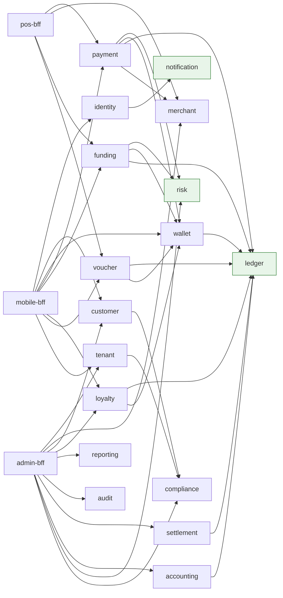

# AEP-CLW — Servis Kataloğu (Service Catalog)

| Alan | Değer |
|---|---|
| Sahip | Chief Architect (`CA`) + Solution Architect – Payments (`SA`) |
| Kaynak | Charter §4 (19 servis), [architecture-overview.md](architecture-overview.md) |
| Durum | Taslak |

> **Okuma rehberi.** Her servis için: sorumluluk, aggregate'ler, API uçları (özet; tam sözleşme OpenAPI'de —
> `api/<service>/openapi.yaml`), yayınladığı / tükettiği event'ler (topic adı kısaltılmış: `clw.` öneki ve `.v1` soneki atlanmıştır),
> veri deposu, bağımlılıklar, ölçekleme profili ve SLO. Tüm uçlar `/v1` altındadır, tüm mutasyonlar `Idempotency-Key` ister.

## 0. Özet Harita

| # | Servis | Katman | Kritiklik | Veri deposu | Senkron bağımlılık | Ölçek profili |
|---|---|---|---|---|---|---|
| 1 | `api-gateway` | Edge | **Tier-0** | Redis | Keycloak (JWKS), tenant-service (cache) | CPU/RPS, stateless |
| 2 | `identity-service` | Core | Tier-0 | PG `identity_db`, Redis, Keycloak | Keycloak, notification (OTP sms — async fallback sync) | RPS, login spike |
| 3 | `tenant-service` | Core | Tier-1 | PG `tenant_db`, Redis | compliance (KYB) | Düşük yazma, yüksek okuma (cache) |
| 4 | `customer-service` | Core | Tier-1 | PG `customer_db` | KYC sağlayıcı, compliance | Orta |
| 5 | `wallet-service` | Core | **Tier-0** | PG `wallet_db`, Redis | ledger | Yüksek RPS |
| 6 | `ledger-service` | Core | **Tier-0** | PG `ledger_db` (sharded) | — (yaprak servis) | **En yüksek yazma** |
| 7 | `payment-service` | Core | **Tier-0** | PG `payment_db`, Redis | risk, wallet, ledger, merchant (cache) | 5.000 TPS |
| 8 | `funding-service` | Core | Tier-0 | PG `funding_db` | PSP'ler, banka, ledger, risk | PSP gecikmesine bağlı |
| 9 | `merchant-service` | Core | Tier-1 | PG `merchant_db`, Redis | — | Okuma ağırlıklı |
| 10 | `loyalty-service` | Engagement | Tier-2 | PG `loyalty_db`, Redis | ledger (promo posting), wallet | Event-driven burst |
| 11 | `voucher-service` | Engagement | Tier-1 | PG `voucher_db` | ledger, wallet | Toplu üretim batch |
| 12 | `risk-service` | Risk | **Tier-0** | PG `risk_db`, Redis (velocity) | — | Düşük gecikme, yüksek RPS |
| 13 | `compliance-service` | Risk | Tier-1 | PG `compliance_db` | AML sağlayıcı | Async ağırlıklı |
| 14 | `settlement-service` | Finance | Tier-1 | PG `settlement_db`, S3 | ledger, banka, PSP | Gün sonu batch |
| 15 | `accounting-service` | Finance | Tier-2 | PG `accounting_db` | ledger (read), e-Fatura, ERP | Batch |
| 16 | `reporting-service` | Finance | Tier-2 | ClickHouse, PG `reporting_db` (tanımlar), S3 | — | Sorgu ağırlıklı |
| 17 | `audit-service` | Risk | Tier-1 | PG `audit_db` (hash chain), S3 WORM | — | Yüksek event ingest |
| 18 | `notification-service` | Engagement | Tier-1 (OTP) / Tier-2 | PG `notification_db`, Redis | SMS/push/e-posta sağlayıcıları | Burst (kampanya) |
| 19 | `mobile-bff` / `pos-bff` / `admin-bff` | Experience | Tier-0 (mobile/pos) | Redis (cache) | Domain servisleri | RPS |

**Kritiklik:** Tier-0 = ödeme/yükleme/bakiye yolunda, %99,95; Tier-1 = %99,9; Tier-2 = %99,5.

---

## 1. `api-gateway`

| Başlık | Detay |
|---|---|
| **Sorumluluk** | Tek dış giriş noktası: TLS, JWT doğrulama (JWKS cache), tenant çözümleme, rate limiting, request size/headers sanitize, route → BFF, CORS, correlation id üretimi, DPoP doğrulama (mobil), API key → token değişimi (POS) |
| **Aggregate** | Yok (stateless). Konfig: route tanımları (GitOps), rate limit planları (tenant-service'ten) |
| **Veri deposu** | Redis (rate limit token bucket, JWKS/tenant cache L2) |
| **Bağımlılık** | Keycloak (JWKS), tenant-service (slug→tenant, plan; cache'li, event invalidation) |
| **Ölçekleme** | HPA: RPS + CPU %60; min 4 / max 30; Netty event loop, bellek 1 GB |
| **SLO** | Kullanılabilirlik %99,99; eklenen gecikme p99 < 15 ms |

| Route | Hedef |
|---|---|
| `/mobile/v1/**` | `mobile-bff` |
| `/pos/v1/**` | `pos-bff` |
| `/admin/v1/**`, `/platform/v1/**` | `admin-bff` |
| `/webhooks/psp/{provider}` | `funding-service` (HMAC doğrulaması serviste; gateway yalnız IP allowlist + boyut limiti) |
| `/api/v1/**` (public POS API) | `pos-bff` |

**Tüketilen event'ler:** `tenant.config.activated`, `tenant.suspended` (cache invalidation).

---

## 2. `identity-service`

| Başlık | Detay |
|---|---|
| **Sorumluluk** | Keycloak üzerinde ince domain katmanı: telefon OTP ile kayıt/giriş (Keycloak custom authenticator SPI'ı çağırır), cihaz bağlama (device binding, cihaz public key kaydı), oturum/cihaz listesi, cihaz iptali, step-up auth (yüksek tutarlı işlemde PIN/biyometrik), şifre/PIN politikası, POS terminal kullanıcı eşlemesi |
| **Aggregate** | `OtpChallenge` (id, phone hash, purpose, attempts, expires), `Device` (deviceId, publicKey, platform, attestation, status), `UserCredential` (PIN hash — Argon2id), `LoginSession` projection |
| **Veri deposu** | PG `identity_db`; Redis (OTP challenge — TTL 180 sn, deneme sayacı); Keycloak kendi DB'si |
| **Bağımlılık** | Keycloak Admin API, notification-service (OTP SMS — **senkron** yüksek öncelik kanalı), risk-service (login risk — async + sync opsiyonel) |
| **Ölçekleme** | RPS; login fırtınası (kampanya push sonrası) için min 3 / max 15 |
| **SLO** | %99,95; OTP gönderim p95 < 3 sn (sağlayıcı dahil); token endpoint p99 < 200 ms |

| Metod | Uç | Açıklama |
|---|---|---|
| POST | `/v1/otp/challenges` | OTP üret (purpose: REGISTER, LOGIN, STEP_UP, DEVICE_BIND) |
| POST | `/v1/otp/challenges/{id}/verify` | OTP doğrula |
| POST | `/v1/devices` | Cihaz bağla (public key + attestation: Play Integrity / App Attest) |
| GET | `/v1/devices` | Kullanıcının cihazları |
| DELETE | `/v1/devices/{deviceId}` | Cihaz iptal (tek istisna DELETE: soft revoke) |
| POST | `/v1/credentials/pin` | PIN oluştur/değiştir |
| POST | `/v1/step-up` | Step-up doğrulama → kısa ömürlü `acr=step-up` token |

| Yayınladığı | Tükettiği |
|---|---|
| `identity.user.registered`, `identity.device.bound`, `identity.device.revoked`, `identity.login.succeeded`, `identity.login.failed` | `customer.blocked` (oturumları sonlandır), `risk.customer.blocked`, `tenant.suspended` |

---

## 3. `tenant-service`

| Başlık | Detay |
|---|---|
| **Sorumluluk** | Tenant yaşam döngüsü (onboarding saga, suspend, offboard), versiyonlu konfigürasyon + maker-checker, sektör preset'leri, plan/abonelik ve SaaS faturalaması için kullanım sayaçları, feature flag, branding, placement map (tier/shard), platform limit tavanları |
| **Aggregate** | `Tenant` (status: PENDING_KYB → ONBOARDING → ACTIVE → SUSPENDED → OFFBOARDED), `TenantConfiguration` (versiyon, immutable), `Subscription` (plan, dönem), `Placement`, `Preset` |
| **Veri deposu** | PG `tenant_db` (jsonb config + JSON Schema doğrulama), Redis (config cache) |
| **Bağımlılık** | compliance-service (KYB), Keycloak, Vault, GitOps repo (SILO/BRIDGE DB provisioning PR) |
| **Ölçekleme** | Yazma düşük; okuma cache'li. min 2 / max 6 |
| **SLO** | %99,9; config okuma p99 < 20 ms (cache) |

| Metod | Uç | Açıklama |
|---|---|---|
| POST | `/v1/tenants` | Tenant oluştur (preset, tier, plan) → onboarding saga |
| GET | `/v1/tenants/{id}` | Detay |
| POST | `/v1/tenants/{id}/suspend` · `/reactivate` · `/offboard` | Yaşam döngüsü |
| GET | `/v1/tenants/{id}/config` | Aktif konfig (`?version=`) |
| POST | `/v1/tenants/{id}/config/drafts` | Taslak oluştur |
| POST | `/v1/tenants/{id}/config/drafts/{v}/submit` · `/approve` · `/reject` | Maker-checker |
| GET | `/v1/presets` | Sektör presetleri |
| GET | `/v1/tenants/{id}/placement` | Placement map (iç kullanım, mesh-only) |
| GET/PUT | `/v1/tenants/{id}/feature-flags` | Feature flag'ler |

| Yayınladığı | Tükettiği |
|---|---|
| `tenant.onboarded`, `tenant.config.activated`, `tenant.suspended`, `tenant.reactivated`, `tenant.offboarded`, `tenant.placement.changed` | `compliance.kyb.completed`, `reporting.usage.aggregated` (SaaS faturalama) |

---

## 4. `customer-service`

| Başlık | Detay |
|---|---|
| **Sorumluluk** | Müşteri profili (tenant kapsamında; aynı kişi farklı tenant'larda farklı müşteri), KYC seviye yönetimi ve KYC sağlayıcı orkestrasyonu, onaylar (KVKK aydınlatma, açık rıza, pazarlama izni — versiyonlu), müşteri durumu (ACTIVE, BLOCKED, CLOSED), KVKK veri sahibi talepleri (erişim/silme), aile/kurumsal gruplar (kampüs, park) |
| **Aggregate** | `Customer` (id, tenant, phone (şifreli), name, dob, status, kycTier), `KycVerification` (provider, steps, result, evidence ref), `Consent` (type, textVersion, grantedAt, revokedAt, channel), `CustomerGroup` (FAMILY, CORPORATE), `DataSubjectRequest` |
| **Veri deposu** | PG `customer_db`; PII kolonları Vault Transit ile şifreli (subject key → crypto-shredding); arama için `phone_hash` (HMAC-SHA256, tenant salt) |
| **Bağımlılık** | KYC sağlayıcıları (ACL), compliance-service (yaptırım/PEP taraması — KYC tamamlanınca), NVİ KPS (TCKN doğrulama) |
| **Ölçekleme** | Orta; kayıt kampanyalarında burst. min 2 / max 10; read replica profil okumaları için |
| **SLO** | %99,9; profil okuma p99 < 80 ms |

| Metod | Uç | Açıklama |
|---|---|---|
| POST | `/v1/customers` | Müşteri oluştur (identity.user.registered sonrası BFF tarafından) |
| GET/PATCH | `/v1/customers/{id}` | Profil (PATCH: JSON Merge Patch, alan whitelist) |
| POST | `/v1/customers/{id}/kyc/verifications` | KYC başlat (hedef seviye) |
| GET | `/v1/customers/{id}/kyc/verifications/{vid}` | Durum |
| POST | `/v1/kyc/webhooks/{provider}` | KYC sağlayıcı callback |
| POST/GET | `/v1/customers/{id}/consents` | Onay ver / listele |
| POST | `/v1/customers/{id}/block` · `/unblock` · `/close` | Durum (admin, maker-checker) |
| POST | `/v1/customers/{id}/data-subject-requests` | KVKK talebi |
| GET | `/v1/customers?phoneHash=&cursor=` | Arama (admin) |

| Yayınladığı | Tükettiği |
|---|---|
| `customer.registered`, `customer.profile.updated`, `customer.kyc.tier.changed`, `customer.consent.changed`, `customer.blocked`, `customer.unblocked`, `customer.closed`, `customer.erasure.requested` | `identity.user.registered`, `compliance.screening.completed`, `risk.customer.blocked` |

---

## 5. `wallet-service`

| Başlık | Detay |
|---|---|
| **Sorumluluk** | Cüzdan hesapları (MAIN/BONUS/GIFT/ALLOWANCE), ledger hesaplarına eşleme, **kullanılabilir bakiye** hesabı (ledger bakiyesi − aktif hold'lar), **hold (provizyon)** yaşam döngüsü, limit kontrolleri (KYC tier + tenant config + platform tavanı), harcama önceliği (spend waterfall: hangi cüzdandan ne kadar), expiry lot takibi (FIFO), auto top-up tetikleme |
| **Aggregate** | `Wallet` (walletId, customerId, type, currency, status, ledgerAccountId), `Hold` (holdId, walletId, amount, capturedAmount, status: ACTIVE/CAPTURED/PARTIALLY_CAPTURED/RELEASED/EXPIRED, expiresAt, reference), `LimitCounter` (period, sum, count), `ValueLot` (expiry lot: amount, remaining, expiresAt), `AutoTopUpRule` |
| **Veri deposu** | PG `wallet_db` (holds, limit sayaçları — optimistic lock), Redis (bakiye görünüm cache, velocity sayaç hızlı yol) |
| **Bağımlılık** | ledger-service (bakiye kaynağı; hold oluştururken ledger'daki `available` ile karşılaştırma — **hold posting'i ledger'a da yazılır**, bkz. ledger-design §7.4) |
| **Ölçekleme** | Yüksek RPS; min 6 / max 24; hold tablosu `(tenant_id, wallet_id, status)` index |
| **SLO** | %99,95; hold oluşturma p99 < 60 ms; bakiye okuma p99 < 50 ms |

| Metod | Uç | Açıklama |
|---|---|---|
| POST | `/v1/wallets` | Cüzdan aç (müşteri kaydında otomatik) |
| GET | `/v1/wallets?customerId=` | Müşteri cüzdanları + bakiyeler |
| GET | `/v1/wallets/{id}/balance` | `ledgerBalance`, `heldAmount`, `available`, lot'lar |
| POST | `/v1/wallets/{id}/holds` | Hold oluştur (amount, reference, ttl) |
| POST | `/v1/holds/{holdId}/capture` | Tam/kısmi capture (ledger posting tetikler) |
| POST | `/v1/holds/{holdId}/release` | Serbest bırak |
| POST | `/v1/wallets/{id}/spend-plan` | Tutarı cüzdanlar arasında önceliğe göre böl (ödeme öncesi) |
| POST | `/v1/limits/check` | Limit ön kontrolü (yükleme/ödeme/P2P) |
| GET/PUT | `/v1/wallets/{id}/auto-top-up` | Otomatik yükleme kuralı |
| POST | `/v1/wallets/{id}/freeze` · `/unfreeze` | Dondurma (risk/uyum) |

| Yayınladığı | Tükettiği |
|---|---|
| `wallet.opened`, `wallet.hold.placed`, `wallet.hold.captured`, `wallet.hold.released`, `wallet.hold.expired`, `wallet.balance.low` (auto top-up + bildirim), `wallet.frozen`, `wallet.lot.expiring` | `customer.registered`, `ledger.journal.posted` (bakiye cache güncelle), `customer.kyc.tier.changed` (limit), `risk.wallet.freeze.requested`, `compliance.freeze.requested`, `tenant.config.activated` |

---

## 6. `ledger-service`

| Başlık | Detay |
|---|---|
| **Sorumluluk** | Çift kayıtlı, append-only defter; hesap planı (chart of accounts) tenant başına; journal + posting; gerçek zamanlı bakiye (running balance) + dönemsel snapshot; negatif bakiye önleme; reversal; bakiye sorgusu (as-of); denge invariant'ı (Σ debit = Σ credit) sürekli doğrulama; dönem kapanışı. **Yaprak servis: başka servise senkron çağrı yapmaz.** Detay: [ledger-design.md](ledger-design.md) |
| **Aggregate** | `LedgerAccount` (accountId, tenant, type, currency, normalBalance, allowNegative, balance, version), `Journal` (journalId, tenant, type, reference, idempotencyKey, postings[], effectiveAt), `AccountingPeriod`, `BalanceSnapshot` |
| **Veri deposu** | PG `ledger_db` — `synchronous_commit=remote_apply`, aylık partition, POOL için hash shard; jOOQ |
| **Bağımlılık** | Yok (inbound only) |
| **Ölçekleme** | min 8 / max 32; DB yazma darboğazı → hot account sharding + shard başına ayrı cluster |
| **SLO** | **%99,99**; posting p99 < 40 ms; drift = 0 (sapma → P1 alarm) |

| Metod | Uç | Açıklama |
|---|---|---|
| POST | `/v1/journals` | Journal post et (atomik, dengeli, idempotent) |
| GET | `/v1/journals/{id}` | Journal + posting'ler |
| POST | `/v1/journals/{id}/reverse` | Tam ters kayıt |
| GET | `/v1/accounts/{id}/balance?asOf=` | Bakiye (anlık veya tarihsel) |
| GET | `/v1/accounts/{id}/postings?cursor=` | Hesap ekstresi |
| POST | `/v1/accounts` | Hesap aç (wallet/merchant açılışında) |
| GET | `/v1/chart-of-accounts` | Hesap planı |
| POST | `/v1/periods/{period}/close` | Dönem kapanışı (accounting tetikler) |
| GET | `/v1/trial-balance?date=` | Mizan |

| Yayınladığı | Tükettiği |
|---|---|
| `ledger.journal.posted` (tüm posting'lerle), `ledger.journal.reversed`, `ledger.account.opened`, `ledger.balance.below.threshold`, `ledger.period.closed`, `ledger.invariant.violated` | `wallet.opened`, `merchant.onboarded` (hesap açma — idempotent), `tenant.onboarded` (hesap planı) |

---

## 7. `payment-service`

| Başlık | Detay |
|---|---|
| **Sorumluluk** | Ödeme orkestrasyonu: QR/token çözümleme (customer-presented dynamic QR — TOTP; merchant-presented QR), authorize/capture/void/refund/reversal sagaları, **pre-auth** (EV şarj, otopark), split tender (cüzdanlar arası), P2P transfer sagası, POS'tan gelen iptal/timeout reversal'ı, offline token mutabakatı |
| **Aggregate** | `Payment` (paymentId, tenant, merchant/store/terminal, customer, amount, legs[], status: INITIATED→AUTHORIZED→CAPTURED / DECLINED / VOIDED / REVERSED, refundedAmount), `PreAuthorization` (holdIds, authorizedAmount, capturedAmount, expiresAt), `Refund` (paymentRef, amount, reason, status), `P2PTransfer`, `PaymentToken` (QR jti, used flag), `SagaInstance` |
| **Veri deposu** | PG `payment_db` (aylık partition), Redis (QR nonce, idempotency hızlı yol, merchant/terminal cache) |
| **Bağımlılık** | risk-service (sync, 80 ms), wallet-service (spend-plan + hold, sync), ledger-service (posting, sync), merchant-service (terminal doğrulama — cache), identity (step-up doğrulama — token claim ile, çağrı yok) |
| **Ölçekleme** | 5.000 TPS; min 6 / max 24; KEDA RPS scaler |
| **SLO** | %99,95; authorize/capture p99 < 300 ms (uçtan uca), p95 < 150 ms; onay oranı (teknik) > %99,9 |

| Metod | Uç | Açıklama |
|---|---|---|
| POST | `/v1/payment-tokens` | Müşteri için QR token seed/yenileme (mobil offline token paketi) |
| POST | `/v1/payments` | Tek adım ödeme (auth+capture) — QR/token/API |
| POST | `/v1/payments/authorize` | Yalnız yetkilendirme |
| POST | `/v1/payments/{id}/capture` | Capture (tam/kısmi) |
| POST | `/v1/payments/{id}/void` | Capture öncesi iptal |
| POST | `/v1/payments/{id}/reversal` | Teknik iptal (POS timeout) |
| POST | `/v1/payments/{id}/refunds` | İade (tam/kısmi, çoklu) |
| POST | `/v1/pre-authorizations` | Pre-auth başlat (EV/otopark) |
| POST | `/v1/pre-authorizations/{id}/increment` | Hold artırma |
| POST | `/v1/pre-authorizations/{id}/complete` | Final capture + kalan release |
| POST | `/v1/p2p-transfers` | P2P transfer |
| GET | `/v1/payments/{id}` · `/v1/payments?cursor=` | Sorgu |
| POST | `/v1/merchant-qr/{qrId}/pay` | Merchant-presented QR ile ödeme |

| Yayınladığı | Tükettiği |
|---|---|
| `payment.authorized`, `payment.captured`, `payment.declined`, `payment.voided`, `payment.reversed`, `payment.refunded`, `preauth.opened`, `preauth.incremented`, `preauth.completed`, `preauth.expired`, `p2p.transfer.completed` | `wallet.hold.expired`, `risk.decision.reviewed` (manuel inceleme sonucu), `merchant.terminal.disabled` (cache), `tenant.config.activated` |

---

## 8. `funding-service`

| Başlık | Detay |
|---|---|
| **Sorumluluk** | Para yükleme sagaları: kart (3DS, PSP hosted), kayıtlı kart (PSP token), otomatik yükleme, havale/EFT ve sanal IBAN eşleştirme, FAST, açık bankacılık (PISP), kasada nakit yükleme, müşteriye para iadesi (withdrawal/payout — refundable cüzdanlar), PSP refund/chargeback işleme; PSP adaptörleri ve **PSP routing** (birincil/yedek, maliyet/başarı oranı) |
| **Aggregate** | `TopUp` (topUpId, method, amount, fee, status: INITIATED→PENDING_3DS→PSP_AUTHORIZED→CAPTURED→COMPLETED / FAILED / COMPENSATED), `SavedCard` (pspToken, mask, brand, expiry — **PAN yok**), `BankTransferMatch` (virtual IBAN, reference, statement line), `Payout`, `Chargeback`, `PspRoute` |
| **Veri deposu** | PG `funding_db`, `webhook_inbox` tablosu |
| **Bağımlılık** | PSP'ler (iyzico, PayTR, Stripe, Adyen), banka API'leri, açık bankacılık, ledger (posting), wallet (limit check), risk (top-up risk) |
| **Ölçekleme** | Yükleme TPS ödemeden ~10x düşük; PSP gecikmesi uzun → virtual threads + bulkhead per PSP. min 3 / max 12 |
| **SLO** | %99,95 (bizim kısmımız); saga tamamlanma p95 < 5 sn (3DS kullanıcı adımı hariç); webhook işleme p99 < 500 ms |

| Metod | Uç | Açıklama |
|---|---|---|
| POST | `/v1/top-ups` | Yükleme başlat (method, amount, savedCardId?) → 3DS redirect/Hosted form bilgisi |
| GET | `/v1/top-ups/{id}` | Durum (mobil polling / SSE) |
| POST | `/v1/top-ups/{id}/3ds-complete` | 3DS dönüşü |
| POST | `/v1/webhooks/psp/{provider}` | PSP webhook (HMAC) |
| POST | `/v1/webhooks/bank/{bank}` | Banka gelen havale bildirimi |
| GET/POST/DELETE | `/v1/saved-cards` | Kayıtlı kart yönetimi (PSP card vault) |
| POST | `/v1/virtual-ibans` | Müşteriye sanal IBAN tahsisi |
| POST | `/v1/cash-top-ups` | Kasada nakit yükleme (pos-bff) |
| POST | `/v1/payouts` | Bakiye iadesi (IBAN'a) |
| POST | `/v1/auto-top-up/executions` | Otomatik yükleme tetikleme (iç) |

| Yayınladığı | Tükettiği |
|---|---|
| `funding.topup.initiated`, `funding.topup.completed`, `funding.topup.failed`, `funding.topup.compensated`, `funding.card.saved`, `funding.payout.completed`, `funding.chargeback.received`, `funding.bank.transfer.unmatched` | `wallet.balance.low` (auto top-up), `settlement.psp.mismatch.detected`, `risk.decision.reviewed` |

---

## 9. `merchant-service`

| Başlık | Detay |
|---|---|
| **Sorumluluk** | İşyeri hiyerarşisi (Merchant → Store → Terminal), merchant KYB, sözleşme/komisyon planı (MDR), POS API anahtarları ve OAuth client'ları, webhook abonelikleri (merchant'a event push), merchant-presented statik/dinamik QR, terminal cihaz kaydı, kasiyer kullanıcıları |
| **Aggregate** | `Merchant` (legal info, IBAN, commissionPlan, settlementSchedule, status), `Store` (adres, geo, çalışma saatleri), `Terminal` (type: WEB_POS/INTEGRATED/CHARGER/BARRIER/TURNSTILE, serial, status), `ApiCredential` (clientId, hashed secret, scopes, rotatedAt), `WebhookSubscription` (url, events, secret ref), `MerchantQr` |
| **Veri deposu** | PG `merchant_db`, Redis (terminal lookup cache) |
| **Bağımlılık** | compliance (KYB), ledger (merchant payable hesabı açılışı — async event), Keycloak (client oluşturma) |
| **Ölçekleme** | Okuma ağırlıklı (her ödemede terminal doğrulama → cache hit > %99). min 2 / max 8 |
| **SLO** | %99,9; terminal lookup p99 < 10 ms (cache) |

| Metod | Uç | Açıklama |
|---|---|---|
| POST/GET/PATCH | `/v1/merchants` | İşyeri CRUD (soft status) |
| POST/GET | `/v1/merchants/{id}/stores` | Mağaza |
| POST/GET | `/v1/stores/{id}/terminals` | Terminal |
| POST | `/v1/terminals/{id}/activate` | Aktivasyon kodu ile eşleştirme |
| POST | `/v1/merchants/{id}/api-credentials` · `/{cid}/rotate` | POS API anahtarı |
| POST/GET | `/v1/merchants/{id}/webhooks` | Webhook abonelikleri |
| POST | `/v1/stores/{id}/qr` | Merchant QR üret |
| GET | `/v1/terminals/{id}/context` | İç: ödeme için terminal+store+merchant+komisyon (cache'lenir) |

| Yayınladığı | Tükettiği |
|---|---|
| `merchant.onboarded`, `merchant.updated`, `merchant.suspended`, `store.created`, `terminal.activated`, `terminal.disabled`, `merchant.commission.plan.changed` | `compliance.kyb.completed`, `tenant.onboarded` (varsayılan merchant) |

**Merchant webhook dağıtımı:** `payment.*`, `refund.*`, `settlement.*` event'leri merchant aboneliğine göre
`notification-service` değil merchant-service içindeki `WebhookDispatcher` tarafından HMAC imzalı olarak iletilir (exponential backoff, 72 saat).

---

## 10. `loyalty-service`

| Başlık | Detay |
|---|---|
| **Sorumluluk** | Puan/yıldız hesabı (puan ledger'ı — ayrı mini double-entry, parasal değil), tier hesaplama, kampanya ve **kural motoru** (event → koşul → aksiyon), cashback (parasal → ledger'a promo posting), kupon, ödül kataloğu ve kullanım, puan expiry |
| **Aggregate** | `LoyaltyAccount` (points, tier, lifetime), `PointsEntry` (append-only), `Campaign` (rules DSL, budget, period, target segment, status), `CampaignBudget` (spent, cap — atomik), `Coupon` / `CouponRedemption`, `Reward` |
| **Veri deposu** | PG `loyalty_db`, Redis (kampanya kuralları derlenmiş cache, bütçe sayacı hızlı yol) |
| **Bağımlılık** | ledger-service (cashback/bonus: `promo expense` → `customer BONUS wallet` posting), wallet (BONUS cüzdanı) |
| **Kural motoru** | Kendi DSL'i (JSON AST) + derlenmiş evaluator; Drools/Easy Rules değerlendirildi — tenant self-service UI ve açıklanabilirlik için JSON AST tercih edildi. Kural = `trigger` (event type) + `conditions` (tutar, merchant, saat, tier, segment, sayaç) + `actions` (points, cashback bps/sabit, coupon, tier boost) + `limits` (müşteri başına, bütçe) |
| **Ölçekleme** | Event-driven; consumer lag bazlı KEDA; min 2 / max 16 |
| **SLO** | %99,5; ödeme → puan yansıma p95 < 5 sn |

| Metod | Uç | Açıklama |
|---|---|---|
| GET | `/v1/loyalty/accounts/{customerId}` | Puan, tier, ilerleme |
| GET | `/v1/loyalty/accounts/{customerId}/entries?cursor=` | Puan hareketleri |
| POST | `/v1/loyalty/redemptions` | Ödül kullanımı |
| POST/GET/PATCH | `/v1/campaigns` | Kampanya yönetimi (maker-checker) |
| POST | `/v1/campaigns/{id}/simulate` | Geçmiş veride simülasyon (ClickHouse) |
| POST | `/v1/coupons/batches` · `/v1/coupons/{code}/validate` | Kupon |

| Yayınladığı | Tükettiği |
|---|---|
| `loyalty.points.earned`, `loyalty.points.redeemed`, `loyalty.points.expired`, `loyalty.tier.changed`, `loyalty.cashback.granted`, `campaign.activated`, `campaign.budget.exhausted` | `payment.captured`, `payment.refunded` (puan geri alma), `funding.topup.completed`, `customer.registered`, `preauth.completed` |

---

## 11. `voucher-service`

| Başlık | Detay |
|---|---|
| **Sorumluluk** | Hediye kartı / e-kod: toplu üretim (kriptografik rastgele, Luhn/checksum), satış (B2B toplu, B2C uygulama içi), aktivasyon, cüzdana yükleme (redeem), bakiyeli fiziksel kart (stored value, PIN), expiry, iptal |
| **Aggregate** | `VoucherBatch` (quantity, faceValue, expiry, status), `Voucher` (codeHash, PIN hash, status: CREATED→ACTIVATED→REDEEMED / EXPIRED / CANCELLED, balance) |
| **Veri deposu** | PG `voucher_db` (kod **hash**lenmiş saklanır; açık kod yalnız üretim anında şifreli dosya olarak S3 → tek seferlik indirme) |
| **Bağımlılık** | ledger (aktivasyon: `voucher liability`; redeem: voucher liability → customer GIFT wallet), wallet |
| **Ölçekleme** | Batch üretim (1M kod) → async job; redeem düşük TPS. min 2 / max 6 |
| **SLO** | %99,9; redeem p99 < 300 ms; brute-force koruması (kod başına ve IP/cihaz başına deneme limiti) |

| Metod | Uç | Açıklama |
|---|---|---|
| POST | `/v1/voucher-batches` | Toplu üretim (async, 202 + job) |
| GET | `/v1/voucher-batches/{id}/export` | Tek seferlik şifreli export |
| POST | `/v1/voucher-batches/{id}/activate` | Aktivasyon (ödeme alındıktan sonra) |
| POST | `/v1/vouchers/redeem` | Kodu cüzdana yükle |
| GET | `/v1/vouchers/{codeHash}/balance` | Bakiye sorgu (fiziksel kart) |
| POST | `/v1/vouchers/{id}/cancel` | İptal (maker-checker) |

| Yayınladığı | Tükettiği |
|---|---|
| `voucher.batch.generated`, `voucher.activated`, `voucher.redeemed`, `voucher.expired`, `voucher.cancelled` | `tenant.config.activated` |

---

## 12. `risk-service`

| Başlık | Detay |
|---|---|
| **Sorumluluk** | Gerçek zamanlı fraud kararı (ALLOW / CHALLENGE (step-up) / REVIEW / DENY) — kural motoru + velocity + cihaz parmak izi + skor (v2: ML model, ONNX runtime in-process), liste yönetimi (blocklist/allowlist: cihaz, kart BIN/token, IBAN, IP), vaka yönetimi (case), cüzdan/müşteri bloklama talebi |
| **Aggregate** | `RiskRule` (versiyonlu), `RiskDecision` (input snapshot, rules fired, score, outcome — açıklanabilirlik), `VelocityCounter` (sliding window; Redis), `ListEntry`, `RiskCase` (alerts[], status, assignee, resolution), `DeviceProfile` |
| **Veri deposu** | PG `risk_db` (kararlar partitioned, 2 yıl sıcak), Redis (velocity sayaçları — sorted set / sliding window Lua) |
| **Bağımlılık** | Yok (sync yolda yaprak). Asenkron: tüm işlem event'leri |
| **Ölçekleme** | Ödeme + yükleme + login TPS; min 6 / max 24; kural değerlendirme bellekte (kurallar event ile yüklenir) |
| **SLO** | %99,95; `evaluate` p99 < **50 ms**; fail-mode tenant config ile |

| Metod | Uç | Açıklama |
|---|---|---|
| POST | `/v1/risk/evaluate` | Karar (context: PAYMENT/TOP_UP/P2P/LOGIN/PAYOUT) |
| POST/GET/PATCH | `/v1/risk/rules` | Kural yönetimi (maker-checker, shadow mode) |
| POST/GET/DELETE | `/v1/risk/lists/{listType}/entries` | Liste |
| GET/PATCH | `/v1/risk/cases` · `/{id}` | Vaka yönetimi |
| POST | `/v1/risk/cases/{id}/resolve` | Karar (release/confirm fraud) |

| Yayınladığı | Tükettiği |
|---|---|
| `risk.decision.made` (örneklenmiş/yalnız REVIEW+DENY tam), `risk.case.opened`, `risk.case.resolved`, `risk.customer.blocked`, `risk.wallet.freeze.requested`, `risk.decision.reviewed` | `payment.*`, `funding.*`, `identity.login.*`, `identity.device.bound`, `funding.chargeback.received` (öğrenme + blok) |

---

## 13. `compliance-service`

| Başlık | Detay |
|---|---|
| **Sorumluluk** | AML/yaptırım/PEP taraması (müşteri onboarding, merchant/tenant KYB, periyodik yeniden tarama, liste güncellemesinde delta tarama), işlem izleme (senaryo bazlı: yapılandırma/smurfing, hızlı yükle-çek, olağandışı P2P ağları), alert → case → **MASAK STR** hazırlığı, regülasyon limit tavanları (6493), müşteri risk derecelendirmesi (CRR), dondurma talepleri, kayıt saklama politikası |
| **Aggregate** | `Screening` (subject, provider, hits[], decision), `MonitoringAlert`, `ComplianceCase`, `SuspiciousTransactionReport` (draft→approved→submitted), `CustomerRiskRating`, `RegulatoryLimit` |
| **Veri deposu** | PG `compliance_db` (erişim kısıtlı — yalnız `CMP` rolleri; tipping-off önleme: STR bilgisi başka servise sızmaz) |
| **Bağımlılık** | AML sağlayıcı (ACL), ClickHouse (işlem izleme senaryoları için okuma), MASAK (manuel/portal) |
| **Ölçekleme** | Async; batch senaryolar gece. min 2 / max 6 |
| **SLO** | %99,9; onboarding taraması p95 < 3 sn; işlem izleme alert gecikmesi < 15 dk (near-real-time senaryolar) |

| Metod | Uç | Açıklama |
|---|---|---|
| POST | `/v1/screenings` | Tarama (sync mod onboarding, async toplu) |
| GET/PATCH | `/v1/alerts` · `/v1/cases` | Alert/case yönetimi |
| POST | `/v1/cases/{id}/str` | STR taslağı |
| POST | `/v1/str/{id}/approve` · `/submit` | Onay (4-göz) ve gönderim kaydı |
| GET | `/v1/regulatory-limits` | Platform tavanları |
| POST | `/v1/freeze-requests` | Cüzdan/müşteri dondurma |

| Yayınladığı | Tükettiği |
|---|---|
| `compliance.screening.completed`, `compliance.kyb.completed`, `compliance.freeze.requested`, `compliance.alert.raised`, `compliance.customer.risk.rated` | `customer.registered`, `customer.kyc.tier.changed`, `payment.captured`, `funding.topup.completed`, `funding.payout.completed`, `p2p.transfer.completed`, `merchant.onboarded`, `tenant.onboarded` (KYB istek) |

---

## 14. `settlement-service`

| Başlık | Detay |
|---|---|
| **Sorumluluk** | (a) **Merchant takası**: gün sonu (veya T+N, tenant/merchant planına göre) merchant payable hesaplarını toplama, komisyon hesaplama, netting (iade/chargeback düşümü), ödeme talimatı (banka EFT/FAST dosyası/API), (b) **Mutabakat**: PSP settlement raporları (iyzico/PayTR/Stripe/Adyen), banka ekstreleri (MT940/camt.053) ve ledger'ın üç yönlü eşleştirmesi, (c) **İstisna yönetimi**: eşleşmeyen, tutar farkı, eksik/fazla kayıt → suspense hesabı + iş kuyruğu |
| **Aggregate** | `SettlementBatch` (merchant, period, gross, fees, refunds, net, status: OPEN→CALCULATED→APPROVED→PAID→CONFIRMED), `PayoutInstruction`, `ReconciliationRun` (source, date, matched, unmatched), `ReconciliationItem`, `ReconciliationException` (type, amount, resolution) |
| **Veri deposu** | PG `settlement_db`, S3 (ham PSP/banka dosyaları — değiştirilemez, checksum) |
| **Bağımlılık** | ledger (settlement posting'leri; `trial-balance` / hesap ekstresi okuma), banka API/SFTP, PSP raporlama API/SFTP |
| **Ölçekleme** | Batch; gün sonu penceresi (tenant timezone'una göre kaydırılmış), Kubernetes Job / Spring Batch, tenant bazlı paralellik |
| **SLO** | Gün sonu takas T+0 23:59'dan sonra **02:00'ye kadar** tamamlanır; otomatik eşleşme oranı > %99,5 |

| Metod | Uç | Açıklama |
|---|---|---|
| GET | `/v1/settlements?merchantId=&period=` | Takas listesi |
| POST | `/v1/settlements/{id}/approve` | Onay (maker-checker, eşik üstü) |
| POST | `/v1/reconciliation/files` | Dosya yükleme (manuel) |
| GET | `/v1/reconciliation/runs/{id}` | Sonuç |
| GET/POST | `/v1/reconciliation/exceptions` · `/{id}/resolve` | İstisna çözümü (düzeltme posting'i önerir) |

| Yayınladığı | Tükettiği |
|---|---|
| `settlement.batch.calculated`, `settlement.batch.paid`, `settlement.payout.failed`, `reconciliation.run.completed`, `reconciliation.exception.raised`, `settlement.psp.mismatch.detected` | `ledger.journal.posted` (merchant payable hareketleri → günlük agregasyon), `payment.refunded`, `funding.chargeback.received`, `merchant.commission.plan.changed` |

---

## 15. `accounting-service`

| Başlık | Detay |
|---|---|
| **Sorumluluk** | Ledger hesaplarının tenant'ın muhasebe hesap planına (Tek Düzen Hesap Planı / IFRS) **eşlenmesi**, yevmiye (GL journal) özetleri ve export, ERP adaptörleri (SAP, Logo, Netsis), e-Fatura/e-Arşiv (merchant komisyon faturaları, ücret faturaları — **cüzdan yüklemesi fatura konusu değildir**, harcamada merchant faturası kesilir), breakage gelir tanıma (IFRS 15), ertelenmiş gelir raporu, dönem kapanışı |
| **Aggregate** | `GlMapping` (ledgerAccountType → GL account code, per tenant), `GlExportBatch`, `Invoice` (e-Fatura/e-Arşiv, UUID, GİB durumu), `BreakageSchedule`, `PeriodClose` |
| **Veri deposu** | PG `accounting_db` |
| **Bağımlılık** | ledger (okuma + breakage posting yazma), e-Fatura entegratörü, ERP |
| **Ölçekleme** | Batch; min 1 / max 4 |
| **SLO** | %99,5; günlük GL export T+1 06:00'da hazır; e-Fatura GİB süre sınırları içinde |

| Metod | Uç | Açıklama |
|---|---|---|
| GET/PUT | `/v1/gl-mappings` | Eşleme |
| POST | `/v1/gl-exports` | Export (tarih aralığı, format: SAP IDoc/CSV/Logo XML) |
| GET | `/v1/invoices?cursor=` · `/{id}/pdf` | Faturalar |
| POST | `/v1/breakage/runs` | Breakage hesap/önizleme/onay |
| POST | `/v1/periods/{p}/close` | Dönem kapanışı (ledger ile koordineli) |

| Yayınladığı | Tükettiği |
|---|---|
| `accounting.gl.exported`, `accounting.invoice.issued`, `accounting.breakage.recognized`, `accounting.period.closed` | `ledger.journal.posted`, `settlement.batch.paid`, `wallet.lot.expiring` / `voucher.expired` (breakage adayları), `ledger.period.closed` |

---

## 16. `reporting-service`

| Başlık | Detay |
|---|---|
| **Sorumluluk** | CQRS okuma modelleri: ClickHouse üzerinde operasyonel dashboard (tenant admin, platform), finansal raporlar (günlük işlem, bakiye yaşlandırma, float/emanet raporu, ertelenmiş gelir), planlı raporlar (cron), export (CSV/XLSX/PDF — async job → S3 presigned URL), regülatör raporları (dönemsel), SaaS kullanım ölçümü |
| **Aggregate** | `ReportDefinition`, `ReportSchedule`, `ReportJob`, `Dashboard` (widget tanımları) |
| **Veri deposu** | ClickHouse (fact/dim tabloları, materialized view), PG `reporting_db` (tanımlar/iş kuyruğu), S3 (çıktılar, 30 gün) |
| **Bağımlılık** | Yok (sync); CDC hattı |
| **Ölçekleme** | Sorgu ağırlıklı; ClickHouse quota; export worker'lar KEDA (kuyruk derinliği) |
| **SLO** | %99,5; dashboard sorgu p95 < 2 sn; veri tazeliği (freshness) < 60 sn |

| Metod | Uç | Açıklama |
|---|---|---|
| GET | `/v1/dashboards/{id}/widgets/{wid}/data?from=&to=` | Dashboard verisi |
| GET | `/v1/reports` · POST `/v1/reports/{id}/runs` | Rapor çalıştır (async) |
| GET | `/v1/report-runs/{id}` | Durum + indirme linki |
| POST/GET | `/v1/report-schedules` | Planlama |

| Yayınladığı | Tükettiği |
|---|---|
| `reporting.report.ready`, `reporting.usage.aggregated` | Tüm domain event'leri (CDC → ClickHouse Kafka engine) |

---

## 17. `audit-service`

| Başlık | Detay |
|---|---|
| **Sorumluluk** | Değiştirilemez, **hash-zincirli** audit log (her kayıt önceki kaydın hash'ini içerir; tenant başına zincir + global anchor), periyodik Merkle root'un harici zaman damgası (RFC 3161 TSA) ile mühürlenmesi, teftiş sorgu ekranı API'si, delil paketi (evidence bundle: kayıtlar + zincir kanıtı + imza, ZIP + manifest), maker-checker onay kayıtları, erişim logları (kim hangi PII'ı gördü) |
| **Aggregate** | `AuditRecord` (seq, tenant, actor, action, resource, before/after hash, payload ref, prevHash, hash), `ChainAnchor` (period, merkleRoot, tsaToken), `EvidencePackage` |
| **Veri deposu** | PG `audit_db` (append-only, partitioned), S3 **Object Lock (WORM, compliance mode)** — 10 yıl |
| **Bağımlılık** | TSA (harici), Vault (imza anahtarı — Transit sign) |
| **Ölçekleme** | Yüksek ingest (her mutasyon); tek yazar per tenant-chain partition (Kafka partition = tenant hash → sıralı), min 3 / max 12 |
| **SLO** | %99,9 ingest; kayıp = 0 (outbox + at-least-once + dedupe); zincir doğrulama job'u günlük |

| Metod | Uç | Açıklama |
|---|---|---|
| GET | `/v1/audit-records?resource=&actor=&from=&to=&cursor=` | Teftiş sorgusu (yetkili rol) |
| GET | `/v1/audit-records/{id}/proof` | Zincir kanıtı |
| POST | `/v1/evidence-packages` | Delil paketi oluştur (async) |
| GET | `/v1/chain/verify?from=&to=` | Zincir doğrulama |

| Yayınladığı | Tükettiği |
|---|---|
| `audit.chain.anchored`, `audit.chain.verification.failed` | `audit.event.recorded` (tüm servislerden, `platform-commons-audit`), seçili domain event'ler |

> **Not:** Audit topic'i partition key olarak `tenant_id` kullanır (istisna) — zincir sırası için tenant başına tek yazar gereklidir.

---

## 18. `notification-service`

| Başlık | Detay |
|---|---|
| **Sorumluluk** | Çok kanallı bildirim (push FCM/APNs, SMS, e-posta, in-app inbox), tenant bazlı şablonlar (i18n, Handlebars/Mustache, versiyonlu), kullanıcı tercihleri + pazarlama izni kontrolü (İYS — İleti Yönetim Sistemi entegrasyonu), sağlayıcı failover (SMS birincil/yedek), öncelik şeritleri (OTP > işlem > pazarlama), teslim takibi |
| **Aggregate** | `Template` (key, channel, locale, version), `Notification` (recipient, channel, status, provider msg id), `Preference`, `InboxMessage`, `DeviceToken` |
| **Veri deposu** | PG `notification_db` (bildirimler 90 gün, sonra arşiv), Redis (dedupe, rate limit) |
| **Bağımlılık** | SMS (Netgsm, İletimerkezi, Twilio), FCM/APNs, e-posta (SES/SendGrid), İYS |
| **Ölçekleme** | 3 ayrı consumer deployment: `otp` (en yüksek öncelik, ayrı topic), `transactional`, `marketing` (throttled) |
| **SLO** | OTP: %99,95, p95 < 3 sn; işlem bildirimi p95 < 10 sn; pazarlama best-effort |

| Metod | Uç | Açıklama |
|---|---|---|
| POST | `/v1/notifications` | Doğrudan gönderim (OTP gibi sync kullanım) |
| GET/PUT | `/v1/templates` | Şablon yönetimi |
| GET/PUT | `/v1/preferences/{customerId}` | Tercihler |
| GET | `/v1/inbox/{customerId}?cursor=` | In-app inbox |
| POST | `/v1/device-tokens` | Push token kaydı |
| POST | `/v1/webhooks/{provider}/dlr` | Teslim raporu |

| Yayınladığı | Tükettiği |
|---|---|
| `notification.sent`, `notification.delivered`, `notification.failed` | `payment.captured`, `payment.refunded`, `funding.topup.*`, `wallet.balance.low`, `wallet.lot.expiring`, `loyalty.*`, `customer.kyc.tier.changed`, `tenant.onboarded`, `reporting.report.ready`, `campaign.activated` (segment push) |

---

## 19. BFF'ler — `mobile-bff`, `pos-bff`, `admin-bff`

Ortak ilkeler: veri sahibi değildir, DB yoktur (yalnız Redis cache), iş kuralı içermez, kanal DTO'su ve aggregation yapar,
downstream hatalarını kanal dostu hata modeline çevirir, kanal bazlı yetki kontrolünü (scope) uygular.

### 19.1 `mobile-bff`

| Başlık | Detay |
|---|---|
| **Sorumluluk** | Müşteri mobil uygulaması: ana ekran aggregation (cüzdanlar + bakiye + son işlemler + puan + kampanyalar tek çağrıda), QR token paketi, yükleme akışı, ödeme geçmişi, profil/KYC, bildirim inbox, **uygulama konfigürasyonu** (tenant branding + feature flags + min app version) |
| **Uçlar (örnek)** | `GET /mobile/v1/home`, `GET /mobile/v1/app-config`, `POST /mobile/v1/auth/otp`, `POST /mobile/v1/top-ups`, `GET /mobile/v1/transactions?cursor=`, `POST /mobile/v1/qr-tokens`, `POST /mobile/v1/p2p`, `POST /mobile/v1/vouchers/redeem`, `GET /mobile/v1/loyalty` |
| **Ölçekleme** | min 4 / max 20; `/home` Redis cache 5 sn (kişisel, event ile invalidate) |
| **SLO** | %99,95; `/home` p99 < 250 ms |

### 19.2 `pos-bff`

| Başlık | Detay |
|---|---|
| **Sorumluluk** | Web POS + **Public POS API** (entegre kasa, CPMS, PARCS): QR tarama → ödeme, pre-auth (EV/otopark), iade, gün sonu raporu (terminal bazında X/Z raporu), kasada nakit yükleme, voucher satışı; POS SDK'ları (Java, .NET, JS, Kotlin) bu API'yi sarar |
| **Uçlar (örnek)** | `POST /pos/v1/payments`, `POST /pos/v1/payments/{id}/refunds`, `POST /pos/v1/payments/{id}/reversal`, `POST /pos/v1/pre-auths`, `POST /pos/v1/pre-auths/{id}/complete`, `POST /pos/v1/cash-top-ups`, `GET /pos/v1/terminals/me/summary?date=` |
| **Güvenlik** | Terminal bazlı OAuth2 client credentials + mTLS (opsiyonel entegre POS için), istek HMAC imzası (`X-Signature`), terminal-store-merchant bağlamı token'dan |
| **Ölçekleme** | min 4 / max 24 (ödeme TPS'i taşır) |
| **SLO** | %99,95; ödeme p99 < 300 ms (gateway dahil) |

### 19.3 `admin-bff`

| Başlık | Detay |
|---|---|
| **Sorumluluk** | Tenant Admin Portalı + Platform Admin Konsolu: listeler (çoğu reporting/CQRS'ten), yönetim formları, maker-checker iş kutusu (bekleyen onaylar), teftiş ekranları, müşteri 360 görünümü (PII maskeli; açma = audit'li "reveal" aksiyonu) |
| **Uçlar (örnek)** | `GET /admin/v1/customers/{id}/360`, `GET /admin/v1/approvals?status=PENDING`, `POST /admin/v1/approvals/{id}/decide`, `GET /admin/v1/dashboards/...`, `/platform/v1/tenants/**` |
| **Güvenlik** | MFA zorunlu (`acr` claim), IP allowlist (platform), ince taneli RBAC (Keycloak roller + ABAC: merchant/store kapsamı) |
| **Ölçekleme** | min 2 / max 8 |
| **SLO** | %99,9; liste p95 < 1 sn |

---

## 20. Servis Bağımlılık Grafı (senkron)

**Kural:** Ok yönü dışında senkron çağrı yasaktır; yeni bir senkron kenar ADR gerektirir. `ledger`, `risk`, `notification` (sync OTP) yaprak düğümlerdir.
