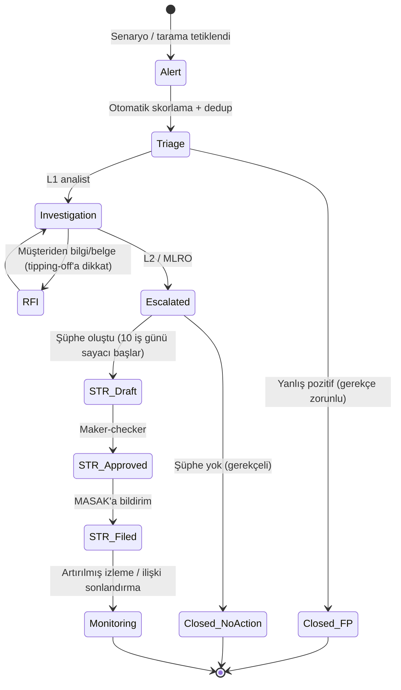

# AEP-CLW — AML / KYC Politikası ve Ürün Gereksinimleri

| Alan | Değer |
|---|---|
| Doküman sahibi | `CMP` (Compliance & Risk Officer / MLRO rolü) |
| Katkı | `SA`, `BA`, `SEC`, `PO`, `DATA` |
| Sürüm | v1.0 — Sprint 0 |
| Uygulayan servisler | `customer-service`, `compliance-service`, `risk-service`, `wallet-service`, `tenant-service` |
| İlgili kontroller | CTL-048 … CTL-053 |

> Bu politika, platformun **risk temelli yaklaşımla** varsayılan olarak uyguladığı asgari AML/KYC çerçevesidir.
> Tenant'ın regülasyon modeli (`CLOSED_LOOP_EXEMPT`, `LICENSED_PARTNER`, `SELF_LICENSED` — bkz.
> [regulatory-framework.md](regulatory-framework.md)) daha sıkı gereklilik doğurabilir. Sayısal limitler **örnek
> başlangıç değerleridir**; yürürlükteki TCMB/MASAK eşikleri ve hukuk görüşü ile "regülasyon tavanı" tablosu canlı öncesi
> güncellenir. Hukuki görüş değildir.

---

## 1. İlkeler

1. **Risk temelli yaklaşım**: Müşteri, ürün, kanal, coğrafya ve işlem riskine göre orantılı kontrol.
2. **Kademeli KYC (progressive KYC)**: Düşük sürtünme ile başla; limit arttıkça kimlik güvencesi artar.
3. **Limit = min(tenant konfigürasyonu, regülasyon tavanı, risk kısıtı)** — tenant hiçbir zaman tavanı aşamaz.
4. **Tipping-off yasağı**: AML vaka ve STR bilgisi yalnızca yetkili rollerce görülür.
5. **Açıklanabilirlik**: Her uyarı, tetikleyen kural/senaryo, parametre ve verilerle birlikte saklanır.

---

## 2. KYC Seviyeleri

| Seviye | Ad | Doğrulama | Tipik Kullanım | Kısıtlar |
|---|---|---|---|---|
| **Tier 0** | Anonim | Cihaz kaydı + app attestation; kişisel veri yok | Fiziksel/dijital hediye kartı, kampüs misafir | Düşük bakiye/aylık limit, yeniden yükleme sınırlı, P2P yok, iade yok (yalnızca kaynağa) |
| **Tier 1** | Telefon doğrulanmış | Telefon OTP + ad-soyad beyanı + e-posta (opsiyonel) + cihaz bağlama + yaptırım taraması (ad/doğum yılı ile) | Kahve zinciri, otopark, EV şarj — standart müşteri | Orta limit, otomatik yükleme açık, P2P (tenant izin verirse) çok düşük limit |
| **Tier 2** | Kimlik doğrulanmış | TCKN + **çipli kimlik kartı NFC okuma** (ICAO 9303 / TCKK çip — pasif & aktif doğrulama) + **canlılık testi (liveness)** + yüz eşleştirme; yabancılar için pasaport NFC; KPS/NVİ doğrulama (yetki varsa) | Yüksek bakiye, P2P, kurumsal kampüs | Yüksek limit |
| **Tier 3** | Tam | Tier 2 + adres doğrulama + gelir/meslek beyanı + fon kaynağı beyanı (eşik üstü) + PEP taraması (tam) + gerektiğinde **EDD** (geliştirilmiş durum tespiti) | Kurumsal / yüksek hacimli bireysel, lisanslı model | En yüksek limit, periyodik yeniden değerlendirme |

**Seviye geçişleri**: Limit aşımı yaklaştığında (%80) uygulama içi yükseltme daveti; yükseltme reddedilirse işlem limit içinde kalır.
**Seviye düşürme**: Belge süresi dolması, yaptırım/PEP eşleşmesi, fraud vakası → otomatik kısıt + vaka.

---

## 3. Limit Matrisi

### 3.1 Regülasyon Tavanları (platform seviyesi — **örnek değerler, yürürlükteki mevzuatla güncellenir**)

| Parametre (TRY) | Tier 0 | Tier 1 | Tier 2 | Tier 3 |
|---|---|---|---|---|
| Maks. bakiye | 1.500 | 10.000 | 50.000 | 250.000 |
| Tek yükleme | 1.000 | 5.000 | 25.000 | 100.000 |
| Aylık yükleme toplamı | 1.500 | 20.000 | 100.000 | 500.000 |
| Tek ödeme | 1.000 | 5.000 | 25.000 | 100.000 |
| Günlük ödeme adedi | 20 | 50 | 100 | 200 |
| P2P (aylık) | — | 1.000 | 10.000 | 50.000 |
| Hesap kapanışında iade | Kaynağa | Kaynağa | Kaynağa / doğrulanmış IBAN | Kaynağa / doğrulanmış IBAN |

### 3.2 Tenant Konfigürasyonu

```yaml
# Snippet — tenant limit profili (tenant-service); değerler tavan ile kırpılır (clamp)
limitProfile:
  currency: TRY
  tiers:
    TIER_1:
      maxBalance: 3000          # kahve zinciri: tavan 10.000'in altında
      singleTopUp: 1000
      monthlyTopUp: 6000
      singlePayment: 1000
      dailyPaymentCount: 30
      p2p: { enabled: false }
  riskOverrides:
    newDeviceCoolDownHours: 24
    newDeviceMaxPayment: 250
  approval: MAKER_CHECKER       # değişiklik tenant FINANCE (maker) + TENANT_ADMIN (checker)
```

Kural: `effective_limit = min(tenant_limit, regulatory_cap[tier][model], risk_override)`. Limit değişiklikleri versiyonlanır, audit edilir (CTL-029).

---

## 4. Yaptırım ve PEP Taraması

| Konu | Uygulama |
|---|---|
| Listeler | Ulusal (6415/7262 kapsamında Resmî Gazete/MASAK dondurma kararları), BM Güvenlik Konseyi, OFAC SDN, AB konsolide, UK HMT; PEP ve olumsuz medya (ticari veri sağlayıcı) |
| Zaman | Onboarding (Tier 1+), seviye yükseltme, **günlük delta yeniden tarama** (liste güncellemelerinde tüm müşteri tabanı), IBAN/iade alıcısı |
| Eşleştirme | Fuzzy (Jaro-Winkler, transliterasyon — Türkçe karakter normalizasyonu), doğum tarihi/uyruk ile güçlendirme; eşik tenant değil **platform** tarafından yönetilir |
| Sonuç | Olası eşleşme → işlemler askıda + vaka (COMPLIANCE_OFFICER); doğrulanmış eşleşme → **varlık dondurma**, bildirim; yanlış pozitif → gerekçeli kapatma (maker-checker), whitelisting (süreli) |
| SLA | Olası eşleşme incelemesi 24 saat (onboarding 1 iş günü) |
| Kanıt | Tarama sorgusu, liste versiyonu, skor, karar ve karar veren — audit log |

---

## 5. İşlem İzleme Senaryoları

Gerçek zamanlı (risk-service, ödeme yolunda < 50 ms) ve yakın gerçek zamanlı/batch (compliance-service, Kafka stream + ClickHouse) iki katman.

| ID | Senaryo | Mantık (örnek parametre) | Mod | Aksiyon |
|---|---|---|---|---|
| TM-01 | **Structuring (parçalama)** | Eşik altında (tavanın %80–99'u) çoklu yükleme, 24 saatte ≥ 3 kez veya 7 günde ≥ 5 | Batch | Uyarı → vaka |
| TM-02 | **Hızlı yükle-harca (rapid load & spend)** | Yüklemeden sonra ≤ 30 dk içinde bakiyenin ≥ %90'ının harcanması + yeni kart | Gerçek zamanlı | Skor artışı, eşik üstünde step-up / red |
| TM-03 | Yükle-iade döngüsü | Yükleme → kısa sürede iade/hesap kapama talebi (kart→farklı kaynak) | Batch | Vaka, iade durdurma |
| TM-04 | **Çoklu hesap** | Aynı kart/IBAN/cihaz/telefon hash'i ile ≥ 3 cüzdan | Gerçek zamanlı + batch | Onboarding reddi / bağlantı analizi |
| TM-05 | **Cihaz paylaşımı** | Aynı cihaz parmak izinde ≥ 3 farklı müşteri 30 günde | Gerçek zamanlı | Risk skoru, vaka |
| TM-06 | Velocity (kart) | Aynı kartla 1 saatte ≥ 3 yükleme veya ≥ 2 farklı cüzdana | Gerçek zamanlı | Red |
| TM-07 | Hareketsiz hesap canlanması | 180 gün hareketsiz → yüksek tutarlı yükleme/harcama | Batch | Uyarı |
| TM-08 | P2P ağ kümesi (mule) | P2P grafiğinde yıldız/fan-in (≥ 5 gönderen → 1 alıcı, 7 gün) | Batch (grafik) | Vaka |
| TM-09 | İşyeri collusion | Tek işyeri/kasiyerde anormal iade oranı, aynı müşteriye tekrarlı iade | Batch | Vaka (insider) |
| TM-10 | Kasada nakit yükleme anomalisi | Kasiyer başına günlük nakit yükleme dağılımında z-skor > 3 | Batch | Vaka |
| TM-11 | Coğrafi anomali | İmkânsız seyahat (iki ödeme arası mesafe/süre), yüksek riskli ülke IP | Gerçek zamanlı | Step-up |
| TM-12 | Yaptırım/PEP ilişkili | Eşleşen kişiye bağlı cihaz/kart | Batch | Vaka |

Senaryo yaşam döngüsü: tasarım (CMP) → backtest (6 ay veri) → gölge mod (2 hafta) → yayın (maker-checker) → çeyreklik
etkinlik (true positive oranı, uyarı hacmi) gözden geçirme. Parametre değişiklikleri versiyonlu ve audit'li.

---

## 6. Vaka Yönetimi Akışı



| Adım | SLA | Rol |
|---|---|---|
| Triyaj | 1 iş günü | L1 analist (COMPLIANCE_OFFICER / RISK_ANALYST) |
| İnceleme | 5 iş günü | L1 |
| Eskalasyon kararı | 2 iş günü | L2 / MLRO |
| STR gönderimi | Şüphe tarihinden **≤ 10 iş günü** (sistem sayacı; 7. günde eskalasyon) | MLRO + checker |

Hesap aksiyonları: izleme, limit düşürme, geçici dondurma, ilişki sonlandırma — her biri gerekçe + audit.

---

## 7. Kayıt Saklama

| Kayıt | Süre | Depolama | Not |
|---|---|---|---|
| KYC belgeleri, doğrulama sonuçları | İlişki bitiminden itibaren **8 yıl** (5549) | Şifreli object storage, WORM | Biyometrik ham veri: doğrulama sonrası KYC sağlayıcısında kısa süre, sistemde yalnızca sonuç + skor (DPIA'ya göre) |
| İşlem kayıtları (ledger) | Min. **10 yıl** (TTK/VUK ve 5549'un en uzunu) | PostgreSQL + arşiv (WORM) | PII içermez (pseudonymous ref) |
| Tarama sonuçları, uyarılar, vakalar, STR | 8 yıl | compliance DB + WORM | Erişim yalnızca CMP |
| Senaryo/parametre versiyonları | 8 yıl | Git + audit | Yeniden üretilebilirlik |
| Audit log | 10 yıl | WORM | — |

Süre sonunda: PII için crypto-shredding / imha tutanağı; finansal agregasyonlar anonim olarak saklanabilir.

---

## 8. Eğitim, Gözden Geçirme, Raporlama

- Yıllık AML eğitimi (CMP, support, finance, kasiyerler için tenant tarafında kısa modül).
- Aylık AML MI raporu: uyarı hacmi, SLA uyumu, STR adedi, yanlış pozitif oranı, açık vaka yaşlandırması.
- Yıllık bağımsız AML etkinlik değerlendirmesi (iç denetim — AUD).
