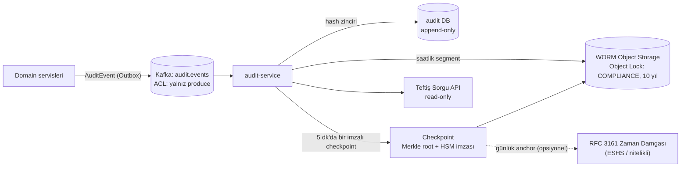

# AEP-CLW — Denetim ve Teftiş (Audit & Inspection)

| Alan | Değer |
|---|---|
| Doküman sahibi | `AUD` (Internal Audit Liaison / Teftiş) |
| Katkı | `CMP`, `SEC`, `SA`, `DATA`, `BE` |
| Uygulayan servis | `audit-service` (+ tüm servislerde audit event üretimi) |
| Sürüm | v1.0 — Sprint 0 |
| İlgili kontroller | CTL-007, CTL-008, CTL-009, CTL-041, CTL-052 |

---

## 1. Teftiş / İç Denetim Gereksinimleri

| # | Gereksinim | Kaynak | Karşılık |
|---|---|---|---|
| AR-01 | Tüm finansal ve yetkisel işlemler için **kim, ne, ne zaman, nereden, neden, önce/sonra** izi | BS ilkeleri, ISO 27001 A.8.15, SOC 2 CC7 | Standart audit event şeması (§3) |
| AR-02 | İz kayıtları **değiştirilemez** ve bütünlüğü **doğrulanabilir** | BS ilkeleri, 5549 | Hash zinciri + imzalı checkpoint + WORM |
| AR-03 | Müfettişin sisteme **salt-okunur**, zaman-sınırlı, kapsamlı erişimi | İç denetim tüzüğü | `AUDITOR` rolü, teftiş ekranı |
| AR-04 | Denetim örneklemi için **delil paketi** üretimi (yeniden üretilebilir, bütünlük kanıtlı) | Denetim standartları (IIA) | Evidence pack export |
| AR-05 | Kritik işlemlerde **dört göz** ilkesi | BS ilkeleri, SOX-benzeri | Maker-checker motoru |
| AR-06 | **Görevler ayrılığı** (SoD) ve toksik rol kombinasyonlarının engellenmesi | ISO 27001 A.5.3 | SoD matrisi (§6) + atama kontrolü |
| AR-07 | Saklama süreleri (10 yıl audit) | TTK/VUK/5549 | Retention politikası |
| AR-08 | Müfettiş faaliyetlerinin de izlenmesi ("denetçiyi denetle") | İyi uygulama | AUDITOR aksiyonları audit log'a |

---

## 2. Değiştirilemez Audit Log Mimarisi



### 2.1 Hash Zinciri

- Her kayıt: `hash_n = SHA-256(canonical_json(event_n) || hash_{n-1})`; zincir **tenant başına** ayrı (+ platform zinciri) — tenant bazlı delil üretimi ve paralellik için.
- Sıralama: tenant zinciri içinde monoton `sequence_no` (boşluk tespiti).
- **Checkpoint**: 5 dakikada bir Merkle root hesaplanır, **HSM anahtarı ile imzalanır** (ECDSA P-384), WORM'a yazılır; günlük root'lar RFC 3161 nitelikli zaman damgası ile mühürlenir (opsiyonel, lisanslı modelde önerilir).
- **Doğrulama**: Günlük otomatik bütünlük job'ı (zincir + checkpoint + WORM karşılaştırma); hata → SEV-1 güvenlik olayı (PB-02/PB-07).

### 2.2 Değiştirilemezlik Katmanları

| Katman | Mekanizma |
|---|---|
| Uygulama | Audit tablosuna yalnızca `INSERT`; servis rolünün `UPDATE/DELETE/TRUNCATE` yetkisi yok; trigger ile ek engel |
| Veritabanı | Ayrı DB/şema, ayrı dinamik kimlik bilgisi, `pgaudit` ile DDL izleme |
| Depolama | **WORM** — S3 uyumlu Object Lock *compliance mode* (ODF/NooBaa veya bulut), saklama 10 yıl, legal hold desteği |
| Kriptografik | Hash zinciri + HSM imzalı checkpoint |
| Organizasyonel | WORM hesabı ayrı yönetim alanında; platform admin'lerin silme yetkisi yok |

### 2.3 Audit Event Şeması (özet)

```json
{
  "event_id": "01J9Z6...",            "sequence_no": 1843021,
  "tenant_id": "t_7c1...",            "occurred_at": "2026-09-25T07:41:12.334Z",
  "event_type": "LEDGER.ADJUSTMENT.APPROVED",
  "actor": { "type": "USER", "id": "u_19a...", "roles": ["FINANCE"], "acr": "3",
             "ip": "85.105.x.0", "device_id": "d_..", "session_id": "s_.." },
  "on_behalf_of": null,
  "resource": { "type": "JOURNAL", "id": "j_..." },
  "action": "APPROVE", "outcome": "SUCCESS", "reason": "Ticket FIN-2211",
  "before": { "...": "hash veya maskeli" }, "after": { "...": "hash veya maskeli" },
  "correlation_id": "c_...", "maker_checker_ref": "mc_...",
  "prev_hash": "9f2c...", "hash": "a71b..."
}
```

PII audit event'e **açık yazılmaz**; `customer_ref` ve maskeli alanlar kullanılır.

---

## 3. Audit Olay Kataloğu

| Kategori | Olay Tipleri (örnek) | Kaynak | Kritiklik |
|---|---|---|---|
| **Kimlik & Oturum** | `AUTH.LOGIN.SUCCESS/FAILURE`, `AUTH.MFA.ENROLLED/RESET`, `AUTH.STEPUP.SUCCESS/FAILURE`, `AUTH.SESSION.REVOKED`, `DEVICE.BOUND/UNBOUND`, `AUTH.OTP.LOCKED` | identity, Keycloak event listener | Orta |
| **Yetki & Kullanıcı Yönetimi** | `IAM.USER.CREATED/DISABLED`, `IAM.ROLE.ASSIGNED/REVOKED`, `IAM.SOD.VIOLATION_BLOCKED`, `IAM.BREAKGLASS.ACTIVATED`, `IAM.ACCESS_REVIEW.COMPLETED` | identity, admin-bff | **Yüksek** |
| **Finansal — Ledger** | `LEDGER.JOURNAL.POSTED`, `LEDGER.REVERSAL.POSTED`, `LEDGER.ADJUSTMENT.REQUESTED/APPROVED/REJECTED`, `LEDGER.IMBALANCE.DETECTED`, `LEDGER.PERIOD.CLOSED` | ledger | **Kritik** |
| **Finansal — Ödeme/Yükleme** | `PAYMENT.AUTHORIZED/CAPTURED/REFUNDED/REVERSED`, `HOLD.CREATED/CAPTURED/RELEASED/EXPIRED`, `TOPUP.INITIATED/CONFIRMED/FAILED`, `REFUND.APPROVAL.*` | payment, funding, wallet | **Kritik** |
| **Cüzdan** | `WALLET.CREATED/FROZEN/UNFROZEN/CLOSED`, `WALLET.LIMIT.CHANGED`, `WALLET.KYC_TIER.CHANGED` | wallet, customer | Yüksek |
| **Konfigürasyon** | `TENANT.CONFIG.CHANGED` (limit, ücret, breakage, feature flag), `TENANT.REGULATORY_MODEL.CHANGED`, `MERCHANT.IBAN.CHANGED`, `FEE.SCHEDULE.CHANGED` | tenant, merchant | **Kritik** |
| **Risk & AML** | `RISK.RULE.PUBLISHED`, `RISK.DECISION` (red/step-up), `AML.ALERT.CREATED`, `AML.CASE.*`, `AML.STR.FILED`, `SANCTIONS.MATCH.*` | risk, compliance | **Kritik** (erişim kısıtlı) |
| **Veri Koruma** | `PII.VIEWED_UNMASKED`, `PII.EXPORTED`, `CONSENT.GIVEN/WITHDRAWN`, `DSR.RECEIVED/COMPLETED`, `KEY.SHREDDED` | customer, reporting | Yüksek |
| **Takas & Muhasebe** | `SETTLEMENT.BATCH.CREATED/APPROVED/PAID`, `RECON.EXCEPTION.*`, `GL.EXPORT.GENERATED`, `EINVOICE.ISSUED` | settlement, accounting | Yüksek |
| **Teftiş** | `AUDIT.QUERY.EXECUTED`, `AUDIT.EVIDENCE_PACK.EXPORTED`, `AUDIT.INTEGRITY.VERIFIED/FAILED` | audit | Yüksek |
| **Platform & Değişiklik** | `DEPLOY.PROMOTED` (ArgoCD), `SECRET.ROTATED`, `KEY.ROTATED`, `CONFIG.DRIFT.DETECTED` | ArgoCD, Vault (webhook köprüsü) | Yüksek |
| **Raporlama** | `REPORT.EXPORTED` (format, satır sayısı, filtre) | reporting | Orta |

Katalog, AsyncAPI şemasıyla (`audit.events.v1`) versiyonlanır; yeni endpoint için "audit event tanımlandı mı?" DoD maddesidir.

---

## 4. Müfettiş Rolü ve Read-Only Teftiş Ekranı

### 4.1 Rol Tanımı — `AUDITOR`

- **Atama**: Tenant admin **talep eder** + platform/tenant compliance **onaylar** (maker-checker); zorunlu **bitiş tarihi** (maks 90 gün), kapsam (tenant(lar), tarih aralığı, modüller).
- **Kimlik doğrulama**: WebAuthn MFA; delil export için step-up (`acr=3`).
- **Yetki**: Tamamen read-only (API seviyesinde yalnızca `GET` + export endpoint'leri; gateway'de method filtresi); PII maskeli, unmask talebi gerekçeli ve loglu (tenant DPO onayı opsiyonel).
- **İzlenebilirlik**: Müfettişin tüm sorguları `AUDIT.QUERY.EXECUTED` olarak loglanır.

### 4.2 Teftiş Ekranı (Admin Portal → "Teftiş" modülü)

| Bileşen | Özellik |
|---|---|
| Olay arama | Tenant, tarih, olay tipi, aktör, kaynak, correlation ID ile filtre; zaman çizelgesi görünümü |
| İşlem izleme (trace) | Bir ödeme/yükleme için uçtan uca: istek → risk kararı → hold → journal → takas → GL |
| Ledger görünümü | Hesap bazlı hareket, deneme mizanı (trial balance), dönem kapanışları, borç=alacak kanıtı |
| Maker-checker kayıtları | Talep, maker, checker, süre, gerekçe, payload hash |
| Kullanıcı/rol geçmişi | Belirli tarihte kimin hangi role sahip olduğu ("as-of" sorgu) |
| Konfigürasyon geçmişi | Limit/ücret/kural değişiklik diff'leri |
| Bütünlük durumu | Zincir doğrulama sonucu, son checkpoint, WORM eşleşmesi (yeşil/kırmızı) |
| Örneklem aracı | Rastgele/istatistiksel örneklem (ör. 25 adet manuel düzeltme) + seed kaydı (yeniden üretilebilirlik) |
| Kaydedilmiş sorgular | Standart denetim testleri (ör. "maker=checker olan işlemler", "mesai dışı düzeltmeler") |

---

## 5. Delil Paketi (Evidence Pack) Export

| Özellik | Tasarım |
|---|---|
| İçerik | Seçilen olaylar (JSON Lines), ilgili journal kayıtları, maker-checker kayıtları, konfig snapshot'ları, sorgu parametreleri, örneklem seed'i |
| Bütünlük | `manifest.json` (her dosyanın SHA-256'sı) + hash zinciri kanıtları (ilgili checkpoint'ler, Merkle inclusion proof) + paketin **HSM ile imzası** (detached `manifest.sig`) + RFC 3161 zaman damgası |
| Doğrulama | Bağımsız doğrulama CLI/talimatı (açık algoritma; müfettiş platforma güvenmeden doğrulayabilir) |
| Format | ZIP (AES-256 şifreli, parola ayrı kanaldan) + PDF özet raporu (watermark: müfettiş adı, tarih) |
| Güvenlik | Step-up, export limiti, `AUDIT.EVIDENCE_PACK.EXPORTED` olayı, indirme linki tek kullanımlık (15 dk) |
| Saklama | Üretilen paketlerin manifest'i 10 yıl saklanır (yeniden üretilebilirlik) |

```
evidence-pack-TENANT-2026Q3-FIN-001.zip
├── manifest.json            # dosya listesi + SHA-256 + sorgu parametreleri
├── manifest.sig             # HSM imzası (ECDSA P-384)
├── manifest.tsr             # RFC 3161 zaman damgası
├── events.jsonl
├── journals.jsonl
├── maker_checker.jsonl
├── config_snapshots/
├── proofs/                  # checkpoint'ler + Merkle inclusion proof
└── summary.pdf
```

---

## 6. Dört Göz İlkesi ve Görevler Ayrılığı (SoD)

### 6.1 Maker-Checker Uygulanan İşlemler

| İşlem | Maker | Checker | Eşik / Not |
|---|---|---|---|
| Manuel ledger düzeltme | FINANCE | FINANCE (farklı kişi) veya TENANT_ADMIN | Her tutar |
| İade (eşik üstü) | MERCHANT_MANAGER / SUPPORT_AGENT | FINANCE | Tenant eşiği (örn. > 1.000 TRY) |
| Limit / ücret / breakage konfig | FINANCE | TENANT_ADMIN | Her değişiklik |
| Fraud kural yayını | RISK_ANALYST | RISK_ANALYST (kıdemli) / COMPLIANCE_OFFICER | Gölge mod sonrası |
| AML senaryo parametresi | COMPLIANCE_OFFICER | MLRO | — |
| STR gönderimi | COMPLIANCE_OFFICER | MLRO | — |
| Yaptırım eşleşmesi kapatma (FP) | COMPLIANCE_OFFICER | COMPLIANCE_OFFICER (farklı) | — |
| Rol ataması (ayrıcalıklı) | TENANT_ADMIN | TENANT_ADMIN (farklı) / PLATFORM_ADMIN | FINANCE, COMPLIANCE, AUDITOR rolleri |
| İşyeri IBAN değişikliği | MERCHANT_MANAGER | FINANCE | + out-of-band teyit |
| Takas batch onayı | FINANCE | FINANCE (farklı) | — |
| Tenant regülasyon modeli değişikliği | PLATFORM_ADMIN | CMP (platform) | — |
| Kriptografik anahtar rotasyonu / crypto-shred | PLATFORM_ADMIN | SEC | — |

**Motor kuralları**: `maker_id != checker_id`; aynı gerçek kişi tespiti (doğrulanmış e-posta/telefon eşleşmesi); checker talep
payload'ının **hash'ini** onaylar (TOCTOU önlemi); maks. bekleme 24 saat → otomatik iptal; red gerekçesi zorunlu;
acil durum bypass yok (kill switch hariç — sonradan onay zorunlu).

### 6.2 SoD Matrisi (toksik kombinasyonlar)

Semboller: **X** = aynı kişide birlikte bulunamaz (sistem engeller), **U** = uyarı + gerekçe + çeyreklik gözden geçirme, **–** = serbest.

| Rol ↓ / Rol → | TENANT_ADMIN | FINANCE | RISK_ANALYST | COMPLIANCE_OFFICER | AUDITOR | SUPPORT_AGENT | MERCHANT_MANAGER | CASHIER | PLATFORM_ADMIN |
|---|---|---|---|---|---|---|---|---|---|
| **TENANT_ADMIN** | · | X | U | X | X | – | U | U | X |
| **FINANCE** | X | · | U | X | X | U | X | X | X |
| **RISK_ANALYST** | U | U | · | U | X | U | X | X | X |
| **COMPLIANCE_OFFICER** | X | X | U | · | X | X | X | X | X |
| **AUDITOR** | X | X | X | X | · | X | X | X | X |
| **SUPPORT_AGENT** | – | U | U | X | X | · | U | U | X |
| **MERCHANT_MANAGER** | U | X | X | X | X | U | · | – | X |
| **CASHIER** | U | X | X | X | X | U | – | · | X |
| **PLATFORM_ADMIN** | X | X | X | X | X | X | X | X | · |

Ek SoD kuralları:
- Geliştirici (repo yazma yetkisi) ↔ prod deploy onayı ↔ prod veri erişimi: aynı kişide birlikte olamaz (CTL-008, CTL-027).
- Fraud kuralı yazan ↔ aynı kuralı onaylayan: farklı kişi.
- AUDITOR ataması, denetlenen birimde operasyonel role sahip kişiye yapılamaz.
- SoD matrisi kod olarak (`sod-policy.yaml`, OPA) tutulur; değişiklik CMP + AUD onayı gerektirir.

---

## 7. Denetim Takvimi ve Kontrol Testleri

| Faaliyet | Sıklık | Sahip | Çıktı |
|---|---|---|---|
| Sprint review kontrol matrisi güncellemesi | Her sprint | AUD + CMP | [control-matrix.md](control-matrix.md) durum güncellemesi |
| Kontrol etkinlik testi (örneklem) | Çeyreklik | AUD | Test çalışma kâğıdı + delil paketi |
| Erişim gözden geçirme (user access review) | Çeyreklik (ayrıcalıklı: aylık) | Tenant admin + AUD | İmzalı gözden geçirme kaydı |
| Audit log bütünlük doğrulama raporu | Günlük (otomatik), aylık özet | audit-service / AUD | Doğrulama raporu |
| Bağımsız iç denetim | Yıllık | AUD | Denetim raporu, bulgular |
| Dış denetim (ISO 27001 / SOC 2) | Yıllık | CMP | Sertifika / rapor |
