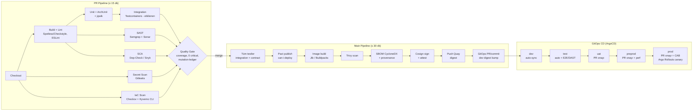
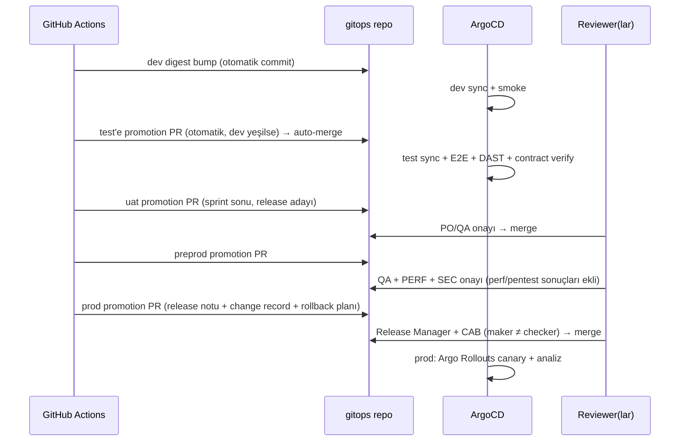

# AEP-CLW — CI/CD ve GitOps Pipeline Tasarımı

| Alan | Değer |
|---|---|
| Doküman sahibi | `OPS` (DevOps/SRE Lead) |
| Katkı | `SEC`, `QA`, `BE`, `FE`, `MOB`, `DATA` |
| Sürüm | v1.0 — Sprint 0 |
| İlgili kontroller | CTL-023, CTL-024, CTL-025, CTL-026, CTL-027, CTL-028 |

---

## 1. İlkeler

1. **Trunk-based** (Tüzük §6): kısa ömürlü feature branch (≤ 2 gün), PR, zorunlu review + CI yeşil.
2. **Build once, deploy many**: aynı imaj digest'i dev → prod; ortam farkı yalnızca konfigürasyonda.
3. **GitOps**: cluster'ın istenen durumu Git'te; ArgoCD pull modeli; CI cluster'a erişmez (kimlik bilgisi yok).
4. **Her şey imzalı ve izlenebilir**: commit → PR → build → imaj digest → SBOM → imza → deploy (SLSA L3 provenance).
5. **Progressive delivery**: prod'a canary + otomatik analiz; hızlı geri alma.

---

## 2. Repo Yapısı

| Repo | İçerik |
|---|---|
| `aep-clw-claude-based` (monorepo) | Servisler (`services/*`), web (`apps/*`), mobil (`mobile/`), paylaşılan kütüphaneler (`libs/*`), Helm library chart (`charts/aep-lib`), servis chart'ları, OpenAPI/AsyncAPI, docs |
| `aep-clw-gitops` | ArgoCD app-of-apps, ortam başına değerler (`envs/<env>/<service>/values.yaml`), imaj digest'leri, platform bileşenleri (Strimzi, CNPG, Vault, Kyverno) |

Monorepo'da değişiklik tespiti: Maven multi-module + `dorny/paths-filter` ile yalnızca etkilenen servisler build edilir (paylaşılan `libs` değişirse bağımlılar).

---

## 3. Pipeline Genel Görünümü



---

## 4. PR Pipeline

| Adım | Araç | Kapı |
|---|---|---|
| Build + lint | Maven (Java 21, `-T 1C`), Spotless, Checkstyle; pnpm + ESLint + Prettier + `tsc --noEmit` | Hata = fail |
| Unit + ArchUnit + property | JUnit 5, ArchUnit, jqwik | %100 geçiş |
| Integration (etkilenen modüller) | Testcontainers (Docker-in-runner, Ryuk) | %100 geçiş |
| SAST | Semgrep (PR diff), SonarQube (PR decoration) | 0 yeni High/Critical, Sonar QG |
| SCA | OWASP Dependency-Check (NVD mirror önbellekli), Snyk | CVSS ≥ 7 fix-available fail |
| Secret scan | Gitleaks | Herhangi bulgu fail |
| IaC | Checkov, `helm lint`, `kubeconform`, Kyverno CLI | High fail |
| Coverage | JaCoCo → Sonar | Domain ≥ %80, genel ≥ %70 (new code) |
| Mutation (ledger) | PIT artımlı | ≥ %60 |
| Commit mesajı | commitlint (Conventional Commits) | Format fail |
| Web/Mobil | Vitest/Jest, Storybook test, jest-axe, bundle size | Eşik |

```yaml
# Snippet — .github/workflows/pr.yml (özet)
name: pr
on:
  pull_request:
    branches: [main]
permissions: { contents: read }
concurrency: { group: pr-${{ github.event.pull_request.number }}, cancel-in-progress: true }
jobs:
  changes:
    runs-on: ubuntu-latest
    outputs: { services: ${{ steps.f.outputs.changes }} }
    steps:
      - uses: actions/checkout@<sha>
      - id: f
        uses: dorny/paths-filter@<sha>
        with: { filters: .github/service-filters.yml }

  build-test:
    needs: changes
    if: ${{ needs.changes.outputs.services != '[]' }}
    runs-on: ubuntu-latest
    strategy:
      matrix: { service: ${{ fromJSON(needs.changes.outputs.services) }} }
    steps:
      - uses: actions/checkout@<sha>
        with: { fetch-depth: 0 }
      - uses: actions/setup-java@<sha>
        with: { distribution: temurin, java-version: '21', cache: maven }
      - name: Build, unit, ArchUnit, integration
        run: ./mvnw -B -pl services/${{ matrix.service }} -am verify -Pci
      - name: Mutation (ledger only)
        if: matrix.service == 'ledger-service'
        run: ./mvnw -B -pl services/ledger-service org.pitest:pitest-maven:scmMutationCoverage -DmutationThreshold=60
      - name: Sonar
        env: { SONAR_TOKEN: ${{ secrets.SONAR_TOKEN }} }
        run: ./mvnw -B -pl services/${{ matrix.service }} sonar:sonar -Dsonar.qualitygate.wait=true

  security:
    uses: ./.github/workflows/_security-gates.yml   # Gitleaks, Semgrep, Dependency-Check, Checkov (bkz. secure-sdlc.md)
    permissions: { contents: read, security-events: write }
```

---

## 5. Main Pipeline (merge sonrası)

| Adım | Araç | Çıktı |
|---|---|---|
| Tam test | Integration (tüm), contract (Pact consumer publish + provider verify) | Pact Broker sonuçları |
| Image build | **Jib** (Java servisleri — Dockerfile'sız, reproducible, distroless/UBI base); **Cloud Native Buildpacks** (Node BFF/web statik — gerekirse) | OCI imaj |
| Tag | `quay.io/aep-clw/<service>:<semver>-<gitsha>`; deploy **digest** ile (`@sha256:...`) | — |
| Container scan | Trivy (vuln + misconfig + secret) | SARIF, fail kuralı |
| SBOM | CycloneDX (Maven + Syft imaj) | `sbom.cdx.json` → OCI attestation, Dependency-Track |
| Provenance | SLSA generator (in-toto) | Attestation |
| İmzalama | Cosign keyless (GitHub OIDC → Fulcio, Rekor); air-gapped prod için Vault Transit/KMS anahtarı ile ikinci imza | İmza + attestation |
| Push | Quay (robot hesap, OIDC federasyon; Quay'in kendi Clair taraması ikinci görüş) | Digest |
| GitOps güncelleme | `aep-clw-gitops`'ta dev değerleri: digest bump (bot commit) | ArgoCD senkron |

```yaml
# Snippet — main pipeline: build, scan, SBOM, sign, push, GitOps bump
  image:
    needs: [test-all, contract]
    runs-on: ubuntu-latest
    permissions: { contents: read, id-token: write, packages: write }   # id-token: keyless imza + Quay OIDC
    steps:
      - uses: actions/checkout@<sha>
      - name: Jib build & push
        run: |
          ./mvnw -B -pl services/${SERVICE} jib:build \
            -Djib.to.image=quay.io/aep-clw/${SERVICE}:${VERSION}-${GITHUB_SHA::7} \
            -Djib.outputPaths.digest=digest.txt
          echo "DIGEST=$(cat services/${SERVICE}/digest.txt)" >> $GITHUB_ENV
      - name: Trivy
        uses: aquasecurity/trivy-action@<sha>
        with:
          image-ref: quay.io/aep-clw/${{ env.SERVICE }}@${{ env.DIGEST }}
          severity: CRITICAL
          ignore-unfixed: true
          exit-code: '1'
      - name: SBOM (CycloneDX)
        run: syft quay.io/aep-clw/${SERVICE}@${DIGEST} -o cyclonedx-json=sbom.cdx.json
      - uses: sigstore/cosign-installer@<sha>
      - name: Sign & attest
        run: |
          cosign sign --yes quay.io/aep-clw/${SERVICE}@${DIGEST}
          cosign attest --yes --type cyclonedx --predicate sbom.cdx.json quay.io/aep-clw/${SERVICE}@${DIGEST}
      - name: Bump dev digest in GitOps repo
        run: ./scripts/gitops-bump.sh dev ${SERVICE} ${DIGEST}   # GitHub App token ile, yalnızca envs/dev yazabilir
```

---

## 6. GitOps — ArgoCD

### 6.1 App-of-Apps

```
aep-clw-gitops/
├── bootstrap/                 # root Application (cluster başına)
├── platform/                  # Strimzi, CNPG, Vault, Kyverno, Service Mesh, OTel, ... (ApplicationSet)
├── apps/
│   └── appset-services.yaml   # ApplicationSet: service × env matrix generator
└── envs/
    ├── dev/      <service>/values.yaml   (image.digest, replicas, resources, flags)
    ├── test/
    ├── uat/
    ├── preprod/
    └── prod/
```

- **ApplicationSet** (matrix: `services` × `envs`), her Application → `charts/<service>` + `envs/<env>/<service>/values.yaml`.
- Sync politikası: dev/test `automated: {prune: true, selfHeal: true}`; uat/preprod/prod otomatik sync + **sync windows** (prod: iş saatleri dışı pik saatleri — ör. 07:00–10:00 ve 12:00–14:00 kahve zinciri pikleri — deploy yasak).
- ArgoCD RBAC: AppProject başına; prod'da manuel sync/override yalnızca SRE break-glass.
- Drift tespiti → alarm (CTL-026).

### 6.2 Ortam Promotion (PR tabanlı)



- Promotion = **aynı digest**'in bir üst ortamın `values.yaml`'ına kopyalanması (`kargo` veya özel promotion action).
- Prod promotion PR'ı için GitHub Environment protection + CODEOWNERS (`envs/prod/** @aep/release-managers`), `can-i-deploy --to-environment prod` kontrolü.

---

## 7. Progressive Delivery — Argo Rollouts

```yaml
# Snippet — Rollout canary stratejisi (payment-service)
apiVersion: argoproj.io/v1alpha1
kind: Rollout
metadata: { name: payment-service }
spec:
  strategy:
    canary:
      trafficRouting:
        istio: { virtualService: { name: payment-service, routes: [primary] } }
      steps:
        - setWeight: 5
        - pause: { duration: 10m }
        - analysis: { templates: [{ templateName: payment-slo-check }] }
        - setWeight: 25
        - pause: { duration: 15m }
        - analysis: { templates: [{ templateName: payment-slo-check }, { templateName: ledger-integrity }] }
        - setWeight: 50
        - pause: { duration: 15m }
        - setWeight: 100
---
apiVersion: argoproj.io/v1alpha1
kind: AnalysisTemplate
metadata: { name: payment-slo-check }
spec:
  metrics:
    - name: error-rate
      interval: 1m
      failureLimit: 2
      successCondition: result[0] < 0.001
      provider:
        prometheus:
          query: |
            sum(rate(http_server_requests_seconds_count{app="payment-service",rollouts_pod_template_hash="{{args.canary-hash}}",status=~"5.."}[2m]))
            / sum(rate(http_server_requests_seconds_count{app="payment-service",rollouts_pod_template_hash="{{args.canary-hash}}"}[2m]))
    - name: p99-latency
      interval: 1m
      failureLimit: 2
      successCondition: result[0] < 0.3
      provider:
        prometheus:
          query: histogram_quantile(0.99, sum by (le) (rate(http_server_requests_seconds_bucket{app="payment-service",rollouts_pod_template_hash="{{args.canary-hash}}"}[2m])))
```

- `ledger-integrity` analizi: canary süresince `ledger_imbalance_total == 0` ve negatif bakiye sayısı 0.
- Canary trafiği tenant bazlı da yönlendirilebilir (header `x-tenant-id` ile önce iç/pilot tenant'lar — "tenant ring" stratejisi: ring 0 dahili, ring 1 pilot, ring 2 tümü).
- Analiz başarısız → otomatik abort + rollback; olay kaydı.

---

## 8. Feature Flag

- **OpenFeature** SDK (Java/TS) + sağlayıcı: **Unleash** (self-hosted) veya **flagd** (GitOps ile yönetilen) — ADR ile seçilecek.
- Flag tipleri: `release` (kısa ömürlü, ≤ 2 sprint sonra temizlenir), `ops` (kill switch — ör. P2P, offline QR, belirli PSP), `permission/tenant` (tenant-service ile entegre tenant özellikleri), `experiment`.
- Finansal akışı değiştiren flag'lerin prod'da değiştirilmesi maker-checker + audit event (`TENANT.CONFIG.CHANGED`/`FLAG.CHANGED`).
- Flag borcu: süresi dolan release flag'leri için otomatik issue.

---

## 9. Veritabanı Migration — Flyway, Expand-Contract

| Faz | Örnek (kolon yeniden adlandırma `amount` → `amount_minor`) | Deploy |
|---|---|---|
| **Expand** | Yeni kolon ekle (nullable), trigger/uygulama ile çift yazma | Release N |
| **Migrate** | Backfill (batch, throttled, idempotent job) | Release N (job) |
| **Switch** | Okuma yeni kolona; eski kolona yazma devam | Release N+1 |
| **Contract** | Eski kolonu kaldır | Release N+2 (en az bir release sonra) |

- Flyway migration'lar uygulama başlangıcında değil, **ayrı Kubernetes Job** (ArgoCD `PreSync` hook) ile; uygulama rolünün DDL yetkisi yok, migration rolü Vault dinamik.
- Kurallar: `CREATE INDEX CONCURRENTLY`, büyük tablolarda `ADD COLUMN ... DEFAULT` (PG16'da sabit default hızlı), `lock_timeout` ve `statement_timeout` zorunlu, ledger tablolarında destructive migration yasak (append-only).
- CI: Testcontainers üzerinde migration testi + prod şema anlık görüntüsüne karşı (anonim) migration provası (preprod).

---

## 10. Rollback Stratejisi

| Durum | Yöntem | Hedef süre |
|---|---|---|
| Canary analizi başarısız | Argo Rollouts otomatik abort | < 2 dk |
| Prod'da tam rollout sonrası sorun | GitOps revert PR (önceki digest) → ArgoCD sync; acil durumda `kubectl argo rollouts undo` (break-glass, sonradan Git'e yansıtılır) | < 10 dk |
| Özellik bazlı sorun | Feature flag kapat (kill switch) | < 1 dk |
| DB migration sorunu | Expand-contract sayesinde uygulama geri alınır, şema geri alınmaz (ileri düzeltme — roll-forward) | — |
| Veri bozulması | Ledger: ters kayıt (reversal) ile düzeltme; PITR yalnızca felaket senaryosunda (bkz. environments-and-dr) | Runbook |
| Event şema sorunu | Schema Registry uyumluluk kuralı nedeniyle geri uyumlu; consumer'lar önce güncellenir | — |

---

## 11. Release Versiyonlama

- **SemVer** (`MAJOR.MINOR.PATCH`) — servis başına bağımsız versiyon (monorepo'da `release-please` manifest modu); platform release'i (ör. `2026.10`) servis versiyonlarının bir **BOM**'u (release manifest).
- **Conventional Commits**: `feat:`, `fix:`, `perf:`, `refactor:`, `docs:`, `test:`, `build:`, `ci:`, `chore:`; `feat!:` / `BREAKING CHANGE:` → major.
- **CHANGELOG** otomatik (release-please PR'ı), iş diliyle release notu PO/DOC tarafından eklenir.
- API versiyonu (`/v1`) SemVer'den bağımsız; breaking API değişikliği yeni major API versiyonu + deprecation süresi (en az 6 ay, `Sunset` header).
- Mobil: `versionName` SemVer, `versionCode`/`buildNumber` monoton; white-label build matrisi (tenant × platform) — EAS Build veya Fastlane; mağaza dağıtımı staged rollout (%10 → %50 → %100).

---

## 12. Pipeline Güvenliği

- Runner: GitHub-hosted (PR) + **ephemeral self-hosted** (OpenShift üzerinde Actions Runner Controller) — main/release; iş başına temiz pod.
- `permissions` minimum, action'lar SHA pinli, Dependabot/Renovate ile güncelleme.
- Sırlar: GitHub OIDC → Vault/Quay; uzun ömürlü token yok (CTL-019).
- GitOps repo'ya yazma: yalnızca bot (GitHub App, ortam bazlı path kısıtı) ve onaylı PR'lar.
- OpenSSF Scorecard haftalık; pipeline değişiklikleri SEC CODEOWNER onayı.

## 13. Metrikler (DORA)

| Metrik | Hedef (GA sonrası) |
|---|---|
| Deployment frequency | Günlük (servis başına haftada birkaç) |
| Lead time for changes | < 1 gün (merge → prod, onay bekleme hariç) |
| Change failure rate | < %10 |
| Time to restore | < 1 saat |
