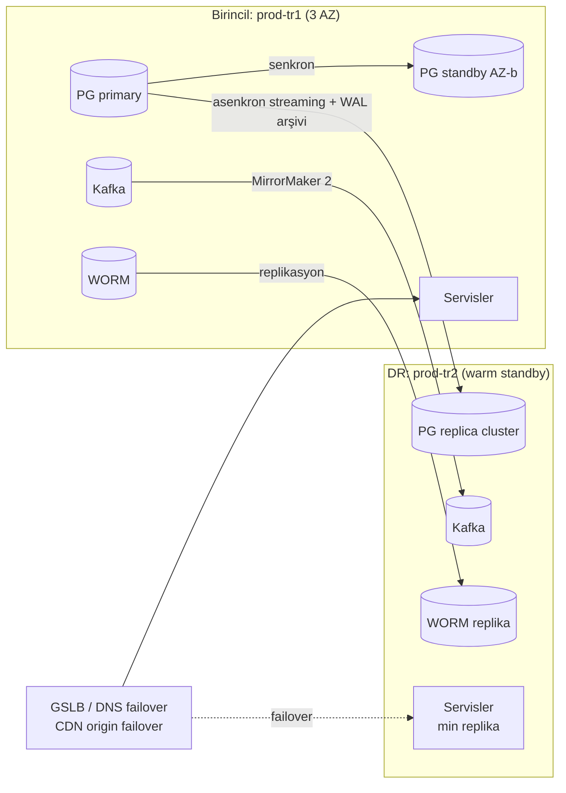

# AEP-CLW — Ortamlar ve Felaket Kurtarma (Environments & DR)

| Alan | Değer |
|---|---|
| Doküman sahibi | `OPS` (DevOps/SRE Lead) |
| Katkı | `DATA`, `SEC`, `QA`, `DM`, `CMP` |
| Sürüm | v1.0 — Sprint 0 |
| İlgili kontroller | CTL-055, CTL-056, CTL-057, CTL-058, CTL-060 |

---

## 1. Ortamlar

| Ortam | Cluster / Namespace | Amaç | Veri | Deploy | Erişim | Ölçek |
|---|---|---|---|---|---|---|
| **local** | Geliştirici makinesi (docker-compose) | Geliştirme, unit/integration | Seed | Manuel | Geliştirici | Minimal |
| **ephemeral (PR)** | `nonprod-tr1` / `aep-pr-<n>-*` (opsiyonel, etiketle tetiklenir) | PR önizleme, E2E | Seed | PR label ile otomatik, TTL 24 saat | Ekip | Minimal |
| **dev** | `nonprod-tr1` / `aep-dev-*` | Entegrasyon | Sentetik, sık reset | `main` her commit (otomatik) | Ekip | Küçük |
| **test** | `nonprod-tr1` / `aep-test-*` | Otomatik regresyon, DAST | Sentetik, gece reset | Otomatik (dev yeşil) | Ekip | Küçük |
| **uat** | `nonprod-tr1` / `aep-uat-*` | İş kabul, pilot tenant | Senaryo verisi, PSP sandbox | Promotion PR | PO, iş birimi, pilot tenant | Küçük |
| **preprod** | `preprod-tr1` | Prod eşdeğeri, perf, chaos, pentest, DR provası | Prod ölçeğinde sentetik / anonim | Promotion PR | QA/PERF/OPS/SEC | ≥ %50 prod |
| **prod** | `prod-tr1` (+ DR `prod-tr2`) | Canlı | Gerçek | Promotion PR + CAB + canary | Yalnızca GitOps; break-glass | Tam |

**Parite ilkeleri**: Aynı imaj digest'i, aynı Helm chart, aynı operatör sürümleri; farklar yalnızca `values.yaml` (replika, kaynak, entegrasyon uç noktaları) ile. Preprod'da prod ile aynı mesh/NetworkPolicy/Kyverno politikaları.

**Veri politikası**: Prod verisi alt ortamlara kopyalanmaz; preprod'a yalnızca CMP onaylı, geri döndürülemez şekilde anonimleştirilmiş agregat veri.

---

## 2. Local Geliştirme Ortamı (docker-compose)

| Bileşen | İmaj (örnek) | Port | Not |
|---|---|---|---|
| PostgreSQL 16 | `postgres:16` | 5432 | Servis başına DB'ler init script'le; RLS aktif |
| Kafka (KRaft) | `apache/kafka:3.x` veya Redpanda | 9092 | + Schema Registry (Apicurio) 8081, Kafka UI 8085 |
| Keycloak | `quay.io/keycloak/keycloak:26` | 8080 | Realm export'ları import (`aep-customers`, `aep-workforce`, `aep-platform`, `aep-machines`), test kullanıcıları |
| Redis | `redis:7` | 6379 | ACL'li |
| MailHog | `mailhog/mailhog` | 1025 / 8025 | E-posta yakalama |
| WireMock | `wiremock/wiremock:3` | 8089 | PSP, SMS, KYC, e-Fatura entegratörü stub'ları (mapping'ler repo'da) |
| Vault (dev mode) | `hashicorp/vault` | 8200 | Opsiyonel profil — varsayılan olarak Spring profil ile yerel sırlar |
| OTel stack (opsiyonel) | `grafana/otel-lgtm` | 3000 / 4317 | Grafana + Loki + Tempo + Prometheus tek konteyner |

```yaml
# Snippet — deploy/local/docker-compose.yml (özet)
services:
  postgres:
    image: postgres:16
    environment: { POSTGRES_PASSWORD: localdev }
    volumes: [ "./init/postgres:/docker-entrypoint-initdb.d:ro" ]
    ports: [ "5432:5432" ]
    healthcheck: { test: ["CMD", "pg_isready"], interval: 5s }
  kafka:
    image: apache/kafka:3.8.0
    environment:
      KAFKA_NODE_ID: 1
      KAFKA_PROCESS_ROLES: broker,controller
      KAFKA_LISTENERS: PLAINTEXT://:9092,CONTROLLER://:9093
      KAFKA_ADVERTISED_LISTENERS: PLAINTEXT://localhost:9092
      KAFKA_CONTROLLER_QUORUM_VOTERS: 1@localhost:9093
      KAFKA_CONTROLLER_LISTENER_NAMES: CONTROLLER
      KAFKA_OFFSETS_TOPIC_REPLICATION_FACTOR: 1
    ports: [ "9092:9092" ]
  keycloak:
    image: quay.io/keycloak/keycloak:26.0
    command: ["start-dev", "--import-realm"]
    environment: { KC_BOOTSTRAP_ADMIN_USERNAME: admin, KC_BOOTSTRAP_ADMIN_PASSWORD: admin }
    volumes: [ "./keycloak/realms:/opt/keycloak/data/import:ro" ]
    ports: [ "8080:8080" ]
  redis:
    image: redis:7
    ports: [ "6379:6379" ]
  mailhog:
    image: mailhog/mailhog
    ports: [ "1025:1025", "8025:8025" ]
  wiremock:
    image: wiremock/wiremock:3.9.1
    command: ["--global-response-templating"]
    volumes: [ "./wiremock:/home/wiremock:ro" ]
    ports: [ "8089:8080" ]
```

- `make up` / `make seed` (tenant fixture'ları: alpha/beta/gamma/delta), servisler IDE'den veya `./mvnw spring-boot:run -Dspring-boot.run.profiles=local`.
- Yerel parolalar yalnızca local'e özgü; Gitleaks allowlist'inde `deploy/local/**` açıkça tanımlı.
- Testcontainers "reuse" modu ile hızlı integration testleri.

---

## 3. Felaket Kurtarma (DR) Hedefleri

| Katman | RPO | RTO | Yöntem |
|---|---|---|---|
| **Kritik (ledger, wallet, payment, funding, identity/Keycloak, audit)** | **≤ 1 dk** | **≤ 15 dk** | Bölge içi: senkron standby (AZ); bölgeler arası: asenkron streaming replica (lag hedefi < 5 sn) + WAL arşivi |
| Kafka | ≤ 1 dk | ≤ 15 dk | MirrorMaker 2 (offset senkronizasyonu); outbox tablosu kaynak — Kafka kaybında DB'den yeniden yayın |
| Standart servisler (tenant, customer, merchant, loyalty, voucher, notification) | ≤ 1 dk | ≤ 30 dk | Aynı mekanizma, sıralı ayağa kaldırma |
| Raporlama (ClickHouse) | ≤ 1 saat | ≤ 4 saat | CDC'den yeniden inşa edilebilir |
| Audit WORM | 0 (kritik olaylar DB + WORM çift yazım) | ≤ 1 saat (sorgu) | Object storage cross-region replikasyon (Object Lock korunarak) |

### 3.1 Mimari



- **Multi-AZ** (CTL-058): Tek AZ kaybı otomatik tolere edilir (RPO 0, RTO dakikalar — operatör failover).
- **Cross-region** (CTL-057): Bölge kaybında **yönetilen (manuel onaylı) failover** — split-brain riskine karşı otomatik bölgeler arası failover yok; karar IC + SRE Lead.
- **Finansal tutarlılık**: Failover sonrası asenkron lag penceresindeki (≤ 1 dk) işlemler için: PSP/POS tarafı idempotency + mutabakat ile kurtarma; ledger bütünlük doğrulaması ve hash zinciri kontrolü failover checklist'inde zorunlu.
- Sırlar: Vault performance/DR replikasyonu; HSM anahtarlarının DR bölgesinde kopyası (HSM cluster).
- Keycloak: DB replikasyonu + Infinispan cross-site (veya oturumların yeniden oluşturulması — kullanıcı yeniden giriş kabul edilebilir).

---

## 4. Yedekleme

| Veri | Yöntem | Sıklık | Saklama | Konum |
|---|---|---|---|---|
| PostgreSQL | pgBackRest/Barman — sürekli WAL arşivi (PITR) + tam yedek | Tam: günlük, fark: saatlik, WAL: sürekli | 35 gün PITR; aylık tam 13 ay; yıllık 10 yıl (finansal) | Farklı bölge object storage, **immutable (Object Lock)**, şifreli (AES-256) |
| Kafka | Topic konfig/ACL GitOps'ta; veri: kritik topic'ler için DB (outbox) kaynak; tiered storage (opsiyonel) | — | — | — |
| Redis | RDB snapshot (kurtarma için gerekli değil — türetilebilir) | 6 saat | 7 gün | — |
| Vault | Raft snapshot | Saatlik | 30 gün | Şifreli, ayrı hesap |
| Keycloak | DB yedeği + realm export (GitOps) | Günlük | 35 gün | — |
| GitOps / konfig | Git (çoklu mirror) | Sürekli | Süresiz | — |
| Audit WORM | Çapraz bölge replikasyon | Sürekli | 10 yıl | — |
| Etcd (cluster) | OpenShift etcd backup | Günlük | 14 gün | — |

- Yedek erişimi ayrı yönetim alanında (üretim yöneticileri silemez); yedek silme maker-checker.
- Yedek başarı/başarısızlık metrikleri ve alarmları (D-08).

---

## 5. Tatbikatlar

| Tatbikat | Kapsam | Sıklık | Başarı Kriteri | Kanıt |
|---|---|---|---|---|
| **Restore tatbikatı** (CTL-056) | Rastgele seçilen servis DB'si → izole namespace'e PITR (rastgele zaman noktası) | Çeyreklik | Restore süresi ≤ hedef, ledger dengesi = 0, hash zinciri doğrulandı, uygulama smoke yeşil | Tatbikat raporu (süre, sorunlar) |
| **AZ kaybı** (chaos) | preprod'da bir AZ'nin node'larını drain/izole et (Litmus) | Çeyreklik | SLO ihlali yok, veri kaybı yok | Chaos raporu |
| **DB failover** | Primary kill (preprod + planlı prod) | Çeyreklik (preprod), yıllık (prod bakım penceresi) | Failover < 60 sn, uygulama otomatik yeniden bağlanma | Rapor |
| **Tam DR failover** (CTL-057) | prod-tr1 → prod-tr2 (planlı, düşük trafik penceresi) veya preprod bölge-çifti | **Yılda en az 1** (GA — M8 — öncesi ilk tatbikat preprod'da) | **Ölçülen RPO ≤ 1 dk, RTO ≤ 15 dk**, mutabakat farkı yok, failback başarılı | DR tatbikat raporu, regülatöre sunulabilir format |
| **Vault/anahtar kurtarma** | Vault snapshot restore, Shamir unseal provası | Yıllık | Başarılı | Rapor |
| **Tabletop — fidye yazılımı** | PB-09 + DR kararı | Yıllık | Karar süreleri, iletişim | Tutanak |

---

## 6. Runbook Listesi

Runbook'lar `docs/runbooks/` altında (kod aşamasında, DOC + OPS) — her alarm bir runbook'a bağlanır.

| ID | Runbook | Tetik / Kullanım |
|---|---|---|
| RB-01 | Ledger dengesizliği tespiti ve sınırlama | `aep_ledger_imbalance_total != 0` (P1) |
| RB-02 | Negatif bakiye / çifte harcama şüphesi | `aep_negative_balance_accounts > 0` |
| RB-03 | Tenant kill switch (ödemeye kapatma / read-only) | Güvenlik veya finansal olay |
| RB-04 | PSP kesintisi — circuit breaker, alternatif PSP'ye yönlendirme | Top-up başarı oranı düşüşü |
| RB-05 | Kafka consumer lag birikmesi | KEDA max replika + lag |
| RB-06 | Outbox/Debezium durması ve yeniden yayın | `aep_outbox_lag_seconds` |
| RB-07 | DLQ mesajlarının incelenmesi ve yeniden işlenmesi | DLQ > 0 |
| RB-08 | PostgreSQL primary failover (manuel/otomatik doğrulama) | DB alarmı |
| RB-09 | PostgreSQL PITR restore | Veri bozulması / tatbikat |
| RB-10 | Bölgeler arası DR failover ve failback | Bölge kaybı |
| RB-11 | Redis cluster kaybı — idempotency/QR counter etkisi | Redis alarmı |
| RB-12 | Keycloak kesintisi — oturum ve token doğrulama davranışı | Auth hata oranı |
| RB-13 | Vault erişilemezliği — lease süresi, acil prosedür | Vault alarmı |
| RB-14 | Sertifika süresi dolması / rotasyon (edge, mesh, POS mTLS) | Cert expiry alarmı (30/7 gün) |
| RB-15 | JWT imza anahtarı ve webhook anahtarı acil rotasyonu | PB-05 |
| RB-16 | Canary başarısızlığı ve manuel rollback | Argo Rollouts abort |
| RB-17 | Başarısız DB migration kurtarma | Migration job hatası |
| RB-18 | Hot account / lock contention azaltma | Lock wait alarmı |
| RB-19 | Mutabakat istisnası çözümü | Recon istisnası |
| RB-20 | Takas batch'i başarısız / yeniden çalıştırma | Batch alarmı |
| RB-21 | Audit hash zinciri doğrulama hatası | `aep_audit_chain_verification_status` |
| RB-22 | SMS pumping / OTP kötüye kullanım | OTP anomali |
| RB-23 | DDoS / WAF under-attack modu | Edge alarmı |
| RB-24 | Cluster upgrade prosedürü | Planlı |
| RB-25 | Yeni tenant onboarding (dedicated tier dahil) | Planlı |
| RB-26 | Break-glass erişim prosedürü | Acil |

---

## 7. İş Sürekliliği Notları (BCP bağlantısı — CTL-060)

- **Kasada ödeme alınamaması** en yüksek iş etkisi: POS fallback prosedürü (tenant tarafı), tenant bazlı opsiyonel offline QR modu (düşük limit, sonradan mutabakat).
- PSP kesintisi: çoklu PSP + kasada nakit yükleme alternatifi.
- Bildirim sağlayıcısı kesintisi: çoklu SMS sağlayıcı, push/e-posta yedek kanal.
- Status page ve tenant iletişim şablonları; BIA'da her hizmet için MTPD (maksimum tolere edilebilir kesinti) tanımlanır.
