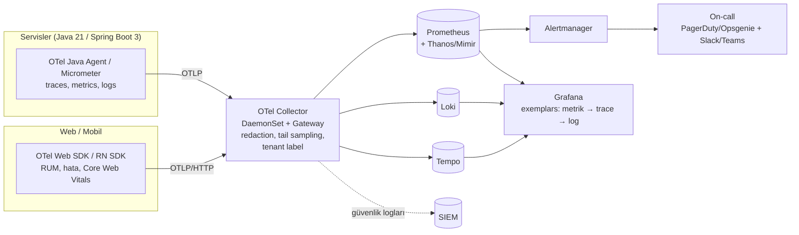

# AEP-CLW — Gözlemlenebilirlik (Observability)

| Alan | Değer |
|---|---|
| Doküman sahibi | `OPS` (DevOps/SRE Lead) |
| Katkı | `PERF`, `SEC`, `SA`, `BE`, `FINANCE` (iş metrikleri) |
| Sürüm | v1.0 — Sprint 0 |
| Yığın | OpenTelemetry, Prometheus (+ Thanos/Mimir uzun saklama), Grafana, Loki, Tempo, Alertmanager |
| İlgili kontroller | CTL-015, CTL-033, CTL-040, CTL-046 |

---

## 1. Mimari

- **Korelasyon**: `trace_id`/`span_id` her log satırında; metriklerde exemplar; `tenant_id`, `correlation_id`, `idempotency_key` (hash) span attribute'u.
- **Kardinalite disiplini**: `tenant_id` metrik label'ı yalnızca iş metriklerinde ve RED metriklerinin **tenant-özet** kayıt kurallarında (500 tenant sınırlı); `customer_id`, `wallet_id` asla metrik label'ı değil (trace/log'da).

---

## 2. Metrikler

### 2.1 RED (servisler, endpoint'ler)

| Metrik | Kaynak |
|---|---|
| Rate: `http_server_requests_seconds_count`, `kafka_consumer_records_consumed_total` | Micrometer |
| Errors: 5xx oranı, iş hatası oranı (`aep_business_errors_total{code}`), consumer DLQ sayısı | Micrometer + özel |
| Duration: `http_server_requests_seconds_bucket` (histogram, native histogram tercih), saga adım süreleri | Micrometer |

### 2.2 USE (kaynaklar)

CPU/bellek kullanım-doygunluk-hata (node, pod, JVM heap/GC, thread pool, Hikari havuz bekleme), PostgreSQL (bağlantı, lock wait, replication lag, WAL, bloat), Kafka (ISR, under-replicated partitions, consumer lag), Redis (bellek, evictions, latency), disk (IOPS, doluluk tahmini).

### 2.3 İş (Business) Metrikleri

| Metrik | Tanım | Alarm |
|---|---|---|
| `aep_payments_total{tenant,channel,outcome}` → **TPS** | Ödeme sayısı/saniye | Tenant bazlı anomali (tarihsel baz −%50 aynı saat) |
| `aep_payment_success_ratio` | Başarılı / (başarılı + teknik hata) — iş reddi hariç | < %99,5 (5 dk) → P2 |
| `aep_topup_success_ratio{psp}` | **Top-up başarı oranı** (PSP bazlı) | < %95 (10 dk) → P2; PSP bazlı düşüş → PSP circuit |
| `aep_ledger_imbalance_total{tenant,currency}` | Σ borç − Σ alacak (sürekli doğrulama job'ı + journal-level) | **≠ 0 → P1 anında sayfa** (CTL-033) |
| `aep_negative_balance_accounts` | Kullanılabilir bakiyesi < 0 müşteri hesabı sayısı | > 0 → P1 |
| `aep_holds_expired_uncaptured_total` | Süresi dolan provizyonlar | Anomali |
| `aep_reconciliation_exceptions_open{type}` | Açık mutabakat istisnaları | Yaşlandırma > 1 iş günü → P3 |
| `aep_customer_liability_vs_bank_diff` | Fon mutabakat farkı (CTL-035) | ≠ 0 (eşik üstü) → P2 |
| `aep_risk_decisions_total{decision}` | Onay/red/step-up oranı | Red oranında sıçrama |
| `aep_aml_alerts_open`, `aep_str_sla_days_remaining` | AML iş yükü, STR SLA | SLA ≤ 3 gün → P3 (CMP) |
| `aep_otp_sent_total{country}` | OTP/SMS hacmi | SMS pumping anomali |
| `aep_audit_chain_verification_status` | Hash zinciri doğrulama sonucu | Başarısız → P1 (SEC) |
| `aep_outbox_lag_seconds` | Outbox → Kafka gecikmesi | > 30 sn → P2 |

---

## 3. Loglar — Loki

- **Format**: JSON (Logback `LogstashEncoder` + maskeleme), alanlar: `ts`, `level`, `service`, `version`, `env`, `tenant_id`, `trace_id`, `span_id`, `correlation_id`, `event`, `msg`, `error.*`.
- **PII maskeleme** (CTL-015): uygulama katmanı (alan adı + regex) → OTel Collector `redaction`/`transform` processor (ikinci hat) → Loki ingestion drop kuralları; haftalık DLP taraması. Sınıflandırma: [security-architecture.md §11](../security/security-architecture.md).
- Label'lar (düşük kardinalite): `namespace`, `service`, `env`, `level`; `tenant_id` structured metadata (label değil).
- **Saklama**: Uygulama logları 30 gün (sıcak), 1 yıl (soğuk, object storage); güvenlik logları SIEM'de 2 yıl; **audit log** Loki'de değil — audit-service + WORM (10 yıl).
- Log seviyesi: prod `INFO`; dinamik seviye değişikliği (actuator, audit'li, süreli).

## 4. Trace — Tempo

- OTel Java agent otomatik enstrümantasyon (Spring MVC/WebFlux, JDBC, Kafka, Redis, HTTP client) + manuel span'ler (saga adımları, ledger posting, risk kararı).
- Kafka üzerinden **context propagation** (W3C `traceparent` header'ı event'te).
- Örnekleme: Collector'da **tail-based** — hatalı, yavaş (> 300 ms ödeme), step-up/red içeren trace'ler %100; geri kalan %5 (prod), %100 (nonprod).
- Saklama: 14 gün.

---

## 5. Dashboard Listesi

| # | Dashboard | Hedef Kitle | İçerik |
|---|---|---|---|
| D-01 | **Platform Genel Durum** | SRE, yönetim | SLO durumu, error budget, TPS, aktif olaylar |
| D-02 | **Ödeme Akışı** | SRE, SA | TPS (kanal/tenant), p50/p95/p99, başarı oranı, saga adım süreleri, red nedenleri |
| D-03 | **Ledger Bütünlüğü** | SA, FINANCE, AUD | Dengesizlik (= 0), negatif bakiye, posting hızı, hold yaşlandırma |
| D-04 | **Funding / PSP** | FINANCE, SRE | Top-up başarı oranı (PSP/3DS), PSP gecikme, webhook doğrulama hataları, circuit durumu |
| D-05 | **Tenant Görünümü** (tenant başına) | Customer Success, tenant admin (portal içi özet) | Tenant TPS, SLO, kota kullanımı, hata oranları |
| D-06 | **Servis RED** (servis başına, şablon) | Takımlar | RED + JVM + Hikari + Kafka consumer |
| D-07 | **Kafka** | SRE, DATA | Lag (group/topic), ISR, throughput, DLQ |
| D-08 | **PostgreSQL** | DATA | Bağlantı, lock, replication lag, slow queries, bloat, yedek durumu |
| D-09 | **Redis** | SRE | Latency, bellek, hit oranı |
| D-10 | **Güvenlik** | SEC | Auth hataları, OTP/SMS hacmi, WAF blokları, rate-limit 429'ları, step-up oranı, attestation başarısızlıkları, audit zincir durumu |
| D-11 | **Risk & AML** | RISK/CMP | Karar dağılımı, kural tetiklenmeleri, açık vaka, STR SLA |
| D-12 | **Settlement & Recon** | FINANCE | Batch durumu, istisnalar, fon mutabakatı |
| D-13 | **Kapasite** | PERF, SRE | Kaynak kullanımı trendi, doygunluk tahmini, HPA/KEDA olayları |
| D-14 | **Release / Canary** | SRE | Argo Rollouts analizleri, deploy işaretleri, DORA metrikleri |
| D-15 | **RUM / Mobil** | FE, MOB | Core Web Vitals, crash-free oranı, app başlangıç süresi, API hata oranı istemci tarafı |

Dashboard'lar **as-code** (Grafana JSON/Jsonnet, `grafana-operator` CR'ları GitOps'ta).

---

## 6. SLO / SLI ve Error Budget

| SLO ID | Kullanıcı Yolculuğu | SLI | Hedef (28 gün) | Error Budget |
|---|---|---|---|---|
| SLO-01 | **QR ödeme** | Başarılı (non-5xx, < 300 ms) ödeme istekleri / tüm geçerli istekler | **%99,95** kullanılabilirlik; **%99** istek < 300 ms | ~20 dk / 28 gün |
| SLO-02 | Bakiye görüntüleme | Başarılı ve < 200 ms | %99,9 | ~40 dk |
| SLO-03 | Top-up (iç sistem) | PSP hatası hariç başarılı top-up oranı | %99,9 | — |
| SLO-04 | Giriş / OTP | OTP gönderim + doğrulama başarı (sağlayıcı dahil) | %99,5 | — |
| SLO-05 | Tenant Admin Portal | Başarılı sayfa/API < 1 sn | %99,5 | — |
| SLO-06 | Event işleme (reporting) | Read model gecikmesi < 5 sn | %99 | — |
| SLO-07 | Webhook teslimi (işyeri/tenant) | 5 dk içinde başarılı teslim | %99,5 | — |
| SLO-08 | **Ledger doğruluğu** | Dengesizliği 0 olan dakika oranı | **%100** (budget yok — ihlal = SEV-1) | 0 |

**Error budget politikası**:
- Budget'ın > %50'si tüketildi → yeni özellik release'leri için ek onay; güvenilirlik işleri öncelik.
- Budget tükendi → **feature freeze** (yalnızca güvenilirlik/güvenlik düzeltmeleri) budget yenilenene veya kök neden giderilene kadar; PO + SRE Lead ortak kararı ile istisna.
- Aylık SLO gözden geçirme; SLO'lar tenant SLA'larından (sözleşme — ör. %99,9) daha sıkı tutulur.

---

## 7. Alarm Politikası

- **Belirti bazlı** (symptom-based) sayfa alarmları; neden bazlı alarmlar bilet/uyarı.
- **Multi-window multi-burn-rate** SLO alarmları (Google SRE): hızlı yanma (1 saat pencere, 14,4× burn → sayfa), yavaş yanma (6 saat, 6× → sayfa; 3 gün, 1× → bilet).
- Her alarm: sahip takım, severity, **runbook linki** (zorunlu), dashboard linki.

| Severity | Anlamı | Bildirim | Yanıt |
|---|---|---|---|
| **P1** | Müşteri etkisi büyük / finansal bütünlük / güvenlik | Sayfa (telefon) + war room | 5 dk ack, 15 dk IC |
| **P2** | Kısmi etki, SLO hızla tükeniyor | Sayfa (iş saatleri dışı dahil) | 15 dk ack |
| **P3** | Etki yok/az, müdahale gerekli | Bilet + kanal | İş saatleri, 1 iş günü |
| **P4** | Bilgi | Kanal/dashboard | — |

- Alarm hijyeni: haftalık gözden geçirme; eyleme dönüşmeyen alarm silinir/ayarlanır; hedef < 2 sayfa/on-call vardiyası/gece.
- Bakım pencerelerinde susturma (Alertmanager silence, audit'li).

---

## 8. On-Call

| Unsur | Tanım |
|---|---|
| Rotasyon | Birincil + ikincil SRE (haftalık), servis sahibi takımlar için "you build it, you run it" ikinci hat (domain on-call: payments/ledger, identity, funding) |
| Araç | PagerDuty / Opsgenie, eskalasyon: 5 dk → ikincil, 15 dk → SRE Lead, 30 dk → Engineering Director |
| Olay yönetimi | SEV sınıflandırması, IC rolü, iletişim kanalı (#inc-<id>), status page; güvenlik boyutu → [incident-response.md](../security/incident-response.md) |
| Postmortem | SEV-1/2 ve SLO ihlallerinde 5 iş günü içinde **blameless** postmortem; aksiyonlar backlog'da, takip |
| Sağlık | Gece sayfalaması sonrası telafi izni; on-call yükü metriği; handover notu |
| Hazırlık | Runbook'lar ([environments-and-dr.md §6](environments-and-dr.md)), yeni on-call için gölge vardiya, çeyreklik GameDay |

---

## 9. Sentetik İzleme ve RUM

- Sentetik: Grafana Synthetic Monitoring / Blackbox exporter — her tenant için kritik yolculuk probları (login → bakiye → test ödemesi `synthetic` tenant'ında, 1 dk), çoklu lokasyon.
- RUM: web Core Web Vitals, mobil crash-free sessions (hedef ≥ %99,8), ANR oranı.
