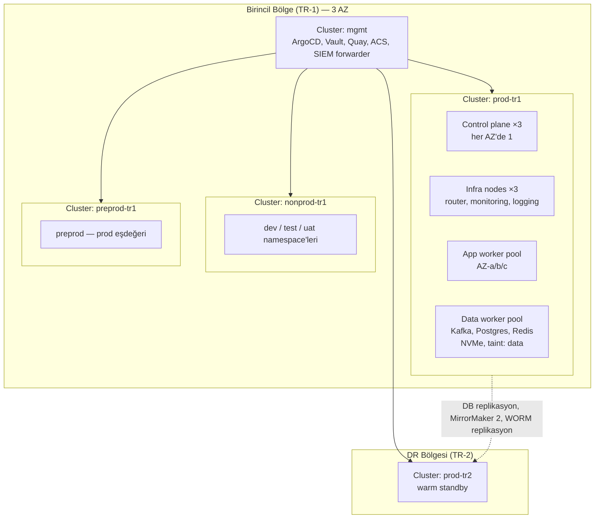

# AEP-CLW — OpenShift Platform Tasarımı

| Alan | Değer |
|---|---|
| Doküman sahibi | `OPS` (DevOps/SRE Lead) |
| Katkı | `SEC`, `DATA`, `PERF`, `CA` |
| Sürüm | v1.0 — Sprint 0 |
| Platform | Red Hat OpenShift 4.x (Kubernetes), OpenShift Service Mesh, Strimzi/AMQ Streams, CloudNativePG veya Crunchy Postgres, Redis, Vault |
| İlgili kontroller | CTL-004, CTL-013, CTL-039, CTL-055, CTL-057, CTL-058 |

---

## 1. Cluster Topolojisi



| Cluster | Amaç | Boyut (başlangıç) |
|---|---|---|
| `mgmt` | ArgoCD (hub), Vault (HA, Raft, HSM auto-unseal), Quay, Red Hat ACS (Advanced Cluster Security) central, Kyverno politika kaynağı | 3 CP + 3 worker |
| `nonprod-tr1` | dev, test, uat (namespace-per-environment) + ephemeral PR namespace'leri | 3 CP + 6–10 worker |
| `preprod-tr1` | Prod eşdeğeri konfig, performans ve chaos | 3 CP + prod'un ≥ %50'si |
| `prod-tr1` | Canlı (3 AZ) | Bkz. §11 |
| `prod-tr2` | DR (warm standby, ölçeklenebilir) | Prod'un ~%50'si, failover'da ölçeklenir |

- Ayrı prod/nonprod cluster'ları: blast radius ve PCI/regülasyon segmentasyonu.
- Çoklu cluster yönetimi: Red Hat Advanced Cluster Management (ACM) — politika ve gözlem; ArgoCD hub-spoke.
- Barındırma: TR veri yerelliği (tüzük + regülasyon) — TR içinde iki bölge/veri merkezi (on-prem veya yerel bulut); AB tenant'ları için ayrı AB bölgesi (gelecek faz).

---

## 2. Namespace Stratejisi

| Namespace | İçerik |
|---|---|
| `aep-<env>-edge` | api-gateway, BFF'ler |
| `aep-<env>-core` | wallet, ledger, payment, funding, voucher, loyalty |
| `aep-<env>-risk` | risk, compliance (erişim kısıtlı) |
| `aep-<env>-backoffice` | tenant, customer, merchant, settlement, accounting, reporting, notification, identity |
| `aep-<env>-audit` | audit-service (ayrı RBAC) |
| `aep-<env>-data` | Kafka (Strimzi), Postgres cluster'ları, Redis |
| `aep-<env>-pay-page` | PSP hosted page/iframe barındırma (PCI segmentasyonu) |
| `keycloak-<env>` | Keycloak (HA, Infinispan) |
| Platform | `openshift-*`, `istio-system`, `vault-agent`, `kyverno`, `observability` |

- **Namespace-per-environment** (nonprod cluster'da `dev`/`test`/`uat` ayrı namespace grupları); prod ve preprod ayrı cluster.
- Her namespace: `ResourceQuota`, `LimitRange`, default-deny `NetworkPolicy`, mesh üyeliği (`ServiceMeshMemberRoll`), label'lar (`aep.io/env`, `aep.io/data-class`, `aep.io/pci-scope`).

---

## 3. Helm Chart Standardı — Library Chart

`charts/aep-lib` (library chart) tüm servisler için ortak şablonları sağlar; servis chart'ları yalnızca değer tanımlar.

| Şablon | Standart |
|---|---|
| `Rollout`/`Deployment` | Argo Rollouts (kritik servisler) veya Deployment; `topologySpreadConstraints` (zone + host), `securityContext` (non-root, readOnlyRootFilesystem, drop ALL caps, seccomp RuntimeDefault), probe'lar (startup/liveness/readiness — Spring Boot actuator groups), graceful shutdown (`preStop` + `terminationGracePeriodSeconds: 45`) |
| `Service`, `ServiceAccount` | SA başına Vault rolü ve SPIFFE kimliği |
| `HPA` / `ScaledObject` | CPU + özel metrik / KEDA |
| `PDB` | `maxUnavailable: 1` veya `minAvailable: 66%` |
| `NetworkPolicy` | Default deny + beyan edilen ingress/egress |
| `AuthorizationPolicy`, `PeerAuthentication` | Mesh — servis çağıran allowlist |
| `ConfigMap` | Uygulama konfig (sır yok) |
| Vault annotations | Agent injector şablonu |
| `ServiceMonitor`, `PrometheusRule` | Standart RED alarmları |
| `ExternalSecret` (opsiyonel) | — |

```yaml
# Snippet — servis chart values.yaml (library chart'ı kullanır)
aep:
  service: payment-service
  tier: critical                  # critical | standard | batch → PDB/HPA/priorityClass varsayılanları
  image: { repository: quay.io/aep-clw/payment-service, digest: sha256:4f1c... }
  replicas: { min: 6, max: 30 }
  resources:
    requests: { cpu: "1",   memory: 1536Mi }
    limits:   { cpu: "2",   memory: 1536Mi }   # bellek request = limit (Guaranteed değil ama OOM öngörülebilir)
  jvm: { opts: "-XX:+UseZGC -XX:+ZGenerational -XX:MaxRAMPercentage=70" }
  autoscaling:
    hpa: { cpu: 60 }
  network:
    ingressFrom: [payment-bff, pos-bff, mobile-bff]
    egressTo: [wallet-service, ledger-service, risk-service, redis, kafka]
  vault:
    role: payment-service
    secrets: [database/creds/payment-rw, kv/data/payment/psp]
  flags: { provider: flagd }
```

---

## 4. Kaynak Limitleri ve QoS

| Tier | Örnek servisler | CPU req/limit | Bellek req = limit | PriorityClass |
|---|---|---|---|---|
| critical | gateway, payment, wallet, ledger, risk, identity | 1 / 2 | 1.5–2 Gi | `aep-critical` |
| standard | tenant, customer, merchant, loyalty, voucher, notification, BFF'ler | 0.5 / 1 | 1 Gi | `aep-standard` |
| batch | settlement, accounting, reporting job'ları | 0.5 / 2 | 2 Gi | `aep-batch` (preemptible) |

- CPU limit: throttling'i önlemek için critical tier'da limit = 2× request; JVM `ActiveProcessorCount` açıkça ayarlanır.
- `LimitRange` ile varsayılan request'ler; `ResourceQuota` namespace başına.
- VPA yalnızca **öneri** modunda (right-sizing raporu).

---

## 5. Otomatik Ölçekleme — HPA / KEDA

| Servis | Ölçekleyici | Metrik | Hedef |
|---|---|---|---|
| gateway, payment, wallet, ledger | HPA | CPU %60 + `http_server_requests` RPS/pod (Prometheus Adapter) | Hızlı ölçek (scaleUp stabilizasyon 0 sn, %100/30 sn) |
| Kafka consumer servisleri (settlement, reporting projectors, notification, audit, compliance TM) | **KEDA** `kafka` scaler | Consumer group **lag** (ör. lagThreshold 1.000/pod), partition sayısı max replika | Lag-temelli |
| notification | KEDA | Lag + SMS sağlayıcı rate limit üst sınırı | — |
| Batch (takas, breakage) | KEDA `cron` + Job | Zamanlanmış | — |

- Kahve zinciri sabah piki için **tahmine dayalı ön ölçekleme**: KEDA `cron` scaler ile 06:45'te min replika artırımı (tenant profiline göre).
- Cluster Autoscaler / MachineAutoscaler (bulut/IPI kurulumunda) — app pool için min/max.

---

## 6. PodDisruptionBudget ve Erişilebilirlik

- Critical servisler: ≥ 3 replika, 3 AZ'ye yayılım, `PDB maxUnavailable: 1`.
- Stateful (Kafka, Postgres, Redis): operatörlerin kendi PDB'leri; node drain sırasında tek seferde tek broker/instance.
- Cluster upgrade: EUS kanalı, önce nonprod → preprod → prod (sync window dışında), MachineConfigPool `maxUnavailable: 1`.

---

## 7. NetworkPolicy — Default Deny

```yaml
# Snippet — her namespace'e library chart/Kyverno generate ile uygulanır
apiVersion: networking.k8s.io/v1
kind: NetworkPolicy
metadata: { name: default-deny-all }
spec:
  podSelector: {}
  policyTypes: [Ingress, Egress]
---
apiVersion: networking.k8s.io/v1
kind: NetworkPolicy
metadata: { name: allow-dns-and-mesh }
spec:
  podSelector: {}
  policyTypes: [Egress]
  egress:
    - to: [{ namespaceSelector: { matchLabels: { kubernetes.io/metadata.name: openshift-dns } } }]
      ports: [{ protocol: UDP, port: 5353 }, { protocol: TCP, port: 5353 }]
    - to: [{ namespaceSelector: { matchLabels: { kubernetes.io/metadata.name: istio-system } } }]
```

- Servis-özel izinler library chart'taki `network.ingressFrom/egressTo` değerlerinden üretilir.
- Dış egress yalnızca **Istio egress gateway** üzerinden (PSP, SMS, KYC, e-Fatura entegratörü allowlist'i — `ServiceEntry`); `EgressFirewall` (OVN-Kubernetes) ile ikinci katman.

---

## 8. Security Context Constraints (SCC) ve Politika

- Tüm uygulama pod'ları **`restricted-v2`** SCC; ayrıcalıklı SCC yalnızca platform operatörleri.
- Kyverno politikaları (enforce): imza doğrulama (`verifyImages` — Cosign, keyless issuer/subject kısıtı), `latest` tag yasağı / digest zorunlu, registry allowlist (`quay.io/aep-clw/*`, `registry.redhat.io/*`), `hostPath`/`hostNetwork` yasağı, zorunlu label'lar, resource request zorunluluğu, `automountServiceAccountToken: false` (gereken yerler hariç).
- Red Hat ACS: runtime tehdit tespiti, ağ grafiği, zafiyet yönetimi (imaj + node), CIS benchmark; **compliance-operator** (CIS OpenShift, PCI-DSS profilleri).
- etcd şifreleme (AES-GCM), API server audit log → SIEM.

---

## 9. OpenShift Service Mesh

- OSSM 3.x (Istio tabanlı, Sail operatörü); ambient değil **sidecar** modu (olgunluk ve mTLS politika granülaritesi) — ADR ile gözden geçirilecek.
- `PeerAuthentication` mesh-wide `STRICT`; `AuthorizationPolicy` servis başına (library chart).
- Trafik yönetimi: timeouts, retry (yalnızca idempotent + idempotency-key'li istekler), outlier detection, circuit breaking (`DestinationRule`).
- Argo Rollouts canary için `VirtualService` ağırlıkları.
- Telemetri: OTel ile entegrasyon (Tempo), Kiali (topoloji).

---

## 10. Routes / Ingress

| Giriş | Mekanizma | TLS |
|---|---|---|
| Public API / mobil / portallar | CDN/WAF → **Istio ingress gateway** (OpenShift Route passthrough veya LoadBalancer) | TLS 1.3, edge'de sertifika (ACME / kurumsal CA), mesh içinde mTLS |
| POS (mTLS istemci sertifikası) | Ayrı ingress gateway (`pos-gateway`) — istemci sertifikası doğrulama | mTLS |
| PSP webhook | Ayrı host + IP allowlist | TLS 1.2+ (PSP uyumluluğu) |
| Admin/Platform konsolu | Ayrı host, IP allowlist/ZTNA opsiyonel | TLS 1.3 |
| Tenant özel domain (white-label) | `*.tenant-domain` — cert-manager + ACME DNS-01 veya tenant sertifika yükleme | TLS 1.3 |

---

## 11. Veri Katmanı Operatörleri

### 11.1 Kafka — Strimzi / AMQ Streams

- KRaft modu (ZooKeeper yok), 6 broker (3 AZ, rack awareness), `min.insync.replicas=2`, RF=3; `KafkaNodePool` ile controller/broker ayrımı.
- TLS + mTLS client auth, `KafkaUser` (ACL) servis başına; `KafkaTopic` CR'ları GitOps'ta.
- Schema Registry (Apicurio Registry — Red Hat build — veya Confluent SR) — uyumluluk `BACKWARD_TRANSITIVE`.
- Debezium (KafkaConnect CR) — outbox connector'ları.
- **MirrorMaker 2** → DR bölgesi.
- Kotalar: tenant/servis bazlı produce/consume quota (noisy neighbor).

### 11.2 PostgreSQL — CloudNativePG veya Crunchy Postgres for Kubernetes

| Kriter | CloudNativePG | Crunchy PGO |
|---|---|---|
| Lisans/destek | Apache 2.0, EDB ticari destek | Crunchy ticari destek (OpenShift sertifikalı) |
| Yedekleme | Barman Cloud (object storage), PITR | pgBackRest (olgun, çoklu repo), PITR |
| HA | Operatör yönetimli failover, senkron replika | Patroni tabanlı |
| Karar | ADR ile (Sprint 1) — değerlendirme kriteri: pgBackRest ihtiyacı, destek modeli, DR replika (replica cluster) desteği |

- Database-per-service (tüzük): servis başına ayrı DB; küçük servisler paylaşımlı Postgres cluster'ında ayrı veritabanı/rol; ledger/wallet/payment ayrı cluster'larda.
- Dedicated tenant tier: büyük tenant için ayrı cluster (aynı chart, farklı değerler).
- Senkron standby (aynı bölge, farklı AZ) + asenkron replica (DR bölgesi); PgBouncer pooler.
- `pgaudit`, `pg_stat_statements`; TLS zorunlu; volume şifreleme.

### 11.3 Redis

- Redis Enterprise Operator veya Redis Cluster (Bitnami/OSS operator) — 3 primary + 3 replica, TLS, ACL; kullanım: idempotency cache, QR counter tek kullanım, rate limit, oturum deny-list.
- Kalıcılık: AOF `everysec` (QR counter için); kaybı durumunda DB unique constraint ikinci savunma.

### 11.4 Vault Agent Injector

- Vault (mgmt cluster, HA Raft, HSM auto-unseal); her cluster'da Vault Agent Injector; Kubernetes auth (SA → Vault role).
- Pod annotation ile dinamik DB creds / PKI / KV şablonları tmpfs'e; `vault-agent` sidecar lease yenileme; uygulama dosyayı izleyerek (Spring Cloud Vault veya dosya watch) bağlantı havuzunu yeniler.

---

## 12. Ölçek ve Maliyet (başlangıç tahmini — prod-tr1)

| Havuz | Node tipi | Adet (başlangıç → 5.000 TPS) | Not |
|---|---|---|---|
| Control plane | 8 vCPU / 32 GB | 3 | — |
| Infra | 16 vCPU / 64 GB | 3 | Router, monitoring, logging (infra node'lar OpenShift aboneliğinden muaf) |
| App | 16 vCPU / 64 GB | 9 → 18 | 3 AZ × 3–6 |
| Data | 32 vCPU / 128 GB / NVMe 4 TB | 9 → 15 | Kafka ×6, Postgres, Redis |
| ClickHouse | 32 vCPU / 128 GB / NVMe | 6 | Raporlama |

**Maliyet kalemleri ve optimizasyon**:
- OpenShift aboneliği (çekirdek çifti başına) en büyük kalem → infra node ayrımı, bin-packing (VPA önerileri), batch'leri gece tepe-dışı çalıştırma.
- Nonprod: gece/hafta sonu ölçek-aşağı (KEDA cron / cluster hibernation), ephemeral PR ortamları TTL 24 saat.
- DR: warm standby küçük boyutta, failover'da ölçeklenir.
- Tenant bazlı maliyet görünürlüğü: OpenCost (namespace + tenant label → paylaşımlı kaynak dağıtımı) → SaaS plan fiyatlandırmasına girdi.
- Depolama: ledger sıcak veri 13 ay, sonra WORM arşiv (düşük maliyetli nesne depolama).
