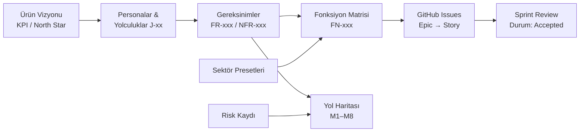

# AEP-CLW — Ürün Dokümantasyonu

> Kapalı devre (closed-loop), multitenant SaaS dijital cüzdan platformu için ürün, analiz ve planlama doküman seti.
> Üst doküman: [Proje Tüzüğü](../00-project-charter.md) · Durum: **Sprint 0 / Inception — onay bekliyor**

| Alan | Değer |
|---|---|
| Sahibi | Product Owner (`PO`) |
| Hazırlayan | `PO`, Business Analyst ×2 (`BA`), UX Research (`UX`) |
| Sürüm | v1.0 — Sprint 0 |
| Güncelleme | Her Sprint Review'da (özellikle Fonksiyon Matrisi ve Risk Kaydı) |

---

## Doküman Dizini

| # | Doküman | İçerik | Sahibi | Güncelleme sıklığı |
|---|---|---|---|---|
| 1 | [product-vision.md](product-vision.md) | Problem, hedef pazar, sektör bazlı değer önerileri (Kahve, EV şarj, Otopark, Eğlence, Kampüs), SaaS iş modeli (Starter/Growth/Enterprise), rekabet analizi, KPI ağacı ve North Star (MTAW) | `PO` | Milestone sonu |
| 2 | [personas-and-journeys.md](personas-and-journeys.md) | 11 persona, 12 ana kullanıcı yolculuğu (mermaid), yolculuk → FR izlenebilirliği, UX araştırma planı | `UX` + `BA` | Araştırma bulgularıyla |
| 3 | [requirements.md](requirements.md) | **185 FR** (21 modül, MoSCoW + milestone) ve **50 NFR** (performans, ölçeklenebilirlik, güvenlik, gözlemlenebilirlik, i18n TR/EN/AR-RTL, WCAG 2.2 AA, veri saklama) | `BA` | Refinement ile sürekli |
| 4 | [function-matrix.md](function-matrix.md) | **Fonksiyon Matrisi — 147 FN**: modül, kanal, 10 rol için CRUD/Approve, sektör uygulanabilirliği, MVP, milestone, durum; kullanım ve güncelleme talimatı | `BA` (onay `PO`) | **Her Sprint Review** |
| 5 | [mvp-scope.md](mvp-scope.md) | MVP (M1–M4) tanımı ve gerekçesi, kapsam içi/dışı, release ve pilot başarı kriterleri, kahve zinciri pilot planı, kapsam dışı riskler | `PO` | Milestone sonu |
| 6 | [roadmap.md](roadmap.md) | M0–M8 milestone'ları, 17 sprintlik plan, mermaid gantt (2026-10-05 başlangıç), çıkış kriterleri, bağımlılıklar, sürüm stratejisi | `DM` + `PO` | Her Sprint Review |
| 7 | [sector-configurations.md](sector-configurations.md) | Sektör presetleri: cüzdan tipleri, ödeme yöntemleri, pre-auth kuralları, sadakat mekaniği, limitler, son kullanma/breakage | `PO` + `BA` | Yeni sektör / milestone |
| 8 | [raci.md](raci.md) | Ekip rolleri (17 rol kodu) ve 43 faaliyetlik RACI matrisi, eskalasyon yolu, ritüeller | `DM` | Çeyreklik / organizasyon değişikliğinde |
| 9 | [risk-register.md](risk-register.md) | 25 proje riski: olasılık, etki, skor, azaltma, sahibi, ısı haritası, eylem planı | `DM` | 2 haftada bir |

---

## Temel Rakamlar

| Gösterge | Değer |
|---|---|
| Fonksiyonel gereksinim (FR) | 185 — Must 88 · Should 75 · Could 21 · Won't 1 |
| MVP kapsamındaki FR (M1–M4) | 104 — Must 81 · Should 23 |
| Fonksiyonel olmayan gereksinim (NFR) | 50 |
| Fonksiyon (FN) | 147 — MVP 85 · Post-MVP 62 |
| Milestone / Sprint | M0–M8 · S0–S16 (2 haftalık) |
| MVP Release v1.0 | 2027-02-05 (S8 sonu) |
| GA v2.0 | 2027-05-28 (S16 sonu) |
| North Star | Aylık aktif cüzdan başına yüklenen bakiye (MTAW) |

---

## İzlenebilirlik Zinciri

- Her Story, GitHub'da `fr:FR-xxx` ve `fn:FN-xxx` etiketlerini taşır; milestone GitHub milestone'u ile eşleşir.
- Kimlikler (FR, NFR, FN, R, J) kalıcıdır; silinen öğe `Deprecated` / `Descoped` olarak işaretlenir, numara yeniden kullanılmaz.

## İlgili Dizinler

- `../architecture/` — mimari genel bakış ve ADR'ler
- `../security/` — tehdit modeli, güvenlik gereksinimleri
- `../compliance/` — uyum gereksinimleri, Audit (Kontrol) Matrisi
- `../quality/` — test stratejisi
- `../devops/` — CI/CD, ortamlar, runbook'lar
- `../governance/` — çalışma anlaşması (DoR/DoD), şablonlar
- `../sprints/` — sprint review paketleri ve Fonksiyon Matrisi anlık görüntüleri
