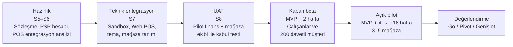

# AEP-CLW — MVP Kapsamı (v1.0)

| Alan | Değer |
|---|---|
| Doküman | MVP Kapsam Tanımı |
| Sahibi | Product Owner (`PO`) |
| Katkı | `BA`, `CA`, `SA`, `CMP`, `UX` |
| Sürüm | v1.0 — Sprint 0 |
| MVP sınırı | **M1–M4** · Sprint 1–8 · ~16 hafta · 2026-10-19 → 2027-02-05 |
| Sürüm etiketi | **MVP Release v1.0** (M4 çıkışı) |
| Pilot | Bir kahve zinciri (tek tenant, 3–5 mağaza) |

---

## 1. MVP Tanımı

> **MVP hipotezi:** Bir kahve zinciri, kendi markalı uygulamasında **ön ödemeli bakiye + müşteri QR ile ödeme**
> sunduğunda, sadakat üyelerinin anlamlı bir bölümü (≥ %25) ilk 90 günde cüzdanı aktif kullanır ve cüzdanla
> ödenen işlemlerin payı ≥ %15'e ulaşır; bu süreçte **ledger ile PSP arasında sıfır mutabakat farkı** oluşur.

MVP, "en küçük satılabilir ve denetlenebilir ürün"dür (Minimum **Auditable** Product): Bir tenant'ın gerçek
parayla, gerçek müşterilerle ve iç denetim tarafından kabul edilebilir kontrollerle canlıya çıkabilmesi için
gereken **en az** yetenek setidir. Sadakat, gelişmiş risk ve muhasebe entegrasyonları bilinçli olarak dışarıda
bırakılmıştır; ancak **mimari temel** (ledger, olay akışı, audit, çok kiracılık) bu modüllerin eklenmesine hazır
kurulur.

### 1.1 Neden bu kapsam? (Gerekçe)

| # | Karar | Gerekçe |
|---|---|---|
| G1 | **Ledger ve audit MVP'de tam** | Finansal doğruluk ve denetlenebilirlik sonradan eklenemez; veri modeli ilk günden doğru olmalı. Pilot tenant'ın iç denetim onayı için zorunlu. |
| G2 | **Kahve pilotu** | En yüksek işlem sıklığı → hipotezi en hızlı doğrulayan sektör; ödeme akışı (sale) en basit; değer önerisi (MDR tasarrufu + float) net. |
| G3 | **Pre-auth/capture MVP'de** | EV ve otopark satış hattındaki tenant'lar için "tasarım ortağı" demosu gerekli; ledger'daki hold modeli sonradan eklenirse yeniden tasarım riski yüksek. Pilot'ta kullanılmasa da API + Web POS üzerinden demo edilir. |
| G4 | **Sadakat MVP dışında** | Pilot tenant'ın mevcut sadakat programı 16 hafta daha çalışabilir; sadakat motoru bağımsız bir bounded context olduğundan M5'te ödeme olaylarına abone olarak eklenir. |
| G5 | **Tek PSP + mock** | Çoklu PSP yönlendirme, işlem hacmi oluşmadan değer üretmez; adaptör portu sayesinde ikinci PSP kod değişikliği olmadan eklenir. |
| G6 | **Takas/muhasebe yerine CSV rapor** | Pilot hacminde finans ekibi ledger-bazlı CSV ile mutabakat yapabilir; otomasyon M7'de. |
| G7 | **Temel limit + velocity, gelişmiş risk değil** | Kapalı devre + düşük limit + KYC Tier0/1 kombinasyonu pilot risk iştahı için yeterli; kural motoru M6'da. |
| G8 | **White-label tek tema** | Build pipeline'ın çok tenant'lı yapısı MVP'de kurulur, ancak yalnızca pilot tema yayınlanır. |

---

## 2. MVP Kapsamı (In Scope)

> Toplam **104 FR** (81 Must, 23 Should) M1–M4'e atanmıştır; ayrıntı [requirements.md](requirements.md),
> fonksiyon bazında durum [function-matrix.md](function-matrix.md) (85 FN, `MVP = Evet`).

| # | Yetenek | Öncelik | MS | Ana FR'ler | Not |
|---|---|---|---|---|---|
| 1 | **Tenant onboarding + temel konfigürasyon** (para birimi, dil, tema, feature flag, plan/kota, izolasyon) | Must | M1 | FR-001–FR-007, FR-010 | Sektör preseti (FR-005) Should |
| 2 | **Telefon OTP ile kayıt/giriş**, cihaz bağlama, oturum, personel MFA, OTP kötüye kullanım koruması | Must | M1 | FR-011, FR-012, FR-014, FR-015, FR-018 | |
| 3 | **Tier0 / Tier1 KYC**, müşteri profili, KVKK onayları, müşteri durum yönetimi, regülasyon limitleri | Must | M2 | FR-019–FR-021, FR-023, FR-106 | Tier2 M6 |
| 4 | **Ana + bonus cüzdan**, bakiye, hold, dondurma, limitler, harcama önceliği | Must | M2 | FR-027–FR-030, FR-034–FR-036 | Bonus cüzdanı MVP'de yalnızca manuel/maker-checker ile fonlanır (kampanya motoru M5) |
| 5 | **Çift kayıtlı ledger** (append-only, idempotent, ters kayıt, bütünlük kontrolü) | Must | M2 | FR-037–FR-042 | Sıfır tolerans (NFR-026) |
| 6 | **Kartla yükleme** (3DS) — **1 PSP adaptörü + mock PSP**, tutar kuralları | Must | M3 | FR-045, FR-046, FR-049 | |
| 7 | **Kayıtlı kart & otomatik yükleme**, yükleme iadesi | Should | M3 | FR-047, FR-048, FR-050 | Pilot başarısı için güçlü etki (KPI: otomatik yükleme benimseme) |
| 8 | **Müşteri-QR ile mağaza ödemesi** (sale), yetkilendirme kontrolleri, idempotency | Must | M3 | FR-056–FR-058, FR-061 | |
| 9 | **Pre-auth / capture** (EV & otopark), hold iptali / süre dolumu | Must | M3 | FR-062, FR-063, FR-065 | Incremental auth M5 |
| 10 | **İade / iptal** | Must | M3 | FR-059, FR-060 | |
| 11 | **İşlem geçmişi** (mobil + portal) | Must | M3–M4 | FR-151, FR-170 | |
| 12 | **Temel limit & velocity kuralları** | Must | M3 | FR-097, FR-098 | |
| 13 | **Audit log (hash-zincir)**, maker-checker, teftiş ekranı, zincir doğrulama, delil paketi | Must (delil paketi Should) | M2–M4 | FR-136–FR-141 | WORM arşiv M8 |
| 14 | **Tenant Admin Portal**: dashboard, müşteriler (360), işlemler, işyeri/mağaza/terminal, kullanıcı-rol, maker-checker kuyruğu, konfigürasyon, destek aksiyonları, PII maskeleme | Must | M4 | FR-128, FR-149–FR-155, FR-157 | |
| 15 | **Temel raporlar + CSV** (işlem, bakiye/yükümlülük, gün sonu, KPI) | Must (KPI Should) | M4 | FR-129–FR-132 | XLSX/PDF, planlı rapor M7 |
| 16 | **Web POS terminali** (QR okutma, iptal/iade, gün sonu) | Must | M3 | FR-075, FR-076 | |
| 17 | **POS REST API** + webhook, geliştirici portalı, sandbox, API istemci yönetimi | Must (webhook Should) | M3 | FR-071–FR-073, FR-077, FR-078, FR-178–FR-183 | |
| 18 | **Bildirim** (push / e-posta), şablon ve tercih yönetimi | Must (şablon/tercih Should) | M3–M4 | FR-143, FR-144, FR-146, FR-147 | SMS bildirim M5 (OTP SMS'i M1'de) |
| 19 | **White-label mobil app (1 tema)** — iOS + Android | Must | M4 | FR-165–FR-172 | Aktif oturum ekranı (FR-172) Should |
| 20 | **Platform Admin (asgari)**: tenant konsolu, break-glass, global parametreler, sağlık paneli | Must / Should | M4 | FR-158–FR-162 | |
| 21 | **CI/CD → OpenShift dev/test**, GitOps, kalite kapıları | Must | M1 | (DevOps backlog) | NFR-021, NFR-023, NFR-046 |
| 22 | **Gözlemlenebilirlik** (OTel, Prometheus, Grafana, Loki, Tempo, alarm) | Must | M1–M4 | (DevOps backlog) | NFR-029–NFR-033 |

### 2.1 MVP için geçerli NFR hedefleri

MVP çıkışında zorunlu NFR'ler: NFR-001, 002, 003 (MVP hedefi: 300 TPS), 004, 005, 008, 010, 011, 012 (%99,9),
014, 015, 016–028, 029–033, 034–036 (TR + EN tam; AR/RTL altyapı hazır, çeviri pilot sonrası), 037–039,
040–045, 046–048. GA'ya ertelenen: NFR-013 DR tatbikatı (tasarım MVP'de, tatbikat M8), NFR-017 QSA ön
değerlendirmesi (M8), NFR-020 harici pentest (M8; MVP'de iç güvenlik testi + DAST).

> **AR/RTL notu:** i18n altyapısı ve RTL yerleşim bileşenleri MVP'de hazırdır ve görsel regresyon testleri ile
> korunur; Arapça içerik çevirisi pilot tenant TR olduğundan MENA tenant onboarding'ine (M8) bağlanır.

---

## 3. MVP Dışı (Post-MVP)

| Yetenek | Hedef MS | FR | Neden şimdi değil? |
|---|---|---|---|
| Sadakat / kampanya motoru (yıldız, tier, kupon, cashback, segment) | M5 | FR-080–FR-089 | Pilot'un mevcut sadakat programı sürer; olay tabanlı entegrasyonla sonradan eklenir |
| Hediye kartı (dijital, fiziksel, B2B) | M5 | FR-090–FR-096 | Ledger'da GIFT hesap tipi hazır; iş kuralları M5 |
| Aile / alt cüzdan, kısıtlı (yemek) cüzdan, bileklik/NFC | M5 | FR-031–FR-033, FR-068 | Eğlence ve kampüs sektörleri pilot sonrası |
| Harici sistem adaptörleri (CSMS, LPR, turnike), abonelik, incremental auth | M5 | FR-064, FR-066, FR-079 | MVP'de harici sistemler genel POS API'yi kullanır |
| Gelişmiş risk (kural motoru, skor, cihaz parmak izi, vaka yönetimi) | M6 | FR-099–FR-105 | Temel limit/velocity pilot risk iştahı için yeterli |
| AML / yaptırım taraması, STR, Tier2 eKYC | M6 | FR-022, FR-107–FR-113 | Tier0/1 limitleri düşük tutularak uyum riski sınırlandırılır |
| Takas & mutabakat otomasyonu, banka ekstresi entegrasyonu | M7 | FR-114–FR-120 | Pilot hacminde CSV + manuel mutabakat |
| Muhasebe / ERP, e-Fatura, breakage motoru | M7 | FR-121–FR-127 | Yevmiye pilot'ta CSV'den manuel aktarılır |
| ClickHouse BI, planlı rapor, XLSX/PDF | M7 | FR-133–FR-135 | Operasyonel raporlar PostgreSQL okuma modelinden |
| Çoklu PSP yönlendirme | M7 | FR-055 | Tek PSP ile başlanır |
| Havale/EFT, açık bankacılık ile yükleme | M7–M8 | FR-051, FR-052 | Kart yüklemesi pilot için yeterli |
| Çoklu para birimi, bölünmüş ödeme, SDK'lar | M8 | FR-043, FR-069, FR-184 | MENA fazına bağlı |
| **P2P transfer** | – (W) | FR-070 | Sınırlı ağ modelini ve regülasyon riskini değiştirir; v2.0 kapsamı dışı |

---

## 4. MVP Başarı Kriterleri

### 4.1 Release (Go-Live) kabul kriterleri — M4 çıkış kapısı

| # | Kriter | Ölçüm | Sahibi |
|---|---|---|---|
| R1 | MVP'deki tüm **Must** FR'ler `Accepted` (function-matrix) | Fonksiyon Matrisi | `PO` |
| R2 | Uçtan uca senaryolar yeşil: kayıt → yükleme → QR ödeme → iade; pre-auth → capture; hold süre dolumu | Playwright + API test raporu | `QA` |
| R3 | Ledger invariant testleri: 1M+ rastgele işlem simülasyonunda fark = 0 | Property-based test raporu | `SA` + `QA` |
| R4 | Performans: 300 TPS sürekli, ödeme p95 ≤ 300 ms, 1 saatlik soak testinde bellek sızıntısı yok | Gatling/k6 raporu | `PERF` |
| R5 | Güvenlik: kritik/yüksek açık bulgu 0 (SAST, SCA, DAST, imaj taraması); tehdit modeli güncel | Güvenlik raporu | `SEC` |
| R6 | Çapraz-tenant izolasyon testleri %100 geçer | CI raporu | `QA` + `SEC` |
| R7 | Audit: kontrol matrisi (maker-checker, SoD, hash-zincir, erişim logu) test edildi, istisna yok | Audit (Kontrol) Matrisi | `AUD` |
| R8 | Uyum: KVKK aydınlatma/rıza metinleri, KYC limit tablosu ve sınırlı ağ değerlendirmesi onaylı | Uyum onay kaydı | `CMP` |
| R9 | Erişilebilirlik: WCAG 2.2 AA otomatik taramada kritik ihlal 0; mobil kritik akışlar ekran okuyucu ile tamamlanabilir | axe + manuel test raporu | `UX` + `QA` |
| R10 | Operasyon: runbook'lar, alarm → runbook eşlemesi, on-call planı, geri alma (rollback) prosedürü test edildi | Operasyonel hazırlık kontrol listesi | `OPS` |
| R11 | Dokümantasyon: API portalı, Admin Portal kullanım kılavuzu, kasiyer hızlı başlangıç kartı | Doküman seti | `DOC` |

### 4.2 Pilot başarı kriterleri (canlı + 90 gün)

| # | Metrik | Hedef | Karar eşiği |
|---|---|---|---|
| K1 | **North Star — MTAW** (aylık aktif cüzdan başına yüklenen bakiye) | Pilot başlangıcında baz alınır; 3. ayda ilk aya göre ≥ %20 artış | < %0 ise değer önerisi yeniden değerlendirilir |
| K2 | Aktif cüzdan / sadakat üyesi | ≥ %25 | < %10 ise onboarding ve teşvik tasarımı revize |
| K3 | Kayıt → 7 günde ilk yükleme dönüşümü | ≥ %40 | < %25 ise yükleme akışı UX araştırması |
| K4 | Pilot mağazalarda cüzdanla ödenen işlem payı | ≥ %15 | |
| K5 | Ödeme başarı oranı (iş kuralı redleri hariç) | ≥ %99,5 | < %99 ise ölçeklemeden önce kök neden |
| K6 | QR ödeme uçtan uca süre (p95) | ≤ 1,5 sn | |
| K7 | Ledger ↔ PSP mutabakat farkı | **0 TL** | Herhangi bir açıklanamayan fark = P1 olay |
| K8 | P1 olay sayısı | 0 (ödeme yolu) | |
| K9 | Mağaza başına destek talebi / gün | ≤ 2 | |
| K10 | Mobil uygulama puanı / CSAT | ≥ 4,5 / ≥ %85 | |
| K11 | Kasiyer eğitim süresi | ≤ 15 dk (NFR-050) | |

---

## 5. Pilot Tenant Planı — Kahve Zinciri

### 5.1 Pilot profili (hedef)

| Parametre | Değer |
|---|---|
| Sektör | Kahve zinciri (ulusal/bölgesel, 50+ şube) |
| Pilot kapsamı | **3–5 mağaza** (yüksek trafikli 2 ofis bölgesi + 1 AVM + 1–2 kampüs yakını) |
| Pilot müşteri hedefi | 2.000–5.000 kayıtlı müşteri, 90 gün |
| Yükleme limitleri | Tier0: tek yükleme ≤ 500 TL, bakiye ≤ 1.000 TL · Tier1: tek yükleme ≤ 2.000 TL, bakiye ≤ 5.000 TL (`CMP` onayına tabi gösterge değerler) |
| Ödeme yöntemi | Müşteri QR (Web POS tablet + pilot'un POS'u ile API entegrasyonu — hangisi hazırsa) |
| Bonus | Hoş geldin bonusu (ör. ilk yüklemede %10) — MVP'de bonus cüzdanına maker-checker ile toplu yükleme |
| Sadakat | Pilot'un mevcut programı devam eder; M5'te yıldız mekaniği AEP-CLW'ye taşınır |

### 5.2 Pilot aşamaları

| Aşama | Zaman | Giriş kriteri | Çıkış kriteri |
|---|---|---|---|
| Hazırlık | S5–S6 | Niyet mektubu (LOI) | Sözleşme + PSP üye işyeri hesabı + hukuki görüş (sınırlı ağ) |
| Teknik entegrasyon | S7 | Sandbox erişimi | Pilot mağazalar ve terminaller tanımlı; test ödemeleri başarılı |
| UAT | S8 | MVP RC (release candidate) | UAT senaryoları %100, kritik hata 0, pilot finans CSV mutabakatı başarılı |
| Kapalı beta | MVP + 0–2 hafta | Go-live onayı (R1–R11) | 200 kullanıcı, 1.000+ işlem, mutabakat farkı 0 |
| Açık pilot | MVP + 4–16 hafta | Kapalı beta başarı | K1–K11 ölçümü |
| Değerlendirme | Pilot + 90 gün | — | Genişletme kararı (tüm şubeler) + M5 sadakat geçişi planı |

### 5.3 Pilot operasyon modeli

- **Hypercare**: Canlıya geçişten itibaren 2 hafta, `BE` + `OPS` + `BA` günlük stand-up, pilot tarafıyla ortak kanal.
- **Günlük mutabakat**: Finance (pilot) + `BA` — ledger CSV ↔ PSP raporu; ilk 30 gün günlük, sonra haftalık.
- **Geri bildirim döngüsü**: Uygulama içi geri bildirim + haftalık mağaza müdürü görüşmesi (`UX`).
- **Kill switch**: Tenant bazlı `payments.enabled` flag'i ile cüzdan ödemesi dakikalar içinde kapatılabilir; müşteri bakiyesi korunur ve iade prosedürü hazırdır.

---

## 6. Kapsam Dışı Bırakmanın Riskleri

| # | Risk | Etki | Azaltma |
|---|---|---|---|
| KR1 | Sadakat MVP'de olmadığı için müşterinin cüzdana geçiş motivasyonu düşük kalır | K2/K4 hedefleri tutmaz | Hoş geldin bonusu (bonus cüzdan, manuel fonlama); M5'i öne çekebilecek şekilde loyalty-service'in olay sözleşmeleri M3'te tanımlanır |
| KR2 | Gelişmiş risk yokken çalıntı kartla yükleme (card testing) | Chargeback, PSP ilişkisi | 3DS zorunlu, düşük Tier0 limitleri, velocity (FR-098), PSP'nin fraud aracı, yükleme → iade akışında karta iade zorunluluğu |
| KR3 | Otomatik mutabakat yokken manuel mutabakat hatası | Finansal rapor hatası, denetim bulgusu | Ledger-bazlı standart CSV, günlük kontrol listesi, invariant alarmı (FR-042) |
| KR4 | AML taraması yokken şüpheli işlem kaçırılması | Regülasyon riski | Kapalı devre + düşük limit + P2P kapalı + karta iade zorunlu (nakde çıkış yok); `CMP` risk kabul kaydı |
| KR5 | Tek PSP bağımlılığı | PSP kesintisinde yükleme durur | Ödeme (bakiyeden harcama) PSP'den bağımsız çalışır; PSP SLA'sı sözleşmede; durum sayfası ve kullanıcı mesajı |
| KR6 | ERP/e-Fatura yokluğu pilot finans ekibine ek yük | Pilot memnuniyeti düşer | Yevmiye CSV şablonu pilot GL'ine uyarlanır; M7 önceliği pilot geri bildirimiyle belirlenir |
| KR7 | AR/RTL çevirisi olmadan MENA satış demoları zayıf | Satış hattı gecikmesi | Altyapı hazır; demo için EN + AR pseudo-localization |
| KR8 | Pre-auth pilot'ta kullanılmayacağı için gerçek trafikle doğrulanmamış olur | EV/otopark tenant'larında üretim hatası | M5'te EV tasarım ortağı ile sandbox pilot; kaos ve süre dolumu testleri MVP'de |

---

## 7. Kapsam Değişiklik Kuralı

- MVP kapsamına **ekleme**, eşdeğer efor çıkarılmadan yapılmaz (takas kuralı) ve `PO` + `DM` onayı gerektirir.
- **Must** bir FR'nin MVP'den çıkarılması Sprint Review'da gerekçelendirilir, [function-matrix.md](function-matrix.md) ve [roadmap.md](roadmap.md) güncellenir.
- Regülasyon veya güvenlik kaynaklı kapsam değişiklikleri (`CMP`, `SEC`) önceliklidir ve takas kuralından muaftır.
