# AEP-CLW — Personalar ve Kullanıcı Yolculukları

| Alan | Değer |
|---|---|
| Doküman | Personalar & Kullanıcı Yolculukları |
| Sahibi | UX Research Lead (`UX`) + Business Analyst (`BA`) |
| Onay | Product Owner (`PO`) |
| Sürüm | v1.0 — Sprint 0 |
| Yöntem | Proto-persona (varsayım tabanlı); Sprint 1–3 arasında pilot tenant ile 12+ derinlemesine görüşme ve 2 kasa gözlemi (contextual inquiry) ile doğrulanacak |

---

## 1. Persona Haritası

| Kod | Persona | Kanal | Rol (RBAC) | Kullanım sıklığı | MVP'de mi? |
|---|---|---|---|---|---|
| P-01 | Son müşteri (Deniz) | Mobil app | `Customer` | Günlük / haftalık | Evet |
| P-02 | Kasiyer / barista (Emre) | Web POS, entegre POS | `Cashier` | Vardiya boyunca sürekli | Evet |
| P-03 | Mağaza müdürü (Selin) | Tenant Admin (mağaza kapsamı), Web POS | `StoreMgr` | Günlük | Evet |
| P-04 | Tenant admin / dijital kanal yöneticisi (Burak) | Tenant Admin Portal | `TenantAdmin` | Günlük | Evet |
| P-05 | Finans / muhasebe uzmanı (Ayşe) | Tenant Admin Portal, export | `Finance` | Günlük + ay sonu yoğun | Evet (temel rapor) |
| P-06 | Risk analisti (Kerem) | Tenant Admin Portal (Risk modülü) | `Risk` | Günlük | Kısmi (limit/velocity) |
| P-07 | Uyum görevlisi (Zeynep) | Tenant Admin Portal (Uyum), Platform Admin | `Compliance` | Haftalık + olay bazlı | Kısmi (KYC seviyeleri) |
| P-08 | Müfettiş / iç denetçi (Hakan) | Teftiş ekranı (salt okunur) | `Auditor` | Dönemsel (çeyreklik) | Evet (audit log) |
| P-09 | Platform admin / SRE (Can) | Platform Admin Konsolu | `PlatformAdmin` | Günlük | Evet |
| P-10 | Destek temsilcisi (Elif) | Tenant Admin (destek görünümü) | `Support` | Vardiya boyunca | Evet (salt okunur + sınırlı aksiyon) |
| P-11 | Entegrasyon geliştiricisi (Murat) | Public API, Sandbox, dokümantasyon portalı | API client (M2M) | Proje bazlı yoğun | Evet (POS API) |

---

## 2. Persona Kartları

### P-01 — Deniz, Son Müşteri

| Alan | İçerik |
|---|---|
| Demografi | 29 yaş, İstanbul, beyaz yaka, iOS kullanıcısı, günde 1–2 kahve |
| Hedefler | Kasada hızlı ödemek, yıldız biriktirip ücretsiz içecek almak, harcamasını takip etmek |
| Acı noktaları | Sabah sırası, kartını çıkarmak, kampanyaların nerede olduğunu bilmemek, "bakiyem neden düşmedi/iki kez düştü" belirsizliği |
| Davranış | Uygulamayı kasaya gelmeden 5 sn önce açar; bildirimleri seçici açar; 250–500 TL yükler |
| Kaygılar | Kart bilgisinin güvenliği, bakiye kaybolur mu, telefonu kaybederse ne olur |
| Başarı anı | "Telefonu okuttum, 1 saniyede onaylandı, 1 yıldız geldi." |
| Tasarım çıkarımları | Açılışta QR tek dokunuşla; offline'da son QR'ı gösterme (kısa süreli token); bakiye ve son işlem ana ekranda; hata mesajları insan dilinde |
| Varyantlar | **Ebeveyn (eğlence parkı)**: çocuk alt cüzdanı ve limit yönetir · **EV sürücüsü**: hold/capture şeffaflığı önemli · **Öğrenci (kampüs)**: kurum yüklemeli bakiye + kişisel bakiye ayrımı · **Otopark abonesi**: plaka yönetimi |

### P-02 — Emre, Kasiyer / Barista

| Alan | İçerik |
|---|---|
| Profil | 22 yaş, yarı zamanlı, yüksek personel devri (ortalama 6–9 ay), minimum eğitim süresi |
| Hedefler | Sırayı hızlı eritmek, hata yapmamak, kasa kapanışında fark çıkmaması |
| Acı noktaları | Yoğun saatte ekran karmaşası, "işlem başarılı mı?" belirsizliği, iade prosedürünü bilmemek |
| Bağlam | Gürültülü, aceleci ortam; eller ıslak/eldivenli olabilir; tablet veya entegre POS |
| Başarı anı | QR okut → büyük yeşil onay + müşteri adı → sonraki müşteri |
| Tasarım çıkarımları | Tek birincil aksiyon, büyük dokunma alanları (≥ 48px), yüksek kontrast, sesli/haptik geri bildirim, iade için müdür onayı akışı, net hata kodları (bakiye yetersiz, QR süresi doldu) |

### P-03 — Selin, Mağaza Müdürü

| Alan | İçerik |
|---|---|
| Profil | 34 yaş, 12 kişilik ekip, satış hedefleri ve kasa farkından sorumlu |
| Hedefler | Gün sonu mutabakatı, iade/iptal onayı, personelin terminal erişimini yönetmek |
| Acı noktaları | Kasiyer hatalarının sorumluluğunun kendisinde olması, rapor almak için merkeze bağımlılık |
| Tasarım çıkarımları | Mağaza kapsamlı dashboard, gün sonu raporu tek tık, iade onayı mobil/tablet uyumlu, kasiyer PIN yönetimi |

### P-04 — Burak, Tenant Admin / Dijital Kanal Yöneticisi

| Alan | İçerik |
|---|---|
| Profil | 38 yaş, markanın dijital/CRM direktörü; IT ile iş birimleri arasında köprü |
| Hedefler | Programı hızlı canlıya almak, benimseme KPI'larını büyütmek, kampanya çalıştırmak |
| Acı noktaları | Her konfigürasyon değişikliği için tedarikçiye ticket açmak, yetki devrinin kontrolsüz olması |
| Tasarım çıkarımları | Self-servis konfigürasyon (limit, ücret, tema), sektör presetleri, maker-checker ile güvenli değişiklik, KPI dashboard (North Star) |

### P-05 — Ayşe, Finans / Muhasebe Uzmanı

| Alan | İçerik |
|---|---|
| Profil | 41 yaş, SMMM, ay sonu kapanış ve bağımsız denetimden sorumlu |
| Hedefler | Müşteri bakiyesi yükümlülüğünün (liability) doğru raporlanması, PSP tahsilatlarının banka ile mutabakatı, breakage ve ertelenmiş gelir |
| Acı noktaları | Excel ile mutabakat, sistemler arası fark, "bu 1.250 TL fark nereden geldi?" |
| Tasarım çıkarımları | Deftere dayalı (ledger-backed) raporlar, drill-down (rapor → journal → işlem), CSV/XLSX export, dönem kapanışı kilidi, GL eşleme ekranı |

### P-06 — Kerem, Risk Analisti

| Alan | İçerik |
|---|---|
| Profil | 31 yaş, fraud önleme ekibi, kart dolandırıcılığı ve hesap ele geçirme (ATO) deneyimli |
| Hedefler | Çalıntı kartla yükleme, bot kayıtları ve promosyon suistimalini önlemek, yanlış pozitifleri düşük tutmak |
| Acı noktaları | Kuralları değiştirmek için deploy beklemek, vaka bağlamının dağınık olması |
| Tasarım çıkarımları | Kural editörü (simülasyon/"shadow mode"), vaka kuyruğu, müşteri 360 risk görünümü, cihaz/IP bağlantı grafiği (post-MVP) |

### P-07 — Zeynep, Uyum Görevlisi

| Alan | İçerik |
|---|---|
| Profil | 45 yaş, hukuk kökenli, MASAK ve KVKK irtibat kişisi |
| Hedefler | KYC seviyesine göre limitlerin doğru uygulanması, yaptırım taraması, şüpheli işlem bildirimi, veri sahibi taleplerinin zamanında yanıtlanması |
| Acı noktaları | Regülasyon değişikliklerinin sisteme geç yansıması, kanıt toplamanın zorluğu |
| Tasarım çıkarımları | Regülasyon limit tabloları konfigürasyon olarak, tarama sonuç ekranı (eşleşme/yanlış pozitif kapatma gerekçesi zorunlu), STR taslağı, KVKK talep takip ekranı (SLA sayaçlı) |

### P-08 — Hakan, Müfettiş / İç Denetçi

| Alan | İçerik |
|---|---|
| Profil | 50 yaş, iç denetim / teftiş kurulu; bağımsız denetim ve regülatör denetimlerine hazırlık |
| Hedefler | "Kim, neyi, ne zaman, hangi onayla değiştirdi?" sorusunu kanıtla yanıtlamak; kontrol etkinliğini test etmek |
| Acı noktaları | Log'ların değiştirilebilir olması şüphesi, veri almak için IT'ye bağımlılık |
| Tasarım çıkarımları | Salt okunur teftiş ekranı, hash-zincir doğrulama göstergesi, zaman aralığı + aktör + nesne filtresi, delil paketi (imzalı ZIP) export, kendi erişiminin de loglandığının görünmesi |

### P-09 — Can, Platform Admin / SRE

| Alan | İçerik |
|---|---|
| Profil | 33 yaş, AEP-CLW operasyon ekibi; çoklu tenant sağlığı ve olay yönetiminden sorumlu |
| Hedefler | Tenant onboarding'i hızlı yapmak, tenant bazlı sağlık/kota izlemek, olayları hızla izole etmek |
| Acı noktaları | "Gürültülü komşu" tenant, tenant verisine gereksiz erişim riski |
| Tasarım çıkarımları | Tenant yaşam döngüsü ekranı, kota/plan yönetimi, tenant bazlı SLO paneli, **break-glass** erişim (gerekçe + süre + onay), tenant verisine varsayılan erişimsizlik |

### P-10 — Elif, Destek Temsilcisi

| Alan | İçerik |
|---|---|
| Profil | 27 yaş, çağrı merkezi / canlı destek; günde 60–80 temas |
| Hedefler | "Bakiyem düşmedi / iki kez düştü / yüklemem görünmüyor" taleplerini ilk temasta çözmek |
| Acı noktaları | Birden çok ekrana bakmak, yetkisinin olmadığı işlemler için eskalasyon |
| Tasarım çıkarımları | Müşteri 360 (maskelenmiş PII), işlem zaman çizelgesi, tek tık "vaka aç / müşteri bloke et", iade/düzeltme **talebi** oluşturma (onay Finance/StoreMgr'da), makro yanıtlar |

### P-11 — Murat, Entegrasyon Geliştiricisi

| Alan | İçerik |
|---|---|
| Profil | 30 yaş, POS yazılım firmasında veya CSMS/otopark sistemi sağlayıcısında backend geliştirici |
| Hedefler | 2 haftada entegrasyonu bitirmek, sandbox'ta uçtan uca test etmek |
| Acı noktaları | Eksik/yanlış dokümantasyon, idempotency ve hata kodlarının belirsizliği, test verisi eksikliği |
| Tasarım çıkarımları | OpenAPI 3.1 + örnekler, Postman koleksiyonu, sandbox + test kartları/QR üretici, webhook imza doğrulama örnekleri, anlamlı hata kodları (RFC 9457 problem+json) |

---

## 3. Ana Kullanıcı Yolculukları

### J-01 — Son müşteri: Kayıt → İlk yükleme → İlk ödeme (Kahve, MVP)

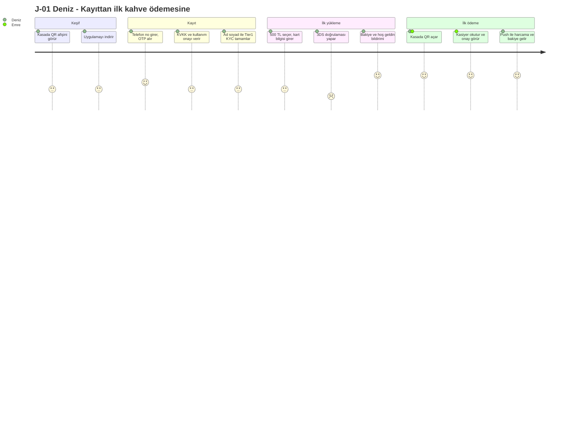

**Duygu eğrisindeki kritik düşüş:** 3DS adımı (banka sayfası, SMS gecikmesi). Aksiyon: PSP'nin
frictionless 3DS2 akışının desteklenmesi, yükleme adımında "bankanız SMS gönderecek" ön bilgilendirmesi.

### J-02 — Kasada QR ile ödeme (Kasiyer bakışı, hata dalları dahil)

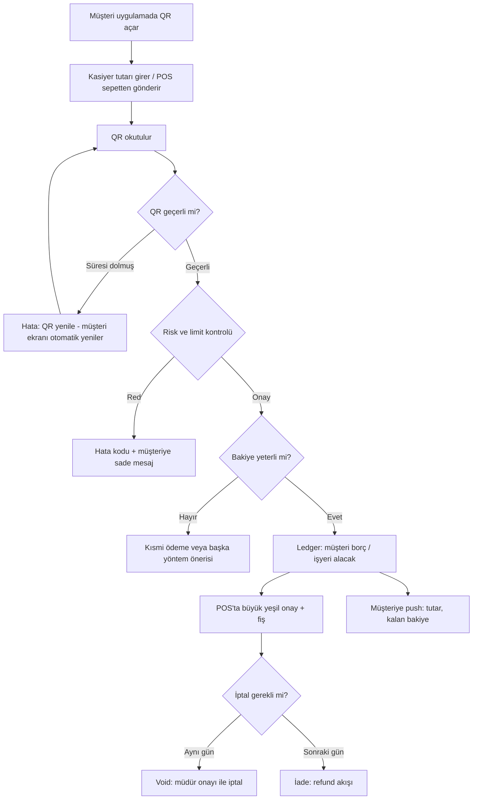

### J-03 — EV şarj: Pre-auth hold → kWh bazlı capture

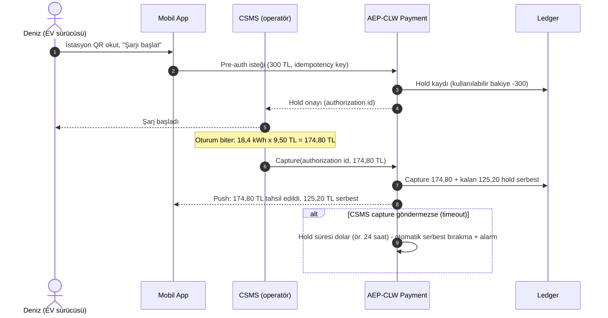

### J-04 — Otopark: Plaka ile giriş/çıkış

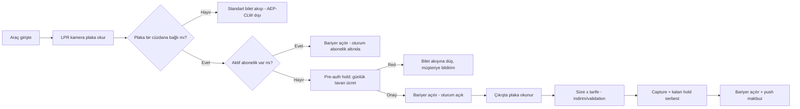

### J-05 — Eğlence parkı: Aile cüzdanı ve çocuk alt cüzdanı

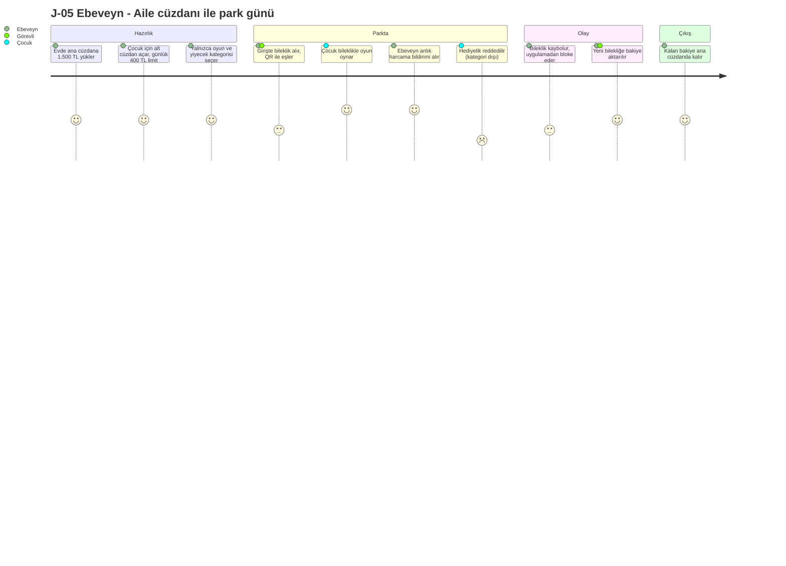

### J-06 — Kampüs: Kurum yüklemeli yemek bakiyesi

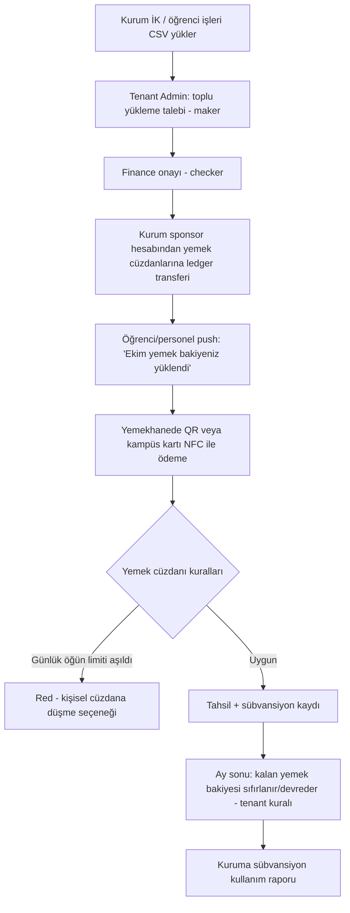

### J-07 — Tenant onboarding (Platform Admin → Tenant Admin)

```mermaid
flowchart LR
    A[Sözleşme imzalandı] --> B[Platform Admin: tenant oluştur - plan, bölge, izolasyon modu]
    B --> C[Sektör preseti seç: Kahve/EV/Otopark/Eğlence/Kampüs]
    C --> D[Keycloak organizasyonu + ilk TenantAdmin daveti]
    D --> E[Tenant Admin: marka/tema, para birimi, limit, ücret]
    E --> F[Maker-checker: kritik konfigürasyon onayı]
    F --> G[İşyeri - mağaza - terminal tanımı]
    G --> H[PSP hesabı bağlama + sandbox testi]
    H --> I[Pilot kullanıcılar - UAT]
    I --> J[Canlıya geçiş onayı - go-live checklist]
```

### J-08 — Finans: Gün sonu / ay sonu mutabakat

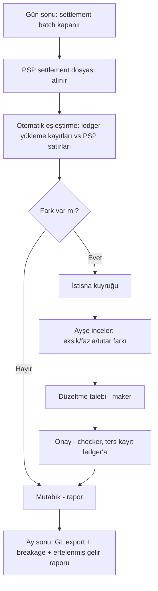

### J-09 — Destek: "Param iki kez çekildi" talebi

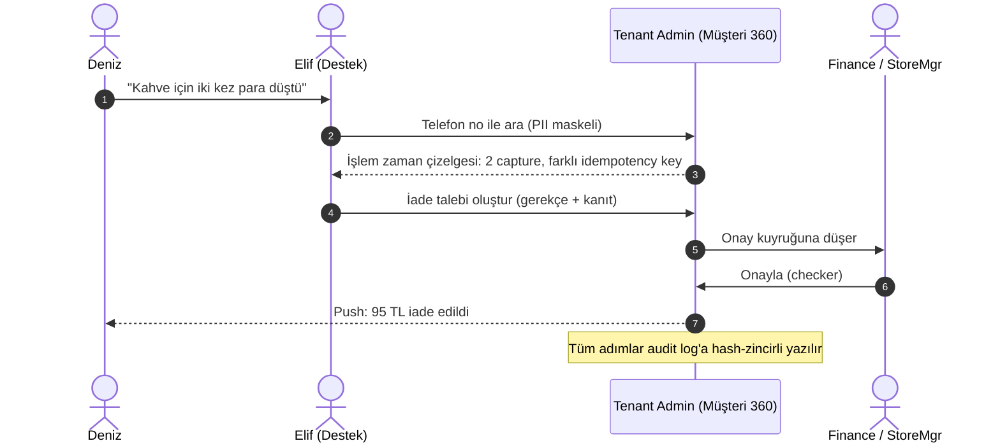

### J-10 — Müfettiş: Yetkili değişiklik incelemesi

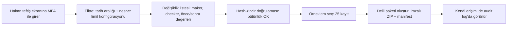

### J-11 — Entegrasyon geliştiricisi: POS entegrasyonu

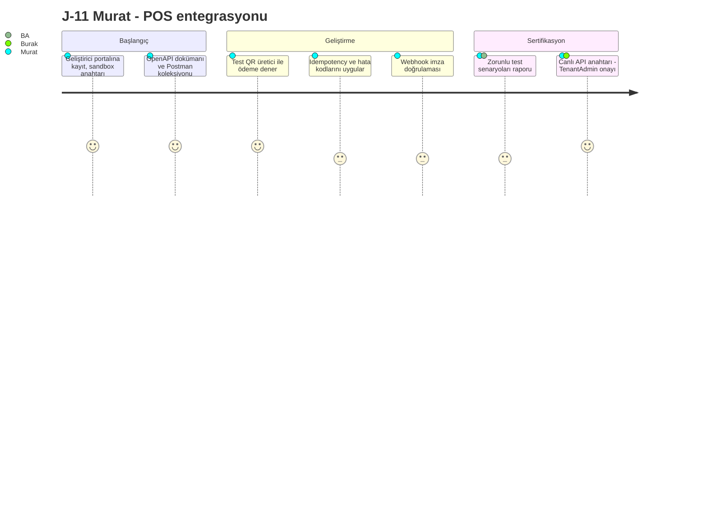

### J-12 — Risk analisti: Şüpheli yükleme vakası (post-MVP, M6)

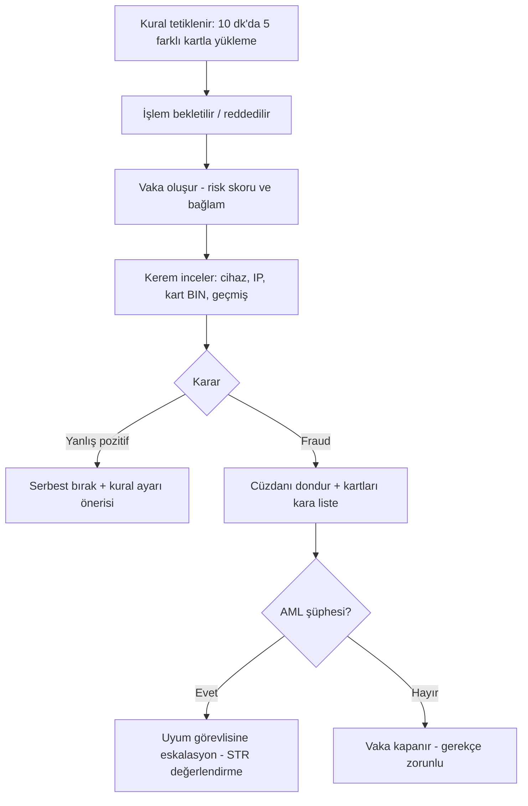

---

## 4. Yolculuk → Gereksinim İzlenebilirliği

| Yolculuk | İlgili FR (örnek) | Milestone |
|---|---|---|
| J-01 | FR-011, FR-012, FR-019, FR-020, FR-045, FR-046, FR-055, FR-154 | M1–M4 |
| J-02 | FR-055, FR-058, FR-060, FR-061, FR-067, FR-071, FR-072 | M3 |
| J-03 | FR-062, FR-063, FR-064, FR-065 | M3 |
| J-04 | FR-062, FR-066, FR-075, FR-034 | M3 (pre-auth), M5 (LPR tam entegrasyon) |
| J-05 | FR-031, FR-032, FR-035, FR-159 | M5 |
| J-06 | FR-033, FR-053, FR-143 | M5 |
| J-07 | FR-001–FR-010, FR-148 | M1 |
| J-08 | FR-108–FR-114, FR-115–FR-121 | M7 (temel rapor M4) |
| J-09 | FR-058, FR-059, FR-144, FR-145 | M3–M4 |
| J-10 | FR-129–FR-135 | M4 |
| J-11 | FR-073, FR-074, FR-163–FR-168 | M3 |
| J-12 | FR-092–FR-099, FR-100–FR-107 | M6 |

---

## 5. Doğrulama Planı (UX Research)

| Aktivite | Katılımcı | Zaman | Çıktı |
|---|---|---|---|
| Kasa gözlemi (contextual inquiry) — sabah yoğunluğu | Pilot kahve zinciri, 2 mağaza | Sprint 1 | Kasiyer akış haritası, zaman ölçümleri |
| Derinlemesine görüşme — son müşteri | 8 müşteri (sadakat üyesi / üye olmayan) | Sprint 1–2 | Persona P-01 güncellemesi |
| Görüşme — finans & denetim | Pilot finans ekibi + iç denetim | Sprint 2 | Rapor gereksinimleri, delil paketi formatı |
| Tıklanabilir prototip testi — mobil | 6–8 katılımcı (erişilebilirlik ihtiyacı olan 2 kişi dahil) | Sprint 3 | SUS ≥ 80 hedefi, bulgu listesi |
| Web POS kullanılabilirlik testi | 5 kasiyer, gerçek kasa simülasyonu | Sprint 5 | Görev süresi ≤ 5 sn (QR ödeme) |
| Pilot sonrası anket | Pilot kullanıcılar | M4 + 4 hafta | CSAT, NPS, iyileştirme backlog'u |
