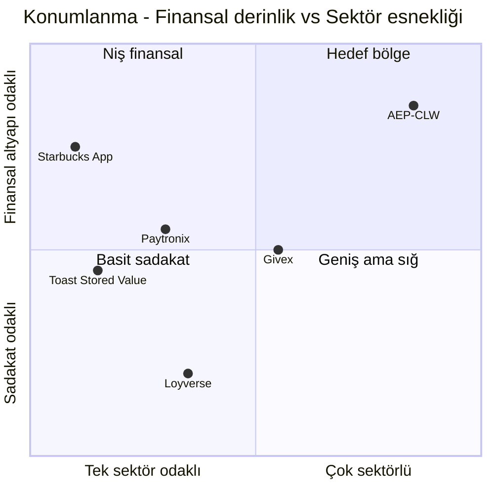

# AEP-CLW — Ürün Vizyonu

| Alan | Değer |
|---|---|
| Doküman | Ürün Vizyonu (Product Vision) |
| Sahibi | Product Owner (`PO`) |
| Katkı | Business Analyst ×2 (`BA`), UX Research (`UX`) |
| Sürüm | v1.0 — Sprint 0 / Inception |
| Durum | Onay bekliyor |
| Bağlı dokümanlar | [Proje Tüzüğü](../00-project-charter.md) · [Personalar](personas-and-journeys.md) · [Gereksinimler](requirements.md) · [MVP Kapsamı](mvp-scope.md) · [Yol Haritası](roadmap.md) |

---

## 1. Vizyon Cümlesi

> **Kendi müşterisiyle doğrudan finansal ilişki kurmak isteyen her marka için; kendi logosuyla, dakikalar
> içinde açılabilen, bankacılık seviyesinde denetlenebilir ve regülasyona uyumlu bir kapalı devre cüzdan
> altyapısı.**

**Elevator pitch (Geoffrey Moore formatı):**
Müşterilerinden ön ödeme toplayarak sadakat ve nakit akışı yaratmak isteyen **çok şubeli markalar**
(kahve zincirleri, EV şarj operatörleri, otopark işletmecileri, eğlence parkları, kampüsler) için,
**AEP-CLW** bir **multitenant SaaS kapalı devre cüzdan platformudur**; markanın kendi uygulamasında
ön ödemeli bakiye, pre-auth tabanlı ödeme, sadakat ve hediye kartını tek bir **çift kayıtlı defter**
üzerinde sunar. Kendi cüzdanını sıfırdan yazan veya yalnızca sadakat odaklı çözümler kullanan
markaların aksine, AEP-CLW **finansal doğruluk, denetlenebilirlik ve sektöre özel ödeme akışlarını
(pre-auth/capture, plaka/QR, bileklik)** kutudan çıktığı gibi sunar.

---

## 2. Problem Tanımı

### 2.1 Markanın (Tenant) Problemleri

| # | Problem | Bugünkü durum | Sonuç |
|---|---|---|---|
| P1 | **Kart işlem maliyeti** | Küçük sepetli (80–250 TL) işlemlerde her işlemde MDR + sabit ücret ödeniyor | Kahve gibi düşük sepetli sektörlerde marjın %2–3'ü ödeme maliyetine gidiyor |
| P2 | **Müşteri verisine sahip olamama** | Banka/kart şemaları müşteriyi tanır, marka tanımaz | Kişiselleştirilmiş kampanya, CLV ölçümü ve yeniden etkileşim yapılamıyor |
| P3 | **Kendi cüzdanını kurmanın maliyeti ve riski** | In-house geliştirme 12–24 ay, ledger/mutabakat/uyum uzmanlığı gerektirir | Bakiye tutarsızlıkları, denetim bulguları, regülasyon riski |
| P4 | **Sektöre özgü ödeme akışları** | EV şarj ve otoparkta tutar işlem sonunda belli olur; standart POS akışı uymaz | Manuel tahsilat, kaçak kullanım, tahsil edilemeyen alacak |
| P5 | **Parçalı sistemler** | Sadakat bir tedarikçide, hediye kartı başka birinde, ödeme PSP'de | Tek müşteri görünümü yok, mutabakat Excel'de yapılıyor |
| P6 | **Finansal raporlama ve breakage** | Kullanılmayan bakiye (breakage) ve ertelenmiş gelir doğru hesaplanamıyor | Muhasebe ve vergi uyumsuzlukları, denetim riski |
| P7 | **Uyum yükü** | 6493, MASAK, KVKK/GDPR gereksinimleri belirsiz; limit ve KYC yönetimi elle yapılıyor | Yaptırım riski, ölçeklenememe |

### 2.2 Son Müşterinin Problemleri

- Kasada kart/temassız işlemin yavaş olması, sıra bekleme (özellikle sabah kahve yoğunluğu).
- Otopark/şarj istasyonunda çıkışta ödeme sürtünmesi, bariyerde bekleme.
- Eğlence parkında çocukların nakit/kart taşıması riski; ebeveynin harcamayı kontrol edememesi.
- Kazanılan puan ve kampanyaların görünür olmaması, karmaşık kullanım kuralları.
- Kampüste yemek bursu/kurumsal yüklemenin fiziksel kartlarla yönetilmesi, kayıp kart = kayıp bakiye.

### 2.3 Neden Şimdi?

1. **Mobil öncelikli tüketim**: QR ile ödeme alışkanlığı pandemi sonrası kalıcılaştı.
2. **EV pazarının büyümesi**: Türkiye ve MENA'da hızla artan şarj istasyonu sayısı; operatörler kendi
   kapalı ağlarında sadakat ve ön ödeme ile müşteri tutmak istiyor.
3. **Faiz ortamı ve float değeri**: Ön ödemeli bakiye (float), markaya ciddi bir işletme sermayesi sağlar.
4. **Regülasyonun netleşmesi**: Kapalı devre (sınırlı ağ) istisnaları ile lisanslı e-para arasındaki
   çizginin bilinmesi, uyumlu bir altyapıyı rekabet avantajına dönüştürüyor.
5. **Bulut-yerel olgunluk**: OpenShift, Kafka, Keycloak gibi olgun bileşenlerle bankacılık seviyesinde
   bir platformun SaaS olarak işletilmesi ekonomik hale geldi.

> **Regülasyon notu (Uyum görevlisi `CMP` ile doğrulanacak):** AEP-CLW varsayılan olarak **sınırlı ağ /
> kapalı devre** modelinde çalışır: bakiye yalnızca ilgili tenant'ın kendi işyeri ağında harcanabilir,
> nakde çevrilemez (iade kuralları hariç), P2P transfer MVP'de kapalıdır. Tenant'ın ölçeği veya kullanım
> modeli sınırlı ağ istisnasını aşarsa lisanslı bir ödeme/e-para kuruluşu ile iş birliği modeli devreye
> girer. Bu sınır, ürün tasarımında **konfigürasyonla açılıp kapanan** özellik bayraklarıyla korunur.

---

## 3. Hedef Pazar

### 3.1 Segmentasyon

| Segment | Tipik profil | Şube / nokta sayısı | Aylık aktif müşteri | Öncelik |
|---|---|---|---|---|
| **Kahve & QSR zincirleri** | Ulusal/bölgesel kahve, fırın, hızlı servis | 20–1.500 | 50K–2M | **Birincil (pilot)** |
| **EV şarj operatörleri (CPO)** | Kendi istasyon ağını işleten operatörler | 50–5.000 soket | 10K–500K | Birincil |
| **Otopark işletmecileri** | AVM, havalimanı, belediye, özel otopark zincirleri | 10–300 lokasyon | 20K–1M | İkincil |
| **Eğlence / tema / oyun parkları** | Tema parkı, aquapark, AVM oyun alanları, FEC | 1–100 | 5K–300K | İkincil |
| **Kampüs & kurumsal yemekhane** | Üniversite, hastane, kurumsal kampüs, catering | 1–50 kafeterya | 2K–100K | İkincil |
| Stadyum, festival, fuar (fırsatçı) | Etkinlik bazlı kapalı devre ödeme | Etkinlik bazlı | Dalgalı | Üçüncül |

### 3.2 Coğrafya

1. **Faz 1 — Türkiye** (TRY, TR dili, KVKK, 6493/MASAK).
2. **Faz 2 — Körfez / MENA** (AED, SAR; AR dili RTL; yerel veri yerleşimi gereksinimleri).
3. **Faz 3 — AB** (EUR; GDPR, PSD2 sınırlı ağ istisnası değerlendirmesi).

### 3.3 Pazar Büyüklüğü Yaklaşımı (TAM / SAM / SOM)

Sayısal değerler Sprint 0 sonunda pazar araştırması ile doldurulacaktır; yaklaşım:

- **TAM**: Hedef sektörlerde ön ödemeli/stored-value hacmi × platform take-rate + SaaS abonelik geliri.
- **SAM**: Türkiye + MENA'da 20+ noktası olan ve dijital kanal yatırımı yapan markalar.
- **SOM (3 yıl)**: 25–40 tenant, 1,5M+ aylık aktif cüzdan hedefi.

---

## 4. Sektör Bazlı Değer Önerileri

### 4.1 Kahve Zinciri (Starbucks / Caffè Nero tipi)

| Boyut | Değer önerisi |
|---|---|
| **Ana mekanik** | Ön ödemeli dijital kart (stored value) + **yıldız** tabanlı sadakat (her X TL = 1 yıldız; N yıldız = ücretsiz ürün) + seviye (Green/Gold benzeri tier) |
| **Ödeme deneyimi** | Uygulamada dinamik müşteri QR'ı (60 sn geçerli), kasada < 2 sn onay; "Order ahead" entegrasyonu için API |
| **Yükleme** | Kayıtlı kart ile tek dokunuş yükleme, bakiye X TL altına düşünce **otomatik yükleme** |
| **Marka için kazanım** | Kart MDR maliyetinde düşüş (bir yükleme = çok sayıda kahve), float, müşteri verisi, ziyaret sıklığı artışı |
| **Müşteri için kazanım** | Hızlı ödeme, yıldız/hediye içecek, doğum günü ödülü, kişisel kampanya |
| **Kritik KPI** | Cüzdanla ödenen işlem payı, ziyaret sıklığı, ortalama yükleme tutarı, breakage oranı |

### 4.2 EV Şarj (Kapalı ağ, roaming yok)

| Boyut | Değer önerisi |
|---|---|
| **Ana mekanik** | Şarj başlangıcında **pre-auth hold** (ör. 300 TL), şarj bitince **gerçek kWh × tarife** kadar **capture**, farkın anında serbest bırakılması |
| **Kapsam sınırı** | Yalnızca operatörün kendi istasyon ağı (OCPI/roaming **kapsam dışı**); CSMS/OCPP backend ile entegrasyon REST/webhook üzerinden |
| **Tarife** | kWh bazlı, zaman dilimi (peak/off-peak), dakika bazlı işgal (idle fee) desteği — tutarı CSMS hesaplar, AEP-CLW capture eder |
| **Marka için kazanım** | Tahsil edilemeyen şarj riskinin sıfırlanması, abonelik/paket (ör. aylık 200 kWh) satışı, müşteri bağlılığı |
| **Müşteri için kazanım** | Kart okutmadan uygulamadan şarj başlatma, şeffaf fatura, sadakat kWh bonusu |
| **Kritik KPI** | Hold → capture dönüşüm oranı, ortalama hold serbest bırakma süresi, oturum başı gelir |

### 4.3 Otopark

| Boyut | Değer önerisi |
|---|---|
| **Ana mekanik** | **Plaka tanıma (ANPR/LPR)** veya QR ile giriş → giriş anında pre-auth veya "açık oturum"; çıkışta süre bazlı tarife ile capture; bariyer açma sinyali |
| **Abonelik** | Aylık/yıllık abonelik (ör. iş yeri abonmanı), abonelik ücretinin cüzdandan otomatik tahsili |
| **Çoklu araç** | Bir cüzdana birden fazla plaka bağlama, kurumsal filo cüzdanı (post-MVP) |
| **Marka için kazanım** | Çıkış kuyruğunun azalması, kasiyer maliyetinin düşmesi, kaçak çıkışların azalması |
| **Müşteri için kazanım** | Durmadan geçiş ("ticketless"), anlık süre/ücret görünürlüğü, AVM harcamasına bağlı indirim (validation) |
| **Kritik KPI** | Ortalama çıkış süresi, ticketless geçiş oranı, abonelik yenileme oranı |

### 4.4 Eğlence / Oyun Parkı

| Boyut | Değer önerisi |
|---|---|
| **Ana mekanik** | **NFC bileklik / kart** ile oyun, yiyecek-içecek, hediyelik ödemesi; bileklik cüzdana bağlanır |
| **Aile cüzdanı** | Ebeveyn **ana cüzdan** sahibi; çocuklar için **alt cüzdan** (sub-wallet) ile günlük harcama limiti, kategori kısıtı (ör. yalnızca oyun), anlık bildirim |
| **Kayıp bileklik** | Uygulamadan anında bloke + yeni bilekliğe bakiye transferi |
| **Gün sonu** | Kalan bakiye için iade/kalıcı bakiye seçeneği (tenant kuralı), sezonluk son kullanma |
| **Marka için kazanım** | Park içi harcamanın artması (nakitsiz sürtünmesiz ödeme), kuyrukların azalması, grup/okul satışları |
| **Kritik KPI** | Ziyaretçi başı harcama, bileklik aktivasyon oranı, alt cüzdan kullanım oranı |

### 4.5 Kampüs / Yemekhane

| Boyut | Değer önerisi |
|---|---|
| **Ana mekanik** | **Kurum yüklemeli yemek bakiyesi** (işveren/üniversite toplu yükleme), kişisel yükleme ayrı cüzdanda |
| **Kurallar** | Yemek bakiyesi yalnızca yemekhane MCC/kategorisinde, günlük öğün limiti, ay sonu sıfırlama veya devretme kuralı |
| **Kimlik** | Personel/öğrenci numarası ile toplu müşteri aktarımı (CSV/API), kampüs kartı (NFC) bağlama |
| **Marka için kazanım** | Fiziksel kart ve kupon maliyetinin kalkması, gerçek zamanlı yemek sayımı, sübvansiyon raporu |
| **Müşteri için kazanım** | Telefonla ödeme, bakiye görünürlüğü, menü ve kampanya bildirimi |
| **Kritik KPI** | Kurumsal yükleme kullanım oranı, öğün başı işlem süresi, sübvansiyon mutabakat doğruluğu |

---

## 5. SaaS İş Modeli

### 5.1 Gelir Kalemleri

1. **Platform aboneliği** (aylık, plan katmanına göre).
2. **İşlem başı ücret** (ödeme/capture işlemi başına; yükleme işleminde PSP maliyeti ayrıca yansıtılır).
3. **Aktif cüzdan aşım ücreti** (plan kapsamını aşan aylık aktif cüzdan başına).
4. **Tek seferlik kurulum** (white-label mobil yayın, entegrasyon, veri göçü).
5. **Katma değerli modüller** (gelişmiş risk/AML, ERP adaptörü, dedicated DB, özel SLA).
6. **Float geliri paylaşımı** — yalnızca regülasyonun ve sözleşmenin izin verdiği modelde; varsayılan olarak **kapalı**.

### 5.2 Plan Katmanları

| Özellik | **Starter** | **Growth** | **Enterprise** |
|---|---|---|---|
| Hedef | Tek marka, < 20 nokta, pilot | Bölgesel/ulusal zincir | Ulusal/uluslararası, çok markalı grup |
| Aylık abonelik (gösterge) | Düşük sabit ücret | Orta sabit ücret | Sözleşmeye bağlı |
| Dahil aylık aktif cüzdan | 5.000 | 50.000 | 500.000+ (sınırsız opsiyon) |
| İşlem başı ücret (gösterge) | En yüksek birim | Kademeli indirim | Hacim bazlı özel fiyat |
| Mağaza / terminal | 20 / 60 | 300 / 1.000 | Sınırsız |
| Cüzdan tipleri | Ana + Bonus | + Hediye, alt cüzdan | + Kurumsal/sponsor cüzdan, çoklu para birimi |
| Ödeme yöntemleri | Müşteri QR | + İşyeri QR, pre-auth | + NFC/HCE, bileklik, LPR entegrasyonu |
| Sadakat & kampanya | Temel yıldız/puan | Kural motoru, tier, kupon | + Segment bazlı gerçek zamanlı kampanya |
| Hediye kartı | – | Dijital | Dijital + fiziksel + B2B toplu |
| Risk & AML | Temel limit/velocity | + Kural motoru, vaka yönetimi | + Gelişmiş skor, özel kural, AML izleme |
| Takas & muhasebe | CSV export | GL export, mutabakat | ERP adaptörleri, e-Fatura, breakage motoru |
| White-label mobil | Paylaşılan tema şablonu | Kendi mağaza yayını | Kendi mağaza yayını + özel akışlar |
| Veri izolasyonu | Paylaşılan DB + RLS | Paylaşılan DB + RLS | **Dedicated DB** opsiyonu |
| SLA | %99,5 | %99,9 | %99,95 + özel destek |
| Destek | E-posta, iş saatleri | 7/24 kritik olay | 7/24 + TAM (Technical Account Manager) |

> Fiyat noktaları Sprint 2 sonunda ticari ekip ile netleşecek; bu tablo **yetenek paketlemesini**
> tanımlar. Plan yetenekleri teknik olarak **feature flag + kota** ile uygulanır (bkz. FR-006, FR-007).

### 5.3 Birim Ekonomisi Varsayımları (doğrulanacak)

- Tenant başına brüt kâr marjı hedefi: **≥ %70** (altyapı + PSP pass-through hariç).
- Tenant edinme maliyeti geri dönüşü (CAC payback): **≤ 12 ay**.
- Net gelir tutma (NRR): **≥ %115** (aktif cüzdan büyümesi + modül satışı).

---

## 6. Rekabet Analizi

> Genel, kamuya açık bilgi seviyesinde bir değerlendirmedir; özellik detayları rakip sürümlerine göre
> değişebilir ve ticari kararlarda güncel teyit gerektirir.

| Rakip / Alternatif | Konumlanma | Güçlü yönler | Zayıf yönler (AEP-CLW fırsatı) |
|---|---|---|---|
| **Starbucks App** (in-house) | Tek markanın kendi kapalı devre cüzdanı; sektörün referans modeli | Olgun stored value + yıldız modeli, yüksek benimseme, order-ahead | Satılık değil; diğer markalar için ancak yüksek maliyetli in-house geliştirme ile taklit edilebilir |
| **Loyverse** | Küçük işletmeler için POS + temel sadakat | Düşük maliyet, kolay kurulum | Kurumsal ölçek, stored value ledger, uyum ve mutabakat derinliği sınırlı |
| **Paytronix** | Restoran/c-store için sadakat, hediye kartı, stored value | Olgun sadakat ve hediye kartı, ABD restoran pazarında güçlü | ABD odaklı; TR/MENA regülasyonu, TRY, yerel PSP ve e-Fatura desteği yok; EV/otopark akışları odakta değil |
| **Givex** | Hediye kartı, sadakat, POS; küresel | Güçlü hediye kartı ağı, çok ülkeli operasyon | Pre-auth tabanlı EV/otopark senaryoları ve modern white-label mobil deneyimi sınırlı; yerelleşme maliyeti |
| **Toast Stored Value / Gift** | Toast POS ekosistemine bağlı stored value | POS ile sıkı entegrasyon | POS'a kilitli (vendor lock-in), restoran dışı sektörlere uygun değil, bölgede yok |
| **Yerel e-para kuruluşları / banka cüzdanları** | Açık devre cüzdan | Geniş kabul ağı, lisans | Marka sahipliği yok, müşteri verisi markada değil, sadakat entegrasyonu zayıf |
| **In-house geliştirme** | Büyük markaların kendi ekibi | Tam kontrol | 12–24 ay, ledger/mutabakat/uyum uzmanlığı eksikliği, yüksek TCO |

### 6.1 Farklılaştırıcılar (Moat)

1. **Bankacılık seviyesinde çift kayıtlı ledger** + hash-zincirli audit log → denetçi dostu.
2. **Sektöre özel ödeme akışları** hazır: pre-auth/capture (EV, otopark), aile/alt cüzdan (eğlence),
   kurum yüklemeli kısıtlı bakiye (kampüs).
3. **Tek platformda** cüzdan + sadakat + hediye kartı + takas + muhasebe → tek müşteri ve tek mutabakat görünümü.
4. **Yerel uyum**: 6493/MASAK/KVKK, e-Fatura/e-Arşiv, TR ERP'leri (Logo, Netsis) ve SAP.
5. **White-label hız**: yeni tenant için konfigürasyonla < 2 hafta canlıya çıkış hedefi (mobil mağaza onay süreleri hariç).
6. **Sektör presetleri**: onboarding'de "Kahve / EV / Otopark / Eğlence / Kampüs" şablonu (bkz. [sector-configurations.md](sector-configurations.md)).

### 6.2 Konumlanma Haritası

---

## 7. Başarı Ölçütleri (KPI)

### 7.1 North Star Metric

> **Aylık aktif cüzdan başına yüklenen bakiye (Monthly Top-up per Active Wallet — MTAW)**
>
> `MTAW = Ay içinde yüklenen toplam net bakiye (TRY) / Ay içinde en az 1 finansal işlem yapan cüzdan sayısı`

**Neden bu metrik?** Hem müşteri değerini (cüzdanı gerçekten kullanıyor), hem tenant değerini (float +
azalan kart maliyeti), hem de platform gelirini (işlem hacmi) tek ölçüde birleştirir. Yalnızca aktif
cüzdan sayısı "boş kayıtları", yalnızca hacim ise "birkaç büyük müşteriyi" ödüllendirir.

- Hesaplamadan hariç: iadeler, iptal edilen yüklemeler, bonus/promosyon yüklemeleri (yalnızca **ana cüzdana gerçek para yüklemesi**).
- Tenant, sektör ve kohort bazında raporlanır (FR-124).

### 7.2 Destekleyici KPI Ağacı

| Katman | KPI | Tanım | Hedef (pilot, 3. ay) |
|---|---|---|---|
| **Benimseme** | Aylık aktif cüzdan (MAW) | Ayda ≥1 finansal işlem yapan cüzdan | Pilot tenant'ın sadakat üyelerinin %25'i |
| | Kayıt → ilk yükleme dönüşümü | İlk 7 günde yükleme yapan yeni kayıt oranı | ≥ %40 |
| **Kullanım** | Cüzdan ödeme payı | Tenant işlemlerinde cüzdanla ödenen işlem oranı | ≥ %15 |
| | Otomatik yükleme benimseme | Aktif cüzdanlarda otomatik yükleme açık olan oran | ≥ %10 |
| | Pre-auth capture başarı oranı | Capture edilen hold / açılan hold | ≥ %98 |
| **Değer** | Ortalama yükleme tutarı | Yükleme başı net tutar | Tenant hedefine göre |
| | Breakage oranı | Süresi dolan/kullanılmayan bakiye / toplam yükleme | İzleme metriği (hedef değil) |
| **Kalite** | Ödeme başarı oranı | Başarılı ödeme / toplam deneme (iş kaynaklı reddedilenler hariç) | ≥ %99,5 |
| | QR ödeme uçtan uca süre | Kasiyer okutma → onay (p95) | ≤ 1,5 sn |
| | Ledger mutabakat farkı | Ledger bakiye toplamı − cüzdan görünüm toplamı | **0** (sıfır tolerans) |
| **Güven** | Fraud kayıp oranı | Fraud kaynaklı kayıp / işlem hacmi | ≤ 5 bps |
| | Müşteri memnuniyeti | Uygulama mağazası puanı / CSAT | ≥ 4,5 / ≥ %85 |
| **Platform** | Tenant canlıya geçiş süresi | Sözleşme → ilk canlı işlem | ≤ 4 hafta (MVP), ≤ 2 hafta (GA) |
| | Kullanılabilirlik | Ödeme yolu aylık uptime | ≥ %99,9 |

### 7.3 Anti-metrikler (bozulmaması gerekenler)

- Kasadaki ortalama işlem süresi **artmamalı**.
- Destek talebi / 1.000 aktif cüzdan **artmamalı**.
- Chargeback oranı (yükleme kartlarında) **≤ %0,1**.

---

## 8. Ürün İlkeleri

1. **Para asla kaybolmaz**: Her kuruş çift kayıtlı ledger'da izlenebilir; bakiye türetilir, elle düzeltilmez (düzeltme = ters kayıt + maker-checker).
2. **Idempotent her şey**: Tekrarlanan istek çift tahsilat yaratamaz.
3. **Tenant'ın markası önde**: Son müşteri AEP-CLW'yi görmez.
4. **Konfigürasyon > kod**: Sektör farkları preset ve kural ile çözülür, tenant'a özel kod dalı açılmaz.
5. **Denetlenebilirlik tasarımdan gelir**: Her yetkili işlem kim/ne/ne zaman/nereden bilgisiyle hash-zincirli loglanır.
6. **Erişilebilir ve kapsayıcı**: WCAG 2.2 AA, TR/EN/AR (RTL).
7. **Önce güvenlik ve uyum**: Kart verisi tutulmaz, KYC seviyesi limitleri belirler.

---

## 9. Kapsam Dışı (Ürün Vizyonu Seviyesinde)

- Açık devre (open-loop) kart çıkarımı, fiziksel banka kartı basımı.
- Tenant'lar arası bakiye kullanımı (koalisyon sadakati) — Enterprise yol haritasında değerlendirilecek.
- EV roaming (OCPI/Hubject vb.) ve üçüncü taraf şarj ağlarında kullanım.
- Kripto varlık, kredi/BNPL ürünleri.
- POS donanımı üretimi (yalnızca yazılım entegrasyonu ve Web POS).

---

## 10. Açık Sorular

| # | Soru | Sahibi | Hedef tarih |
|---|---|---|---|
| Q1 | Pilot tenant'ın sınırlı ağ istisnası kapsamında kalacağı hukuki görüşle teyit edildi mi? | `CMP` | Sprint 1 sonu |
| Q2 | Pilot PSP seçimi (3DS, tokenizasyon, pre-auth desteği) | `SA` + `PO` | Sprint 1 |
| Q3 | Fiyatlandırma noktaları ve işlem başı ücret bantları | `PO` + Ticari | Sprint 2 |
| Q4 | Pilot tenant POS sağlayıcısının API entegrasyon kabiliyeti | `BA` | Sprint 2 |
| Q5 | MENA fazı için veri yerleşimi (data residency) gereksinimleri | `CMP` + `CA` | M6 öncesi |
