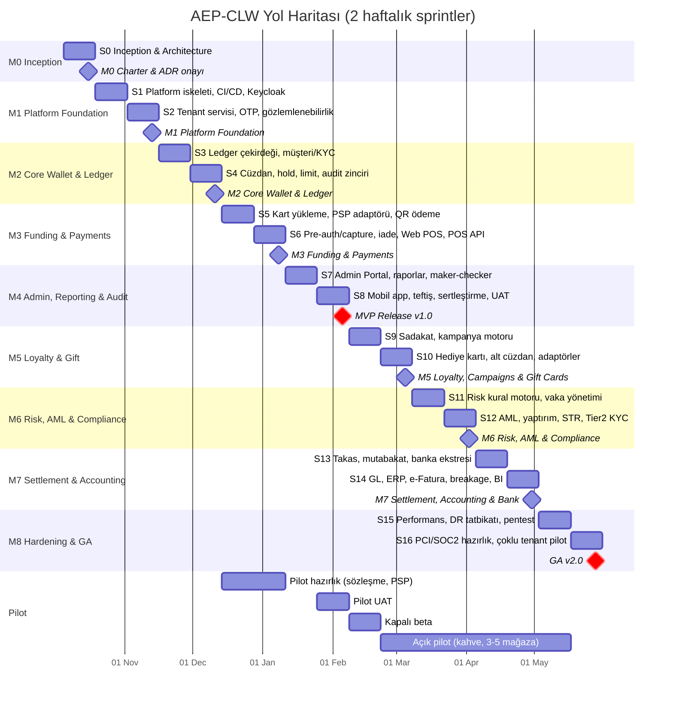

# AEP-CLW — Yol Haritası (Roadmap)

| Alan | Değer |
|---|---|
| Doküman | Ürün ve Teslimat Yol Haritası |
| Sahibi | Delivery Manager (`DM`) + Product Owner (`PO`) |
| Sürüm | v1.0 — Sprint 0 |
| Başlangıç | **2026-10-05** (Sprint 0) |
| Sprint uzunluğu | 2 hafta (Pazartesi → ikinci haftanın Cuma günü; Review + onay kapısı son gün) |
| MVP v1.0 | **2027-02-05** (Sprint 8 sonu, M4) |
| GA v2.0 | **2027-05-28** (Sprint 16 sonu, M8) |

---

## 1. Özet Zaman Çizelgesi

---

## 2. Sprint Planı

| Sprint | Tarih | MS | Sprint hedefi | Ana FR / çıktı | Demo (Review) |
|---|---|---|---|---|---|
| **S0** | 2026-10-05 → 2026-10-16 | M0 | Inception: charter, vizyon, gereksinim, mimari, ADR, backlog, ortam hazırlığı | Bu doküman seti; ADR-001…; tehdit modeli v0; kontrol matrisi v0 | Mimari walkthrough, tıklanabilir prototip v0 |
| **S1** | 2026-10-19 → 2026-10-30 | M1 | "Walking skeleton": gateway → servis → DB → Kafka uçtan uca, CI/CD → OpenShift dev | FR-015, FR-010 (RLS temeli), NFR-016, NFR-021, NFR-023 | Pipeline'dan dev'e otomatik deploy, trace görünümü |
| **S2** | 2026-11-02 → 2026-11-13 | M1 | Tenant servisi ve müşteri kimliği | FR-001–FR-007, FR-011, FR-012, FR-014, FR-018; gözlemlenebilirlik yığını | Tenant oluştur → OTP ile müşteri kaydı |
| **S3** | 2026-11-16 → 2026-11-27 | M2 | Ledger çekirdeği ve müşteri/KYC | FR-037–FR-040, FR-019–FR-021, FR-023, FR-106 | Dengeli posting, idempotency, Tier geçişi |
| **S4** | 2026-11-30 → 2026-12-11 | M2 | Cüzdan, hold, limitler, audit zinciri | FR-027–FR-030, FR-034–FR-036, FR-041, FR-042, FR-017, FR-009, FR-136 | Hold → serbest bırakma, invariant kontrolü, hash-zincir |
| **S5** | 2026-12-14 → 2026-12-25 | M3 | Para yükleme ve QR ödeme | FR-045–FR-049, FR-056–FR-058, FR-061, FR-097, FR-098, FR-143, FR-144 | Kartla yükleme (mock + sandbox PSP) → QR ile ödeme |
| **S6** | 2026-12-28 → 2027-01-08 | M3 | Pre-auth/capture, iade/iptal, işyeri & POS | FR-050, FR-059, FR-060, FR-062, FR-063, FR-065, FR-071–FR-078, FR-008, FR-178–FR-183 | EV senaryosu (hold → kWh capture), Web POS, sandbox |
| **S7** | 2027-01-11 → 2027-01-22 | M4 | Tenant Admin Portal, raporlar, maker-checker | FR-128–FR-132, FR-137, FR-149–FR-155, FR-157, FR-044, FR-146, FR-147 | Portal üzerinden uçtan uca operasyon, onay kuyruğu |
| **S8** | 2027-01-25 → 2027-02-05 | M4 | Mobil app, teftiş, Platform Admin, sertleştirme, UAT → **MVP v1.0** | FR-165–FR-172, FR-013, FR-024, FR-138–FR-141, FR-158–FR-162 | Pilot UAT sonuçları, go-live kararı |
| **S9** | 2027-02-08 → 2027-02-19 | M5 | Sadakat ve kampanya motoru | FR-080–FR-089, FR-173 | Yıldız kazanımı, kampanya önizleme |
| **S10** | 2027-02-22 → 2027-03-05 | M5 | Hediye kartı, alt cüzdan, sektör adaptörleri | FR-090–FR-096, FR-031–FR-033, FR-053, FR-054, FR-064, FR-066–FR-068, FR-079, FR-016, FR-025, FR-145, FR-148, FR-156, FR-174–FR-177, FR-185 | Hediye kartı, aile cüzdanı, LPR/CSMS referans entegrasyonu |
| **S11** | 2027-03-08 → 2027-03-19 | M6 | Risk kural motoru ve vaka yönetimi | FR-099–FR-105 | Kural yayınla (shadow → aktif), vaka akışı |
| **S12** | 2027-03-22 → 2027-04-02 | M6 | AML, yaptırım, STR, Tier2, KVKK talepleri | FR-022, FR-026, FR-107–FR-111, FR-113 | Tarama eşleşmesi → STR taslağı |
| **S13** | 2027-04-05 → 2027-04-16 | M7 | Takas ve mutabakat | FR-114–FR-120, FR-051, FR-055 | PSP dosyası → otomatik eşleşme → istisna |
| **S14** | 2027-04-19 → 2027-04-30 | M7 | Muhasebe, ERP, e-Fatura, BI | FR-121–FR-127, FR-112, FR-133–FR-135, FR-163 | GL export, breakage raporu, BI panosu |
| **S15** | 2027-05-03 → 2027-05-14 | M8 | Performans, DR tatbikatı, pentest | NFR-003 (GA), NFR-012 (GA), NFR-013, NFR-020; FR-142 | Yük testi raporu, DR tatbikat raporu |
| **S16** | 2027-05-17 → 2027-05-28 | M8 | PCI/SOC2 hazırlık, çoklu tenant pilot → **GA v2.0** | FR-043, FR-052, FR-069, FR-164, FR-184; dedicated DB (FR-010) | 2. ve 3. tenant (EV + otopark/eğlence) canlı, GA kararı |

> **Takvim notları:** 29 Ekim (Cumhuriyet Bayramı, S1), yılbaşı (S6) ve 2027 Ramazan Bayramı (~9–11 Mart, S11)
> sprint kapasitesinden düşülür. S5–S6 yıl sonu izin dönemine denk geldiğinden kapasite planı %80 ile yapılır.

---

## 3. Milestone Detayları

### M0 — Inception & Architecture (Sprint 0)

| Başlık | İçerik |
|---|---|
| **Hedef** | Ortak anlayış, onaylı kapsam ve mimari; Sprint 1'in "ready" backlog'u. |
| **Çıktılar** | Proje tüzüğü; ürün doküman seti (bu dizin); mimari genel bakış, C4 diyagramları, ADR'ler (mikroservis, çok kiracılık, ledger modeli, outbox/CDC, kimlik); tehdit modeli v0; Audit (Kontrol) Matrisi v0; test stratejisi; çalışma anlaşması (DoR/DoD); GitHub Epic/Story yapısı; S1–S2 backlog'u (DoR karşılanmış). |
| **Çıkış kriterleri** | Tüzük ve vizyon onaylı; en az 5 ADR kabul edildi; S1 backlog'u tahminli; ortam erişimleri (OpenShift dev, GitHub, registry) hazır; pilot tenant LOI görüşmesi başladı. |
| **Bağımlılıklar** | Paydaş erişimi, OpenShift kümesi tahsisi, bulut/DC ağ onayları. |
| **Riskler** | Kapsam genişlemesi (R-01), altyapı tahsis gecikmesi (R-06). |

### M1 — Platform Foundation (S1–S2)

| Başlık | İçerik |
|---|---|
| **Hedef** | Üzerine iş fonksiyonlarının güvenle inşa edileceği, gözlemlenebilir, çok kiracılı platform temeli. |
| **Çıktılar** | API gateway (JWT, tenant çözümleme, rate limit); Keycloak realm + organizasyon modeli; tenant-service (onboarding, konfigürasyon, flag, plan, tema); identity-service (OTP, cihaz bağlama, oturum); CI/CD (build, test, SAST, SCA, imaj tarama, SBOM, imza) → ArgoCD → OpenShift dev/test; gözlemlenebilirlik yığını (OTel, Prometheus, Grafana, Loki, Tempo, Alertmanager); servis şablonu (hexagonal, ArchUnit kuralları). |
| **Çıkış kriterleri** | M1 Must FR'leri `Accepted`; çapraz-tenant izolasyon testi CI'da zorunlu; her servis trace/metrik/log üretir; ana dala merge → dev deploy ≤ 15 dk; güvenlik kapıları kırıcı modda. |
| **Bağımlılıklar** | SMS sağlayıcı sözleşmesi (OTP); Vault ve Kafka (Strimzi) kurulumu; Keycloak sürüm kararı (ADR). |
| **Riskler** | Keycloak organizasyon modeli kısıtları (R-11); SMS teslim oranı (R-14); platform ekibinin ortam kurulumu ile özellik geliştirmeyi paralel yürütmesi. |

### M2 — Core Wallet & Ledger (S3–S4)

| Başlık | İçerik |
|---|---|
| **Hedef** | Finansal doğruluğun kalbi: çift kayıtlı ledger ve cüzdan modeli. |
| **Çıktılar** | ledger-service (journal, hesap planı, point-in-time bakiye, idempotent posting, ters kayıt, invariant kontrolü); wallet-service (MAIN/BONUS, hold, dondurma, limit); customer-service (profil, KVKK onay, Tier0/1, durum); regülasyon limit tabloları; audit-service çekirdeği (hash-zincir); olay sözleşmeleri (AsyncAPI) v1. |
| **Çıkış kriterleri** | Property-based testlerle 1M işlemde invariant ihlali 0; eşzamanlı çift istek testinde çift kayıt 0; ledger mutasyon skoru ≥ %75; hold süre dolumu otomatik; audit zinciri doğrulanabilir. |
| **Bağımlılıklar** | M1 platformu; `CMP`'den KYC limit tablosu; `SA` ledger modeli ADR'si. |
| **Riskler** | Ledger performansı ve kilit çekişmesi (hot account) (R-04); veri modeli değişikliklerinin geç fark edilmesi (R-02). |

### M3 — Funding & Payments (S5–S6)

| Başlık | İçerik |
|---|---|
| **Hedef** | Gerçek parayı içeri almak ve mağazada harcatmak. |
| **Çıktılar** | funding-service (3DS kart yükleme, PSP adaptörü + mock, kayıtlı kart, otomatik yükleme, yükleme iadesi); payment-service (QR token, sale, void, refund, pre-auth, capture, hold iptali, sagalar); merchant-service (hiyerarşi, terminal, kasiyer); Web POS; POS REST API + webhook; geliştirici portalı + sandbox; temel limit/velocity; push/e-posta bildirim. |
| **Çıkış kriterleri** | Uçtan uca: yükle → öde → iade; hold → kısmi capture → serbest bırakma; PSP sandbox ile gerçek 3DS akışı; ödeme p95 ≤ 300 ms (100 TPS ara hedef); Pact contract testleri yeşil; mock PSP'de hata/timeout senaryoları telafi ediliyor. |
| **Bağımlılıklar** | **PSP seçimi ve sandbox erişimi (S4 sonuna kadar kritik)**; APNs/FCM hesapları; pilot POS sağlayıcısının API kabiliyeti. |
| **Riskler** | PSP entegrasyon gecikmesi (R-03); QR token güvenliği (R-09); yıl sonu kapasite düşüşü (R-19). |

### M4 — Admin Portal, Reporting & Audit → **MVP Release v1.0** (S7–S8)

| Başlık | İçerik |
|---|---|
| **Hedef** | Tenant'ın platformu kendi başına işletebilmesi, denetçinin güvenebilmesi ve müşterinin mobil uygulamayla kullanabilmesi → pilot canlıya geçiş. |
| **Çıktılar** | Tenant Admin Portal (dashboard, Müşteri 360, işlemler, işyeri/mağaza/terminal, kullanıcı-rol, maker-checker, konfigürasyon, destek); temel raporlar + CSV; teftiş ekranı, zincir doğrulama, delil paketi; Platform Admin (tenant konsolu, break-glass, sağlık); white-label mobil app (iOS/Android, 1 tema); runbook'lar; kullanım kılavuzları; MVP release notları. |
| **Çıkış kriterleri** | [mvp-scope.md §4.1](mvp-scope.md) R1–R11 karşılandı; pilot UAT onayı; 300 TPS yük testi; güvenlik kapısı temiz; mobil uygulama mağaza incelemesine gönderildi/onaylandı; go-live kararı (PO + DM + SEC + CMP + AUD). |
| **Bağımlılıklar** | Apple/Google geliştirici hesapları (pilot tenant adına); pilot tenant tema ve metinleri; KVKK metinlerinin hukuk onayı. |
| **Riskler** | Mobil mağaza onay gecikmesi (R-10); UAT'ta kapsam talepleri (R-01); erişilebilirlik bulgularının geç çıkması (R-17). |

### M5 — Loyalty, Campaigns & Gift Cards (S9–S10)

| Başlık | İçerik |
|---|---|
| **Hedef** | Cüzdanı "neden kullanayım?" sorusunun cevabıyla güçlendirmek ve eğlence/kampüs/otopark sektörlerini açmak. |
| **Çıktılar** | loyalty-service (yıldız/puan, ödül, tier, kampanya kural motoru, kupon, cashback, segment, bütçe); voucher-service (dijital/fiziksel/B2B hediye kartı); alt/aile cüzdanı, kısıtlı yemek cüzdanı, sponsor toplu yükleme; NFC/bileklik; işyeri QR; abonelik; incremental auth; CSMS/LPR/turnike referans adaptörleri; mobil sadakat/hediye/plaka ekranları. |
| **Çıkış kriterleri** | Pilot tenant'ın yıldız programı AEP-CLW'ye taşınmış (göç planı onaylı); kampanya bütçe aşımı testi; hediye kartı brute-force koruması; en az 1 EV veya otopark tasarım ortağıyla sandbox uçtan uca demo. |
| **Bağımlılıklar** | Pilot'un mevcut sadakat verisinin göç formatı; CSMS/LPR sağlayıcılarının sandbox erişimi. |
| **Riskler** | Sadakat veri göçü (R-15); kampanya suistimali (R-13). |

### M6 — Risk, AML & Compliance (S11–S12)

| Başlık | İçerik |
|---|---|
| **Hedef** | Ölçeklenebilir fraud önleme ve regülasyona tam uyum. |
| **Çıktılar** | risk-service (kural motoru, skor, cihaz parmak izi, listeler, vaka, shadow mode, promosyon suistimali); compliance-service (yaptırım/PEP, AML senaryoları, STR iş akışı, sınırlı ağ eşik izleme, saklama/imha); Tier2 eKYC; KVKK veri sahibi talepleri. |
| **Çıkış kriterleri** | Kural değişikliği deploy'suz ≤ 60 sn yayında; risk kontrolü ek gecikme ≤ 20 ms (p95); tarama listesi güncelleme süreci test edildi; `CMP` uyum değerlendirmesi olumlu. |
| **Bağımlılıklar** | Yaptırım listesi sağlayıcısı; eKYC sağlayıcısı; hukuk görüşü (STR süreci). |
| **Riskler** | Regülasyon değişikliği (R-07); yanlış pozitif oranı yüksek kurallar (R-13). |

### M7 — Settlement, Accounting & Bank Integrations (S13–S14)

| Başlık | İçerik |
|---|---|
| **Hedef** | Finans ekibinin manuel işini ortadan kaldırmak: otomatik mutabakat ve muhasebe entegrasyonu. |
| **Çıktılar** | settlement-service (takas batch, PSP dosyası, otomatik eşleştirme, istisna, banka ekstresi MT940/camt.053, payout, sertifika); accounting-service (GL eşleme, yevmiye export, ERP adaptörü, e-Fatura/e-Arşiv, breakage, ertelenmiş gelir, dönem kilidi); havale/EFT yükleme; çoklu PSP; ClickHouse BI, planlı rapor, XLSX/PDF; platform faturalandırma; regülatör raporları. |
| **Çıkış kriterleri** | Pilot verisiyle 30 günlük geriye dönük mutabakat: otomatik eşleşme ≥ %99,5; GL export'u pilot finans tarafından kabul; e-Fatura test ortamı onayı. |
| **Bağımlılıklar** | Banka ekstre kanalı; ERP erişimi (pilot); özel entegratör (e-Fatura) sözleşmesi. |
| **Riskler** | Banka/ERP entegrasyon gecikmeleri (R-08); dosya formatı farklılıkları. |

### M8 — Production Hardening & GA v2.0 (S15–S16)

| Başlık | İçerik |
|---|---|
| **Hedef** | Çok tenant'lı ölçekte üretime tam hazırlık ve genel erişim (GA). |
| **Çıktılar** | GA performans hedefleri (2.000 TPS, burst 3×); DR tatbikatı (RPO/RTO kanıtı); harici pentest ve düzeltmeler; PCI DSS (SAQ A) ön değerlendirme ve SOC 2 Type I hazırlık kanıt seti; audit WORM arşivi; dedicated DB tenant modu; çoklu para birimi; SDK'lar; açık bankacılık; bölünmüş ödeme; tenant veri çıkış süreci; **çoklu tenant pilot** (EV + otopark veya eğlence). |
| **Çıkış kriterleri** | NFR GA hedefleri karşılandı; pentest kritik/yüksek bulgu 0 (açık kalanlar risk kabulü ile); DR tatbikatı RTO ≤ 1 saat; en az 3 tenant canlı (kahve + 2 farklı sektör); SLO %99,95 için 30 günlük hata bütçesi raporu; GA go/no-go kurulu onayı. |
| **Bağımlılıklar** | Pentest firması, QSA/denetim firması takvimi; ikinci DC/bölge kapasitesi. |
| **Riskler** | Pentest bulgularının düzeltme süresi (R-12); ikinci tenant'ların onboarding gecikmesi (R-20). |

---

## 4. Sürüm Stratejisi

| Sürüm | Zaman | İçerik | Hedef kitle |
|---|---|---|---|
| v0.x (iç) | Her sprint | Sprint artımı, dev/test ortamı | Ekip, PO |
| **v1.0 MVP** | 2027-02-05 | M1–M4 | Pilot kahve zinciri |
| v1.1 | 2027-03-05 | M5 (sadakat, hediye kartı, sektör genişlemesi) | Pilot + tasarım ortakları |
| v1.2 | 2027-04-02 | M6 (risk, AML) | Tüm tenant'lar |
| v1.3 | 2027-04-30 | M7 (takas, muhasebe) | Tüm tenant'lar |
| **v2.0 GA** | 2027-05-28 | M8 (hardening, çoklu tenant) | Genel satış |

- Özellikler **feature flag** arkasında ana dala girer; sürüm ≠ deploy (trunk-based).
- Üretim sürümleri semantik versiyonlama; API'de `/v1` sabit, kırıcı değişiklik yok (NFR-047).

---

## 5. Onay Kapıları

Her sprint sonunda: Sprint Review dokümanı + İlerleme Raporu + Sunum + **Fonksiyon Matrisi** + **Audit (Kontrol) Matrisi** → kullanıcı onayı → sonraki sprint.
Milestone sonlarında ek olarak: milestone çıkış kriterleri kontrol listesi ve risk kaydı ([risk-register.md](risk-register.md)) güncellemesi.
MVP (M4) ve GA (M8) için **go/no-go kurulu**: `PO`, `DM`, `CA`, `SEC`, `CMP`, `AUD`, `OPS`, `QA`.
