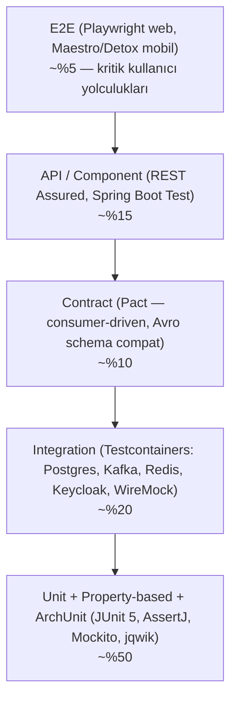
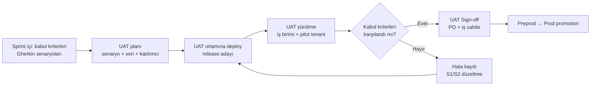

# AEP-CLW — Test Stratejisi

| Alan | Değer |
|---|---|
| Doküman sahibi | `QA` (QA Lead) |
| Katkı | `SDET`, `BE`, `FE`, `MOB`, `PERF`, `SEC`, `OPS`, `SA` |
| Sürüm | v1.0 — Sprint 0 |
| İlgili | [performance-plan.md](performance-plan.md), [definition-of-done.md](definition-of-done.md), [../security/secure-sdlc.md](../security/secure-sdlc.md), [../devops/devops-pipeline.md](../devops/devops-pipeline.md) |

---

## 1. Kalite Hedefleri ve İlkeler

1. **Finansal doğruluk pazarlık konusu değildir** — ledger invariant'ları kanıtlanır (property-based), yalnızca örneklenmez.
2. **Shift-left + shift-right** — hataları mümkün olan en erken aşamada yakala; üretimde sentetik izleme, canary analizi ve chaos ile doğrula.
3. **Otomasyon önce** — regresyon %100 otomatik; manuel test yalnızca keşif (exploratory), kullanılabilirlik ve UAT.
4. **Hızlı geri bildirim** — PR pipeline ≤ 15 dk; main pipeline ≤ 30 dk; gece suite'leri ≤ 3 saat.
5. **Test verisi üretimde değil** — prod verisi test ortamlarına kopyalanmaz (KVKK); sentetik veri.
6. **Multitenancy her testte** — test fixture'ları en az iki tenant ile çalışır (cross-tenant sızıntı tespiti).

---

## 2. Test Piramidi



Piramidin yanında (dikey, tüm seviyeleri kesen) **non-functional** test türleri: performans, güvenlik, chaos, erişilebilirlik, mutation.

---

## 3. Test Seviyeleri

| Seviye | Araçlar | Kapsam | Sahip | Çalışma Zamanı | Pipeline |
|---|---|---|---|---|---|
| **Unit** | JUnit 5, AssertJ, Mockito, jqwik | Domain modeli (aggregate, value object, domain service), use-case (application service) — hexagonal çekirdek; adaptörler mock'lanır | Geliştirici | < 3 dk / servis | PR |
| **Mimari** | **ArchUnit** | Hexagonal katman kuralları (domain → adapter bağımlılığı yok), `TenantContext` zorunluluğu, `double` para yasağı, ledger'da UPDATE yok, paket döngüsü yok, `@Transactional` yalnızca application katmanında | Tech Lead | < 30 sn | PR |
| **Integration** | **Testcontainers** (PostgreSQL 16, Kafka/Redpanda, Redis, Keycloak, WireMock, Schema Registry), Spring Boot Test | Repository + RLS, Flyway migration, Outbox → Kafka, Debezium, Vault (dev mode) | Geliştirici | < 10 dk | PR (etkilenen servis) / main (tümü) |
| **Contract** | **Pact** (HTTP consumer-driven, Pact Broker + `can-i-deploy`), Avro Schema Registry uyumluluk (BACKWARD_TRANSITIVE) | BFF ↔ servis, servis ↔ servis, PSP adaptörü (provider stub) | Consumer takımı | < 5 dk | main + promotion kapısı |
| **API / Component** | **REST Assured**, OpenAPI şema doğrulaması (swagger-request-validator), Schemathesis (fuzz) | Servisin tek başına kara kutu testi; yetki matrisi; hata kodları (RFC 9457); idempotency | SDET | < 10 dk | main |
| **E2E Web** | **Playwright** (TypeScript), axe-core entegrasyonu | Tenant Admin Portal, Platform Konsolu, Web POS kritik akışları | SDET + FE | < 20 dk (sharded) | test ortamı deploy sonrası + gece |
| **E2E Mobil** | **Maestro** (hızlı akış testleri, CI'da tercih) + **Detox** (RN gri kutu, karmaşık senaryolar); BrowserStack/Firebase Test Lab cihaz çiftliği | Kayıt/OTP, yükleme (PSP sandbox), QR ödeme, bakiye, white-label tema | MOB + SDET | < 30 dk | gece + release |
| **Performans** | **Gatling** (Java DSL — backend ekibiyle aynı dil) + **k6** (hafif senaryolar, CI smoke) | Bkz. [performance-plan.md](performance-plan.md) | PERF | 15 dk (smoke) → 24 saat (soak) | gece / haftalık / release |
| **Chaos** | **LitmusChaos** (pod kill, network latency/loss, AZ kaybı, Kafka broker kaybı, DB failover) | Dayanıklılık, saga telafileri, idempotency altında retry | OPS + PERF | Haftalık (preprod) | GameDay |
| **Güvenlik** | ZAP, Schemathesis, özel BOLA/cross-tenant suite, MobSF | Bkz. [secure-sdlc.md](../security/secure-sdlc.md) | SEC + SDET | — | PR/main/gece |
| **Erişilebilirlik** | **axe-core** (Playwright + jest-axe), Lighthouse CI, React Native Accessibility (manuel VoiceOver/TalkBack) | **WCAG 2.2 AA** — portallar, web POS, mobil app | FE + UX + QA | < 5 dk | PR (bileşen), gece (E2E) |
| **Mutation** | **PIT** (pitest) | Ledger, wallet, payment domain | BE | 10–30 dk | Gece + ledger PR'larında artımlı |
| **Görsel regresyon** | Playwright screenshot + Storybook (Chromatic veya lokal) | Design system, tenant temaları | FE | < 10 dk | PR (UI) |

### 3.1 ArchUnit Kural Örnekleri

```java
// Snippet — mimari kurallar (örnek)
@ArchTest static final ArchRule domain_is_pure =
    noClasses().that().resideInAPackage("..domain..")
        .should().dependOnClassesThat().resideInAnyPackage("..adapter..", "org.springframework..", "jakarta.persistence..");

@ArchTest static final ArchRule no_floating_point_money =
    noFields().that().haveNameMatching(".*(amount|balance|fee).*")
        .should().haveRawType(double.class).orShould().haveRawType(float.class);
```

---

## 4. Finansal Doğruluk Testleri

### 4.1 Ledger Invariant'ları (Property-Based — jqwik)

| # | Invariant | Test Yaklaşımı |
|---|---|---|
| INV-1 | Her journal için Σ borç = Σ alacak (para birimi bazında) | Rastgele journal üreteci (1–20 posting, çoklu para birimi) → domain reddeder veya dengelidir |
| INV-2 | Sistem genelinde Σ tüm hesap bakiyeleri = 0 (çift kayıt kapalı sistem) | Rastgele işlem dizileri (yükleme, ödeme, iade, hold, capture, release, reversal) sonrası |
| INV-3 | Müşteri kullanılabilir bakiyesi asla < 0 (overdraft yok) | Rastgele dizi + eşzamanlı yürütme |
| INV-4 | `available + held = ledger_balance` | Hold yaşam döngüsü dizileri |
| INV-5 | Reversal(journal) + journal = sıfır etki; reversal'ın reversal'ı yok | Stateful property test |
| INV-6 | Idempotency: aynı komutun N kez uygulanması = 1 kez uygulanması | `@ForAll` tekrar sayısı |
| INV-7 | Para birimi dönüşümü yok (closed-loop tek para birimi/tenant) — farklı para birimi posting reddedilir | Negatif üreteç |
| INV-8 | Yuvarlama: `BigDecimal` scale=2 (TRY), HALF_EVEN; ücret/cashback bölüşümünde kuruş kaybı yok (largest remainder) | Rastgele tutar ve oran |

```java
// Snippet — jqwik stateful: rastgele işlem dizisi sonrası invariant'lar
@Property(tries = 2000)
void ledger_invariants_hold(@ForAll("walletCommandSequences") ActionChain<LedgerModel> chain) {
    chain.withInvariant("double-entry", m -> assertThat(m.sumOfAllBalances()).isZero())
         .withInvariant("no-overdraft", m -> assertThat(m.minAvailableBalance()).isGreaterThanOrEqualTo(Money.ZERO))
         .run();
}
```

### 4.2 Eşzamanlılık — "Çifte Harcama Yok"

- **Test düzeni**: Testcontainers PostgreSQL (prod ile aynı izolasyon seviyesi ve lock stratejisi), gerçek `ledger-service` + `wallet-service` adaptörleri.
- **Senaryo**: Bakiyesi B olan cüzdana, N paralel iş parçacığı (virtual threads, N=50–500) tutarı `B/k` olan ödemeler gönderir (farklı idempotency key, farklı "POS").
- **Beklenen**: Başarılı ödeme sayısı ≤ k; son bakiye ≥ 0; Σ başarılı debit ≤ B; INV-1..4 sağlanır; deadlock olsa bile retry ile tutarlı.
- **Varyasyonlar**: Hold capture ↔ release yarışı; hold expiry job ↔ capture; aynı QR counter'ının iki POS'ta eşzamanlı sunulması (replay); Kafka consumer'ın aynı event'i iki kez alması (at-least-once).
- **jqwik + eşzamanlılık**: jqwik rastgele komut kümesi üretir; komutlar `CountDownLatch` ile eşzamanlı başlatılır; sonuçlar sıralı referans modelle **linearizability** açısından karşılaştırılır (Lincheck-benzeri yaklaşım).
- Yük altındaki doğrulama: performans testleri sonunda **mutabakat job'ı** çalıştırılır; dengesizlik = test başarısız (bkz. performance-plan).

### 4.3 Saga ve Telafi Testleri

- Her saga adımında hata enjeksiyonu (WireMock gecikme/5xx, Kafka broker kesintisi): son durum ya tamamen commit ya tamamen telafi.
- Zaman aşımı ve belirsiz durum (PSP timeout) senaryoları → reconciliation ile doğru nihai durum.

### 4.4 Mutabakat ve Muhasebe

- Altın (golden) veri setleri: bilinen işlem seti → beklenen takas dosyası, GL export, breakage hesabı (byte-level karşılaştırma).
- PSP mutabakat dosyası parser'ları için fuzz + hatalı satır testleri.

---

## 5. Mutation Testing (PIT)

| Modül | Hedef Mutation Score | Not |
|---|---|---|
| `ledger-service` domain | **≥ %60** (hedef yıl sonu %75) | Kalite kapısı — altında merge yok |
| `wallet-service`, `payment-service` domain | ≥ %50 | Kapı (M2'den itibaren) |
| Diğer domain modülleri | İzleme (kapı değil) | Trend raporu |

Artımlı analiz (`pitest` + `scmMutationCoverage`) PR'da yalnız değişen sınıflar; tam analiz gece.

---

## 6. Test Verisi Yönetimi

| İlke | Uygulama |
|---|---|
| Prod verisi kullanılmaz | Test ortamlarına prod kopyası yasak (KVKK); istisna yalnızca preprod için **anonimleştirilmiş + CMP onaylı** agregat veri |
| Sentetik veri | Test veri fabrikaları (builder pattern, `Instancio`/`Datafaker` — Türkçe locale); geçerli ama sahte TCKN algoritması, `+90 555 000 xx xx` rezerve aralık |
| Tenant fixture'ları | `tenant-alpha` (kahve zinciri), `tenant-beta` (EV şarj), `tenant-gamma` (otopark, pre-auth), `tenant-delta` (kampüs, Tier 2 ağırlıklı) |
| PSP / banka | WireMock stub'ları + PSP sandbox (UAT); kayıtlı yanıt senaryoları (başarılı, 3DS challenge, red, timeout, duplicate webhook) |
| Veri sıfırlama | Ephemeral ortamlar (PR başına namespace — opsiyonel) ve test ortamında gece reset + seed job |
| Performans verisi | 1M cüzdan/tenant ölçeğinde veri üreteci (COPY tabanlı bulk load), dağılım: Pareto (%20 aktif müşteri %80 işlem) |
| Gizlilik | Test kartları yalnızca PSP'nin test PAN'ları; gerçek kişisel veri yok |

---

## 7. Ortamlar

| Ortam | Amaç | Veri | Deploy | Test Türleri | Erişim |
|---|---|---|---|---|---|
| **local** | Geliştirici | Seed | docker-compose | Unit, integration | Geliştirici |
| **dev** | Entegrasyon, hızlı geri bildirim | Sentetik, sık reset | Her `main` commit (otomatik) | Smoke, API | Ekip |
| **test** | Otomatik regresyon | Sentetik, gece reset | Otomatik (dev yeşilse) | API, contract verify, E2E, DAST, a11y | Ekip |
| **uat** | İş kabul | Sentetik, senaryo bazlı, PSP sandbox | PR onayı ile (sprint sonu) | UAT, exploratory, mobil cihaz testleri | PO, iş birimleri, pilot tenant |
| **preprod** | Prod benzeri (boyut/konfig), performans, chaos, DR provası | Anonim, prod ölçeğinde sentetik | Release adayı | Performans, soak, chaos, pentest, release rehearsal | QA, PERF, OPS, SEC |
| **prod** | Canlı | Gerçek | Canary (Argo Rollouts) | Sentetik izleme, canary analiz | Yalnızca GitOps |

Detay: [../devops/environments-and-dr.md](../devops/environments-and-dr.md).

---

## 8. Kalite Kapıları

| Kapı | Kriter | Nerede | Aşılmazsa |
|---|---|---|---|
| Build | Derleme, lint (Checkstyle/Spotless, ESLint/Prettier), ArchUnit | PR | Merge blok |
| Unit + Integration | %100 geçiş, flaky yok (flaky test karantinası 48 saat SLA) | PR | Merge blok |
| **Coverage — domain** | Satır + dal **≥ %80** (domain/application paketleri) | PR (SonarQube new code) | Merge blok |
| **Coverage — genel** | **≥ %70** | PR | Merge blok |
| **Statik analiz** | SonarQube: **0 Blocker, 0 Critical** (bug + vulnerability), security hotspot'lar incelenmiş, tekrar ≤ %3 | PR | Merge blok |
| **Mutation — ledger** | **≥ %60** | Ledger PR + gece | Merge blok (ledger) |
| Güvenlik | Bkz. secure-sdlc (SAST/SCA/secret/IaC) | PR | Merge blok |
| Contract | `can-i-deploy` yeşil, şema uyumluluğu | main + promotion | Promotion blok |
| E2E | Kritik yolculuklar %100 | test ortamı | UAT promotion blok |
| Erişilebilirlik | 0 kritik/ciddi axe ihlali (WCAG 2.2 AA) | PR (UI) + gece | Merge/Release blok |
| Performans | NFR regresyonu yok (p99 ≤ baseline + %10, hata oranı < %0,1) | preprod | Prod promotion blok |
| Açık hata | Release'te açık S1/S2 hata yok | Release | Release blok |

---

## 9. Hata Yönetimi ve Severity Tanımları

| Severity | Tanım | Örnek | Düzeltme Hedefi | Release Etkisi |
|---|---|---|---|---|
| **S1 — Blocker/Kritik** | Finansal yanlışlık, veri kaybı/sızıntısı, güvenlik açığı, ana akış tamamen çalışmıyor, workaround yok | Bakiye yanlış hesaplanıyor; cross-tenant veri görünüyor; QR ödeme başarısız | Prod: hotfix ≤ 24 saat; pre-prod: sprint içinde hemen | Release blok |
| **S2 — Major** | Önemli fonksiyon bozuk, workaround zor | İade akışı hatalı; rapor tutarları yanlış (ledger doğru) | ≤ 5 iş günü / sonraki release öncesi | Release blok |
| **S3 — Minor** | Fonksiyon kısmen etkilenmiş, kolay workaround | Filtre hatalı; bildirim gecikmeli | Planlı sprint | Release'e engel değil (PO kararı) |
| **S4 — Trivial** | Kozmetik | Yazım hatası, hizalama | Backlog | Engel değil |

- **Priority** (P1–P4) PO tarafından iş etkisine göre ayrıca belirlenir; severity QA tarafından teknik etkiye göre.
- Finansal doğruluğu etkileyen **her hata otomatik S1**; kök neden analizi (RCA) zorunlu, regresyon testi eklenmeden kapatılamaz.
- İzleme: GitHub Issues — label'lar `type:bug`, `severity:S1..S4`, `priority:P1..P4`, `found-in:<env>`, `area:<service>`.
- Hata yaşam döngüsü: `New → Triaged → In Progress → In Review → Ready for Test → Verified → Closed` (`Rejected`, `Duplicate`, `Deferred`).
- Metrikler: kaçak hata oranı (prod'da bulunan / toplam), MTTR (severity bazlı), yeniden açılma oranı, flaky test oranı (< %1).

---

## 10. UAT Süreci



| Unsur | Tanım |
|---|---|
| Giriş kriterleri | Test ortamında regresyon yeşil, açık S1/S2 yok, UAT senaryoları hazır, test verisi yüklü, release notu taslak |
| Katılımcılar | PO, BA, pilot tenant temsilcileri (örn. kahve zinciri operasyon, finans), CMP (uyum akışları), AUD (teftiş ekranı) |
| Senaryolar | Uçtan uca iş süreçleri: tenant onboarding, müşteri kaydı → KYC → yükleme → ödeme → iade → takas → GL export; EV şarj pre-auth; otopark giriş/çıkış; kampanya |
| Süre | Sprint sonu 2–3 iş günü (MVP/GA release'lerinde 2 hafta) |
| Çıkış kriterleri | Kritik senaryolar %100 geçti, açık S1/S2 yok, S3'ler için PO onayı, imzalı UAT sign-off (GitHub Issue/PR onayı + PDF) |
| Kanıt | UAT raporu, sign-off kaydı — Sprint Review paketine eklenir |

---

## 11. Raporlama

- Her sprint: Test Özet Raporu (koşan/geçen/başarısız, coverage trendi, mutation skoru, açık hata dağılımı, flaky oranı, performans karşılaştırması) → Sprint Review paketi.
- Dashboard: SonarQube portföy, Allure TestOps / Allure Report, Pact Broker matrisi, Grafana (k6/Gatling sonuçları).
