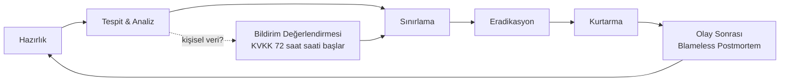

# AEP-CLW — Güvenlik Olay Müdahale Planı (Incident Response Plan)

| Alan | Değer |
|---|---|
| Doküman sahibi | `SEC` (CISO) |
| Katkı | `OPS`, `CMP`, `DM`, Hukuk, İletişim |
| Referans | NIST SP 800-61r3, ISO/IEC 27035, KVKK md.12/5, GDPR md.33–34, KVK Kurulu 2019/10 sayılı karar |
| Sürüm | v1.0 — Sprint 0 |
| İlgili kontroller | CTL-043 (IR planı ve tatbikat), CTL-040 (SIEM), CTL-041 (audit log) |

> Operasyonel (güvenlik dışı) kesintiler için SRE on-call süreci: [../devops/observability.md](../devops/observability.md).
> Bir operasyonel olay güvenlik boyutu kazanırsa bu plana devredilir.

---

## 1. Amaç ve Kapsam

Kişisel veri ihlali, finansal sahtecilik, hesap ele geçirme, tenant izolasyonu ihlali, tedarik zinciri kompromizi,
fidye yazılımı ve kullanılabilirlik saldırıları dahil tüm bilgi güvenliği olaylarının tespit, sınırlama, kök neden analizi,
kurtarma ve bildirim süreçlerini tanımlar. Multitenant yapı gereği **veri sorumlusu çoğunlukla tenant**, AEP-CLW
**veri işleyen**dir (tenant'ın e-para kuruluşu / lisanslı yapı olduğu senaryolarda roller sözleşmeye göre değişebilir).

---

## 2. Roller (CSIRT)

| Rol | Kim | Sorumluluk |
|---|---|---|
| Incident Commander (IC) | CISO veya yetkili vekili (SEC) | Karar, koordinasyon, severity, kapanış |
| Teknik Lider | SRE Lead / ilgili Tech Lead | Sınırlama, eradikasyon, kurtarma |
| Forensics | SEC (gerekirse harici DFIR firması — retainer) | Delil toplama, zaman çizelgesi, chain of custody |
| Compliance / DPO | `CMP` | KVKK/GDPR/MASAK/TCMB bildirim değerlendirmesi |
| Hukuk | Hukuk müşaviri | Sözleşmesel yükümlülük, kolluk, ifade |
| İletişim | Kurumsal iletişim + Customer Success | Tenant, müşteri, kamuoyu iletişimi |
| Scribe | Atanmış | Olay günlüğü (zaman damgalı) |
| Yönetim | Program Direktörü / CEO | Kritik olaylarda onay, bütçe |

---

## 3. Sınıflandırma

### 3.1 Severity

| Seviye | Tanım | Örnekler | Yanıt Süresi | Eskalasyon |
|---|---|---|---|---|
| **SEV-1 Kritik** | Aktif istismar; finansal kayıp veya kişisel veri ihlali doğrulanmış/yüksek olasılıklı; çok tenant etkisi | Cross-tenant veri sızıntısı, ledger manipülasyonu, imza anahtarı kompromizi, fidye yazılımı, prod'da RCE | 15 dk | IC + yönetim + CMP anında; 1 saatte war room |
| **SEV-2 Yüksek** | Sınırlı kapsamlı ihlal veya kritik kontrol başarısızlığı | Tek tenant'ta ATO dalgası, webhook sahteciliği girişimi başarılı, PII log sızıntısı | 30 dk | IC + CMP |
| **SEV-3 Orta** | İhlal şüphesi, kontrol zayıflığı, istismar kanıtı yok | Başarısız brute force dalgası, yüksek CVE açığa çıkması | 4 saat | SEC on-call |
| **SEV-4 Düşük** | Bilgi amaçlı, politika ihlali | Phishing e-postası raporu, tekil yanlış konfigürasyon | 1 iş günü | SEC kuyruğu |

### 3.2 Kategori

`DATA-BREACH`, `FIN-FRAUD`, `ATO`, `TENANT-ISOLATION`, `INSIDER`, `SUPPLY-CHAIN`, `MALWARE`, `DDOS`, `KEY-COMPROMISE`, `VULN-EXPLOIT`, `THIRD-PARTY` (PSP/bulut sağlayıcı olayı).

---

## 4. Yaşam Döngüsü

| Faz | Anahtar Faaliyetler |
|---|---|
| Hazırlık | Playbook'lar, on-call, DFIR retainer, iletişim şablonları, kontak listesi (KVKK, TCMB, MASAK, PSP'ler, tenant güvenlik irtibatları), yıllık tatbikat |
| Tespit & Analiz | SIEM alarmları, ledger imbalance alarmı, fraud skor anomalileri, bug bounty/tenant bildirimi; triyaj, severity, olay kaydı açma |
| Sınırlama | Kısa vadeli (hesap dondurma, token iptali, WAF kuralı, feature flag ile akışı kapatma, servis izolasyonu NetworkPolicy), uzun vadeli (yama, anahtar rotasyonu) |
| Eradikasyon | Kök nedenin giderilmesi, arka kapı taraması, imajların yeniden build + imza |
| Kurtarma | GitOps ile temiz sürüm, izleme yoğunlaştırma, ledger mutabakatı ve düzeltme kayıtları (maker-checker) |
| Olay sonrası | 5 iş günü içinde postmortem, aksiyonlar backlog'a, kontrol matrisi ve tehdit modeli güncellemesi |

**Delil yönetimi**: Audit log (hash zinciri) ve WORM kopyaları, pod snapshot'ları, Loki/Tempo export'ları hash'lenerek
kanıt deposuna alınır; chain-of-custody formu doldurulur. Delil toplama tamamlanmadan pod/volume silinmez (kısıtlama: `forensic-hold` label'ı → ArgoCD prune devre dışı).

---

## 5. Yasal Bildirimler

### 5.1 KVKK — 72 Saat

| Adım | Süre | Sorumlu | Not |
|---|---|---|---|
| İhlalin **öğrenilmesi** (T0) | — | IC | Farkındalık anı olay kaydında zaman damgalanır |
| AEP-CLW veri işleyen ise → **tenant'a (veri sorumlusu) bildirim** | **Gecikmeksizin, hedef ≤ 24 saat** | CMP | DPA sözleşmesinde taahhüt; tenant'ın 72 saatini koruyacak şekilde |
| Veri sorumlusu → **KVK Kurulu'na bildirim** | **T0 + 72 saat** | Tenant DPO (AEP-CLW destekler) / AEP-CLW kendi verisi için CMP | Kurul'un "Kişisel Veri İhlal Bildirim Formu" ile; bilgiler eksikse kademeli bildirim, gecikme gerekçesi |
| İlgili kişilere bildirim | Makul en kısa süre | Veri sorumlusu | İletişim şablonu (Ek-B) |
| İhlal envanteri | Sürekli | CMP | Bildirilmeyen ihlaller dahil tüm ihlaller kaydedilir |

**GDPR (AB veri sahipleri etkilenmişse)**: Yetkili denetim otoritesine 72 saat (md.33), yüksek risk varsa veri sahiplerine gecikmeksizin (md.34).

### 5.2 Diğer Bildirimler

| Muhatap | Ne Zaman | Not |
|---|---|---|
| **TCMB** | Lisanslı yapı (ödeme/e-para kuruluşu) altında faaliyet varsa, ilgili yönetmelikteki bilgi sistemleri olay bildirim yükümlülüğüne göre | Lisans durumuna bağlı — [regulatory-framework.md](../compliance/regulatory-framework.md) |
| **MASAK** | Olay şüpheli işlem (kara para aklama/terör finansmanı) göstergesi içeriyorsa → STR | Tipping-off yasağına dikkat |
| **PSP / Acquirer / Kart şemaları** | Kart verisi veya PSP entegrasyon anahtarları etkilendiyse | PSP sözleşmesindeki süre (genelde 24 saat) |
| **Tenant'lar** | Etkilenen her tenant | SLA/DPA'daki süre |
| **Kolluk** | Suç şüphesi (Hukuk kararı) | Delil bütünlüğü korunarak |
| **Siber sigorta** | Poliçedeki süre | — |
| **USOM / Sektörel SOME** | Kurumsal kapsamdaysa | — |

---

## 6. Playbook'lar

Her playbook: **Tetik → Triyaj → Sınırlama → Eradikasyon → Kurtarma → Bildirim → Kanıt**.

### PB-01 — Tenant Veri Sızıntısı (Cross-Tenant)

1. **Tetik**: Cross-tenant test başarısızlığı prod'da, tenant bildirimi, RLS policy ihlali log'u, anormal export.
2. **Triyaj**: Etkilenen endpoint/servis, zaman aralığı, erişilen kayıt sayısı (audit log + gateway log sorgusu).
3. **Sınırlama**: İlgili endpoint'i feature flag / gateway route ile kapat; şüpheli token'ları iptal et.
4. **Eradikasyon**: Hata düzeltme, RLS/ArchUnit kuralı eklenmesi, regresyon testi.
5. **Bildirim**: Her iki tenant'a (sızan ve gören), KVKK değerlendirmesi — **SEV-1**.
6. **Kanıt**: Erişim logları, düzeltme PR'ı, test kanıtı.

### PB-02 — Ledger Dengesizliği / Bakiye Manipülasyonu

1. **Tetik**: `ledger_imbalance_total != 0` alarmı, mutabakat farkı, negatif bakiye.
2. **Sınırlama**: Etkilenen tenant'ta ilgili akışı (ör. P2P, iade) feature flag ile durdur; gerekirse tenant'ı **read-only / ödemeye kapalı** moda al (kill switch — maker-checker'dan muaf, IC yetkisi, sonradan onay).
3. **Analiz**: Hash zinciri doğrulaması, journal zaman çizelgesi, idempotency/lock ihlali mi insider mı?
4. **Kurtarma**: Düzeltme yalnızca ters kayıt ile (maker-checker), müşteri bakiyeleri mutabakatı.
5. **Bildirim**: Finansal etki > eşik ise yönetim + CMP; lisans durumuna göre regülatör.

### PB-03 — Account Takeover Dalgası

1. **Tetik**: Yeni cihaz bağlama oranında anomali, SIM swap sinyalleri, müşteri şikâyetleri.
2. **Sınırlama**: Risk kuralı sıkılaştırma (yeni cihazda harcama kapalı), etkilenen hesapları dondur, oturum ailelerini iptal et, OTP akışına ek doğrulama.
3. **Kurtarma**: Hesap iade süreci (KYC ile kimlik yeniden doğrulama), finansal kayıp değerlendirmesi.
4. **Bildirim**: Etkilenen müşteriler, tenant; kişisel veri etkisi varsa KVKK.

### PB-04 — Webhook Sahteciliği / Funding Fraud

1. **Tetik**: İmza doğrulama hatası artışı, PSP geri sorgulamada "bilinmeyen işlem", mutabakat farkı.
2. **Sınırlama**: İlgili PSP webhook endpoint'ini geçici olarak yalnızca polling moduna al; imza anahtarını rotasyonla.
3. **Analiz**: Başarılı sahte credit var mı? (S2S teyit kontrolü atlanmış mı?)
4. **Kurtarma**: Hatalı credit'lerin ters kaydı, etkilenen cüzdanların dondurulması, STR değerlendirmesi.

### PB-05 — Kriptografik Anahtar / Sır Kompromizi

1. **Sınırlama**: Vault'ta ilgili anahtarı revoke/rotate, dinamik lease'leri iptal (`vault lease revoke -prefix`), JWT imza anahtarı rotasyonu (JWKS'de eski anahtarı kaldır), webhook anahtarı çift-anahtar geçişi.
2. **Etki analizi**: Anahtarla korunan veri kapsamı; KEK kompromizinde rewrap (DEK'ler yeni KEK ile).
3. **Kanıt**: Vault audit log.

### PB-06 — Tedarik Zinciri Kompromizi

1. **Tetik**: Zararlı bağımlılık duyurusu, imza doğrulama hatası, beklenmeyen egress.
2. **Sınırlama**: Etkilenen imajları admission policy'de blokla, SBOM (Dependency-Track) üzerinden etkilenen servisleri bul, egress kısıtla.
3. **Eradikasyon**: Temiz bağımlılık, yeniden build + imza, GitHub token/OIDC trust ilişkilerinin gözden geçirilmesi.

### PB-07 — Insider Fraud

1. **Tetik**: UEBA alarmı, SoD ihlali denemesi, anormal manuel düzeltme, kasiyer vardiya farkı.
2. **Sınırlama**: Kullanıcıyı askıya al (İK ve Hukuk ile koordineli, gizlilik), erişimleri kaldır, delili koru.
3. **Analiz**: Audit log (hash zinciri doğrulamalı), maker-checker kayıtları, ilişkili hesaplar.
4. **Bildirim**: Hukuk, tenant yönetimi; gerekirse kolluk ve MASAK.

### PB-08 — DDoS / Kullanılabilirlik Saldırısı

1. WAF/CDN "under attack" modu, rate limit sıkılaştırma, coğrafi filtre, tenant bazlı kota.
2. Kasada ödeme sürekliliği: offline mod (tenant'ta açıksa) ve POS fallback prosedürü.

### PB-09 — Fidye Yazılımı / Destructive Saldırı

1. Etkilenen cluster/ağ segmentini izole et, yedeklerin bütünlüğünü doğrula (immutable backup), DR bölgesine failover kararı (bkz. [environments-and-dr.md](../devops/environments-and-dr.md)).
2. Fidye ödenmez (kurumsal politika); kolluk ve siber sigorta bildirimi.

### PB-10 — PII Log Sızıntısı

1. İlgili log akışını durdur / drop kuralı ekle, Loki'de ilgili stream'leri sil (retention override, silme kaydı ile).
2. Kaynağın düzeltilmesi (masking kuralı + test), erişenlerin tespiti, KVKK değerlendirmesi (genelde sınırlı erişim → risk değerlendirmesine göre).

---

## 7. İletişim Şablonları (Ekler)

- **Ek-A**: Tenant ilk bildirim (≤ 24 saat) — olay özeti, etkilenen veri kategorileri, alınan önlemler, irtibat.
- **Ek-B**: Veri sahibi bildirimi (sade dil, önerilen önlemler).
- **Ek-C**: KVK Kurulu bildirim formu hazırlık kontrol listesi (ihlal tarihi, tespit tarihi, kategori/kişi sayısı, olası sonuçlar, alınan önlemler, irtibat kişisi).
- **Ek-D**: Status page mesaj şablonları.

---

## 8. Tatbikat ve İyileştirme

| Tatbikat | Sıklık | Katılımcı |
|---|---|---|
| Tabletop (SEV-1 senaryosu: cross-tenant sızıntı / ledger manipülasyonu) | 6 ayda 1 | CSIRT + yönetim + CMP |
| Teknik tatbikat (anahtar rotasyonu, token toplu iptali, kill switch) | Çeyreklik | SEC + OPS |
| KVKK 72 saat bildirim provası | Yılda 1 | CMP + Hukuk + İletişim |
| Purple team | Yılda 1 | SEC + harici |

Metrikler: MTTD, MTTC (containment), MTTR, bildirim sürelerine uyum %100, postmortem aksiyon kapanma oranı ≥ %90 (30 gün).
