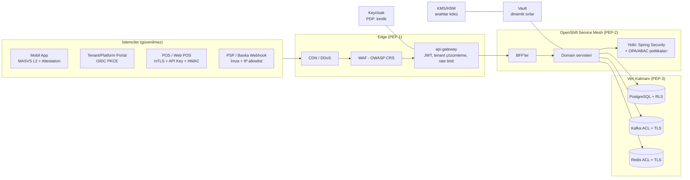
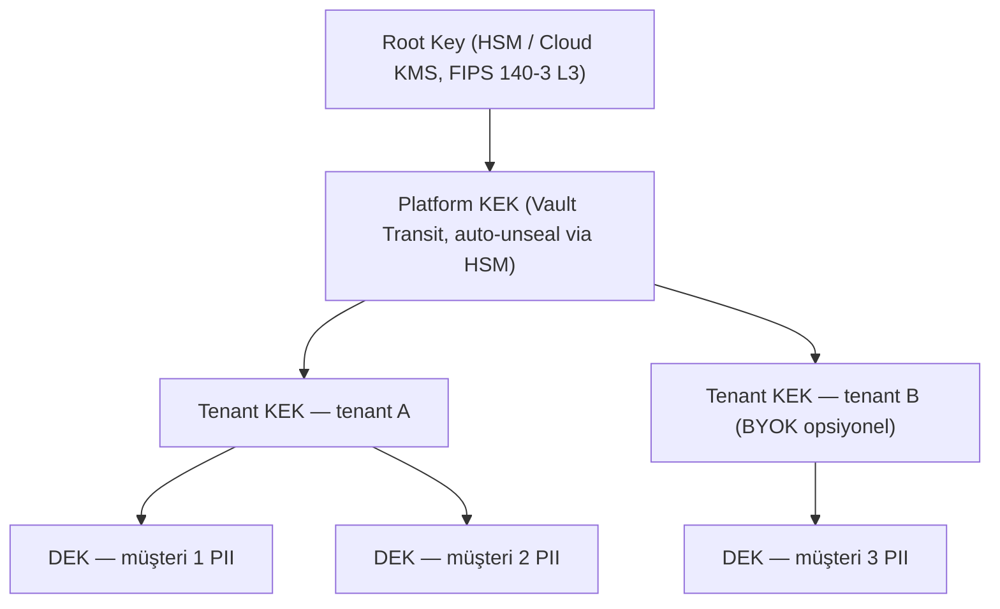

# AEP-CLW — Güvenlik Mimarisi (Security Architecture)

| Alan | Değer |
|---|---|
| Doküman sahibi | `SEC` (CISO / Security Architect) |
| Katkı | `CA`, `SA`, `OPS`, `CMP`, `MOB` |
| Sürüm | v1.0 — Sprint 0 (Inception) |
| Durum | Taslak — onay bekliyor |
| İlgili | [threat-model.md](threat-model.md), [secure-sdlc.md](secure-sdlc.md), [../compliance/control-matrix.md](../compliance/control-matrix.md) |

> Bu doküman, [Proje Tüzüğü](../00-project-charter.md) §3'teki teknik kararlara (Keycloak, Vault, HSM/KMS,
> OpenShift Service Mesh, kart verisi tutulmaz / PSP tokenizasyonu, RLS ile tenant izolasyonu) sadıktır.
> Her kontrol, [Kontrol Matrisi](../compliance/control-matrix.md)'ndeki `CTL-xxx` kimlikleriyle ilişkilendirilmiştir.

---

## 1. Güvenlik İlkeleri

1. **Zero Trust** — "Asla güvenme, her zaman doğrula". Ağ konumu güven kaynağı değildir; her istek kimlik, cihaz duruşu ve bağlam ile değerlendirilir.
2. **Defense-in-Depth** — Tek bir kontrolün başarısızlığı ihlale yol açmamalı; her katmanda bağımsız kontrol.
3. **Least Privilege & Need-to-Know** — Minimum yetki, zaman-sınırlı (JIT) ayrıcalıklı erişim.
4. **Secure by Default** — Varsayılan deny (NetworkPolicy, RBAC, CORS), güvenli varsayılan konfigürasyon.
5. **Tenant İzolasyonu Birinci Sınıf Vatandaştır** — Her katmanda `tenant_id` doğrulaması (token → gateway → servis → RLS).
6. **Finansal Bütünlük** — Bakiye değiştiren her işlem idempotent, atomik, çift kayıtlı ve denetlenebilir.
7. **Privacy by Design (KVKK/GDPR md.25)** — Veri minimizasyonu, alan düzeyinde şifreleme, crypto-shredding.
8. **Assume Breach** — Tespit, sınırlama ve kurtarma kabiliyetleri önleme kadar önemlidir.

---

## 2. Zero Trust Referans Modeli



| Zero Trust Sütunu | AEP-CLW Uygulaması |
|---|---|
| Kimlik | Keycloak OIDC, MFA, step-up, kısa ömürlü token (access 5 dk, refresh rotasyonlu) |
| Cihaz | Mobil app attestation (Play Integrity / App Attest), cihaz bağlama, root/jailbreak tespiti; admin için yönetilen cihaz (opsiyonel, tenant politikası) |
| Ağ | Default-deny NetworkPolicy, mesh mTLS STRICT, egress allowlist |
| Uygulama | JWT audience doğrulaması, method-level authz, ABAC (tenant, merchant, store kapsamı) |
| Veri | RLS, field-level encryption, envelope encryption, DLP/log maskeleme |
| Görünürlük & Analitik | Merkezi audit log, SIEM korelasyonu, UEBA (insider fraud) |
| Otomasyon | Policy-as-code (OPA/Kyverno), GitOps, otomatik sır rotasyonu |

---

## 3. Defense-in-Depth Katmanları

| # | Katman | Kontroller | Sorumlu | CTL |
|---|---|---|---|---|
| L0 | Yönetişim | Politikalar, risk yönetimi, eğitim, güvenlik şampiyonları | SEC/CMP | CTL-001, CTL-045 |
| L1 | Perimeter / Edge | CDN + DDoS koruması, WAF (OWASP CRS 4.x, paranoya seviyesi 2), bot yönetimi, TLS 1.3 sonlandırma, geo/IP politikaları | OPS | CTL-020 |
| L2 | API Gateway | JWT imza/`aud`/`iss`/`exp` doğrulama, tenant çözümleme (token claim ↔ host/header uyumu), rate limit (Redis token bucket), şema doğrulama (OpenAPI), istek boyutu limiti | BE/SEC | CTL-003, CTL-021 |
| L3 | Service Mesh | mTLS STRICT, SPIFFE kimlikleri, AuthorizationPolicy (servis→servis allowlist), egress gateway | OPS | CTL-004 |
| L4 | Uygulama | Spring Security RS, method-level `@PreAuthorize`, ABAC, input validation, idempotency, optimistic/pessimistic locking, maker-checker | BE | CTL-005..CTL-008, CTL-031, CTL-032 |
| L5 | Veri | RLS (`tenant_id`), field-level encryption (PII), TDE/disk şifreleme (AES-256), dinamik DB kimlik bilgileri, WORM audit | DATA/SEC | CTL-011..CTL-016, CTL-019 |
| L6 | Platform | SCC `restricted-v2`, read-only root FS, non-root, imzalı imaj doğrulama (admission), Kyverno politikaları, node hardening (CIS) | OPS | CTL-025, CTL-039 |
| L7 | İzleme & Müdahale | SIEM, anomali tespiti, ledger dengesizlik alarmı, IR playbook'ları | SEC/OPS | CTL-033, CTL-040..CTL-043 |

---

## 4. Kimlik ve Erişim Yönetimi (IAM)

### 4.1 Keycloak Topolojisi

Tüzük kararı: **realm-per-platform + organization-per-tenant** (Keycloak Organizations özelliği).

| Realm | Kullanıcı Tipi | Kimlik Doğrulama | Notlar |
|---|---|---|---|
| `aep-customers` | Son kullanıcı (cüzdan sahibi) | Telefon OTP + cihaz bağlama, opsiyonel biyometrik (cihaz içi, anahtar çifti) | Her tenant bir *Organization*; token'da `tenant_id` claim |
| `aep-workforce` | Tenant admin, finance, risk analyst, compliance officer, auditor, merchant manager, cashier, support | OIDC PKCE + **MFA zorunlu** (TOTP / WebAuthn passkey); kurumsal IdP federasyonu (SAML/OIDC) opsiyonel | Tenant bazlı Organization; cashier için POS cihazına bağlı kısa oturum |
| `aep-platform` | Platform admin, SRE, platform support | WebAuthn (FIDO2 donanım anahtarı) zorunlu, JIT ayrıcalık | Ayrı realm → tenant kullanıcılarıyla çapraz risk yok |
| `aep-machines` | POS entegrasyonları, partner API | OAuth2 Client Credentials + `private_key_jwt` veya mTLS-bound token (RFC 8705) | API key yalnızca tanımlama; yetki token ile |

### 4.2 Akışlar

- **Web portallar (SPA)**: Authorization Code + **PKCE (S256)**, BFF pattern — token'lar tarayıcıda değil BFF'te (HttpOnly, `Secure`, `SameSite=Strict` session cookie). Implicit flow yasak.
- **Mobil**: Authorization Code + PKCE (AppAuth), refresh token **cihaz anahtarına bağlı** (DPoP — RFC 9449), Secure Enclave/StrongBox'ta saklanan anahtar.
- **Token ömürleri**: access 5 dk; refresh 30 dk (workforce, sliding, maks 8 saat), müşteri 30 gün (rotasyon + reuse detection → tüm oturum ailesi iptal).
- **Oturum iptali**: Keycloak back-channel logout + gateway'de `jti`/`sid` deny-list (Redis, TTL = token ömrü).

### 4.3 MFA ve Step-Up Authentication

Step-up, OIDC `acr_values` / `max_age` ile istenir; servis, token'daki `acr` ve `auth_time` claim'ini doğrular.

| Hassas İşlem | Gerekli ACR | Ek Koşul |
|---|---|---|
| Müşteri: yeni cihaz bağlama | `acr=2` (OTP + mevcut cihaz onayı veya KYC selfie) | Cihaz değişikliği sonrası 24 saat düşük limit (cool-down) |
| Müşteri: P2P transfer / yüksek tutarlı ödeme (> tenant eşiği) | `acr=2` (biyometrik/PIN cihaz imzası) | Risk skoru > eşik ise ek OTP |
| Müşteri: telefon/e-posta değişikliği | `acr=2` + eski kanal onayı | 72 saat bildirim, geri alma bağlantısı |
| Workforce: manuel bakiye düzeltme, iade onayı, limit değişikliği | `acr=3` (WebAuthn), `auth_time` ≤ 5 dk | Maker-checker zorunlu |
| Workforce: kullanıcı/rol atama | `acr=3` | Maker-checker, SoD kontrolü |
| Platform: tenant silme, anahtar rotasyonu, prod break-glass | `acr=3` donanım anahtarı | İki platform admin onayı + ticket referansı |
| Delil paketi export (auditor) | `acr=3` | Watermark + audit event |

### 4.4 Servisler Arası Kimlik: mTLS + JWT Audience

- **Taşıma**: OpenShift Service Mesh (Istio) `PeerAuthentication: STRICT`; iş yükü kimliği SPIFFE ID (`spiffe://aep-clw/ns/<env>/sa/<service>`), sertifika ömrü 24 saat, otomatik rotasyon.
- **Yetki (L3)**: `AuthorizationPolicy` ile açık allowlist (ör. yalnızca `payment-service` → `ledger-service` `POST /internal/v1/journals`).
- **Uygulama kimliği (L4)**: Kullanıcı bağlamı **token exchange (RFC 8693)** ile aşağı akışa taşınır; her servis kendi `aud` değerini doğrular (`aud=ledger-service`). Kullanıcı token'ı olduğu gibi forward edilmez (confused deputy önlemi).
- **Asenkron (Kafka)**: Event envelope'unda `tenant_id`, `actor`, `causation_id`, `correlation_id`; Kafka ACL (topic başına produce/consume principal), mTLS client auth; hassas event'lerde imza (JWS detached) — ledger ve audit topic'leri için zorunlu.

```yaml
# Snippet — Istio AuthorizationPolicy (ledger-service yalnızca izinli çağıranlar)
apiVersion: security.istio.io/v1
kind: AuthorizationPolicy
metadata: { name: ledger-allowlist, namespace: aep-prod }
spec:
  selector: { matchLabels: { app: ledger-service } }
  action: ALLOW
  rules:
    - from: [{ source: { principals:
          ["cluster.local/ns/aep-prod/sa/payment-service",
           "cluster.local/ns/aep-prod/sa/funding-service",
           "cluster.local/ns/aep-prod/sa/settlement-service"] } }]
      to: [{ operation: { methods: ["POST"], paths: ["/internal/v1/journals*"] } }]
```

---

## 5. Yetkilendirme Modeli (RBAC + ABAC)

### 5.1 Roller

| Rol | Realm | Kapsam | Temel Yetkiler | Yasaklar |
|---|---|---|---|---|
| `PLATFORM_ADMIN` | platform | Tüm platform (tenant verisine **varsayılan erişim yok**) | Tenant onboarding, plan, global konfig, anahtar yönetimi | Tenant müşteri PII'sine erişim yalnızca break-glass + tenant onayı |
| `TENANT_ADMIN` | workforce | Tek tenant | Tenant konfig, kullanıcı/rol yönetimi, marka, feature flag | Finansal işlemleri tek başına onaylayamaz |
| `FINANCE` | workforce | Tek tenant | Takas/mutabakat, iade onayı, manuel düzeltme (maker), GL export | Kullanıcı yönetimi, kendi yaptığı işlemi onaylama |
| `RISK_ANALYST` | workforce | Tek tenant | Fraud vakaları, kural yönetimi (maker), hesap dondurma | Bakiye düzeltme |
| `COMPLIANCE_OFFICER` | workforce | Tek tenant (+ platform MLRO rolü) | AML vakaları, STR hazırlama/gönderme, KYC override, yaptırım eşleşme kararı | Kural yayını (checker değilse) |
| `AUDITOR` (Müfettiş) | workforce/platform | Atandığı tenant(lar), zaman-sınırlı | **Read-only**: audit log, teftiş ekranı, raporlar, delil paketi export | Hiçbir yazma işlemi; PII maskeli (unmask talebi loglanır) |
| `SUPPORT_AGENT` | workforce | Tek tenant | Müşteri profili (maskeli), işlem görüntüleme, hesap kilitleme talebi | Bakiye/iade işlemi, PII tam görüntüleme |
| `MERCHANT_MANAGER` | workforce | Kendi işyeri/mağazaları | Mağaza/terminal yönetimi, işyeri raporları, iade başlatma (limit dahilinde) | Diğer işyerleri, müşteri PII |
| `CASHIER` | workforce | Tek mağaza/terminal | Ödeme alma, kasada yükleme (limitli), günlük iptal | İade (limit üstü), rapor export |

### 5.2 ABAC Öznitelikleri

Karar = `RBAC izni` ∧ `ABAC politikası`. Politika motoru: servis içi Spring Security + merkezi **OPA (Rego)** bundle'ları (GitOps ile dağıtılır, sürümlü, test edilmiş).

| Öznitelik | Kaynak | Örnek Kural |
|---|---|---|
| `subject.tenant_id` | Token | `resource.tenant_id == subject.tenant_id` (her istek) |
| `subject.merchant_ids`, `store_ids` | Token/tenant-service | Merchant manager yalnızca kendi `merchant_id` kaynakları |
| `action.amount` | İstek | Cashier iptal ≤ 500 TRY; üstü için `FINANCE` onayı |
| `env.time`, `env.ip`, `env.device_trust` | Gateway | Workforce admin işlemleri yalnızca izinli IP/ülke; mesai dışı uyarı |
| `subject.acr`, `auth_time` | Token | Hassas işlemde step-up |
| `resource.state` | Domain | Dondurulmuş cüzdanda debit yasak |
| `subject.assignment_expiry` | IGA | Auditor ataması süre sonunda otomatik düşer |

### 5.3 Maker-Checker (Dört Göz)

- Uygulanacak işlemler: manuel ledger düzeltme, iade (eşik üstü), limit/ücret konfig değişikliği, fraud/AML kural yayını, kullanıcı-rol ataması, tenant silme/askıya alma, yaptırım eşleşmesi kapatma, STR gönderimi, anahtar rotasyonu.
- Kurallar: `maker != checker` (aynı kişi, aynı kişinin ikincil hesabı — e-posta/telefon eşleşmesi ile tespit), checker rolü farklı ve eşit/üst yetkide, talep **değiştirilemez** (hash'li payload; checker'ın gördüğü = uygulanacak olan), onay süresi (24 saat) sonrası otomatik iptal, tüm adımlar audit log'a.
- Detaylı SoD matrisi: [../compliance/audit-and-inspection.md](../compliance/audit-and-inspection.md).

---

## 6. Sır (Secret) Yönetimi — HashiCorp Vault

| Sır Tipi | Mekanizma | Rotasyon |
|---|---|---|
| PostgreSQL kimlik bilgileri | Vault **Database secrets engine** — dinamik, servis başına rol, TTL 1 saat, max 24 saat | Otomatik (lease) |
| Kafka / Redis | Vault PKI (mTLS client cert, TTL 24 saat) / dinamik ACL kullanıcıları | Otomatik |
| PSP / banka API anahtarları | KV v2 (sürümlü), yalnızca ilgili servis policy'si | 90 gün veya olay sonrası |
| Uygulama şifreleme anahtarları | **Transit engine** (encrypt/decrypt as a service; anahtar Vault dışına çıkmaz), root → HSM auto-unseal | Yıllık + olay bazlı |
| Webhook imza anahtarları | KV v2 + tenant bazlı | 180 gün, çift anahtar geçiş dönemi |
| CI/CD | GitHub OIDC → Vault JWT auth (uzun ömürlü sır yok) | Kısa ömürlü |

- Enjeksiyon: **Vault Agent Injector** (sidecar, tmpfs) veya Vault Secrets Operator; sırlar env var olarak değil dosya olarak.
- Kubernetes Secret'larına kalıcı sır yazılmaz (istisna: platform bootstrap, etcd şifreli).
- Vault audit device → SIEM; kök token kullanımı yalnızca break-glass (Shamir 3/5).

---

## 7. Kriptografi

### 7.1 Standartlar

| Kullanım | Algoritma / Parametre |
|---|---|
| Transit (dış) | **TLS 1.3** (TLS 1.2 yalnızca legacy POS için, AEAD suite'ler, PFS zorunlu), HSTS preload, OCSP stapling |
| Transit (iç) | mTLS (mesh), TLS 1.3 |
| At rest | **AES-256-GCM** (PostgreSQL volume/TDE, object storage SSE, Kafka tiered storage, backup) |
| Alan düzeyi (PII) | AES-256-GCM, DEK kayıt/tenant başına, KEK Vault Transit/KMS |
| Aranabilir alanlar | HMAC-SHA-256 blind index (telefon, e-posta, TCKN) — tenant başına pepper |
| Hash / bütünlük | SHA-256 (audit hash zinciri), SHA-384 imzalı checkpoint |
| İmza | ECDSA P-256 / Ed25519 (webhook, QR, JWT ES256), RSA-3072 min (legacy) |
| Parola (workforce yerel hesap kullanılırsa) | Keycloak: Argon2id |
| Rastgelelik | CSPRNG (`SecureRandom` DRBG) |
| Yasaklı | MD5, SHA-1, 3DES, RC4, ECB, TLS ≤ 1.1, statik IV |

### 7.2 Envelope Encryption ve Anahtar Hiyerarşisi



- DEK'ler şifreli olarak veriyle birlikte saklanır (`key_version`, `wrapped_dek`); KEK hiçbir zaman uygulama belleğinde kalıcı değildir.
- Büyük tenant (dedicated DB tier) için **BYOK/HYOK** opsiyonu.

### 7.3 Crypto-Shredding

- KVKK md.7 / GDPR md.17 silme talebinde, yasal saklama süresi (MASAK 8 yıl, VUK 5+ yıl) **dolmuş** kişisel veriler için müşteri DEK'i imha edilir → tüm kopyalar (backup, CDC, ClickHouse, Kafka) okunamaz hale gelir.
- Saklama yükümlülüğü devam eden finansal kayıtlar (ledger) PII içermez; müşteriye **pseudonymous `customer_ref`** ile bağlıdır. Ledger değiştirilmez; yalnızca PII anahtarı imha edilir.
- İmha işlemi maker-checker + audit event (`KEY_SHREDDED`) + imha sertifikası.

### 7.4 Kart Verisi

Kart verisi (PAN, CVV) AEP-CLW sistemlerine **hiç girmez**: PSP'nin hosted payment page / iframe / native SDK'sı kullanılır, sistemde yalnızca PSP token + maskeli PAN (ilk 6 / son 4) tutulur → PCI-DSS kapsamı **SAQ A** (bkz. [regulatory-framework.md](../compliance/regulatory-framework.md)).

---

## 8. QR / Token Güvenliği

### 8.1 Müşteri Tarafından Üretilen Dinamik QR (Customer-Presented)

| Özellik | Tasarım |
|---|---|
| Algoritma | TOTP-benzeri (RFC 6238 türevi), HMAC-SHA-256, **30 sn** zaman adımı, ±1 adım tolerans |
| Seed | Cihaz bağlama sırasında sunucu üretir; cihazda **Secure Enclave/StrongBox**'ta sarılı saklanır; sunucuda Vault Transit ile şifreli |
| Payload | `v1 | tenant_id | wallet_token (opak, cüzdan ID değil) | counter | otp(8 hane) | device_sig` — kısa, EMVCo-uyumlu değil (closed-loop) |
| Tek kullanımlık | `(wallet_token, counter)` Redis'te `SETNX` ile tüketilir (TTL 90 sn) → **replay koruması** |
| Cihaz bağlama | Payload'da cihaz anahtarıyla imza (ECDSA P-256) — kopyalanan seed başka cihazda geçersiz |
| Offline mod | Opsiyonel, tenant bazlı: ön-provizyonlu düşük limitli offline token (maks 3 işlem / 200 TRY), online'a dönünce mutabakat |
| Ekran güvenliği | Screenshot engelleme (`FLAG_SECURE`), QR ekranda maks 60 sn, arka plana geçince gizleme |

### 8.2 İşyeri QR (Merchant-Presented)

- Statik QR yalnızca `merchant/store/terminal` kimliği taşır; **tutar sunucu tarafında** POS'un oluşturduğu *payment intent* ile eşleşir (QR üzerinde tutar güvenilmez).
- Dinamik işyeri QR: payment intent ID + imza (Ed25519) + kısa TTL (120 sn).
- QR sticker değişimi (quishing) riskine karşı: uygulama, çözümlenen işyeri adını ve mağaza konumunu **onay öncesi** gösterir; geofence uyumsuzluğunda uyarı.

### 8.3 NFC-HCE Token

- Tokenize edilmiş cüzdan kimliği, sınırlı kullanımlı anahtarlar (LUK), her işlemde kriptogram; token'lar cihaz başına ve süreli.

### 8.4 Çifte Harcama ve Yarış Koşulu Koruması

- Her ödeme isteği **idempotency key** (istemci UUID v7) ile; aynı key + farklı payload → `409`.
- Ledger'da bakiye düşümü **tek hesap satırında** koşullu güncelleme (`UPDATE ... WHERE available >= :amount`) veya `SELECT ... FOR UPDATE` — serializable anomali testi jqwik ile (bkz. [test-strategy.md](../quality/test-strategy.md)).
- Hold → capture → release durum makinesi; aynı hold iki kez capture edilemez (unique constraint).

---

## 9. Mobil Uygulama Güvenliği — OWASP MASVS L2 (+ R)

| MASVS Kategorisi | Kontroller |
|---|---|
| MASVS-STORAGE | Hassas veri yalnızca Keychain/Keystore (StrongBox), `expo-secure-store`; AsyncStorage'da sır yasak; yedeklemeden hariç tutma |
| MASVS-CRYPTO | Platform kripto API'leri, donanım destekli anahtar, özel kripto yok |
| MASVS-AUTH | Biyometrik bağlı anahtar (`setUserAuthenticationRequired`), oturum zaman aşımı, sunucu tarafı oturum kontrolü |
| MASVS-NETWORK | **Certificate pinning** (SPKI pin, en az 2 yedek pin, pin rotasyon planı), ATS/Network Security Config, cleartext yasak |
| MASVS-PLATFORM | Deep link doğrulama (App Links/Universal Links), WebView'da JS bridge kısıtı, `FLAG_SECURE` |
| MASVS-CODE | Hermes bytecode, bağımlılık SCA, minimum OS sürümü, zorunlu güncelleme mekanizması |
| MASVS-RESILIENCE | **Root/jailbreak tespiti**, emulator/hook (Frida) tespiti, tamper/repackaging tespiti, obfuscation; sinyaller sunucuya gönderilir (risk skoruna girdi, istemci tek başına karar vermez) |
| MASVS-PRIVACY | Minimum izin, analitik SDK'larda PII yok, izin onay yönetimi |

**App Attestation**: Google **Play Integrity API** ve Apple **App Attest / DeviceCheck**; attestation sonucu kayıt, cihaz bağlama ve yüksek riskli işlemlerde sunucu tarafında doğrulanır. White-label build'lerde her tenant uygulaması ayrı bundle ID/imzalama ile attestation konfigürasyonuna eklenir.

---

## 10. API Güvenliği — OWASP API Security Top 10 (2023)

| Risk | AEP-CLW Kontrolü |
|---|---|
| API1 BOLA | Her kaynak erişiminde `tenant_id` + sahiplik kontrolü (servis katmanı + RLS); opak ID'ler (UUIDv7/ULID, sıralı ID yok); BOLA negatif testleri CI'da |
| API2 Broken Authentication | Keycloak, PKCE, DPoP, OTP brute-force limiti (5 deneme/15 dk), credential stuffing tespiti |
| API3 BOPLA | DTO whitelisting (mass assignment yok), yanıt şemalarında alan filtresi, rol bazlı alan maskeleme |
| API4 Unrestricted Resource Consumption | Rate limit (tenant, kullanıcı, IP, endpoint katmanlı), sayfalama maks 100, istek boyutu limiti, OTP/SMS maliyet limitleri |
| API5 BFLA | Admin API'leri ayrı BFF + ayrı realm, method-level authz, route bazlı yetki matrisinin otomatik testi |
| API6 Unrestricted Access to Sensitive Business Flows | Top-up, P2P, kupon kullanma akışlarında velocity kuralları, bot tespiti, cihaz attestation |
| API7 SSRF | Webhook URL'leri allowlist + DNS rebinding koruması, egress gateway, iç ağ IP'leri yasak |
| API8 Security Misconfiguration | Güvenli başlıklar, CORS allowlist, hata mesajlarında stack trace yok (RFC 9457 Problem Details), Checkov/Kyverno |
| API9 Improper Inventory Management | OpenAPI 3.1 tek kaynak, API kataloğu, gateway'de kayıtsız route yok, sürüm sonlandırma politikası |
| API10 Unsafe Consumption of APIs | PSP/banka yanıtları şema doğrulama, timeout + circuit breaker, webhook imza doğrulama |

### 10.1 Rate Limit Politikası (başlangıç değerleri — tenant konfigüre edilebilir, platform tavanlı)

| Katman | Anahtar | Limit |
|---|---|---|
| Edge (WAF) | IP | 1.000 req/dk, burst 200 |
| Gateway — anonim | IP + endpoint | OTP isteği: 3/5 dk telefon başı, 10/saat IP başı |
| Gateway — müşteri | `sub` | 60 req/dk; ödeme 10/dk |
| Gateway — POS | `client_id` (terminal) | 600 req/dk |
| Gateway — tenant toplam | `tenant_id` | Plan bazlı (ör. Enterprise 5.000 TPS) — noisy neighbor koruması |

### 10.2 Webhook Güvenliği

- **Giden (tenant/işyeri'ne)**: `X-AEP-Signature: t=<ts>,v1=<HMAC-SHA256>`; zaman damgası toleransı 5 dk, event ID ile tekillik, retry ile exponential backoff.
- **Gelen (PSP/banka)**: sağlayıcının imza şeması doğrulanır + IP allowlist + mTLS (destekleniyorsa); webhook yalnızca "tetikleyici"dir — durum her zaman PSP API'sinden **geri sorgulanarak** (server-to-server) teyit edilir.

---

## 11. Log'larda PII Maskeleme ve Veri Sınıflandırma

| Sınıf | Örnek | Log'da | Trace'de | Analitik |
|---|---|---|---|---|
| **Kısıtlı (C4)** | Kart PAN (zaten yok), OTP, parola, token, QR seed, sırlar | **Asla** | Asla | Asla |
| **Gizli PII (C3)** | TCKN, kimlik görüntüsü, adres, doğum tarihi, biyometrik | Asla (yalnızca `customer_ref`) | Asla | Pseudonym |
| **Kişisel (C2)** | Ad, telefon, e-posta, IP, cihaz ID | Maskeli (`+90 5** *** **12`, `a***@x.com`), IP son oktet sıfır | Maskeli | Hash |
| **Dahili (C1)** | Tutar, işlem ID, tenant ID | Açık | Açık | Açık |

- Uygulama: Logback `MaskingJsonLayout` (regex + alan adı tabanlı), OpenTelemetry Collector `transform`/`redaction` processor ikinci savunma hattı, Loki'de yazma öncesi drop kuralları.
- CI'da log maskeleme birim testleri; üretimde periyodik **PII sızıntı taraması** (Loki sorgusu + DLP pattern'leri) → bulgu = P2 olay.

---

## 12. Tenant İzolasyonu

| Katman | Mekanizma |
|---|---|
| Kimlik | Token'da `tenant_id` (Keycloak Organization), gateway host/header ile çapraz kontrol |
| Uygulama | `TenantContext` (ThreadLocal/ScopedValue) — yalnızca doğrulanmış token'dan set edilir; ArchUnit kuralı: repository katmanı `TenantContext` olmadan çağrılamaz |
| Veritabanı | PostgreSQL **RLS** (`USING (tenant_id = current_setting('app.tenant_id')::uuid)`), `FORCE ROW LEVEL SECURITY`, uygulama rolü `BYPASSRLS` yok; dedicated DB tier (büyük tenant) |
| Kafka | Event'te `tenant_id` zorunlu (Avro şema), consumer'da doğrulama |
| Cache | Redis anahtar prefix'i `t:{tenant_id}:` + ACL |
| Raporlama | ClickHouse row policy |
| Şifreleme | Tenant KEK — tenant'lar arası anahtar paylaşımı yok |
| Test | Otomatik "cross-tenant" negatif test seti (her endpoint, iki tenant fixture) — CI kapısı |

---

## 13. Ayrıcalıklı Erişim ve Üretim Erişimi

- Üretime insan erişimi varsayılan **yok**; GitOps dışı değişiklik yasak.
- Break-glass: PAM (ör. Vault + OpenShift OAuth, JIT 1 saat), iki onay, oturum kaydı, sonrası zorunlu inceleme.
- Veritabanına doğrudan sorgu: yalnızca read-only replica, maskeli view, ticket referansı, kayıtlı oturum.

---

## 14. Açık Konular / Kararlar (ADR adayları)

| # | Konu | Öneri | Sahip |
|---|---|---|---|
| 1 | OPA merkezi PDP mi, kütüphane mi? | Gömülü (sidecar-less, OPA-WASM veya Java SDK) — latency | SEC/CA |
| 2 | HSM seçimi (on-prem Thales Luna vs bulut KMS) | Müşteri barındırma modeline göre; TR veri yerelliği için on-prem HSM | SEC/OPS |
| 3 | Offline QR ödeme | MVP dışı, pilot tenant ile değerlendirme | PO/SEC |
| 4 | DPoP mobil kütüphane olgunluğu | Sprint 2 spike | MOB/SEC |
