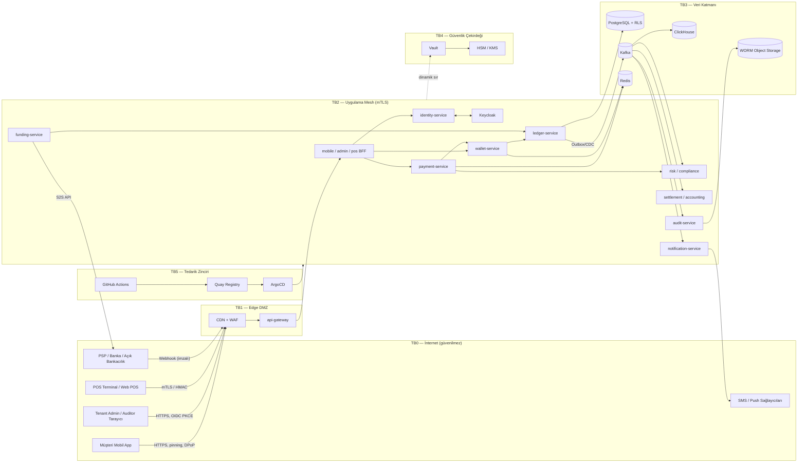
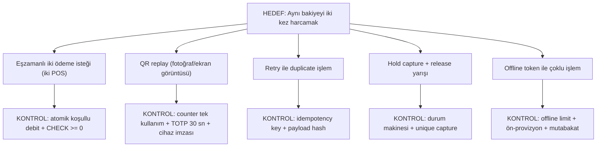

# AEP-CLW — Tehdit Modeli (STRIDE)

| Alan | Değer |
|---|---|
| Doküman sahibi | `SEC` |
| Katkı | `SA`, `CA`, `BE`, `MOB`, `CMP`, `AUD` |
| Yöntem | STRIDE-per-element + saldırı ağaçları (kritik senaryolar) |
| Risk puanlama | Olasılık (1–5) × Etki (1–5) = Risk (1–25); **Kritik ≥ 15**, Yüksek 10–14, Orta 5–9, Düşük ≤ 4 |
| Gözden geçirme | Her yeni bounded context / dış entegrasyon öncesi, her major release, en az yılda bir |
| Sürüm | v1.0 — Sprint 0 |

> Puanlar **kalıntı riskten önceki (inherent)** değerlendirmedir; "Kontroller" sütunu hedef kontrol setini, "CTL" sütunu
> [Kontrol Matrisi](../compliance/control-matrix.md) eşlemesini gösterir. Tehdit modeli, threat modeling aracına
> (OWASP Threat Dragon, repo'da `threat-model.json` olarak — kod aşamasında) aktarılacaktır.

---

## 1. Kapsam ve Varlıklar

| ID | Varlık | Sınıf | Neden Kritik | Sahip |
|---|---|---|---|---|
| A1 | Müşteri bakiyesi / ledger journal | Finansal — Kritik | Doğrudan parasal kayıp, e-para yükümlülüğü | ledger-service |
| A2 | Hold (provizyon) durumu | Finansal — Yüksek | EV şarj/otopark ön provizyonu; çifte capture riski | wallet/payment |
| A3 | Müşteri PII (ad, telefon, TCKN, kimlik görüntüsü) | Kişisel veri (özel nitelikli değil; biyometrik selfie **özel nitelikli**) | KVKK/GDPR ihlali, itibar | customer-service |
| A4 | Kimlik bilgileri, token'lar, OTP, oturumlar | Kısıtlı | Hesap ele geçirme | identity-service / Keycloak |
| A5 | QR seed / cihaz anahtarları | Kısıtlı | Ödeme sahteciliği | identity/payment |
| A6 | Kriptografik anahtarlar (KEK/DEK, webhook, JWT imza) | Kısıtlı | Tüm kontrollerin kökü | Vault / HSM |
| A7 | Tenant konfigürasyonu (limit, ücret, kural) | İş kritik | Limit manipülasyonu → AML ihlali, gelir kaybı | tenant-service |
| A8 | Hediye kartı / voucher kodları | Finansal | Kod tahmini/sızıntısı → bakiye hırsızlığı | voucher-service |
| A9 | Sadakat puanı / kampanya bütçesi | Finansal (düşük–orta) | Kampanya istismarı | loyalty-service |
| A10 | Audit log | Uyum — Kritik | Delil bütünlüğü, teftiş | audit-service |
| A11 | Takas/mutabakat dosyaları, işyeri IBAN'ları | Finansal | Ödeme yönlendirme sahteciliği | settlement-service |
| A12 | AML vakaları, STR'ler | Gizli (tipping-off yasağı) | 5549 md.4 ifşa yasağı | compliance-service |
| A13 | CI/CD pipeline, imajlar, GitOps repo | Tedarik zinciri | Tüm sisteme kod enjeksiyonu | OPS |
| A14 | Platform erişilebilirliği | Operasyonel | Kasada ödeme alınamaması | OPS |

---

## 2. Aktörler (Tehdit Kaynakları)

| Aktör | Motivasyon | Yetenek |
|---|---|---|
| Fırsatçı dolandırıcı | Bedava bakiye/puan | Düşük–orta (otomasyon, script) |
| Organize fraud çetesi | Çalıntı kartla yükle-harca, kara para aklama | Yüksek (bot farm, SIM swap, sosyal mühendislik) |
| Kötü niyetli müşteri | Chargeback istismarı, replay | Düşük |
| Kötü niyetli kasiyer / işyeri çalışanı | Sahte iade, kasada nakit yükleme suistimali | Orta, içeriden erişim |
| Kötü niyetli tenant kullanıcısı | Başka tenant verisi, limit manipülasyonu | Orta |
| İçeriden tehdit (platform personeli) | Finansal kazanç, veri satışı | Yüksek ayrıcalık |
| Rakip / hacktivist | DDoS, itibar zedeleme | Orta |
| Tedarik zinciri saldırganı | Bağımlılık/imaj zehirleme | Yüksek |

---

## 3. Güven Sınırları ve Veri Akış Diyagramı (DFD)

| Güven Sınırı | Geçiş | Birincil Kontroller |
|---|---|---|
| TB0 → TB1 | İnternet → Edge | TLS 1.3, WAF, DDoS, bot yönetimi, rate limit |
| TB1 → TB2 | Edge → Mesh | JWT doğrulama, tenant çözümleme, mTLS ingress gateway |
| TB2 ↔ TB2 | Servis → Servis | mTLS STRICT, AuthorizationPolicy, token exchange (aud) |
| TB2 → TB3 | Servis → Veri | Dinamik DB creds, RLS, Kafka ACL, Redis ACL |
| TB2 → TB4 | Servis → Sır | Vault k8s auth, policy, audit |
| TB5 → TB2 | Pipeline → Runtime | İmza doğrulama (Cosign + admission), GitOps, SBOM |
| TB2 → TB0 | Egress (PSP, SMS) | Egress gateway allowlist, mTLS, sır yönetimi |

---

## 4. STRIDE Tehdit Kataloğu

Kısaltmalar: **O** = Olasılık, **E** = Etki, **R** = Risk (O×E).

### 4.1 Kimlik & Hesap (identity-service, Keycloak, mobile app)

| ID | STRIDE | Bileşen | Tehdit | Etki | O | E | R | Kontroller | CTL |
|---|---|---|---|---|---|---|---|---|---|
| T-01 | S | identity / OTP | **Account takeover** — SIM swap ile OTP ele geçirme | Bakiye hırsızlığı, PII ifşası | 4 | 4 | 16 | Cihaz bağlama (OTP tek başına yeni cihazda yetmez), SIM değişim sinyali (operatör API — mümkünse), yeni cihazda 24 saat cool-down + düşük limit, step-up | CTL-006, CTL-054 |
| T-02 | S | Keycloak | Credential stuffing / OTP brute force | ATO, SMS maliyeti (SMS pumping) | 5 | 3 | 15 | OTP deneme limiti, CAPTCHA/attestation, IP/ASN reputation, SMS pumping koruması (ülke/prefix allowlist, tenant SMS bütçesi) | CTL-021, CTL-054 |
| T-03 | S | Mobil app | Repackaged / sahte uygulama, emulator farm | Otomatik fraud, kampanya istismarı | 4 | 3 | 12 | Play Integrity / App Attest, tamper tespiti, sunucu tarafı karar | CTL-054 |
| T-04 | S | Workforce portal | Phishing ile tenant admin/finance ele geçirme | Kritik konfig değişikliği, sahte iade | 3 | 5 | 15 | Phishing-dirençli MFA (WebAuthn), step-up, maker-checker, yeni cihaz/konum uyarısı | CTL-002, CTL-006, CTL-007 |
| T-05 | I | Oturum | Refresh token hırsızlığı (cihaz malware, XSS) | Oturum kaçırma | 3 | 4 | 12 | DPoP sender-constrained token, refresh rotasyon + reuse detection, BFF pattern (tarayıcıda token yok), CSP | CTL-003 |
| T-06 | R | Müşteri | "Bu ödemeyi ben yapmadım" inkârı | Chargeback, uyuşmazlık | 3 | 2 | 6 | Cihaz imzalı QR, attestation kaydı, audit log, işlem bildirimi (push/SMS) | CTL-041 |

### 4.2 Ödeme & Cüzdan & Ledger

| ID | STRIDE | Bileşen | Tehdit | Etki | O | E | R | Kontroller | CTL |
|---|---|---|---|---|---|---|---|---|---|
| T-07 | T | payment / wallet | **Çifte harcama** — aynı bakiyenin eşzamanlı iki ödemede kullanılması (iki kasa, iki cihaz) | Negatif bakiye, finansal kayıp | 4 | 5 | 20 | Hesap satırında atomik koşullu debit, `SELECT FOR UPDATE`/optimistic version, DB `CHECK (available >= 0)`, jqwik eşzamanlılık property testleri | CTL-032, CTL-030 |
| T-08 | T | payment | **Replay** — müşteri QR'ının fotoğrafının çekilip tekrar kullanılması | Yetkisiz ödeme | 4 | 4 | 16 | TOTP 30 sn, `(wallet_token,counter)` tek kullanım (Redis SETNX + DB unique), cihaz imzası, maks ekran süresi | CTL-032 |
| T-09 | T | API | İstemci retry'ı ile **aynı ödemenin iki kez işlenmesi** | Müşteriden çift tahsilat | 5 | 3 | 15 | Idempotency key (zorunlu header), sonuç önbelleği 24 saat, payload hash karşılaştırma | CTL-031 |
| T-10 | T | wallet (hold) | **Bakiye yarış koşulu** — hold capture ile release/expiry eşzamanlı | Çift capture veya bakiye kaybolması | 3 | 5 | 15 | Hold durum makinesi, tek geçiş (`UPDATE ... WHERE state='HELD'`), unique capture constraint, saga telafi testleri | CTL-032 |
| T-11 | T | ledger | Journal kaydının doğrudan DB'de değiştirilmesi (insider / SQLi) | Bakiye sahteciliği, delil kaybı | 2 | 5 | 10 | Append-only tablo (UPDATE/DELETE yetkisi yok, trigger ile engel), hash-zincirli journal, günlük bütünlük doğrulama, DB erişimi yalnızca dinamik creds | CTL-030, CTL-036, CTL-041 |
| T-12 | T | ledger | Dengesiz journal (borç ≠ alacak) — yazılım hatası | Mali tablolar yanlış, regülatör bildirimi | 3 | 5 | 15 | DB constraint (deferrable trigger: Σ=0 per journal), property test, gerçek zamanlı "imbalance ≠ 0" alarmı | CTL-030, CTL-033 |
| T-13 | E | payment | Tutar manipülasyonu — istemcinin QR/istek tutarını değiştirmesi | Düşük tahsilat | 3 | 3 | 9 | Tutar yalnızca POS payment intent'ten (sunucu), imzalı intent, müşteri onayı ekranı | CTL-038 |
| T-14 | D | payment | Kahve zinciri sabah pikinde **hot account** kilitlenmesi (tek işyeri alacak hesabı) | Kasada kuyruk, gelir kaybı | 4 | 4 | 16 | İşyeri alacak hesabı için sharded sub-account / batched posting, kapasite testi, backpressure | CTL-047 |
| T-15 | S | payment | Statik işyeri QR'ının sahte sticker ile değiştirilmesi (quishing) | Ödeme başka işyerine | 3 | 3 | 9 | İşyeri adı/konum onay ekranı, geofence uyarısı, dinamik işyeri QR tercihi | CTL-053 |

### 4.3 Funding & Settlement & Webhook

| ID | STRIDE | Bileşen | Tehdit | Etki | O | E | R | Kontroller | CTL |
|---|---|---|---|---|---|---|---|---|---|
| T-16 | S | funding (webhook) | **Webhook sahteciliği** — sahte "ödeme başarılı" bildirimi ile bedava yükleme | Doğrudan finansal kayıp | 4 | 5 | 20 | İmza doğrulama, IP allowlist/mTLS, **S2S geri sorgulama** (webhook yalnızca tetikleyici), event ID tekilliği, tutar/para birimi çapraz kontrol | CTL-038 |
| T-17 | T | funding | Çalıntı kartla yükle → hızlı harca / P2P ile çek (**card testing + cash-out**) | Chargeback kaybı, AML | 5 | 4 | 20 | 3DS2 zorunlu, yeni kart için bekleme/limit, velocity (kart/cihaz/IP), yükle-harca senaryosu, P2P kapalı varsayılan | CTL-050, CTL-053 |
| T-18 | T | settlement | İşyeri IBAN'ının değiştirilmesi (BEC) | Takas tutarı saldırgana | 2 | 5 | 10 | IBAN değişikliği maker-checker + out-of-band teyit, 48 saat bekleme, ad-IBAN doğrulama | CTL-007, CTL-029 |
| T-19 | T | settlement | Mutabakat dosyasının manipülasyonu / eksik kayıt | Mutabakatsızlık gizlenir | 2 | 4 | 8 | Dosya imza/hash, SFTP + PGP, otomatik mutabakat, istisna kuyruğu SLA | CTL-034 |
| T-20 | R | funding | PSP ile yükleme durum uyuşmazlığı (timeout sonrası belirsiz durum) | Müşteri parası askıda | 4 | 3 | 12 | Pending durum + reconciliation job, saga timeout/telafi, günlük mutabakat | CTL-034 |

### 4.4 Multitenancy & Veri

| ID | STRIDE | Bileşen | Tehdit | Etki | O | E | R | Kontroller | CTL |
|---|---|---|---|---|---|---|---|---|---|
| T-21 | I | Tüm servisler | **Tenant veri sızıntısı** — BOLA / eksik `tenant_id` filtresi | Çoklu KVKK ihlali, sözleşme ihlali | 4 | 5 | 20 | RLS FORCE, TenantContext yalnızca token'dan, ArchUnit kuralı, cross-tenant otomatik test seti, opak ID | CTL-011, CTL-005 |
| T-22 | I | reporting / ClickHouse | CQRS okuma modelinde tenant filtresinin atlanması | Rapor/export ile toplu sızıntı | 3 | 5 | 15 | ClickHouse row policy, export servisinde ikinci kontrol, export audit | CTL-011 |
| T-23 | I | Redis cache | Anahtar çakışması ile tenant'lar arası cache sızıntısı | PII/bakiye ifşası | 2 | 4 | 8 | Tenant prefix zorunlu (kütüphane), Redis ACL, test | CTL-011 |
| T-24 | I | Log / trace | PII / token'ın log'a düşmesi | KVKK ihlali, token çalınması | 4 | 3 | 12 | Masking layout, OTel redaction, CI testleri, periyodik DLP taraması | CTL-015 |
| T-25 | I | Backup | Şifrelenmemiş/aşırı erişimli yedek | Toplu veri sızıntısı | 2 | 5 | 10 | AES-256 şifreli, ayrı hesap, immutable, erişim logu | CTL-013, CTL-055 |
| T-26 | I | compliance | STR bilgisinin müşteriye/işyerine sızması (**tipping-off**) | 5549 ihlali, cezai sorumluluk | 2 | 5 | 10 | AML vakaları ayrı yetki alanı (yalnız COMPLIANCE_OFFICER), support ekranında görünmez, erişim audit | CTL-051 |
| T-27 | T | tenant-service | Tenant admin'in regülasyon tavanını aşan limit tanımlaması | AML/6493 ihlali | 3 | 4 | 12 | Platform tavanları kod dışı politika, tenant limitleri `min(tenant, regülasyon)`, maker-checker | CTL-029, CTL-048 |

### 4.5 İçeriden Tehdit (Insider Fraud)

| ID | STRIDE | Bileşen | Tehdit | Etki | O | E | R | Kontroller | CTL |
|---|---|---|---|---|---|---|---|---|---|
| T-28 | E | Admin portal | **Insider fraud** — finance kullanıcısının kendi/tanıdık cüzdana manuel bakiye düzeltmesi | Finansal kayıp | 3 | 5 | 15 | Maker-checker, maker≠checker (kimlik eşleşmesi), düzeltmeler yalnızca ters kayıt, günlük düzeltme raporu (AUD), UEBA anomali | CTL-007, CTL-008, CTL-036 |
| T-29 | E | Web POS | **Kasiyer suistimali** — sahte iade / kasada nakitsiz yükleme | Kayıp, AML | 4 | 3 | 12 | Kasiyer iade/yükleme limitleri, vardiya mutabakatı (nakit sayımı ↔ sistem), iade için manager onayı, anomali raporu | CTL-007, CTL-050 |
| T-30 | E | Platform | Platform admin'in tenant PII'sine erişimi / DB dump | Toplu sızıntı | 2 | 5 | 10 | Tenant verisine varsayılan erişim yok, break-glass + iki onay, oturum kaydı, field-level encryption | CTL-022, CTL-012 |
| T-31 | R | audit-service | Audit log kaydının silinmesi/değiştirilmesi | Delil kaybı, teftiş bulgusu | 2 | 5 | 10 | Hash zinciri + periyodik imzalı checkpoint, WORM (Object Lock compliance mode), ayrı hesap | CTL-041 |
| T-32 | E | Rol yönetimi | Tenant admin'in kendine çakışan roller atayarak SoD'yi aşması | Tek kişinin maker+checker olması | 3 | 4 | 12 | SoD motoru (toksik kombinasyon engeli), rol ataması maker-checker, çeyreklik erişim gözden geçirme | CTL-008, CTL-009 |

### 4.6 Loyalty / Voucher

| ID | STRIDE | Bileşen | Tehdit | Etki | O | E | R | Kontroller | CTL |
|---|---|---|---|---|---|---|---|---|---|
| T-33 | S | voucher | Hediye kartı kodu tahmini / brute force | Bakiye hırsızlığı | 3 | 4 | 12 | ≥ 80 bit entropi, Luhn-benzeri kontrol + HMAC, aktivasyon sonrası geçerlilik, deneme limiti, kod DB'de hash | CTL-021 |
| T-34 | T | loyalty | Kampanya istismarı — çoklu hesapla hoş geldin bonusu toplama | Kampanya bütçesi kaybı | 5 | 2 | 10 | Cihaz parmak izi, telefon başına tek hesap, bonus hold süresi, çoklu hesap senaryosu | CTL-050, CTL-053 |

### 4.7 Platform & Tedarik Zinciri & Erişilebilirlik

| ID | STRIDE | Bileşen | Tehdit | Etki | O | E | R | Kontroller | CTL |
|---|---|---|---|---|---|---|---|---|---|
| T-35 | T | CI/CD | Zehirlenmiş bağımlılık / typosquatting | RCE, veri sızıntısı | 3 | 5 | 15 | SCA, bağımlılık pinning + lock, private mirror (Nexus), Renovate + review, SBOM | CTL-024, CTL-025 |
| T-36 | T | Registry / cluster | İmzasız veya değiştirilmiş imajın deploy edilmesi | Arka kapı | 2 | 5 | 10 | Cosign imza + admission (Sigstore policy-controller / Kyverno verifyImages), SLSA L3 provenance | CTL-025 |
| T-37 | E | GitHub Actions | Pipeline sırlarının çalınması (pwn request) | Prod erişimi | 2 | 5 | 10 | OIDC federasyon (uzun ömürlü sır yok), `pull_request_target` yasak, minimum `permissions`, action SHA pinning | CTL-024 |
| T-38 | D | Edge | L7 DDoS / bot trafiği | Ödeme kesintisi | 3 | 4 | 12 | CDN/WAF, rate limit, autoscaling, tenant bazlı kota | CTL-020, CTL-021 |
| T-39 | D | Kafka / DB | Noisy neighbor — tek tenant'ın kaynakları tüketmesi | Diğer tenant'larda SLO ihlali | 3 | 3 | 9 | Tenant kotası, Kafka quota, dedicated tier, bulkhead | CTL-047 |
| T-40 | E | Kubernetes | Konteyner kaçışı / ayrıcalıklı pod | Cluster ele geçirme | 2 | 5 | 10 | SCC restricted-v2, non-root, seccomp, read-only FS, NetworkPolicy default-deny | CTL-039 |
| T-41 | I | Egress | SSRF ile metadata / iç servis erişimi | Sır sızıntısı | 2 | 4 | 8 | Egress gateway allowlist, webhook URL doğrulama, metadata endpoint engeli | CTL-039 |
| T-42 | D | PSP bağımlılığı | PSP kesintisi | Yükleme yapılamaz | 3 | 3 | 9 | Çoklu PSP, circuit breaker, kasada nakit yükleme alternatifi | CTL-059 |

**Toplam: 42 tehdit** — Kritik (≥15): 15, Yüksek (10–14): 19, Orta (5–9): 8.

---

## 5. Kritik Senaryo Saldırı Ağaçları

### 5.1 Çifte Harcama

### 5.2 Account Takeover

Giriş vektörleri: SIM swap → OTP; phishing → OTP relay; malware → token; sosyal mühendislik → support agent.
Kontrol zinciri: cihaz bağlama → yeni cihaz cool-down → step-up (biyometrik cihaz anahtarı) → davranışsal risk skoru →
işlem bildirimi → hızlı "hesabımı dondur" (self-service) → support agent'ın kimlik doğrulama scripti (bilgi tabanlı soru yasak, uygulama içi onay).

### 5.3 Webhook Sahteciliği

Saldırgan PSP'nin webhook endpoint'ini keşfeder ve `status=SUCCESS` gönderir → imza yoksa reddedilir → imza anahtarı sızmışsa
bile S2S geri sorgulamada PSP "bilinmeyen işlem" döner → funding **yalnızca** PSP API teyidi sonrası ledger'a credit yazar.

---

## 6. Risk Kabulü ve İzleme

- Kritik riskler (R ≥ 15) için kontroller **ilgili özelliğin MVP'sine** dahil edilmeden özellik release edilemez (DoD kapısı).
- Kalıntı risk kabulü: Yüksek → CISO + PO; Kritik → CISO + Program Direktörü + (finansal ise) CMP; kabul kaydı risk register'da, 6 ayda bir yeniden değerlendirme.
- Tehdit modeli değişiklikleri PR ile yapılır; `SEC` onayı zorunlu (CODEOWNERS).
